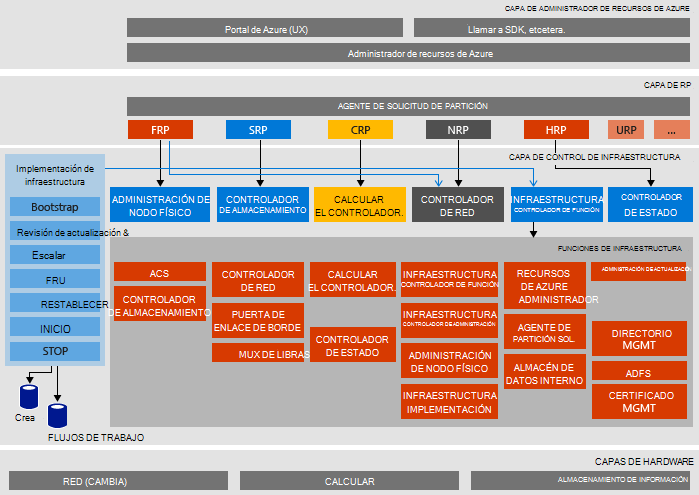

<properties
    pageTitle="Arquitectura de Microsoft Azure pila prueba de concepto (prueba de concepto) | Microsoft Azure"
    description="Ver la arquitectura de prueba de concepto de pila de Microsoft Azure."
    services="azure-stack"
    documentationCenter=""
    authors="heathl17"
    manager="byronr"
    editor=""/>

<tags
    ms.service="azure-stack"
    ms.workload="na"
    ms.tgt_pltfrm="na"
    ms.devlang="na"
    ms.topic="article"
    ms.date="10/25/2016"
    ms.author="helaw"/>

# Arquitectura de prueba de concepto de pila de Microsoft Azure

La prueba de concepto de pila de Azure es una implementación de un nodo de Azure pila Technical Preview 2. Todos los componentes se instalan en máquinas virtuales se ejecutan en un equipo host único. 

## Diagrama de arquitectura lógica
El siguiente diagrama muestra la arquitectura lógica de la prueba de concepto de pila de Azure y sus componentes.

## Roles de máquina virtual
La prueba de concepto de pila de Azure ofrece servicios con las siguientes VM en el host de prueba de concepto:

 - **MAS ACS01** Máquina virtual que alojan los servicios de almacenamiento de pila de Azure.

 - **MAS ADFS01** Máquina virtual que hospeda los servicios de federación de Active Directory.  Esta máquina virtual no se usa en Technical Preview 2.  

 - **MAS ASQL01**  Máquina virtual de proporcionar un almacén de datos interno para funciones de infraestructura de pila de Azure.  

 - **MAS BGPNAT01** Máquina virtual funciona como un enrutador de borde y ofrece capacidades NAT y VPN de pila de Azure.

 - **MAS CA01** Máquina virtual de proporcionar servicios de entidad emisora de certificados para servicios de rol de pila de Azure.

 - **MAS CON01** Equipo virtual disponible para los desarrolladores con la instalación de PowerShell, Visual Studio y otras herramientas.

 - **MAS DC01** Máquina virtual que alojan los servicios de Active Directory, DNS y DHCP para Microsoft Azure pila.

 - **MAS GWY01** Máquina virtual de proporcionar servicios de puerta de enlace, como las conexiones de sitio a sitio VPN para redes de inquilinos de borde.

 - **MAS NC01**  Máquina virtual que hospeda el controlador de red, que administra los servicios de red de pila de Azure.  

 - **MAS SLB01**  Máquina virtual proporciona equilibrio de carga servicios en la pila de Azure para los inquilinos y servicios de infraestructura de pila de Azure.  

 - **MAS SUS01**  Virtual máquina host Windows Server Update Services y responsable de proporcionar actualizaciones de otras máquinas virtuales de pila de Azure.

 - **MAS WAS01**  Máquina virtual que aloja el portal y servicios de administrador de recursos de Azure.

 - **MAS XRP01** Máquina virtual que hospeda los proveedores de recursos principales de Microsoft Azure pila, incluidos los proveedores de recursos de proceso, red y almacenamiento.

## Servicios de almacenamiento
Servicios de almacenamiento en el sistema operativo en el host físico incluyen:

 - **Servicio de blobs de ACS** Azure servicio coherente blobs de almacenamiento, que proporciona servicios de almacenamiento de blobs y tabla.

 - **SoFS** Servidor de archivos de escalado.

 - **CSV de referencias cruzadas** Clúster de sistema de archivo y son resistentes había compartido volumen.

 - **Disco virtual**, **Espacio de almacenamiento**y **Almacenamiento espacios directa** son la tecnología de almacenamiento subyacente respectivos de Windows Server para habilitar al proveedor de recursos de almacenamiento de Microsoft Azure pila básico.

## Pasos siguientes

[Implementar la pila de Azure](azure-stack-deploy.md)

[Primera escenarios para probar](azure-stack-first-scenarios.md)

