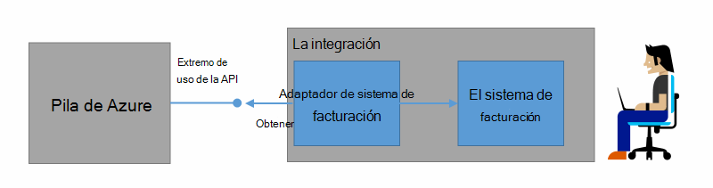
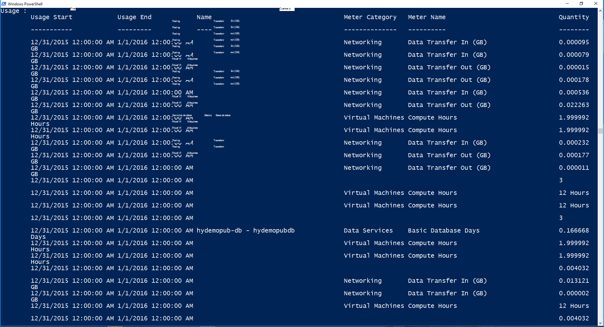

<properties
    pageTitle="Facturación del cliente y cargo al usuario en pila Azure | Microsoft Azure"
    description="Obtenga información sobre cómo recuperar información de uso de recursos de pila de Azure."
    services="azure-stack"
    documentationCenter=""
    authors="AlfredoPizzirani"
    manager="byronr"
    editor=""/>

<tags
    ms.service="azure-stack"
    ms.workload="na"
    ms.tgt_pltfrm="na"
    ms.devlang="na"
    ms.topic="article"
    ms.date="10/18/2016"
    ms.author="alfredop"/>

# Cliente de facturación y cargo al usuario en pila de Azure

Ahora que está usando la pila de Azure, es una buena idea pensar en cómo realizar el seguimiento de uso. Proveedores de servicios se basan en información de uso para cobrar a sus clientes y comprender el costo de los servicios.
Empresas, demasiado, normalmente un seguimiento del uso por departamento.

Pila de Azure no es un sistema de facturación. No se carga a los inquilinos para los recursos que utilizan. Sin embargo, pila de Azure tiene la infraestructura para recopilar y agregar datos de uso para cada proveedor único recurso. Puede obtener acceso a datos y exportar a un sistema de facturación utilizando un adaptador de facturación o exportar a una herramienta de inteligencia empresarial como Microsoft Power BI.

## ¿Qué información de uso se debe buscar y cómo?

Proveedores de recursos de pila Azure generan registros de uso a intervalos cada horas. Los registros muestran la cantidad de cada recurso que se ha consumido y qué suscripción había consumida del recurso. Estos datos están almacenados. Puede obtener acceso a los datos a través de la API de REST.

Un administrador puede recuperar datos de uso para todas las suscripciones de inquilinos. Los inquilinos individuales pueden recuperar solo su propia información.

Registros de uso tienen información sobre el almacenamiento, la red y el uso de cálculo. Para obtener una lista de medidores, consulte [este artículo](azure-stack-usage-related-faq.md).

## Recuperar la información de uso

Para generar registros, es fundamental que tenga recursos ejecutando y utilizando el sistema de forma activa. Si no está seguro de si dispone de los recursos que se ejecutan, en la pila de Azure Marketplace implementar y ejecutar una máquina virtual (VM). Buscar en la máquina virtual de supervisión módulo para asegurarse de que se está ejecutando.

Se recomienda que ejecute los cmdlets de Windows PowerShell para ver los datos de uso.
PowerShell llama a las API de uso de recursos.

1.  [Instalar y configurar Azure PowerShell](https://azure.microsoft.com/en-us/documentation/articles/powershell-install-configure/).

2.  Para iniciar sesión en el Administrador de recursos de Azure, use el cmdlet de PowerShell **AzureRmAccount de inicio de sesión**.

3.  Para seleccionar la suscripción que usó para crear recursos, escriba **AzureRmSubscription Get-SubscriptionName "su sub" | Seleccione AzureRmSubscription**.

4.  Para recuperar los datos, use el cmdlet de PowerShell [**Get-UsageAggregates**](https://msdn.microsoft.com/en-us/library/mt619285.aspx).
    Si hay datos de uso, se devuelve en PowerShell, como en el ejemplo siguiente. PowerShell devuelve 1.000 líneas de uso por llamada.
    Puede usar el argumento de *continuación* para recuperar conjuntos de líneas más allá de los primeros 1.000. Para obtener más información acerca de los datos de uso, vea la [referencia de la API de uso de recursos](azure-stack-provider-resource-api.md).

    

## Pasos siguientes

[Uso de recursos de proveedor API](azure-stack-provider-resource-api.md)

[Uso de recursos API de inquilinos](azure-stack-tenant-resource-usage-api.md)

[P+F de uso](azure-stack-usage-related-faq.md)
