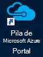
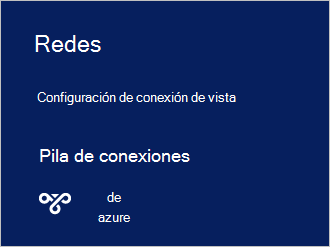

<properties
    pageTitle="Conectarse a la pila de Azure | Microsoft Azure"
    description="Obtenga información sobre cómo conectar pila de Azure"
    services="azure-stack"
    documentationCenter=""
    authors="ErikjeMS"
    manager="byronr"
    editor=""/>

<tags
    ms.service="azure-stack"
    ms.workload="na"
    ms.tgt_pltfrm="na"
    ms.devlang="na"
    ms.topic="get-started-article"
    ms.date="10/18/2016"
    ms.author="erikje"/>

# <a name="connect-to-azure-stack"></a>Conectarse a la pila de Azure
Para administrar los recursos, debe conectarse al equipo de prueba de concepto de pila de Azure. Puede utilizar cualquiera de las siguientes opciones de conexión:

 - Escritorio remoto: permite que un único usuario simultáneo conectar rápidamente desde el equipo de prueba de concepto.
 - Red privada virtual (VPN): permite que varios usuarios simultáneos conectar desde clientes fuera de la infraestructura de pila de Azure (requiere la configuración).

## <a name="connect-with-remote-desktop"></a>Conectar con Escritorio remoto
Con una conexión a Escritorio remoto, un único usuario simultáneo puede trabajar con el portal de administración de recursos. También puede usar herramientas de la máquina virtual de MAS CON01.

1.  Inicie sesión en el equipo de prueba de concepto de pila de Azure físico.

2.  Abra una conexión a Escritorio remoto y conéctese a MAS CON01. Escriba **AzureStack\AzureStackAdmin** como el nombre de usuario y la contraseña administrativa proporcionado durante la instalación de la pila de Azure.  

3.  En el escritorio MAS CON01, haga doble clic en el icono de **Microsoft Azure pila Portal** (https://portal.azurestack.local/) para abrir el [portal](azure-stack-key-features.md#portal).

    

4.  Inicie sesión con las credenciales de Azure Active Directory especificadas durante la instalación.

## <a name="connect-with-vpn"></a>Conectar con VPN
Conexiones de red privada virtuales permitir que varios usuarios simultáneos a conectar desde clientes fuera de la infraestructura de pila de Azure. Puede usar el portal para administrar la disponibilidad. También puede usar herramientas, como Visual Studio y PowerShell, en el cliente local.

1.  Instalar el módulo AzureRM mediante el siguiente comando:
   
    ```PowerShell
    Install-Module -Name AzureRm -RequiredVersion 1.2.6 -Scope CurrentUser
    ```   
   
2. Descargar las secuencias de comandos de herramientas de la pila de Azure.  Estos archivos se pueden descargar en el [repositorio de GitHub](https://github.com/Azure/AzureStack-Tools)de exploración, o bien ejecutando el siguiente script de Windows PowerShell como administrador de soporte técnico:
    
    >[AZURE.NOTE]  Los pasos siguientes requieren PowerShell 5.0.  Para comprobar su versión, ejecute $PSVersionTable.PSVersion y comparar la versión "Principal".  

    ```PowerShell
       
       #Download the tools archive
       invoke-webrequest https://github.com/Azure/AzureStack-Tools/archive/master.zip -OutFile master.zip

       #Expand the downloaded files. 
       expand-archive master.zip -DestinationPath . -Force

       #Change to the tools directory
       cd AzureStack-Tools-master
    ````

3.  En la misma sesión de PowerShell, vaya a la carpeta de **conectarse** e importar el módulo de AzureStack.Connect.psm1:

    ```PowerShell
    cd Connect
    import-module .\AzureStack.Connect.psm1
    ```

4.  Para crear la conexión VPN de pila de Azure, ejecute el siguiente Windows PowerShell. Antes de ejecutar, rellene los campos de dirección de host de pila de Azure y contraseña de administrador. 
    
    ```PowerShell
    #Change the IP Address below to match your Azure Stack host
    $hostIP = "<HostIP>"

    # Change password below to reference the password provided for administrator during Azure Stack installation
    $Password = ConvertTo-SecureString "<Admin Password>" -AsPlainText -Force

    # Add Azure Stack One Node host & CA to the trusted hosts on your client computer
    Set-Item wsman:\localhost\Client\TrustedHosts -Value $hostIP -Concatenate
    Set-Item wsman:\localhost\Client\TrustedHosts -Value mas-ca01.azurestack.local -Concatenate  

    # Update Azure Stack host address to be the IP Address of the Azure Stack POC Host
    $natIp = Get-AzureStackNatServerAddress -HostComputer $hostIP -Password $Password

    # Create VPN connection entry for the current user
    Add-AzureStackVpnConnection -ServerAddress $natIp -Password $Password

    # Connect to the Azure Stack instance. This command (or the GUI steps in step 5) can be used to reconnect
    Connect-AzureStackVpn -Password $Password 
    ```

5. Cuando se le solicite, confiar en el host de pila de Azure.

6. Cuando se le solicite, instalar un certificado (el indicador aparecerá detrás de la ventana de la sesión de Powershell).

7. Para probar la conexión portal, en un explorador de Internet, vaya a *https://portal.azurestack.local*.

8. Para revisar y administrar la conexión de pila de Azure, use **redes** de cliente:

    

>[AZURE.NOTE] Esta conexión VPN no proporciona conectividad a máquinas virtuales u otros recursos. Para obtener información sobre la conectividad a los recursos, vea [Una conexión VPN de nodo](azure-stack-create-vpn-connection-one-node-tp2.md)


## <a name="next-steps"></a>Pasos siguientes
[Primeras tareas](azure-stack-first-scenarios.md)

[Instalar y conectar con PowerShell](azure-stack-connect-powershell.md)

[Instalar y conectar con CLI](azure-stack-connect-cli.md)


