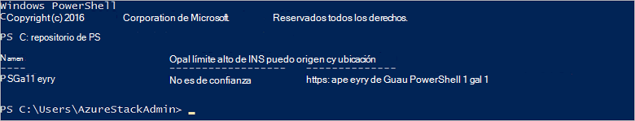

<properties
    pageTitle="Conectarse a la pila de Azure con PowerShell | Microsoft Azure"
    description="Obtenga información sobre cómo administrar la pila de Azure con PowerShell"
    services="azure-stack"
    documentationCenter=""
    authors="HeathL17"
    manager="byronr"
    editor=""/>

<tags
    ms.service="azure-stack"
    ms.workload="na"
    ms.tgt_pltfrm="na"
    ms.devlang="na"
    ms.topic="article"
    ms.date="10/19/2016"
    ms.author="helaw"/>

# Instale PowerShell y conectarse a la pila de Azure
En esta guía le guiaremos a través de los pasos para conectar con la pila de Azure con PowerShell. Una vez completada, estos pasos pueden también ayudarle a administrar e implementar recursos.

## Instalar los cmdlets de PowerShell de pila de Azure

1.  Cmdlets de AzureRM se instalan desde la Galería de PowerShell. Para comenzar, abra una consola de PowerShell en MAS CON01 y ejecute el comando siguiente para devolver una lista de repositorios de PowerShell disponibles:

        Get-PSRepository

      

2.  Ejecute el comando siguiente para instalar el módulo AzureRM:

        Install-Module -Name AzureRM -RequiredVersion 1.2.6 -Scope CurrentUser

    >[AZURE.NOTE] *-Ámbito CurrentUser* es opcional. Si desea más que el usuario actual tiene acceso a los módulos, utilice un símbolo del sistema con privilegios elevados y deje desactivado el parámetro de *ámbito* .

3.  Para confirmar la instalación de AzureRM módulos, ejecute los comandos siguientes:

        Get-Command -Module AzureRM.AzureStackAdmin

## Conectarse a la pila de Azure
Un módulo está disponible para su descarga que controla la configuración de la conexión de PowerShell en pila de Azure para usted.  Visite [Azure pila de herramientas](http://aka.ms/ConnectToAzureStackPS) para el módulo y pasos adicionales. 

## Recuperar una lista de suscripciones
En esta sección, compruebe los cmdlets de PowerShell se están ejecutando en pila de Azure recuperar y seleccionando una suscripción para su uso.

Ejecute el comando siguiente para recuperar una lista de suscripciones de pila de Azure asociada a su cuenta:

    Get-AzureRmSubscription

## Pasos siguientes
[Implementar plantillas con PowerShell](azure-stack-deploy-template-powershell.md)

[Conectar con CLI Azure](azure-stack-connect-cli.md)

[Implementar plantillas de Visual Studio](azure-stack-deploy-template-visual-studio.md)

