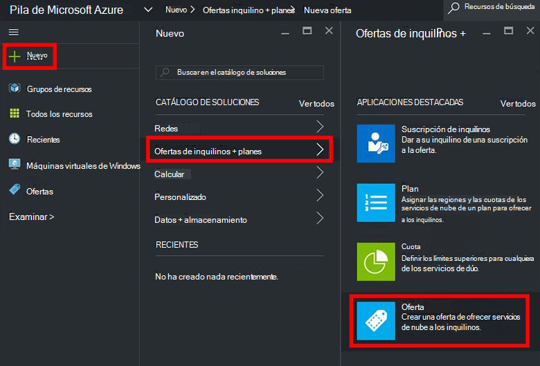
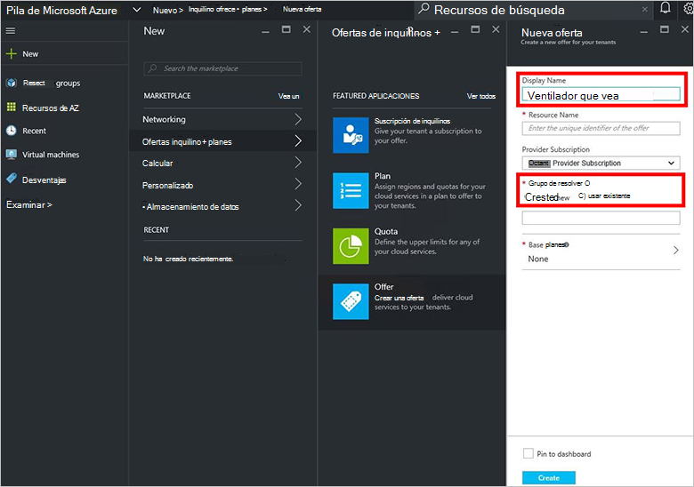
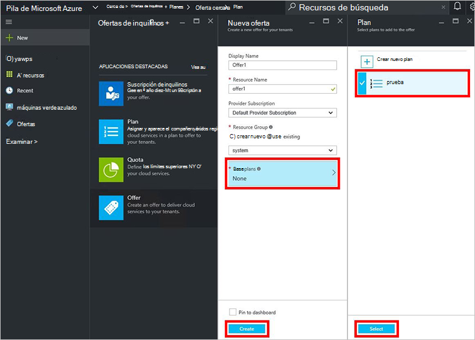
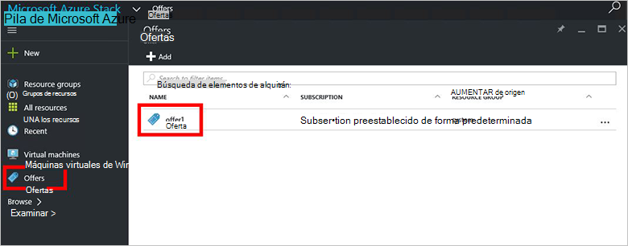
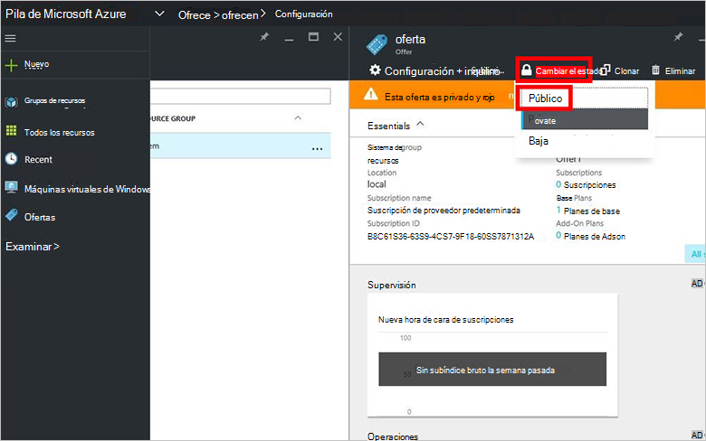

<properties
    pageTitle="Crear una oferta en pila de Azure | Microsoft Azure"
    description="Como administrador de servicios, obtenga información sobre cómo crear una oferta para los inquilinos en pila de Azure."
    services="azure-stack"
    documentationCenter=""
    authors="ErikjeMS"
    manager="byronr"
    editor=""/>

<tags
    ms.service="azure-stack"
    ms.workload="na"
    ms.tgt_pltfrm="na"
    ms.devlang="na"
    ms.topic="get-started-article"
    ms.date="09/26/2016"
    ms.author="erikje"/>

# Crear una oferta en pila de Azure

[Ofrece](azure-stack-key-features.md#services-plans-offers-and-subscriptions) son grupos de uno o varios planes de los proveedores de presentan a inquilinos para comprar o suscribirse a. Este documento muestra cómo crear una oferta que incluye el [plan que ha creado](azure-stack-create-plan.md) en el último paso. Esta oferta permite que los suscriptores aprovisionar máquinas virtuales de Windows.

1.  [Inicie sesión en](azure-stack-connect-azure-stack.md#log-in-as-a-service-administrator) el portal como administrador del servicio y, a continuación, haga clic en **nuevo** > **inquilino ofrece + planes** > **ofrecen**.
    

2.  En el módulo **Ofrecen nuevo** , rellene **Nombre para mostrar** y el **Nombre del recurso**y, a continuación, seleccione un **Grupo de recursos**de nuevo o existente. El nombre para mostrar es nombre descriptivo de la oferta. Solo el administrador puede ver el nombre del recurso. Es el nombre que usan los administradores para trabajar con la oferta como un recurso del Administrador de recursos de Azure.

    

3.  Haga clic en **planes de Base** y, en el módulo de **Plan** , seleccione el plan que desea incluir en la oferta y, a continuación, haga clic en **Seleccionar**. Haga clic en **crear** para crear la oferta.

    
    
4. Haga clic en **ofrece** y, a continuación, haga clic en la oferta que acaba de crear.

    

5.  Haga clic en **Cambiar estado**y, a continuación, haga clic en **público**.
  
    

Ofertas deben hacerse públicos para los inquilinos obtener la vista completa al suscribirse. Pueden ser ofertas:

- **Público**: Visible para los inquilinos.

- **Privado**: solo visible para los administradores de servicios. Útil al elaborar el plan o la oferta, o si desea que el Administrador de aprobar cada suscripción.

- **Disponible**: cerrados para los suscriptores de nuevos. Puede usar el Administrador de fuera de servicio para evitar futuras suscripciones, pero dejar intacto suscriptores actuales.

Cambios en la oferta no son visibles inmediatamente al inquilino. Para ver los cambios, es posible que tenga que cierres de sesión para ver la nueva suscripción en el selector de"suscripción" al crear grupos de recurso.

## Pasos siguientes

[Suscribirse a una oferta y, a continuación, proporciona una máquina virtual](azure-stack-subscribe-plan-provision-vm.md)
