<properties
    pageTitle="Crear un plan en la pila de Azure | Microsoft Azure"
    description="Como administrador de servicios, cree un plan que le permite máquinas virtuales de aprovisionamiento de suscriptores."
    services="azure-stack"
    documentationCenter=""
    authors="ErikjeMS"
    manager="byronr"
    editor=""/>

<tags
    ms.service="azure-stack"
    ms.workload="na"
    ms.tgt_pltfrm="na"
    ms.devlang="na"
    ms.topic="get-started-article"
    ms.date="09/26/2016"
    ms.author="erikje"/>

# Crear un plan en la pila de Azure

[Los planes](azure-stack-key-features.md#services-plans-offers-and-subscriptions) son agrupaciones de uno o más servicios. Como un proveedor, puede crear planes para ofrecer a los inquilinos. A su vez, los inquilinos suscripción a las ofertas para usar los planes y servicios que se incluyen. Este ejemplo muestra cómo crear un plan que incluya el cálculo, la red y proveedores de recursos de almacenamiento. Este plan permite que los suscriptores aprovisionar máquinas virtuales de Windows.

1.  En un explorador de internet, vaya a https://portal.azurestack.local.

2.  [Inicie sesión en](azure-stack-connect-azure-stack.md#log-in-as-a-service-administrator) el Portal de la pila de Azure como administrador del servicio y escriba sus credenciales de administrador de servicio (la cuenta que creó en el paso 5 de la sección de [ejecutar la secuencia de comandos de PowerShell](azure-stack-run-powershell-script.md) ) y, a continuación, haga clic en **iniciar sesión**.

    Los administradores de servicios pueden crear ofertas y planes y administrar usuarios.

3.  Para crear un plan y una oferta de inquilinos pueden suscribirse a, haga clic en **nuevo** > **inquilino ofrece + planes** > **Plan**.

    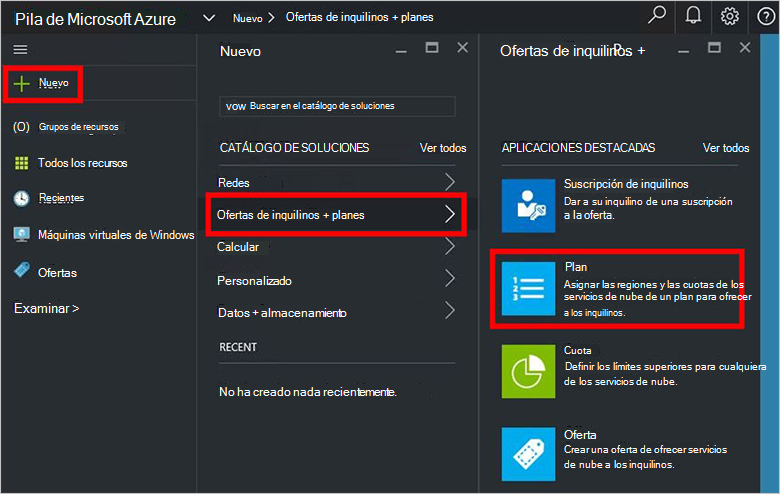

4.  En el módulo **Nuevo Plan** , rellene **Nombre para mostrar** y **Nombre del recurso**. El nombre para mostrar es el nombre descriptivo del plan que ven los inquilinos. Solo el administrador puede ver el nombre del recurso. Es el nombre que usan los administradores para trabajar con el plan que un recurso de administrador de recursos de Azure.

    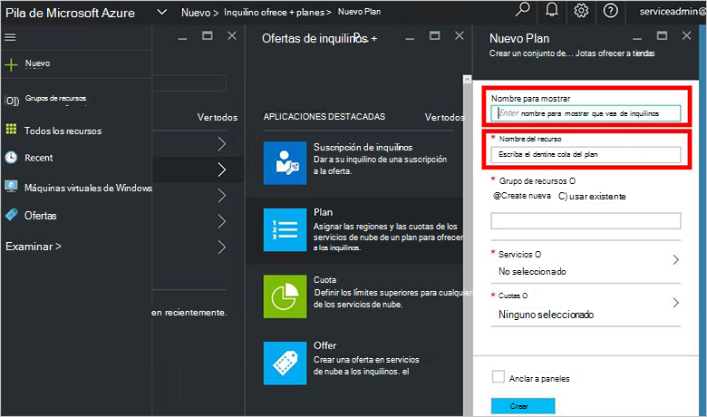

5.  Crear un nuevo **Grupo de recursos**, o seleccione una existente, como un contenedor para el plan (por ejemplo, "OffersAndPlans")

    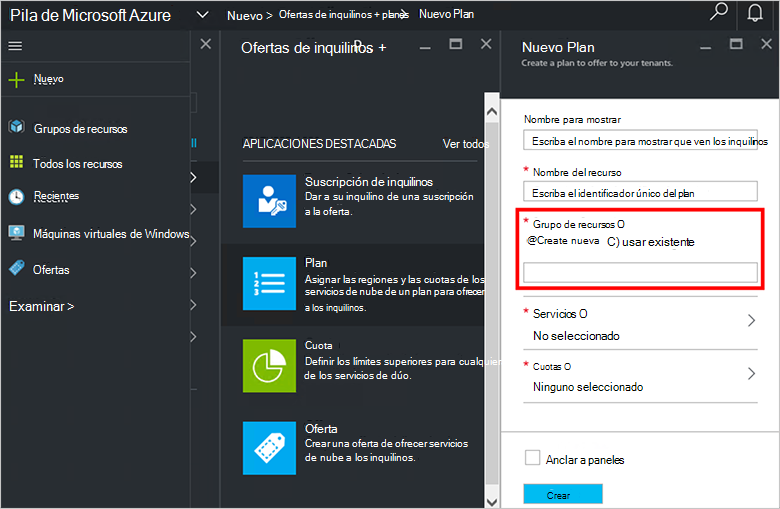

6.  Haga clic en **Servicios**, seleccione **Microsoft.Compute**, **Microsoft.Network**y **Microsoft.Storage**y, a continuación, haga clic en **Seleccionar**.

    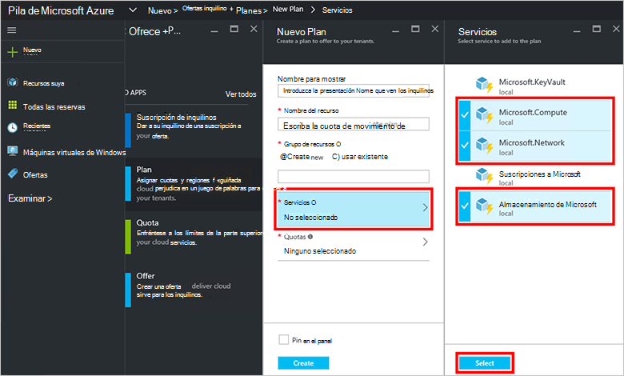

7.  Haga clic en **las cuotas de**, haga clic en **Microsoft.Storage (local)**y, a continuación, seleccione la cuota predeterminada o haga clic en **Crear nueva cuota** para personalizar la cuota.

    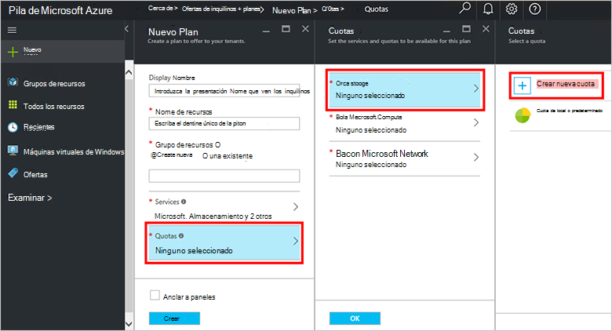

8.  Escriba un nombre para la cuota, haga clic en **Configuración de cuota**, establezca los valores de cuota y haga clic en **Aceptar**y, a continuación, haga clic en **crear**.

    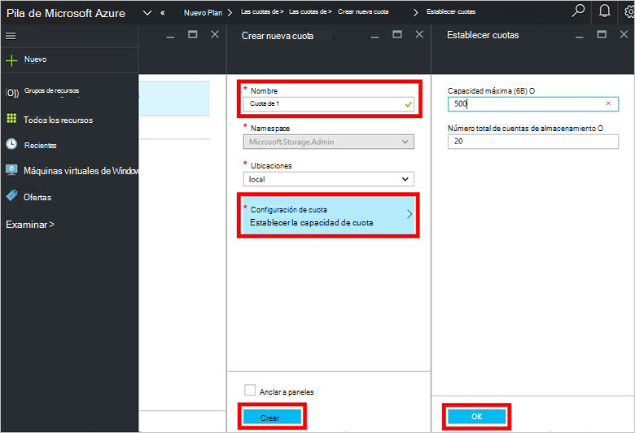

9. Haga clic en **Microsoft.Network (local)**y, a continuación, seleccione la cuota predeterminada o haga clic en **Crear nueva cuota** para personalizar la cuota.

    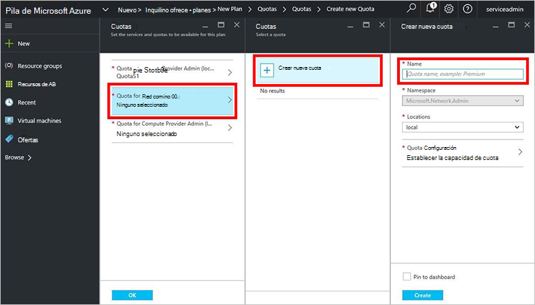

10. Escriba un nombre para la cuota, haga clic en **Configuración de cuota**, establezca los valores de cuota y haga clic en **Aceptar**y, a continuación, haga clic en **crear**.

    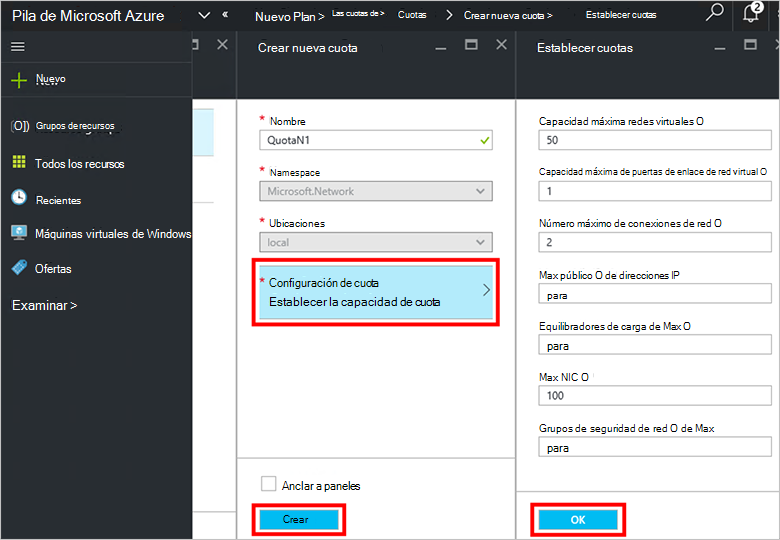

11. Haga clic en **Microsoft.Compute (local)**y, a continuación, seleccione la cuota predeterminada o haga clic en **Crear nueva cuota** para personalizar la cuota.

    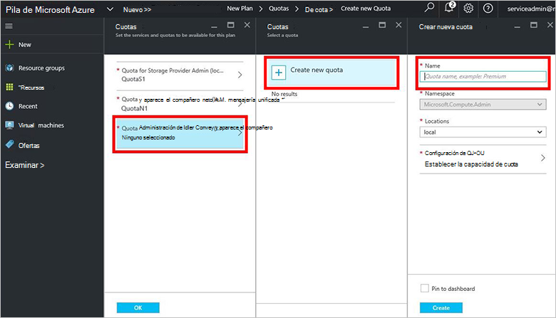

12.  Escriba un nombre para la cuota, haga clic en **Configuración de cuota**, establezca los valores de cuota y haga clic en **Aceptar**y, a continuación, haga clic en **crear**.

    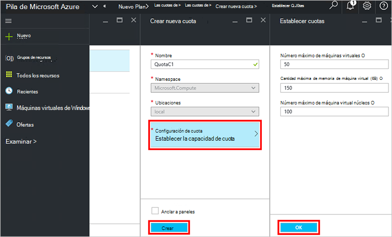

13. En el módulo de **cuotas** , haga clic en **Aceptar**y, a continuación, en el módulo **Nuevo Plan** , haga clic en **crear** para crear el plan.

    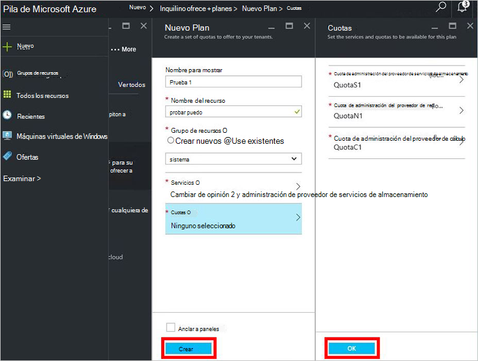

14. Para ver el nuevo plan, haga clic en **todos los recursos**, a continuación, busque el plan y haga clic en su nombre.

    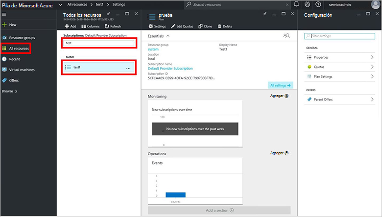

## Pasos siguientes

[Crear una oferta](azure-stack-create-offer.md)
