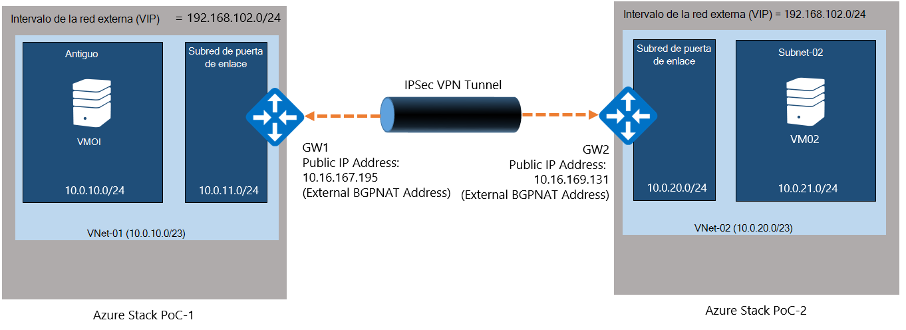
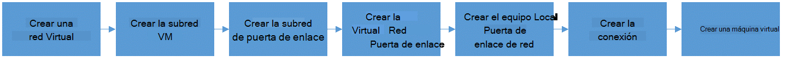
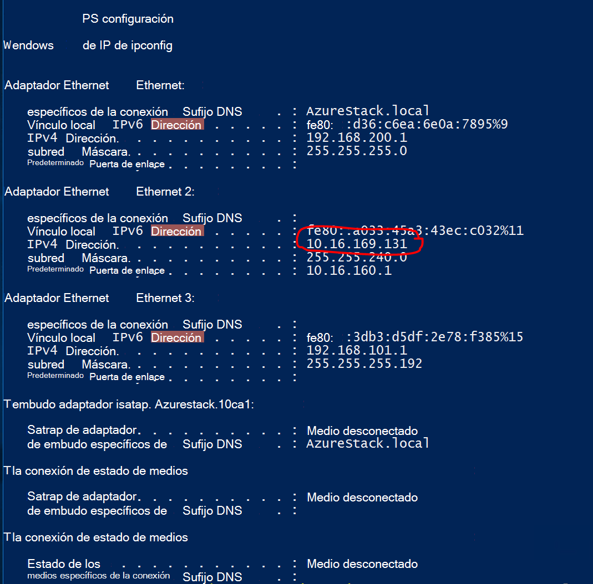

<properties
    pageTitle="Crear una conexión VPN de sitio a sitio entre dos redes virtuales en diferentes entornos de prueba de concepto de pila de Azure | Microsoft Azure"
    description="Procedimiento paso a paso que le permitirá un administrador de la nube crear una conexión VPN de sitio a sitio entre los dos entornos de prueba de concepto de un nodo en TP2."
    services="azure-stack"
    documentationCenter=""
    authors="ScottNapolitan"
    manager="darmour"
    editor=""/>

<tags
    ms.service="azure-stack"
    ms.workload="na"
    ms.tgt_pltfrm="na"
    ms.devlang="na"
    ms.topic="get-started-article"
    ms.date="09/26/2016"
    ms.author="scottnap"/>

# Crear una conexión VPN de sitio a sitio entre dos redes virtuales en diferentes entornos de prueba de concepto de pila de Azure

## Información general

En este artículo le guiará por los pasos para crear una conexión VPN de sitio a sitio entre dos redes virtuales en dos entornos de pila de Azure prueba de concepto (prueba de concepto) independientes. La finalidad de esta es ayudar a personas que va a evaluar a sitios puertas de enlace comprender cómo configurar conexiones VPN entre redes virtuales en dos implementaciones diferentes de pila de Azure.  En el proceso de este modo, obtendrá comprender cómo funcionan las puertas de enlace VPN en pila de Azure.

>[AZURE.NOTE] Este documento se aplica específicamente a la prueba de concepto de Azure pila TP2.

### Diagrama de conexión

A continuación se muestra un diagrama que muestra el aspecto que debería nuestra configuración cuando hemos terminado.

### Antes de empezar

Para completar esta configuración, tiene los siguientes elementos para Asegúrese de que tenga estas cosas antes de empezar.

-   Dos servidores que cumplen los requisitos de hardware de prueba de concepto de pila de Azure definidos por los [Requisitos previos de implementación de pila de Azure](azure-stack-deploy.md)y los requisitos previos definidos por el documento.

-   El paquete de implementación de Azure pila Technical Preview 2.

## Implementar los entornos de prueba de concepto

Se implementará dos entornos de prueba de concepto de pila de Azure para completar esta configuración.

-   Para cada prueba de concepto implementa, simplemente puede seguir las instrucciones de implementación detalladas en el artículo [Implementar prueba de concepto de pila de Azure](azure-stack-run-powershell-script.md).
    Se hará referencia a cada entorno de prueba de concepto de este documento genérica como POC1 y POC2.

## Configurar cuotas para proceso, red y almacenamiento

Debe configurar cuotas para proceso, red y almacenamiento para que estos servicios se pueden asociados con un Plan y, a continuación, una oferta de inquilinos puede suscribirse a.

>[AZURE.NOTE] Debe realizar estos pasos para cada entorno de prueba de concepto de pila de Azure.

Ha cambiado la experiencia para crear cuotas para los servicios de TP1. Los pasos sobre cómo crear cuotas en TP2 se pueden encontrar en <http://aka.ms/mas-create-quotas>. Puede aceptar los valores predeterminados para todos los valores de cuota para este ejercicio.

## Crear un Plan y oferta

[Los planes](azure-stack-key-features.md) son agrupaciones de uno o más servicios. Como un proveedor, puede crear planes para ofrecer a los inquilinos. A su vez, los inquilinos suscripción a las ofertas para usar los planes y servicios que se incluyen.

>[AZURE.NOTE] Debe realizar estos pasos para cada entorno de prueba de concepto de pila de Azure.

1.  Crear un Plan. Para ello, puede seguir los pasos en el artículo de [crear un Plan](azure-stack-create-plan.md) en línea.

2.  Crear una oferta siguiendo los pasos descritos en [crear una oferta en pila de Azure](azure-stack-create-offer.md).

3.  Inicie sesión en el Portal como un administrador de inquilinos y [suscribirse a la oferta que creó] (azure-pila-suscribirse-plan-aprovisionar-vm.md.

## Crear los recursos de red de prueba de concepto 1

Ahora vamos a crear los recursos que necesitamos para establecer la configuración. Los pasos siguientes muestran qué se va a realizar. Estas instrucciones se que se muestra cómo crear recursos a través del Portal, pero lo mismo se puede conseguir a través de PowerShell.

### Inicie sesión como un inquilino

Un administrador puede iniciar sesión como un inquilino para probar los planes, ofertas y suscripciones que pueden usar los inquilinos. Si todavía no tiene una, [crear una cuenta de inquilino](azure-stack-add-new-user-aad.md) antes de iniciar sesión.

### Crear la red virtual y subred VM

1.  Inicie sesión con una cuenta de inquilino.

2.  En el portal de Azure, haga clic en el icono de **nuevo** .

     
3.  Seleccione **redes** desde el menú de catálogo de soluciones.

4.  Haga clic en el elemento de **red Virtual** en el menú.

5.  Haga clic en el botón **crear** cerca de la parte inferior de la hoja de descripción de recursos. Escriba los valores siguientes en los campos adecuados de acuerdo con esta tabla.

  	| **Campo**             | **Valor** |
  	|----------------------- | ------ |
  	| Nombre                  |vnet-01 |
  	| Espacio de direcciones         | 10.0.10.0/23 |
  	| Nombre de subred           | subred-01 |
  	| Intervalo de direcciones de subred  | 10.0.10.0/24 |

6.  Ahora debe aparecer la suscripción que creó anteriormente se rellena en el campo de la **suscripción** .

7.  Grupo de recursos, puede crear un nuevo grupo de recursos o si ya tiene una, seleccione Usar una existente.

8.  Compruebe la ubicación predeterminada.

9.  Haga clic en el botón **crear** .

### Crear la subred de puerta de enlace

1.  Abra el recurso de red Virtual que acaba de crear (Vnet-01) desde el panel.

2.  En el módulo de configuración, seleccione subredes

3.  Haga clic en el botón **Subred de puerta de enlace** para agregar una subred de puerta de enlace a la red Virtual.

     
4.  El nombre de la subred se establece en **GatewaySubnet** de forma predeterminada.
    Subredes de puerta de enlace son especiales y deben tener este nombre específico para que funcione correctamente.

5.  En el campo **intervalo de direcciones** , escriba **10.0.11.0/24**.

6.  Haga clic en el botón **crear** para crear la subred de puerta de enlace.

### Crear la puerta de enlace de red Virtual

1.  En el portal de Azure, haga clic en el icono de **nuevo** .

    

2.  Seleccione **redes** desde el menú de catálogo de soluciones.

3.  Seleccione la **puerta de enlace de red Virtual** de la lista de recursos de red.

4.  Revise la descripción y haga clic en **crear**.

5.  En el campo **nombre** , escriba **GW1**.

6.  Haga clic en el elemento de **red Virtual** para elegir una red virtual.
    Seleccione **Vnet-01** en la lista.

7.  Haga clic en el elemento de menú de la **dirección IP pública** . Cuando se abre el módulo de dirección IP público de elegir haga clic en el botón Crear nuevo.

8.  En el campo **nombre** , escriba **GW1 puntos** y haga clic en **Aceptar.**

9.  El **tipo de puerta de enlace** debe tener **VPN** seleccionado de manera predeterminada. Mantenga esta configuración.

10. Debe tener el **tipo de VPN** **basado en ruta** seleccionado de manera predeterminada.
    Mantenga esta configuración.

11. Comprobar la **ubicación** y **suscripción** son correctas. Si lo desea puede anclar el recurso en el panel. Haga clic en **crear**.

### Crear la puerta de enlace de red Local

El recurso de la puerta de enlace de red Local es un poco raro en nuestro escenario.
Es el mismo recurso que se encuentre en Azure, pero en Azure normalmente pensado para representar un dispositivo físico, locales usaría para conectarse a la puerta de enlace de red virtual en Azure. En nuestro ejemplo, ambos extremos de la conexión son puertas de enlace de red virtual realmente!

Una manera de pensar más genérica que el recurso de la puerta de enlace de red Local esté siempre está pensado para indicar que la puerta de enlace remota al final de la conexión. Debido a la manera en que se ha diseñado la prueba de concepto, realmente es necesario proporcionar la dirección del adaptador de red externa en el NAT VM de prueba de concepto otra como la dirección IP pública de la puerta de enlace de red Local. A continuación, crearemos asignaciones NAT en la VM NAT para asegurarse de que ambos extremos están conectadas correctamente.

### Obtener la dirección IP del adaptador externo de VM NAT

1.  Iniciar sesión en el equipo físico en pila de Azure para POC2.

2.  [Tecla Windows] + R para abrir el menú **Ejecutar** y escriba **mstsc** y presione ENTRAR.

3.  En el campo **equipo** escriba el nombre **BGPNAT01 MAS** y haga clic en el botón **Conectar** .

4.  Haga clic en el menú Inicio y haga clic en PowerShell y seleccione **Ejecutar como administrador**.

5.  Tipo de **IPConfig/all**.

6.  Busque el adaptador Ethernet que está conectado a su red local y tome nota de la dirección IPv4 enlazada al adaptador. En mi entorno es **10.16.167.195** pero suyo será algo diferente.

7.  Grabar esta dirección. Esto es lo que se utilizará como la dirección IP pública del recurso de la puerta de enlace de red Local que se crea en POC1.

### Crear el recurso de puerta de enlace de red Local

1.  Iniciar sesión en el equipo físico en pila de Azure para POC1.

2.  En el campo de **equipo** , escriba el nombre **CON01 MAS** y haga clic en el botón **Conectar** .

3.  En el portal de Azure, haga clic en el icono de **nuevo** .

    

4.  Seleccione **redes** desde el menú de catálogo de soluciones.

5.  Seleccione la **puerta de enlace de red local** de la lista de recursos.

6.  En el campo **nombre** escriba **POC2 GW**.

7.  Aún no sabemos la dirección IP de nuestro otra puerta de enlace, pero que está bien porque podemos volver y cambiar más adelante. Por ahora, escriba **10.16.167.195** en el **campo dirección IP**.

8.  En el campo **Espacio de direcciones** , escriba el espacio de direcciones de la Vnet que se van a crear en POC2. Esta será **10.0.20.0/23** indique ese valor.

9.  Compruebe que su **suscripción**, el **Grupo de recursos** y la **ubicación** son correctos y haga clic en **crear**.

### Crear la conexión

1.  En el portal de Azure, haga clic en el icono de **nuevo** .

     

2.  Seleccione **redes** desde el menú de catálogo de soluciones.

3.  Seleccione la **conexión** de la lista de recursos.

4.  En el módulo de configuración **básica** , elija **sitio a sitio (IPSec)** como el **tipo de conexión**.

5.  Seleccione la **suscripción**, el **Grupo de recursos** y la **ubicación** y haga clic en **Aceptar**.

6.  En el módulo de **configuración** , elija la **Puerta de enlace de red Virtual** (**GW1**) que creó anteriormente.

7.  Elija el **local** **Puerta de enlace de red** (**POC2 GW**) que creó anteriormente.

8.  En el campo **Nombre de la conexión** , escriba **POC1 POC2**.

9.  En el campo de **Clave compartida (PSK)** escriba **12345**. Haga clic en **Aceptar**.

### Crear una máquina virtual

Para validar los datos que viajan a través de la conexión VPN, necesita máquinas virtuales para enviar y recibir datos en cada prueba de concepto. Vamos a crear una máquina virtual en POC1 ahora y lo coloca en nuestra subred VM en nuestra red virtual.

1. En el portal de Azure, haga clic en el icono de  **nuevo** .

     

2.  Seleccione **máquinas virtuales** en el menú del catálogo de soluciones.

3.  En la lista de imágenes de máquina virtual, seleccione la imagen del **Centro de datos de Windows Server 2012 R2** .

4.  En el módulo de **conceptos básicos** , en el campo **nombre** , escriba el valor **VM01**.

5.  Escriba un nombre de usuario válido y una contraseña. Deberá usar esta cuenta para iniciar sesión en la máquina virtual después de que se ha creado.

6.  Proporcionar una **suscripción**, el **Grupo de recursos** y la **ubicación** y, a continuación, haga clic en **Aceptar**.

7.  En el módulo de **tamaño** , elija un tamaño de memoria virtual para esta instancia y, a continuación, haga clic en **Seleccionar**.

8.  En el módulo de configuración, puede aceptar los valores predeterminados, asegúrese de que la red Virtual seleccionada es **VNET-01** y la subred se establece en **10.0.10.0/24**. Haga clic en **Aceptar**.

9.  Revise la configuración en el módulo de **Resumen** y haga clic en **Aceptar**.

## Crear los recursos de red de prueba de concepto 2

### Inicie sesión como un inquilino

Un administrador puede iniciar sesión como un inquilino para probar los planes, ofertas y suscripciones que pueden usar los inquilinos. Si todavía no tiene una, [crear una cuenta de inquilino](azure-stack-add-new-user-aad.md) antes de iniciar sesión.

### Crear la red virtual y subred VM

1. Inicie sesión con una cuenta de inquilino.

2. En el portal de Azure, haga clic en el icono de  **nuevo** .

     

3.  Seleccione **redes** desde el menú de catálogo de soluciones.

4.  Haga clic en el elemento de **red Virtual** en el menú.

5.  Haga clic en el botón **crear** cerca de la parte inferior de la hoja de descripción de recursos. Escriba los siguientes valores para los campos adecuados enumerados en la tabla siguiente.

  	|**Campo**              |**Valor** |
  	| ----------------------|----------|
  	| Nombre                  | 02 vnet |
  	| Espacio de direcciones         | 10.0.20.0/23 |
  	| Nombre de subred           | subred 02 |
  	| Intervalo de direcciones de subred  | 10.0.20.0/24 |

6.  Ahora debe aparecer la suscripción que creó anteriormente se rellena en el campo de la **suscripción** .

7.  Grupo de recursos, puede crear un nuevo grupo de recursos o si ya tiene una, seleccione Usar una existente.

8.  Compruebe la **ubicación**de predeterminada. Si lo desea, puede anclar la red virtual a panel para facilitar el acceso.

9.  Haga clic en el botón **crear** .

### Crear la subred de puerta de enlace

1.  Abra el recurso de red Virtual que creó (**Vnet-02**) desde el panel.

2.  En el módulo de **configuración** , seleccione **subredes.**

3.  Haga clic en el botón **Subred de puerta de enlace** para agregar una subred de puerta de enlace a la red Virtual.

     

4.  El nombre de la subred se establece en **GatewaySubnet** de forma predeterminada.
    Subredes de puerta de enlace son especiales y deben tener este nombre específico para que funcione correctamente.

5.  En el campo **intervalo de direcciones** , escriba **10.0.20.0/24**.

6.  Haga clic en el botón **crear** para crear la subred de puerta de enlace.

### Crear la puerta de enlace de red Virtual

1. En el portal de Azure, haga clic en el icono de  **nuevo** .

     

2.  Seleccione **redes** desde el menú de catálogo de soluciones.

3.  Seleccione la **puerta de enlace de red Virtual** de la lista de recursos de red.

4.  Revise la descripción y haga clic en **crear**.

5.  En el campo **nombre** , escriba **GW2**.

6.  Haga clic en el elemento de **red Virtual** para elegir una red virtual.
    Seleccione **Vnet 02** de la lista.

7.  Haga clic en el elemento de menú de la **dirección IP pública** . Cuando se abre el módulo de dirección IP público de elegir haga clic en el botón Crear nuevo.

8.  En el campo **nombre** , escriba **GW2 puntos** y haga clic en **Aceptar.**

9.  El **tipo de puerta de enlace** debe tener **VPN** seleccionado de manera predeterminada. Mantenga esta configuración.

10. Debe tener el **tipo de VPN** **basado en ruta** seleccionado de manera predeterminada.
    Mantenga esta configuración.

11. Comprobar la **ubicación** y **suscripción** son correctas. Si lo desea puede anclar el recurso en el panel. Haga clic en **crear**.

### Crear la puerta de enlace de red Local

#### Obtener la dirección IP del adaptador externo de VM NAT

1.  Iniciar sesión en el equipo físico en pila de Azure para POC1.

2.  Presione y mantenga presionada [tecla Windows] + R para abrir el menú **Ejecutar** y escriba **mstsc** y pulse escriba.

3.  En el campo **equipo** escriba el nombre **BGPNAT01 MAS** y haga clic en el botón **Conectar** .

4.  Haga clic en el menú Inicio y haga clic en PowerShell y seleccione **Ejecutar como administrador**.

5.  Tipo de **IPConfig/all**.

6.  Busque el adaptador Ethernet que está conectado a su red local y tome nota de la dirección IPv4 enlazada al adaptador. En mi entorno es **10.16.169.131** pero suyo será algo diferente.

7.  Grabar esta dirección. Esto es lo que más adelante usaremos como la dirección IP pública del recurso de la puerta de enlace de red Local que creamos en POC1.

#### Crear el recurso de puerta de enlace de red Local

1.  Iniciar sesión en el equipo físico en pila de Azure para POC2.

2.  En el campo **equipo** escriba el nombre **CON01 MAS** y haga clic en el botón **Conectar** .

3. En el portal de Azure, haga clic en el icono de **nuevo** .

     

4.  Seleccione **redes** desde el menú de catálogo de soluciones.

5.  Seleccione la **puerta de enlace de red local** de la lista de recursos.

6.  En el campo **nombre** escriba **POC1 GW**.

7.  Ahora se necesita la dirección IP pública hemos registrado de la puerta de enlace de red Virtual en POC1. Escriba **10.16.169.131** en el **campo dirección IP**.

8.  En el campo **Espacio de direcciones** , escriba el espacio de direcciones de **Vnet-01** de POC1 - **10.0.0.0/16**.

9.  Compruebe que su **suscripción**, el **Grupo de recursos** y la **ubicación** son correctos y haga clic en **crear**.

## Crear la conexión

1. En el portal de Azure, haga clic en el icono de  **nuevo** .

     

2.  Seleccione **redes** desde el menú de catálogo de soluciones.

3.  Seleccione la **conexión** de la lista de recursos.

4.  En el módulo de configuración **básica** , elija **sitio a sitio (IPSec)** como el **tipo de conexión**.

5.  Seleccione la **suscripción**, el **Grupo de recursos** y la **ubicación** y haga clic en **Aceptar**.

6.  En el módulo de **configuración** , elija la **Puerta de enlace de red Virtual** (**GW1**) que creó anteriormente.

7.  Elija el **local** **Puerta de enlace de red** (**POC1 GW**) que creó anteriormente.

8.  En el campo **Nombre de la conexión** , escriba **POC2 POC1**.

9.  En el campo de **Clave compartida (PSK)** escriba **12345**. Si elige un valor diferente, recuerde que debe coincidir con el valor de clave compartida asignados en POC1. Haga clic en **Aceptar**.

## Crear una máquina virtual

Crear una máquina virtual en POC1 ahora y lo coloca en nuestra subred VM en nuestra red virtual.

1.  En el portal de Azure, haga clic en el icono de **nuevo** .

     

2.  Seleccione **máquinas virtuales** en el menú del catálogo de soluciones.

3.  En la lista de imágenes de máquina virtual, seleccione la imagen del **Centro de datos de Windows Server 2012 R2** .

4.  En el módulo de **conceptos básicos** , en el campo **nombre** , escriba el valor **VM02**.

5.  Escriba un nombre de usuario válido y una contraseña. Deberá usar esta cuenta para iniciar sesión en la máquina virtual después de que se ha creado.

6.  Proporcionar una **suscripción**, el **Grupo de recursos** y la **ubicación** y, a continuación, haga clic en **Aceptar**.

7.  En el módulo de **tamaño** , elija un tamaño de memoria virtual para esta instancia y, a continuación, haga clic en **Seleccionar**.

8.  En el módulo de configuración, puede aceptar los valores predeterminados, asegúrese de que la red Virtual seleccionada es **02 VNET** y la subred se establece en **20.0.0.0/24**. Haga clic en **Aceptar**.

9.  Revise la configuración en el módulo de **Resumen** y haga clic en **Aceptar**.

## Configurar la VM NAT en cada prueba de concepto de recorrido de la puerta de enlace

Porque la prueba de concepto se ha diseñado para ser independiente y aislado desde la red en la que se implementa el host físico, la red VIP "Externo" que están conectadas las puertas de enlace a no es realmente externa, pero en su lugar, se oculta detrás de un enrutador realiza la traducción de direcciones de red (NAT). El enrutador es realmente un Windows Server VM (**MAS BGPNAT01**) ejecuta la función enrutamiento y servicios de acceso remoto (RRAS) en la infraestructura de prueba de concepto. Es necesario configurar NAT en la máquina virtual de MAS BGPNAT01 para permitir la conexión VPN de sitio a otro conectar en ambos extremos.

>[AZURE.NOTE] Esta configuración se requiere para los entornos de prueba de concepto solo.

### Configurar NAT

Debe seguir estos pasos en entornos de prueba de concepto ambas.

1.  Iniciar sesión en el equipo físico en pila de Azure para POC1.

2.  Presione y mantenga presionada [tecla Windows] + R para abrir el menú **Ejecutar** y escriba **mstsc** y pulse escriba.

3.  En el campo **equipo** escriba el nombre **BGPNAT01 MAS** y haga clic en el botón **Conectar** .

4.  Haga clic en el menú Inicio y haga clic en PowerShell y seleccione **Ejecutar como administrador**.

5.  Tipo de **IPConfig/all**.

6.  Busque el adaptador Ethernet que está conectado a su red local y tome nota de la dirección IPv4 enlazada al adaptador. En mi entorno es **10.16.169.131** (en un círculo rojo a continuación), pero el suyo será algo diferente.

     

7.  Escriba el siguiente comando PowerShell para designar la dirección NAT externa para los puertos que la autenticación IKE. Recuerde que debe cambiar la dirección IP que coincida con su entorno.

        Add-NetNatExternalAddress -NatName BGPNAT -IPAddress 10.16.169.131 PortStart 499 -PortEnd 501

8. A continuación, se crea una asignación de NAT estática para asignar la dirección externa a la dirección IP pública de puerta de enlace para asignar el puerto ISAKMP 500 para la fase 1 del túnel IPSEC.

        Add-NetNatStaticMapping -NatName BGPNAT -Protocol UDP -ExternalIPAddress 10.16.169.131 -InternalIPAddress 192.168.102.1 -ExternalPort 500 -InternalPort 500

9.  Por último, debemos realizar recorridos NAT que usa el puerto 4500 para poder establecer el túnel IPEC completo sobre dispositivos NAT.

         Add-NetNatStaticMapping -NatName BGPNAT -Protocol UDP -ExternalIPAddress 10.16.169.131 -InternalIPAddress 192.168.102.1 -ExternalPort 4500 -InternalPort 4500

10.  Repita los pasos 1 a 9 en POC2.

## Probar la conexión

Ahora que ha establecido la conexión a sitios que nos debemos validar que podemos disponer de tráfico que fluye a través de él. Esta tarea es sencilla como simplemente implica la sesión una de las máquinas virtuales que se creó en cada entorno de prueba de concepto y haga ping a la máquina virtual que se creó en el entorno de otro. Para asegurarse de que estamos estableciendo el tráfico a través de la conexión de sitio a otro, queremos para asegurarse de que se haga ping a la dirección IP directa (DIP) de la máquina virtual en la subred remota, no la dirección VIP. Para ello, debemos saber qué es la dirección en el otro extremo de la conexión.

### Inicie sesión en el inquilino VM en POC1

1.  Iniciar sesión en el equipo físico en pila de Azure para POC1 y a continuación, inicie sesión en el portal con una cuenta de inquilino.

3.  Haga clic en el icono de **máquinas virtuales de Windows** en la barra de navegación izquierda.

4.  Buscar **VM01** que creó anteriormente en la lista de VM y haga clic en ella.

5. En el módulo de la máquina virtual, haga clic en **Conectar**.

     

6.  Abra un símbolo del sistema desde dentro de la máquina virtual y escriba **IPConfig/all**.

7.  Busque la **Dirección IPv4** en los resultados y tome nota del mismo. Esta es la dirección que se ping desde POC2. En este entorno, la dirección es **10.0.10.4**, pero en su entorno pueden ser diferente. Sin embargo debería quedar la subred **10.0.10.0/24** que creó anteriormente.

### Inicie sesión en el inquilino VM en POC2

1.  Iniciar sesión en el equipo físico en pila de Azure para POC2 e inicie sesión en el portal con una cuenta de inquilino.

3.  Haga clic en el icono de **máquinas virtuales de Windows** en la barra de navegación izquierda.

4.  Buscar **VM02** que creó anteriormente en la lista de VM y haga clic en ella.

5.  En el módulo de la máquina virtual, haga clic en **Conectar**.

     

6.  Abra un símbolo del sistema desde dentro de la máquina virtual y escriba **IPConfig/all**.

7.  Debería ver una dirección IPv4 que se encuentra dentro de 10.0.20.0/24. En mi laboratorio de prueba, la dirección es 10.0.20.4, pero suya podrían ser diferente.

8.  Ahora de la máquina virtual en POC2 queremos ping la máquina virtual en POC1, a través del túnel. Para hacer esto que ping a la DIP que hemos registrado desde VM01.
    En mi laboratorio es 10.0.10.4, pero no olvide hacer ping a la dirección que se encuentra en la práctica. Debe ver un resultado que es similar a esta.

     

9.  ¡Una respuesta de la máquina virtual remota indica una prueba correcta! Puede cerrar la ventana conectar VM o, si lo desea, pruebe a hacer algunas otras transferencias de datos para probar la conexión (por ejemplo, una copia del archivo).

### Ver datos transferir estadísticas a través de la conexión de la puerta de enlace

Si desea saber la cantidad de datos se pasa a través de su conexión de sitio a otro, esta información está disponible en el módulo de conexión. Esta prueba también es otra buena manera de comprobar que realmente fue el ping que acaba de enviar a través de la conexión VPN.

1.  Mientras sigue conectado a **ClientVM** en POC2, inicie sesión en el **Portal de prueba de concepto de pila de Microsoft Azure** con su cuenta de inquilino.

2.  Haga clic en el elemento de menú **Examinar** y seleccione **conexiones**.

3.  Haga clic en la conexión de **POC2 POC1** en la lista.

4.  En el módulo de conexión, puede ver las estadísticas de datos y los. En la siguiente imagen se verá que explique algunos números mayores que simplemente ping. Eso es porque hemos hecho también la transferencia de algunos archivos. Debería ver algunos valores cero.

     
