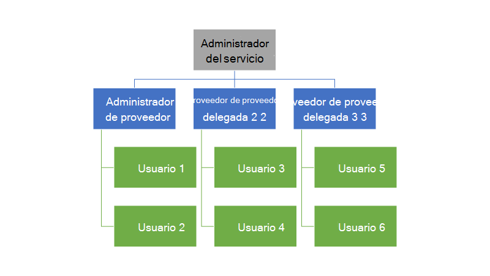
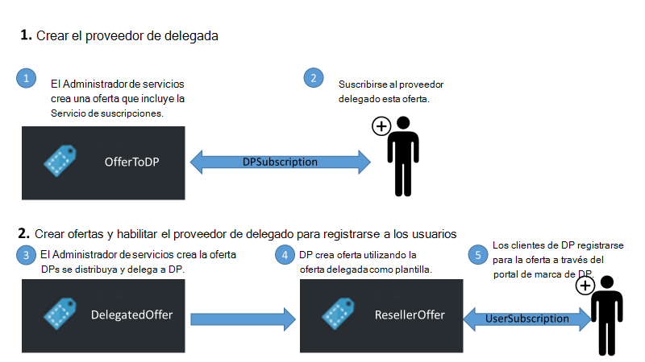
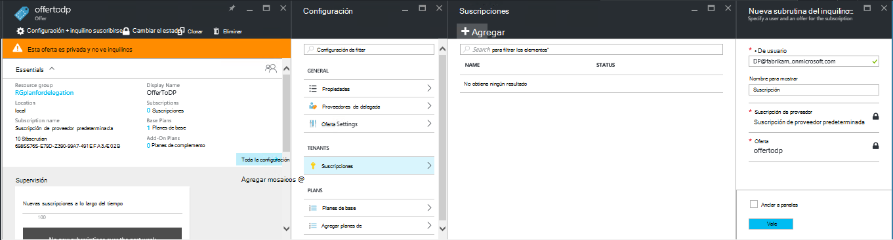
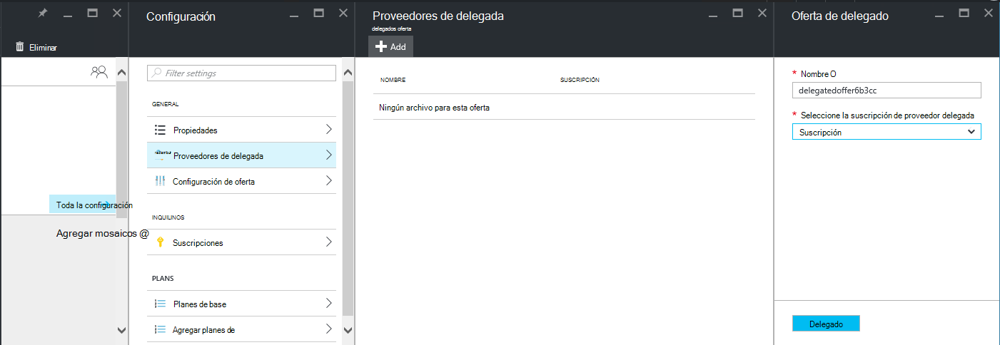
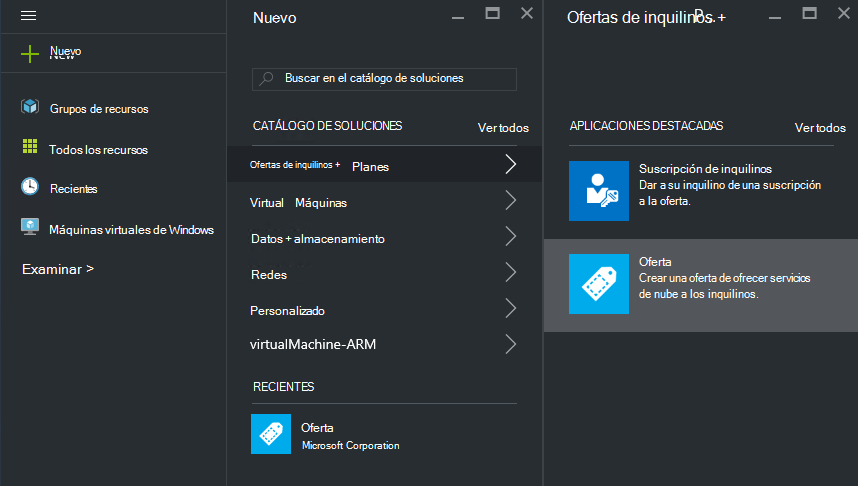
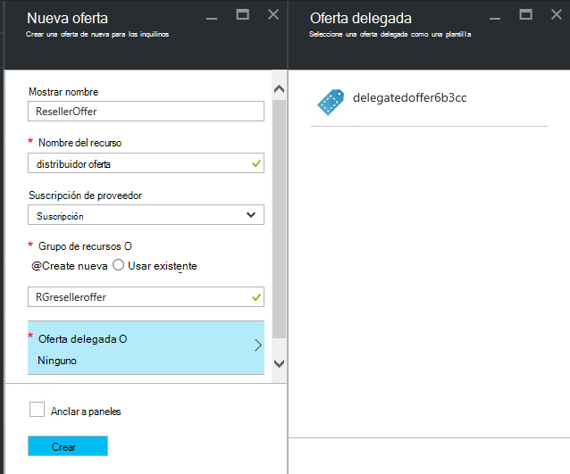
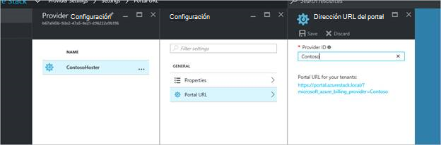
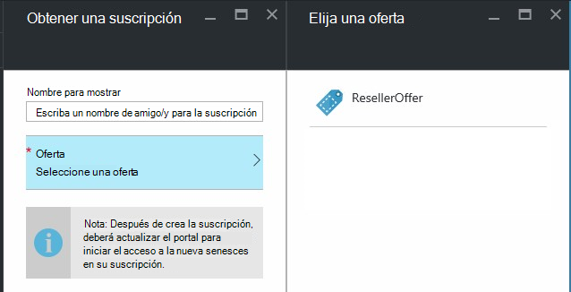

<properties
    pageTitle="Delegar ofertas en pila de Azure | Microsoft Azure"
    description="Obtenga información sobre cómo poner otras personas responsable de crear ofertas y suscribirse a los usuarios para."
    services="azure-stack"
    documentationCenter=""
    authors="AlfredoPizzirani"
    manager="byronr"
    editor=""/>

<tags
    ms.service="azure-stack"
    ms.workload="na"
    ms.tgt_pltfrm="na"
    ms.devlang="na"
    ms.topic="article"
    ms.date="10/07/2016"
    ms.author="alfredop"/>

#Delegar ofertas en pila de Azure

Como administrador del servicio, con qué frecuencia desea colocar otras personas responsable de crear ofertas y suscribirse a los usuarios para. Por ejemplo, esto puede suceder si es un proveedor de servicios y desea distribuidores para registrarse a los clientes y administrarlos en su nombre. También puede ocurrir en una empresa si forman parte de un grupo de TI central y desea que las divisiones o subsidiarias para registrarse a los usuarios sin intervención del usuario.

La delegación ayuda a estas tareas, lo que ayuda a llegar a y administrar más usuarios se puede hacer directamente. La siguiente ilustración muestra un nivel de la delegación, pero pila de Azure es compatible con varios niveles. Proveedores de delegada por separado pueden delegar a otros proveedores de hasta cinco niveles.

Los administradores pueden delegar la creación de ofertas e inquilinos a otros usuarios mediante la funcionalidad de delegación.

##Roles y los pasos de la delegación

Para conocer la delegación, tenga en cuenta que existen tres roles implicados:

-   El **Administrador del servicio** administra la infraestructura de pila de Azure, se crea una plantilla de oferta y delega a otras personas para ofrecer a sus usuarios.

-   Los usuarios delegados se denominan **proveedores de delegados**. Puede pertenecen a otras organizaciones (por ejemplo, otros inquilinos de Azure Active Directory).

-   **Los usuarios** suscribirse a las ofertas y usarlos para administrar sus cargas de trabajo, crear máquinas virtuales, almacenar datos, etcetera.

Como se muestra en el siguiente gráfico, hay dos pasos para configurar la delegación.

1.  Identificar los proveedores delegados. Hacer esto por ellas suscribirse a una oferta en función de un plan que contenga solo el servicio de suscripciones.
    Los usuarios que se suscriben a esta oferta adquirir algunas de las funcionalidades del Administrador de servicios, incluida la capacidad de extender ofertas e inicie usuarios para ellos.

2.  Delegar una oferta en el proveedor de delegada. Esta oferta funciona como una plantilla para lo que puede ofrecer el proveedor delegado. El proveedor de delegada puede tomar la oferta, elija un nombre para el mismo (pero no cambiar sus servicios y cuotas) y ofrecer a los clientes.

Para actuar como delegado de los proveedores, los usuarios necesitan establecer una relación con el proveedor principal; en otras palabras, que necesitan crear una suscripción. En este escenario, esta suscripción identifica los proveedores delegados como el derecho a presentar ofertas en nombre del proveedor principal.

Una vez establecida esta relación, el administrador del sistema puede delegar una oferta en el proveedor de delegada. El proveedor de delegada puede tomar la oferta, cambiarle el nombre (pero no cambiar su contenido) y ofrecer a sus clientes.

Para establecer un proveedor delegado, una oferta de delegado y compruebe que los usuarios puedan iniciar sesión en él, siga las instrucciones en las secciones siguientes.

##Configurar roles

Para ver un proveedor delegado en el trabajo, debe cuentas adicionales de Azure Active Directory además de la cuenta de administrador de servicio. Si no se tienen, cree las dos cuentas. Las cuentas que se pueden pertenecer a cualquier inquilino AAD. Nos referimos a ellos como el proveedor delegado (DP) y el usuario.

| **Función** | **Derechos de la organización** |
| -------------------- | ----------------------- |
|  Proveedor de delegada | Usuario |
| Usuario | Usuario |

##Identificar los proveedores delegados

1.  Inicie sesión como administrador de servicio.

2.  Cree la oferta que le permitirán inquilinos para convertirse en delegado proveedores. Requiere la creación de un plan y una oferta basados en ella:

    una.  [Crear un plan](azure-stack-create-plan.md).
        Este plan debe incluir solo el servicio de suscripciones. En este artículo, usamos un plan de PlanForDelegation.

    b.  [Crear una oferta](azure-stack-create-offer.md) 
     basado en este plan. En este artículo, se utiliza una oferta denominada OfferToDP.

    c.  Una vez completada la creación de la oferta, agregue el identificador de usuario del proveedor delegado como un inquilino para esta oferta haciendo clic en     **suscripciones** &gt; **Agregar** &gt; **Nueva suscripción inquilino**.

  

> [AZURE.NOTE]Como con todas las ofertas de pila de Azure, tiene la opción de realizar la oferta públicos y lo que permite a los usuarios iniciar sesión en o mantener la privacidad y tener administrador del servicio a administrar la suscripción. Proveedores de delegada suelen ser un pequeño grupo y desea controlar quién admitido, por lo que mantener esta oferta privada tendrá sentido en la mayoría de los casos.

##Administrador de servicios crea la oferta delegada

Ya ha establecido su proveedor de delegada. El siguiente paso es crear el plan y la oferta que va a delegar y que usarán los clientes. Debe definir esta oferta exactamente como desea que los clientes para verlo, porque el proveedor delegado no podrá cambiar los planes y las cuotas que incluye.

1.  Como administrador del servicio, [crear un plan](azure-stack-create-plan.md) y [una oferta](azure-stack-create-offer.md) basados en ella. En este artículo, se utiliza una oferta denominada DelegatedOffer.
> [AZURE.NOTE]Esta oferta no es necesario hacer público. Se puede hacer público si elige, pero, en la mayoría de los casos, solo desea delegados proveedores para tener acceso a ella. Una vez delegar una oferta privada como se describe en los pasos siguientes, el proveedor de delegada tendrá acceso a él.

2.  Delegar la oferta. Vaya a DelegatedOffer y, en el panel de configuración, haga clic en **Proveedores de delegados** &gt; **Agregar**.

3.  Seleccione suscripción del proveedor delegada en el cuadro de lista desplegable y haga clic en el **delegado**.

> 

##Proveedor de delegada personaliza la oferta

Inicie sesión como el proveedor de delegada y crear una oferta de nueva usando la oferta delegada como una plantilla.

1.  Haga clic en **nuevo** &gt; **inquilino ofrece + planes** &gt; **ofrecen**.

    

2.  Asignar un nombre a la oferta. A continuación, elija ResellerOffer. Seleccione la oferta delegada basar en y, a continuación, haga clic en **crear**.
    
    

    >[AZURE.NOTE] Tenga en cuenta la diferencia en comparación con la oferta de creación como experimentados por el administrador del servicio. El proveedor de delegada no construye la oferta de planes de bases y complemento; solo podrán elegir entre ofertas que se han delegado a ella y no realizan cambios en ellos.

3. Hacer que la oferta pública haciendo clic en **Examinar** &gt; **ofrece**, seleccionar la oferta y haciendo clic en **Cambiar estado**.

4. El proveedor delegado expone estas ofertas a través del portal de su propia dirección URL. Tenga en cuenta que estas ofertas están visibles solo a través de este portal delegada. Buscar y cambiar esta dirección URL:

    una.  Haga clic en **Examinar** &gt; **configuración de proveedor** &gt; **dirección URL del Portal**.

    b.  Cambiar el ID de proveedor si lo desea.

    c.  Copiar el portal de la dirección URL en una ubicación diferente, como el Bloc de notas.

    
<!-- -->
Ahora ha finalizado la creación de una oferta delegada como un proveedor delegada. Cierre sesión como el proveedor de delegada. Cierre la pestaña del explorador que ha estado utilizando.

##Iniciar sesión en la oferta

1.  En una nueva ventana del explorador, vaya al portal delegado URL que guardó en el paso anterior. Inicie sesión como usuario en el portal. Nota: debe utilizar el portal de delegado para este paso. La oferta delegada no será visible en caso contrario.

2.  En el panel, haga clic en **obtener una suscripción**. Verá que se presentan sólo las ofertas delegadas creadas por el proveedor de delegado para el usuario:

> 

Esto concluye el proceso de delegación de oferta. El usuario puede registrarse ahora para esta oferta por obtener una suscripción.

##Delegación de varios niveles

Delegación de varios niveles permite al proveedor delegado al delegado la oferta a otras entidades. Esto permite, por ejemplo, la creación de canales de distribuidor más profundos, en el que el proveedor de administración de la pila de Azure delega una oferta a un distribuidor, que delega por separado a un distribuidor.
Pila de Azure admite un máximo de cinco niveles de delegación.

Para crear múltiples niveles de delegación de oferta, el proveedor de delegada por separado delega la oferta al siguiente proveedor. El proceso es el mismo para el proveedor de delegada tal y como era para el administrador del servicio (consulte [Administrador de servicios crea la oferta delegada](#service-admin-creates-the-delegated-offer)).

##Pasos siguientes
[Proporciona una máquina virtual](azure-stack-provision-vm.md)
