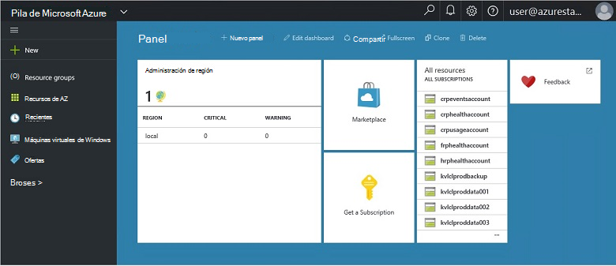
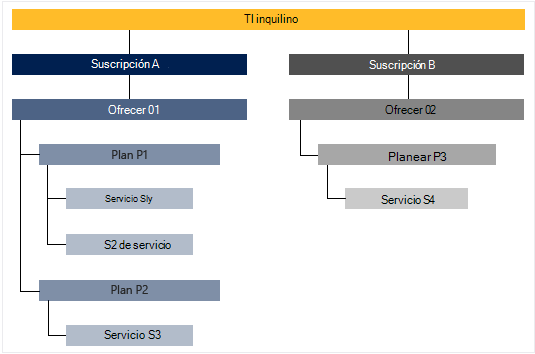

<properties
    pageTitle="Principales características y conceptos en pila de Azure | Microsoft Azure"
    description="Obtenga información sobre las características claves y los conceptos de pila de Azure."
    services="azure-stack"
    documentationCenter=""
    authors="Heathl17"
    manager="byronr"
    editor=""/>

<tags
    ms.service="azure-stack"
    ms.workload="na"
    ms.tgt_pltfrm="na"
    ms.devlang="na"
    ms.topic="article"
    ms.date="10/25/2016"
    ms.author="helaw"/>

# Características clave y los conceptos de pila de Azure

Si es nuevo en la pila de Microsoft Azure, pueden resultar útiles estos términos y descripciones de características.

## Roles

Existen dos tipos de usuarios de Microsoft Azure pila, el administrador del servicio y el inquilino (cliente).

-  Un **Administrador** puede configurar y administrar proveedores de recursos, ofertas de inquilinos, planes, servicios, cuotas y precios.
-  Un **inquilino** adquiere (o compras) servicios que ofrece el administrador del servicio. Inquilinos pueden aprovisionar, supervisar y administrar servicios que han suscrito, como aplicaciones Web, almacenamiento y máquinas virtuales de Windows.

## Portal

Los principales métodos de interacción con Microsoft Azure pila es el portal y PowerShell.

El portal de Microsoft Azure pila es una instancia de Azure portal ejecutando en los servidores. Es un sitio web que ofrece una experiencia de autoservicio para los administradores de servicios y los inquilinos con control de acceso basado en roles (RBAC) a los recursos y la capacidad de la nube, habilitar implementación y desarrollo de servicios y aplicaciones rápida.

## Regiones, servicios, planes, ofertas y suscripciones

En la pila de Azure, servicios se ofrecen a los inquilinos con regiones, suscripciones, ofertas y planes. Los inquilinos pueden suscribirse a varias ofertas. Ofertas pueden tener uno o varios planes y planes pueden tener uno o más servicios.

Jerarquía de ejemplo de suscripciones del inquilino a ofertas, cada una con distintos planes y servicios.

### Regiones
Las áreas de pila Azure son un elemento básico de escala y administración.  Una organización puede tener varias áreas con recursos disponibles en cada región.  Regiones que también tenga ofertas de servicio diferentes disponibles.

### Servicios

Pila de Microsoft Azure permite a los proveedores de ofrecer una amplia variedad de servicios y aplicaciones, como máquinas virtuales de Windows, SQL Server bases de datos, SharePoint, Exchange y más.

### Planes

Los planes son agrupaciones de uno o más servicios. Como un proveedor, cree planes para ofrecer a los inquilinos. A su vez, los inquilinos suscripción a las ofertas para usar los planes y servicios que se incluyen.

Cada agregado a un plan de servicio puede configurarse con la configuración de cuota para ayudarle a administrar la capacidad de la nube. Las cuotas pueden incluir restricciones, como los límites de VM, RAM y CPU y se aplican por la suscripción del usuario. Pueden diferenciar las cuotas de ubicación. Por ejemplo, un plan que contiene los servicios de cálculo de región A podría tener una cuota de dos máquinas virtuales, 4GB de RAM y 10 núcleos de CPU.

Al redactar una oferta, el administrador puede incluir **planes bases**. Estos planes de bases se incluyen de forma predeterminada cuando se suscribe un inquilino a la misma. Tan pronto como un usuario que se ha suscrito y se crea la suscripción, el usuario tiene acceso a todos los proveedores de recursos especificado en los planes de bases (con las cuotas correspondientes).

El administrador del servicio también puede incluir **planes de complemento** en una oferta. Planes de complemento no se incluyen de forma predeterminada en la suscripción. Planes de complemento son planes adicionales (cuotas) disponibles en una oferta que puede agregar un propietario de la suscripción a sus suscripciones.

### Ofertas

Ofertas son grupos de uno o varios planes de los proveedores de presentan a inquilinos para comprar (suscribirse a). Por ejemplo, puede contener ofrecen alfa Plan A (del 1 de la región que contiene un conjunto de servicios de cálculo) y el Plan B (de 2 de la región que contiene un conjunto de servicios de almacenamiento y de red).

Una oferta incluye un conjunto de planes de bases y los administradores de servicios pueden crear planes de complemento que pueden agregar los inquilinos a su suscripción.

### Suscripciones

Una suscripción es cómo inquilinos de compran las ofertas. Una suscripción es una combinación de un inquilino con una oferta. Un inquilino puede tener suscripciones a varias ofertas. Cada suscripción se aplica a solo una oferta. Suscripciones del inquilino determinan qué planes y servicios pueden tener acceso.

Suscripciones a ayudar a los proveedores organizar acceso y uso de recursos de la nube y los servicios.

## Administrador de recursos de Azure

Mediante el Administrador de recursos de Azure, puede trabajar con los recursos de infraestructura en un modelo declarativas basado en la plantilla.   Proporciona una única interfaz que puede usar para implementar, administrar y supervisar los componentes de la solución, como máquinas virtuales, cuentas de almacenamiento, aplicaciones web y bases de datos. Para obtener información completa e instrucciones, vea la [información general del Administrador de recursos de Azure](../azure-resource-manager/resource-group-overview.md).

### Grupos de recursos

Grupos de recursos son conjuntos de aplicaciones, servicios y recursos, y cada recurso tiene un tipo, como máquinas virtuales, redes virtuales, direcciones IP públicas, cuentas de almacenamiento y sitios Web. Cada recurso debe estar en un grupo de recursos y para los grupos de recursos ayudan a lógicamente organizar recursos, como carga de trabajo o ubicación.

Estas son algunas cosas importantes a tener en cuenta al definir un grupo de recursos:

-   Cada recurso sólo puede existir en un grupo de recursos.

-   Se implementar, actualizar y eliminar elementos de un grupo de recursos entre sí. Si un recurso, como un servidor de base de datos, debe existir en un ciclo de implementación diferentes, debería en otro grupo de recursos.

-   Puede agregar o quitar un recurso a un grupo de recursos en cualquier momento.

-   Puede mover un recurso de un grupo de recursos a otro grupo.

-   Un grupo de recursos puede contener recursos que se encuentran en distintas regiones.

-   Un grupo de recursos puede usarse para definir el ámbito de control de acceso para acciones administrativas.

-   Un recurso se pueden vincular a un recurso en otro grupo de recursos cuando los dos recursos deben interactuar con ellos, pero no comparten el mismo ciclo de vida. Por ejemplo, varias aplicaciones deben conectarse a una base de datos, pero dicha base de datos no se actualiza o eliminado al mismo ritmo que las aplicaciones.

-   En la pila de Microsoft Azure, como los planes y ofertas también administrar los recursos en grupos de recursos.

-   Puede implementar un grupo de recursos.  Esto es útil para realizar pruebas o desarrollo.  

### Plantillas de administrador de recursos de Azure

Con el Administrador de recursos de Azure, puede crear una plantilla simple (en formato JSON) que define la implementación y configuración de la aplicación. Esta plantilla se conoce como una plantilla de administrador de recursos de Azure y ofrece una manera descriptiva para definir implementación. Varias veces mediante una plantilla, puede implementar la aplicación en todo el ciclo de vida de la aplicación y tiene confianza que se implementan los recursos en un estado coherente.

## Proveedores de recursos (RPs): red RP, calcular RP, almacenamiento RP

Proveedores de recursos son servicios web que forman la base para todos los IaaS basados en Azure y servicios de PaaS. Administrador de recursos de Azure se basa en RPs diferente para proporcionar acceso a los servicios del anfitrión.

Hay tres RPs principal: red, almacenamiento y cálculo. Cada uno de estos RPs le ayuda a configurar y controlar sus respectivos recursos. Los administradores de servicios también pueden agregar nuevos proveedores de recursos personalizados.

### Calcular RP

El proveedor de recursos calcular (PRC) permite a los inquilinos de pila de Azure crear sus propios máquinas virtuales. También proporciona funcionalidad para el administrador del servicio configurar el proveedor de recursos para los inquilinos. El PRC incluye la capacidad para crear máquinas virtuales, así como las extensiones de máquina Virtual. El servicio de extensión de máquina Virtual ayuda a proporcionar las capacidades de IaaS para máquinas virtuales de Windows y Linux.

### Red RP

El proveedor de recursos de red (NRP) ofrece una serie de características de redes definidas por el Software (SDN) y virtualización de función de red (NFV) para la nube privada. Estas características son coherentes con la nube pública de Azure para que las plantillas de aplicación se pueden escritas una vez e implementar tanto en la nube pública de Azure o local Microsoft Azure pila. El punto de reunión de red proporciona control más detallado de red, etiquetas de metadatos, configuración rápida, predecible y rápida personalización y varias interfaces de control (incluidos PowerShell, .NET SDK, Node.JS SDK, API de REST). Puede usar el NRP para crear grupos de seguridad de red de equilibradores, IP pública, de carga de software, redes virtuales, entre otros.

### Almacenamiento RP

El punto de reunión de almacenamiento ofrece cuatro servicios de almacenamiento de Azure coherente: blobs, tabla, cola y administración de cuentas. También ofrece un servicio de administración de la nube de almacenamiento para facilitar la administración del servicio de proveedor de servicios de almacenamiento de Azure coherentes. Almacenamiento de Azure proporciona la flexibilidad para almacenar y recuperar grandes cantidades de datos no estructurados, como documentos y archivos multimedia con Blobs de Azure, y NoSQL estructurada en función de datos con tablas de Azure. Para obtener más información sobre el almacenamiento de Azure, vea [Introducción a Microsoft Azure almacenamiento](../storage/storage-introduction.md).

#### Almacenamiento de blobs

Almacenamiento de blobs almacena cualquier conjunto de datos. Un blob puede ser cualquier tipo de texto o datos binarios, como un documento, el archivo multimedia o el instalador de la aplicación. Almacenamiento de tablas almacena los conjuntos de datos estructurados. Almacenamiento de tablas es un almacén atributo de clave de datos, lo que permite el desarrollo rápido y acceso rápido a grandes cantidades de datos. Almacenamiento de cola proporciona mensajería confiable para el procesamiento de flujo de trabajo y para la comunicación entre los componentes de servicios en la nube.

Cada blob se organiza en un contenedor. Contenedores también proporcionan una manera útil para asignar las directivas de seguridad a grupos de objetos. Una cuenta de almacenamiento puede contener cualquier número de contenedores y un contenedor puede contener cualquier número de blobs, hasta el límite de capacidad de 500 TB de la cuenta de almacenamiento. Tres tipos de ofertas de almacenamiento de blobs de manchas, bloquear BLOB, anexar BLOB y blobs de página (discos). Bloque BLOB está optimizado para la transmisión y el almacenamiento de objetos de la nube y es una buena opción para almacenar los documentos, archivos multimedia, etcetera las copias de seguridad. Anexar BLOB son similar a bloque BLOB, pero están optimizado para operaciones de datos anexados. Un blob de datos anexados se puede actualizar solo agregando un nuevo bloque al final. Anexar BLOB es una buena opción para escenarios como registro, donde deben escribirse al final del blob nuevos datos. BLOB de página está optimizado para representar IaaS discos y auxiliares aleatorio escribe y pueden ser hasta 1 TB. Conectado a una red de Azure máquina virtual IaaS disco es un disco duro virtual almacenado como un blob de página.

#### Almacenamiento de tablas

Almacenamiento de tablas es almacén clave o atributo de Microsoft: tenga un diseño sin esquemas, lo que diferentes de bases de datos relacionales tradicionales. Dado que falta esquemas almacena los datos, es fácil adaptar los datos como las necesidades de su evolucionar de aplicación. Almacenamiento de tablas es fácil de usar, por lo que los desarrolladores pueden crear aplicaciones rápidamente. Almacenamiento de tablas es un almacén de clave de atributo, lo que significa que se almacena cada valor en una tabla con un nombre de propiedad escrito. El nombre de propiedad puede usarse para filtrar y especificar criterios de selección. Una colección de propiedades y sus valores constan de una entidad. Desde esquemas de falta de almacenamiento de tablas, dos entidades en la misma tabla pueden contener diferentes colecciones de propiedades y las propiedades pueden ser de diferentes tipos. Puede usar el almacenamiento de tablas para almacenar flexible conjuntos de datos, como los datos de usuario para las aplicaciones web, libretas de direcciones, la información del dispositivo y cualquier otro tipo de metadatos que requiere el servicio. Puede almacenar cualquier número de entidades en una tabla y una cuenta de almacenamiento puede contener cualquier número de tablas, hasta el límite de capacidad de la cuenta de almacenamiento.

#### Almacenamiento de cola
Almacenamiento de cola Azure proporciona mensajería entre componentes de la aplicación de nube. En el diseño de aplicaciones de escala, con qué frecuencia se separan componentes de la aplicación, por lo que puede escalar de manera independiente. Almacenamiento de cola proporciona mensajería asincrónica para la comunicación entre componentes de la aplicación, si se están ejecutando en la nube, en el escritorio, en un servidor local o en un dispositivo móvil. Almacenamiento de cola también admite la administración de tareas asincrónicas y la creación de flujos de trabajo del proceso.

## Control de acceso (RBAC) basado en roles

Puede usar RBAC para conceder acceso al sistema a los usuarios autorizados, grupos y servicios mediante la asignación de roles en una suscripción, el grupo de recursos o el nivel de recurso individual. Cada función define el nivel de acceso de que un usuario, grupo o servicio tiene sobre los recursos de la pila de Microsoft Azure.

RBAC Azure tiene tres funciones básicas que se aplican a todos los tipos de recursos: propietario, Colaborador y lector. Propietario tiene acceso completo a todos los recursos, incluido el derecho de acceso de delegado a otras personas. Colaborador puede crear y administrar todos los tipos de recursos de Azure, pero no puede conceder acceso a otras personas. Lector solo puede ver los recursos existentes de Azure. El resto de las funciones RBAC en Azure permitir la administración de recursos de Azure específicos. Por ejemplo, el rol de colaborador de máquina Virtual permite la creación y administración de máquinas virtuales, pero no permite la administración de la red virtual o la subred que se conecta la máquina virtual.

## Datos de uso

Pila de Microsoft Azure recopila y agrega los datos de uso para todos los proveedores de recursos para proporcionar un informe conciso por usuario. Datos pueden ser tan sencillo como recuento de recurso utilizado o tan complejas como contadores de rendimiento y escala individuales. Los datos están disponibles a través de la API de REST. Hay una API de Azure coherente inquilino así como proveedor y delegados API de proveedor obtener datos de uso en todas las suscripciones de inquilinos. Estos datos pueden utilizarse para integrar con una herramienta externa o un servicio de facturación o cargo al usuario.

## Pasos siguientes

[Implementar pila Azure Technical Preview 2 (prueba de concepto)](azure-stack-deploy.md)
