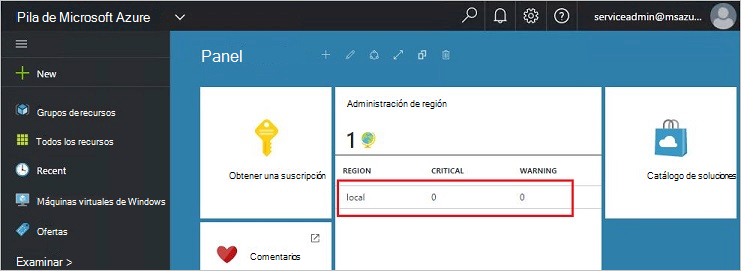
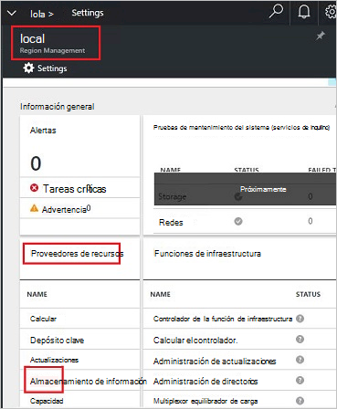
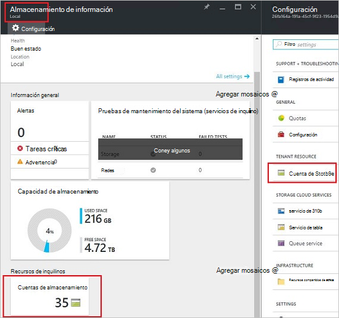
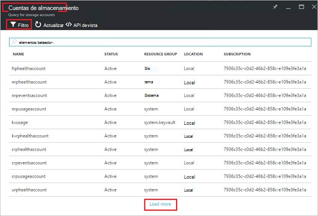
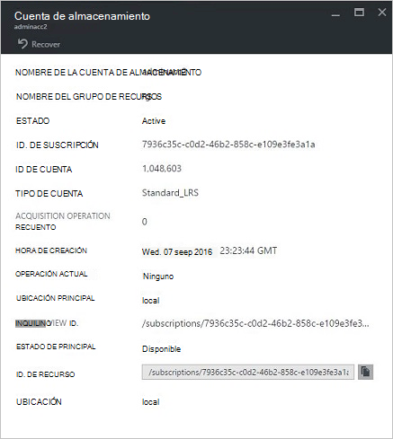
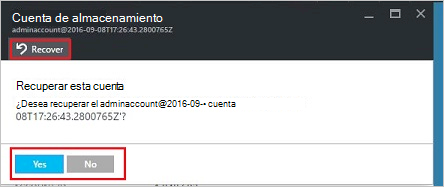
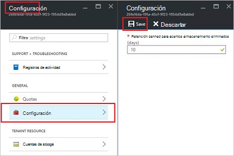

<properties
    pageTitle="Administrar cuentas de almacenamiento de la pila de Azure | Microsoft Azure"
    description="Aprenda a buscar, administrar, recuperar y recuperar cuentas de almacenamiento de la pila de Azure"
    services="azure-stack"
    documentationCenter=""
    authors="AniAnirudh"
    manager="darmour"
    editor=""/>

<tags
    ms.service="azure-stack"
    ms.workload="na"
    ms.tgt_pltfrm="na"
    ms.devlang="na"
    ms.topic="get-started-article"
    ms.date="09/26/2016"
    ms.author="anirudha"/>

# <a name="manage-storage-accounts-in-azure-stack"></a>Administrar cuentas de almacenamiento en la pila de Azure

Obtenga información sobre cómo administrar las cuentas de almacenamiento en la pila de Azure para buscar, recuperar y reasignar capacidad de almacenamiento según las necesidades empresariales.

## <a name="find-a-storage-account"></a>Buscar una cuenta de almacenamiento

La lista de cuentas de almacenamiento en la región puede visualizarse en pila de Azure por:

1.  En un explorador de internet, vaya a [https://portal.azurestack.local](https://portal.azurestack.local/).

2.  Inicie sesión el portal de pila de Azure como administrador (con las credenciales proporcionadas durante la implementación)

3.  En el panel predeterminado: busque lista **administración de región** y haga clic en la región que desea explorar: por ejemplo **(local**).

    

4.  Seleccione el **almacenamiento** de la lista de **Proveedores de recursos** .

    

5.  Ahora, en el módulo de administración del proveedor de recursos de almacenamiento: desplácese hacia abajo hasta la pestaña "Cuentas de almacenamiento" y haga clic en ella.

    
    
    La página resultante es la lista de cuentas de almacenamiento de esa región.

    

De forma predeterminada, se muestran las cuentas de 10 primeros. Puede elegir capturar más haciendo clic en el vínculo "cargar más" en la parte inferior de la lista <br>
OR <br>
Si está interesado en una cuenta de almacenamiento en particular, puede **filtrar y buscar las cuentas relevantes** solo.<br>

Para filtrar cuentas:

1. Haga clic en el botón filtro en la parte superior de la hoja.

2. En el módulo de filtro, le permite especificar el **nombre de la cuenta**,  **Id. de suscripción** o **estado** para ajustar con precisión la lista de cuentas de almacenamiento para que se muestre. Usarlas según corresponda.

3. Haga clic en actualizar. La lista debe actualizar según corresponda.

    

4. Para restablecer el filtro: haga clic en el botón Filtro, borre las selecciones y actualizar.

El cuadro de texto Buscar, en la parte superior del módulo de lista de cuentas de almacenamiento, le permite resaltar el texto seleccionado en la lista de cuentas. Esto es realmente útil en el caso cuando el nombre completo o el identificador no está disponible con facilidad.<br>
Puede usar texto sin formato para facilitar la búsqueda de la cuenta que le interesa.


## <a name="look-at-account-details"></a>Ver los detalles de la cuenta

Una vez haya encontrado las cuentas que le interesa la visualización, puede hacer clic en la cuenta determinada para ver algunos detalles. Se abrirá un nuevo módulo los detalles de la cuenta como el tipo de la cuenta, la hora de creación, la ubicación etcetera.




## <a name="recover-a-deleted-account"></a>Recuperar una cuenta eliminada

Es posible que en una situación donde desea recuperar una cuenta eliminada.<br>
En AzureStack hay una forma muy sencilla.

1.  Vaya a vaya a la lista de cuentas de almacenamiento. [Consulte buscar una cuenta de almacenamiento](#find-a-storage-account)

2.  Busque una cuenta en particular en la lista. Debe filtrar.

3.  Comprobar el estado de' ' de la cuenta. Debe indicar "eliminado".

4.  Haga clic en la cuenta que se abre el módulo de detalles de la cuenta.

5.  En la parte superior este módulo: busque el botón "recuperar" y haga clic en ella.

6.  Confirme pulsando "Sí"

    

7.  La recuperación se encuentra ahora en proceso... Espere a que indica que se realizó correctamente.
    También puede hacer clic en el icono de la "palabra campana" en la parte superior del portal para ver las indicaciones de progreso.

    

  Una vez que se ha sincronizado correctamente la cuenta recuperada, uno puede volver a usarlo.

### <a name="some-gotchas"></a>Algunas trampas

- Su cuenta eliminada muestra el estado como "fuera de retención".

  Esto significa que la cuenta eliminada ha superado el período de retención y no pueden recuperarse ya.

- Su cuenta eliminado no se muestra en la lista de cuentas.

  Esto puede deberse a que la cuenta eliminada ya ha sido recolección. En este caso no podrá recuperarla ya. Consulte "reclamar la capacidad" más adelante.

## <a name="set-retention-period"></a>Establecer el período de retención

Valor de período de retención permite a un administrador especificar un período de tiempo en días (entre 0 y 9999 días) durante el cual potencialmente se puede recuperar cualquier cuenta eliminada. El período de retención predeterminado se establece en 15 días. El valor "0" significa que la cuenta eliminada inmediatamente estará fuera de retención y marca para recolección periódico.

Para cambiar el período de retención:

1.  En un explorador de internet, vaya a [https://portal.azurestack.local](https://portal.azurestack.local/).

2.  Inicie sesión el portal de pila de Azure como administrador (con las credenciales proporcionadas durante la implementación)

3.  En el panel predeterminado: busque lista **administración de región** y haga clic en la región que desea explorar: por ejemplo **(local**).

4.  Seleccione el **almacenamiento** de la lista de **Proveedores de recursos** .

5.  Haga clic en el icono de configuración en la parte superior para abrir la hoja de configuración.

6.  Haga clic en configuración - período de retención.

7.  Puede editar el valor y guárdelo.

 Este valor se efectiva inmediatamente y reflejar a través de toda la región.



## <a name="reclaim-capacity"></a>Reclamar la capacidad

Uno de los efectos de disponer de un período de retención es que una cuenta eliminada seguirán consumir capacidad hasta que se fuera del período de retención. Como administrador, es posible que tenga una manera de recuperar este eliminado espacio cuentas incluso si aún no ha caducado el período de retención. Actualmente se puede utilizar una línea de comandos para reemplazar explícitamente el período de retención e inmediatamente reclamar la capacidad. Para hacerlo:

1.  Suponiendo que Azure PowerShell instalado y configurado. Si no siga las instrucciones aquí: para instalar la última versión de PowerShell de Azure y asociar con su suscripción de Azure, consulte [cómo instalar y configurar Azure PowerShell](http://azure.microsoft.com/documentation/articles/powershell-install-configure/).
    Para obtener más información acerca de los cmdlets del Administrador de recursos de Azure, vea [con Azure con el Administrador de recursos de Azure](http://go.microsoft.com/fwlink/?LinkId=394767)

2.  Ejecute este cmdlet:

    ```
    PS C:\\>; Clear-ACSStorageAccount -ResourceGroupName system
    -FarmName <your farmname>
    ```

> Para obtener más detalles, consulte la [documentación de powershell de AzureStack](https://msdn.microsoft.com/library/mt637964.aspx)

> [AZURE.NOTE] Si ejecuta este cmdlet, se eliminará permanentemente la cuenta y su contenido. Ya no estará recuperable. Usar con cuidado.

