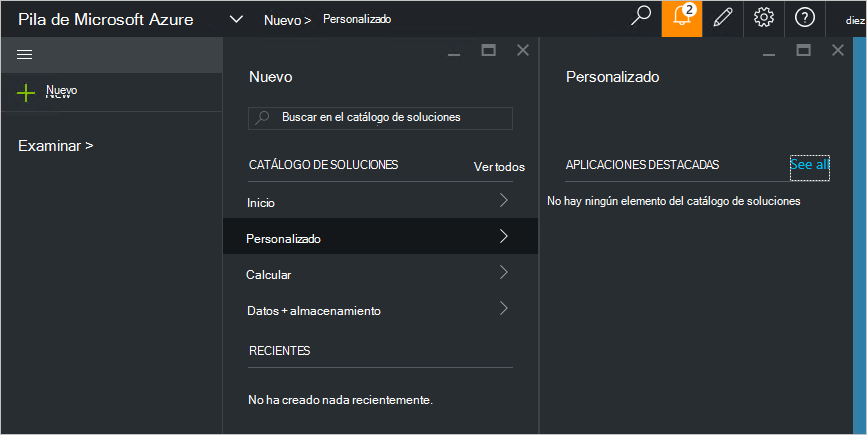

<properties
    pageTitle="Publicar un elemento del catálogo de soluciones personalizadas de pila de Azure (Administrador de servicios) | Microsoft Azure"
    description="Como administrador de servicios, obtenga información sobre cómo publicar un elemento del catálogo de soluciones personalizadas en pila de Azure."
    services="azure-stack"
    documentationCenter=""
    authors="rupisure"
    manager="byronr"
    editor=""/>

<tags
    ms.service="azure-stack"
    ms.workload="na"
    ms.tgt_pltfrm="na"
    ms.devlang="na"
    ms.topic="article"
    ms.date="09/26/2016"
    ms.author="rupisure"/>

# El catálogo de soluciones de pila de Azure

El catálogo de soluciones es una colección de elementos personalizados para la pila de Azure, como servicios, aplicaciones y recursos. Es el lugar procedencia de inquilinos para crear nuevos recursos e implementar nuevas aplicaciones. Los administradores de servicios pueden agregar elementos personalizados para el catálogo de soluciones e inquilinos los verán inmediatamente.

Para abrir el catálogo de soluciones, haga clic en **nuevo**.

El catálogo de soluciones se actualiza cada cinco minutos.

## Elementos del catálogo de soluciones

Cada elemento del catálogo de soluciones tiene:

-   Una plantilla de administrador de recursos de Azure para el aprovisionamiento de recursos

-   Metadatos, como cadenas, iconos y otros materiales de marketing

-   Información de formato para mostrar el elemento en el portal

Cada elemento publicado en el catálogo de soluciones utiliza un formato denominado el paquete de la Galería de Azure (azpkg). Recursos de implementación o runtime (por ejemplo, código, archivos zip con el software o imágenes de máquina virtual) deben agregarse a la pila de Azure por separado, no como parte del elemento de catálogo de soluciones. 

## Pasos siguientes

[Crear y publicar un elemento del catálogo de soluciones](azure-stack-create-and-publish-marketplace-item.md)
