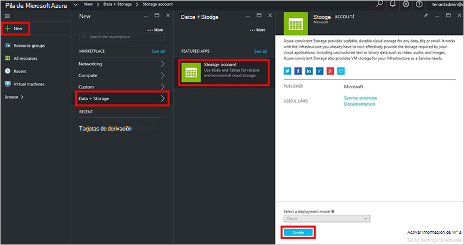
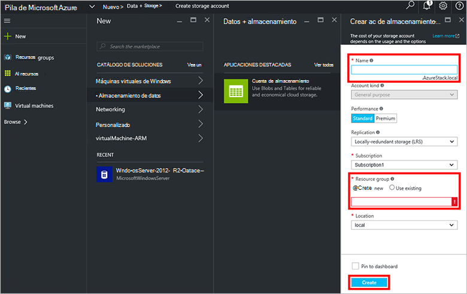
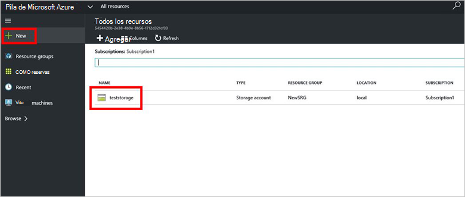

<properties
    pageTitle="Cuentas de almacenamiento en pila de Azure | Microsoft Azure"
    description="Obtenga información sobre cómo crear una cuenta de pila de Azure almacenamiento."
    services="azure-stack"
    documentationCenter=""
    authors="ErikjeMS"
    manager="byronr"
    editor=""/>

<tags
    ms.service="azure-stack"
    ms.workload="na"
    ms.tgt_pltfrm="na"
    ms.devlang="na"
    ms.topic="get-started-article"
    ms.date="09/26/2016"
    ms.author="erikje"/>

# Cuentas de almacenamiento en pila de Azure

Cuentas de almacenamiento incluyen servicios Blob y tabla y el espacio de nombres único para los objetos de datos de almacenamiento. De forma predeterminada, los datos de su cuenta están disponibles solo para usted, el propietario de la cuenta de almacenamiento.

1.  En el equipo de prueba de concepto de pila de Azure, inicie sesión en `https://portal.azurestack.local` como [Administrador](azure-stack-connect-azure-stack.md#log-in-as-a-service-administrator)y, a continuación, haga clic en **nuevo** > **datos + almacenamiento** > **cuenta de almacenamiento**.

    

2.  En el módulo **crear cuenta de almacenamiento** , escriba un nombre para su cuenta de almacenamiento. Crear un nuevo **Grupo de recursos**, o seleccione uno existente y después haga clic en **crear** para crear la cuenta de almacenamiento.

    

3. Para ver la nueva cuenta de almacenamiento, haga clic en **todos los recursos**, a continuación, busque la cuenta de almacenamiento y haga clic en su nombre.

    
    
## Pasos siguientes

[Usar plantillas de administrador de recursos de Azure](azure-stack-arm-templates.md)

[Obtenga más información sobre las cuentas de almacenamiento de Azure](../storage/storage-create-storage-account.md)

[Descargar a la Guía de validación de almacenamiento Azure coherente de pila de Azure](http://aka.ms/azurestacktp1doc)
