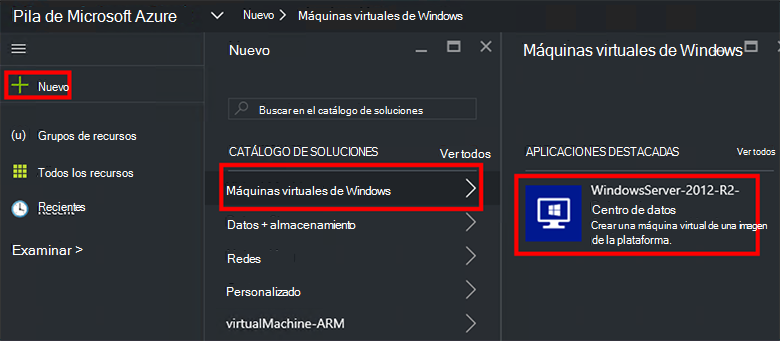
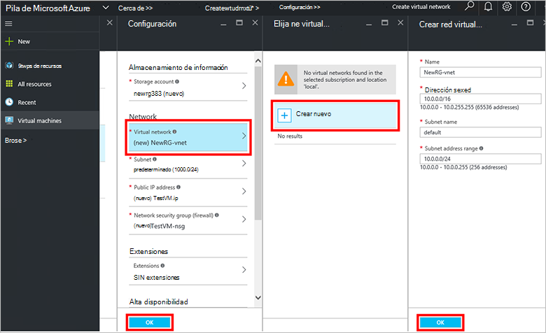
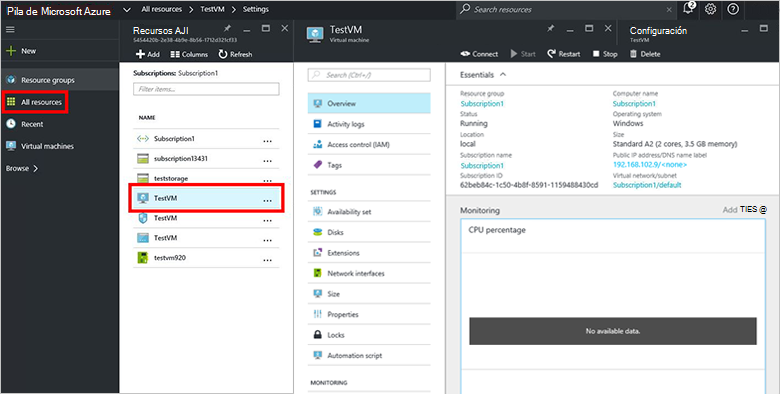

<properties
    pageTitle="Proporciona una máquina virtual en pila de Azure (inquilino) | Microsoft Azure"
    description="Como un inquilino, obtenga información sobre cómo aprovisionar una máquina virtual en pila de Azure."
    services="azure-stack"
    documentationCenter=""
    authors="ErikjeMS"
    manager="byronr"
    editor=""/>

<tags
    ms.service="azure-stack"
    ms.workload="na"
    ms.tgt_pltfrm="na"
    ms.devlang="na"
    ms.topic="get-started-article"
    ms.date="10/12/2016"
    ms.author="erikje"/>

# Aprovisionar una máquina virtual

Como administrador, puede crear máquinas virtuales para evaluar los recursos antes de que se ofrece en los planes.

## Aprovisionar una máquina virtual

1.  En el equipo de prueba de concepto de pila de Azure, inicie sesión en `https://portal.azurestack.local` como [Administrador](azure-stack-connect-azure-stack.md#log-in-as-a-service-administrator)y, a continuación, haga clic en **nuevo** > **máquinas virtuales** > **Windows Server 2012-R2-centro de datos**.  

    

2.  En el módulo de **conceptos básicos** , escriba un **nombre**, el **nombre de usuario**y la **contraseña**. En **tipo de máquina virtual disco**, elija la **unidad de disco duro**. Elija una **suscripción**. Crear un **grupo de recursos**, o seleccione uno existente y, a continuación, haga clic en **Aceptar**.  

3.  En el módulo de **Elegir un tamaño** , haga clic en **Básica de A1**y, a continuación, haga clic en **Seleccionar**.  

4.  En el módulo de **configuración** , haga clic en **red Virtual**. En el módulo de **Elegir una red virtual** , haga clic en **Crear nuevo**. En el módulo de **red virtual de crear** , Aceptar todos los valores predeterminados y haga clic en **Aceptar**. En el módulo de **configuración** , haga clic en **Aceptar**.

    

5.  En el módulo de **Resumen** , haga clic en **Aceptar** para crear la máquina virtual.  

6. Para ver el nuevo equipo virtual, haga clic en **todos los recursos**, a continuación, busque la máquina virtual y haga clic en su nombre.

    

## Pasos siguientes

[Cuentas de almacenamiento](azure-stack-provision-storage-account.md)
