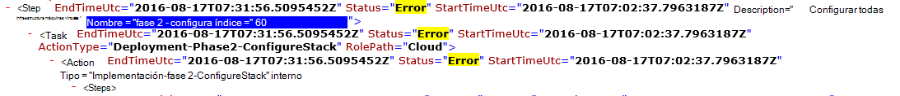

<properties
    pageTitle="Vuelva a ejecutar una implementación de un paso error | Microsoft Azure"
    description="Si se produce un error durante la implementación, puede intentar los siguientes pasos para volver a ejecutar la implementación desde donde se produjo un error."
    services="azure-stack"
    documentationCenter=""
    authors="ErikjeMS"
    manager="byronr"
    editor=""/>

<tags
    ms.service="azure-stack"
    ms.workload="na"
    ms.tgt_pltfrm="na"
    ms.devlang="na"
    ms.topic="get-started-article"
    ms.date="09/26/2016"
    ms.author="erikje"/>
    
# Vuelva a ejecutar una implementación de un paso error
  
Si se produce un error durante la implementación, puede intentar los siguientes pasos para volver a ejecutar la implementación desde donde se produjo un error.

## Encontrar el error

No se pudo tomar nota del error, específicamente en la parte que llama en qué paso la llamada. Por ejemplo,

**2016-08-17 00:30:57 error 1 > 1 > acción: no se pudo invocar del paso 60.140.143. Detener invocación de plan de acción.**

Este es el paso de implementación donde se iniciará el volver a ejecutar de la implementación.

## Buscar más detalles sobre el error

Si desea obtener más detalles sobre el error, buscar asociado **resumen. AAAA-MM-DD.tt.N.log.xml** en el **C:\CloudDeployment\Logs\* * carpeta.
Para buscar la cadena "Error" y siga hacia abajo de a través del resultado hasta que vea una gran cantidad de texto con formato no XML que contiene el mensaje de error (esta sección a menudo coincide con la última instancia de la cadena "Error"). Por ejemplo:

También puede usar esta información para realizar un seguimiento del paso ejecutar de nuevo, siga los números "Índice" hacia arriba desde el último error. En la imagen anterior, puede ver (empezando desde la parte inferior): 143, 140 y, si desplazarse hacia arriba, vea 60:

¿Coloca todas juntas (ahora de arriba a abajo), obtendrá 60.140.143, igual que en el resultado de la consola de PS del error (tal como se muestra en la sección "Buscar el error" anteriormente).

## Vuelva a ejecutar la implementación en un paso específico

Ahora que tiene el paso que no se pudo la implementación de, puede intentar una - volver a ejecutar de la implementación de este paso.

> [AZURE.IMPORTANT] El usuario correcto en contexto con el error que se ha producido deben ejecutar los siguientes comandos. Si el error se produjo antes de que el HOST se ha unido al dominio, ejecute estos pasos como la cuenta de administrador local. Si el error después de que el HOST se ha unido al dominio, ejecute estos pasos como administrador de dominio (azurestack\azurestackadmin).

### Ejecutar el comando invocar EceAction

1. Desde una consola PS elevada, importar los módulos siguientes:

        Import-Module C:\CloudDeployment\CloudDeployment.psd1 -Force
        Import-Module C:\CloudDeployment\ECEngine\EnterpriseCloudEngine.psd1 -Force 

2. A continuación, ejecute el siguiente comando (por ejemplo desde aquí utilizado):

        Invoke-EceAction -RolePath Cloud -ActionType Deployment -Start 60.140.143 -Verbose

3.  Se iniciará la implementación del paso identificada por el - parámetro de inicio del comando invocar EceAction

### Resultados de volver a ejecutar /-inicio

Independientemente de la opción que elija, comenzará de nuevo la implementación de especificado - parámetro de inicio.

1.  Si el error es recuperable, seguirá la implementación a través de finalización.

2.  Si la implementación nuevo falla en...
    
    - el mismo lugar: el error probablemente no es recuperable y, a continuación, se requiere una investigación más.

    - un nuevo lugar después donde falló esta vez: puede intentar los mismos pasos para obtener el ritmo de nuevo.

    - un nuevo lugar antes donde falló esta vez: más hubo un problema con una llamada idempotente, que precisa una investigación más.

## Pasos siguientes

[Conectarse a la pila de Azure](azure-stack-connect-azure-stack.md)

