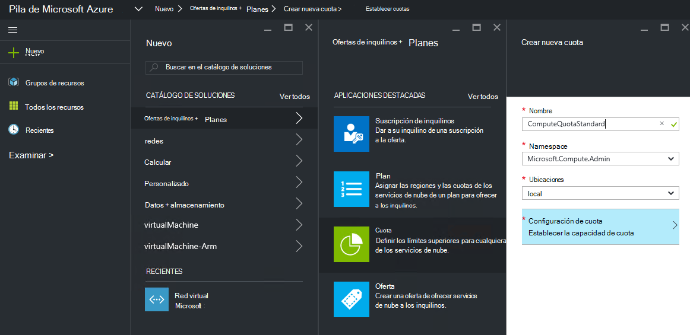
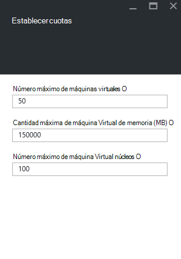
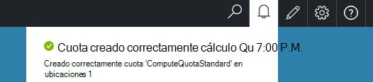

<properties
    pageTitle="Las cuotas de pila de Azure | Microsoft Azure"
    description="Los administradores establecer cuotas para limitar la cantidad máxima de recursos que el acceso a los inquilinos."
    services="azure-stack"
    documentationCenter=""
    authors="mattmcg"
    manager="byronr"
    editor=""/>

<tags
    ms.service="azure-stack"
    ms.workload="na"
    ms.tgt_pltfrm="na"
    ms.devlang="na"
    ms.topic="get-started-article"
    ms.date="09/26/2016"
    ms.author="mattmcg"/>

# Establecer cuotas en pila de Azure

Las cuotas de definen los límites de recursos que se puede aprovisionar o consumir una suscripción de inquilinos. Por ejemplo, una cuota podría permitir un inquilino crear máquinas virtuales de un máximo de cinco. Para agregar un servicio a un plan, el administrador debe configurar la configuración de cuota de dicho servicio.

Las cuotas son configurables por el servicio y por ubicación, permitir a los administradores proporcionar un mayor control sobre el consumo de recursos. Los administradores pueden crear uno o varios de los recursos de cuota y asociarlos con los planes, lo que significa que pueden proporcionar ofertas diferenciadas para sus servicios. Las cuotas de un servicio determinado se pueden crear desde el módulo de administración de **Proveedor de recursos** para dicho servicio.

Un inquilino que se suscribe a una oferta que contiene varios planes puede usar todos los recursos que están disponibles en cada plan.

## Para crear una cuota de IaaS

1.  En un explorador, vaya a [https://portal.azurestack.local](https://portal.azurestack.local/).

    Inicie sesión en el portal de pila de Azure como administrador (mediante las credenciales que facilitó durante la implementación).

2.  Seleccione **nuevo**y, a continuación, seleccione **cuota**.

3.  Seleccione el primer servicio para el que desea crear una cuota. Para una cuota de IaaS, siga estos pasos para los servicios de proceso, red y almacenamiento.
En este ejemplo, primero se crea una cuota para el servicio de cálculo. En la lista **Namespace** , seleccione el espacio de nombres **Microsoft.Compute.Admin** .

    > 

4.  Elija la ubicación donde se define la cuota (por ejemplo, 'local').

5.  En el elemento de la **Configuración de cuota** , dice **establecer la capacidad de cuota**. Haga clic en este artículo para configurar los valores de cuota.

6.  En el módulo de **Establecer cuotas** , puede ver todos los recursos de cálculo para que puede configurar los límites. Cada tipo tiene un valor predeterminado que tiene asociado. Puede cambiar estos valores o puede seleccionar el botón **Aceptar** en la parte inferior del módulo para aceptar los valores predeterminados.

    > 

7.  Después de haber configurado los valores y hacer clic en **Aceptar**, aparece el elemento de **Configuración de cuota** como **configurado**. Haga clic en **Aceptar** para crear la **cuota** de recursos.

    Verá una notificación que indica que se creará el recurso de cuota.

8.   Después de que se ha creado correctamente el conjunto de cuota, recibirá una notificación de la segunda. La cuota de servicio de cálculo está preparada para estar asociadas a un plan. Repita estos pasos con los servicios de almacenamiento y de red y esté listo para crear un plan de IaaS!

    >   

## Calcular tipos de cuota

|**Tipo**                    |**Valor predeterminado**| **Descripción**|
|--------------------------- | ------------------------------------|------------------------------------------------------------------|
|Número máximo de máquinas virtuales   |50|El número máximo de máquinas virtuales que puede crear una suscripción en esta ubicación. |
|Número máximo de núcleos de máquina virtual              |100|El número máximo de núcleos que puede crear una suscripción en esta ubicación (por ejemplo, una máquina virtual de A3 tiene cuatro núcleos).|
|Cantidad máxima de memoria de máquina virtual (GB)         |150|La cantidad máxima de RAM que se puede aprovisionar en megabytes (por ejemplo, una máquina virtual de A1 consume 1,75 GB de RAM).|

> [AZURE.NOTE] Calcular las cuotas no se aplican en esta vista preliminar técnica.

## Tipos de cuota de almacenamiento

|**Elemento**                           |**Valor predeterminado**   |**Descripción**|
|---------------------------------- |------------------- |-----------------------------------------------------------|
|Capacidad máxima (GB)              |500                 |Capacidad de almacenamiento total que puede usar una suscripción en esta ubicación.|
|Número total de cuentas de almacenamiento   |20                  |El número máximo de cuentas de almacenamiento que puede crear una suscripción en esta ubicación.|

## Tipos de cuota de red

|**Elemento**                                                   |**Valor predeterminado**   |**Descripción**|
|----------------------------------------------------------| ------------------- |--------------------------------------------------------------------------------------------------------------------------------------------------------------------|
| Direcciones IP de público Max                         |50                  |El número máximo de direcciones IP pública que puede crear una suscripción en esta ubicación. |
| Redes virtuales de Max                   |50                  |El número máximo de redes virtuales que puede crear una suscripción en esta ubicación. |
| Puertas de enlace de red virtual máxima           |1                   |El número máximo de puertas de red virtual (VPN puertas de enlace) que puede crear una suscripción en esta ubicación. |
| Número máximo de conexiones de red                |2                   |El número máximo de conexiones de red (punto a punto o a sitios) que puede crear una suscripción a través de todas las puertas de enlace de red virtual en esta ubicación. |
| Equilibradores de carga de Max                     |50                  |El número máximo de equilibradores de carga que puede crear una suscripción en esta ubicación. |
| Max NIC                               |100                 |El número máximo de interfaces de red que puede crear una suscripción en esta ubicación. |
| Grupos de seguridad de red Max            |50                  |El número máximo de grupos de seguridad de red que puede crear una suscripción en esta ubicación. |
