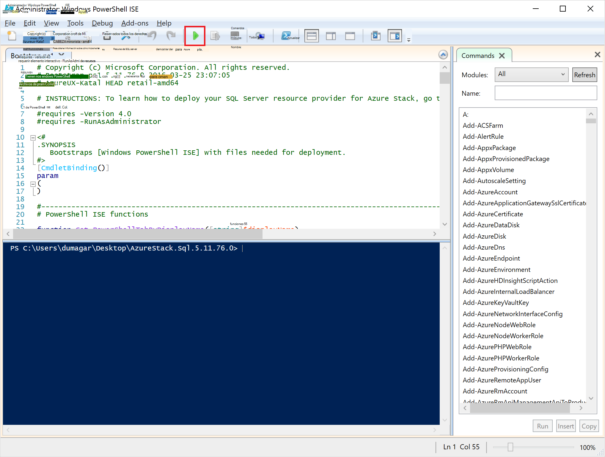
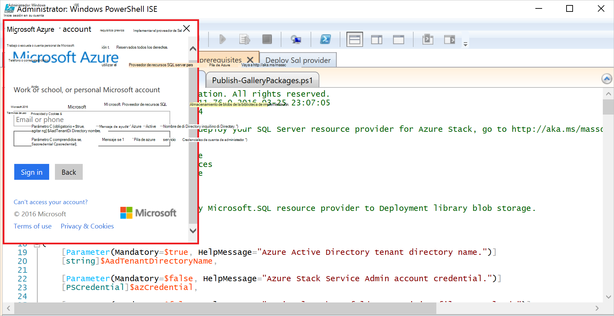
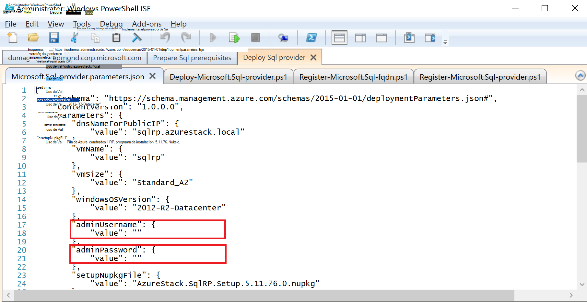
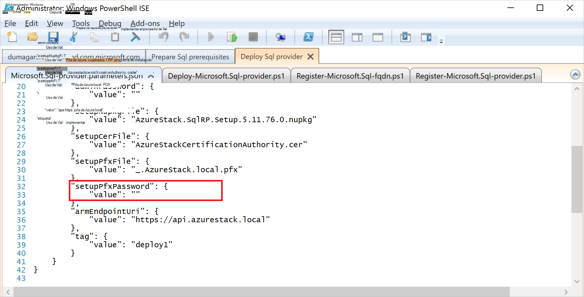
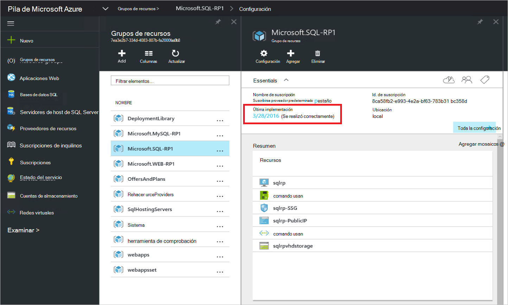
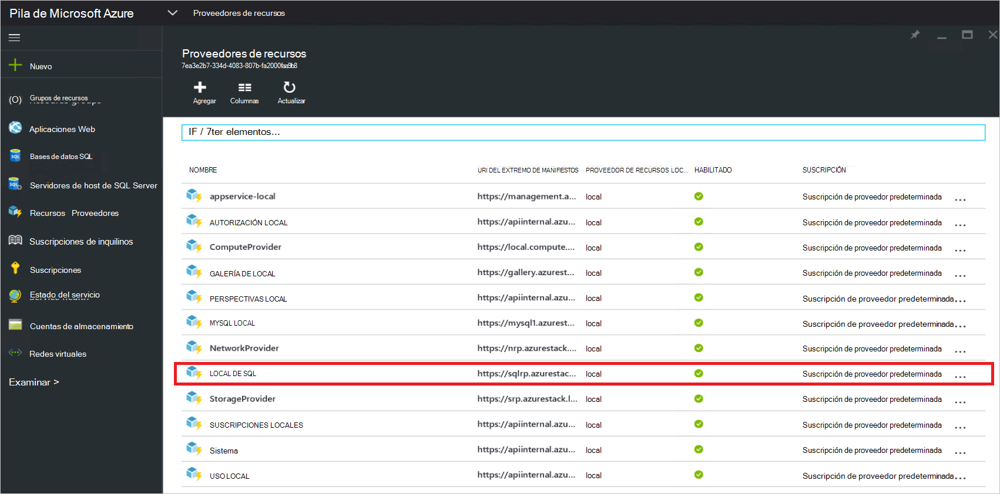
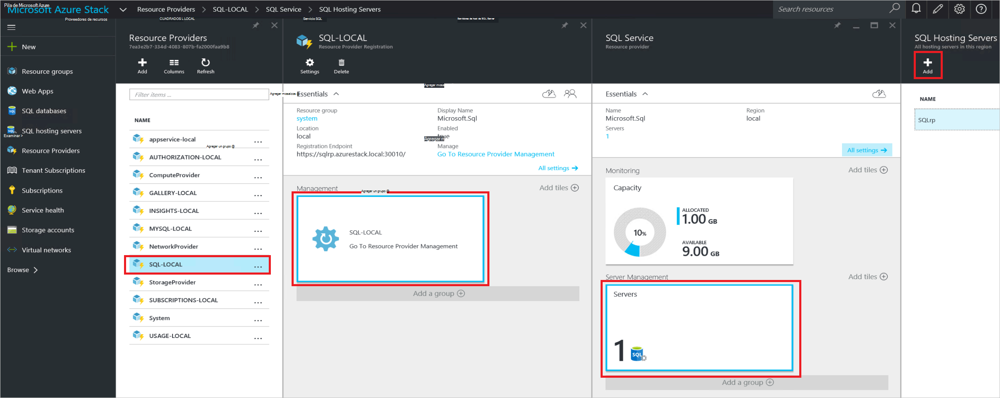
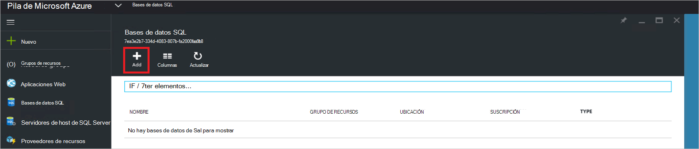
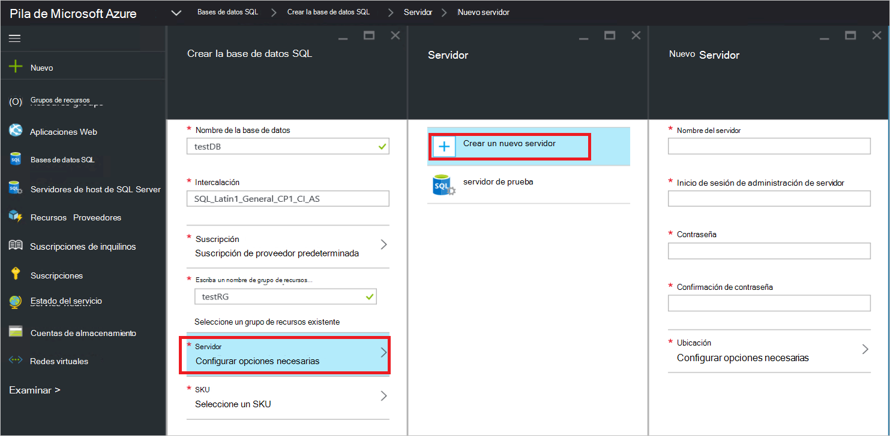
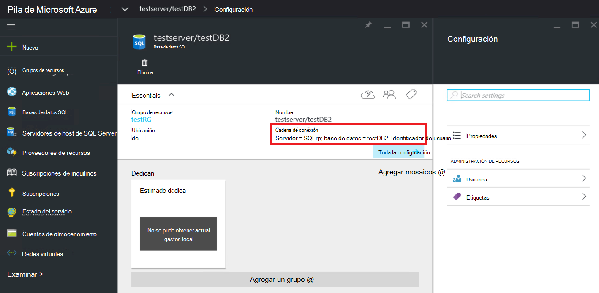

<properties
    pageTitle="Implementar el proveedor de recursos de SQL Server en pila de Azure | Microsoft Azure"
    description="Pasos detallados para implementar un adaptador de proveedor de recursos de SQL Server en pila de Azure."
    services="azure-stack"
    documentationCenter=""
    authors="Dumagar"
    manager="byronr"
    editor=""/>

<tags
    ms.service="multiple"
    ms.workload="na"
    ms.tgt_pltfrm="na"
    ms.devlang="na"
    ms.topic="article"
    ms.date="09/26/2016"
    ms.author="dumagar"/>

# Implementar el adaptador de proveedor de recursos SQL Server en pila de Azure

> [AZURE.NOTE] La siguiente información solo se aplica a implementaciones TP1 de pila de Azure.

Use este artículo para seguir los pasos detallados para configurar el adaptador de proveedor de recursos de SQL Server en la pila de Azure prueba de concepto (prueba de concepto). Consulte [Usar bases de datos SQL en la pila de Azure](azure-stack-sql-rp-deploy-short.md) para comprender la arquitectura y las capacidades de proveedor de recursos.

## Pasos de configuración antes de implementar

Antes de implementar el proveedor de recursos, debe:

- Tiene una imagen predeterminada de Windows Server con .NET 3.5
- Desactivar la seguridad mejorada de Internet Explorer (IE)
- Instalar la última versión de PowerShell de Azure

### Crear una imagen de Windows Server, incluidos .NET 3.5

Puede omitir este paso si ha descargado los bits de Azure pila después 23/2/2016 porque la imagen predeterminada de Windows Server 2012 R2 base incluye 3.5 de .NET framework en esta descarga y versiones posteriores.

Si ha descargado antes de 23/2/2016, tiene que crear un disco duro virtual de Windows Server 2012 R2 centro de datos con la imagen de .NET 3.5 y conjunto es como la imagen predeterminada en el repositorio de imágenes de la plataforma.

### Desactivar IE mejorado de seguridad y habilitar cookies

Para implementar un proveedor de recursos, ejecute el entorno de Scripting integrado (ISE) de PowerShell como administrador, por lo que debe permitir las cookies y JavaScript en el perfil de Internet Explorer que usa para iniciar sesión en Azure Active Directory para inicios de sesión de usuario y de administrador.

**Para desactivar IE seguridad mejorada:**

1. Inicie sesión en el equipo de pila de Azure prueba de concepto (prueba de concepto) como un administrador de AzureStack y, a continuación, abra el administrador del servidor.

2. Desactivar **La configuración de seguridad mejorada de Internet Explorer** para administradores y usuarios.

3. Inicie sesión en la máquina virtual **ClientVM.AzureStack.local** como administrador y, a continuación, abra el administrador del servidor.

4. Desactivar **La configuración de seguridad mejorada de Internet Explorer** para administradores y usuarios.

**Para habilitar las cookies:**

1. En la pantalla de inicio de Windows, haga clic en **todas las aplicaciones**, haga clic en **Accesorios de Windows**, haga clic en **Internet Explorer**, seleccione **más**y, a continuación, haga clic en **Ejecutar como administrador**.

2. Si se le solicita, active **usar recomendada seguridad**y, a continuación, haga clic en **Aceptar**.

3. En Internet Explorer, haga clic en el **icono Herramientas (del engranaje)** &gt; **Opciones de Internet** &gt; pestaña **privacidad** .

4. Haga clic en **Avanzadas**, asegúrese de que se seleccionan ambos botones **Aceptar** , haga clic en **Aceptar**y, a continuación, haga clic en **Aceptar** nuevamente.

5. Cierre Internet Explorer y reinicie PowerShell ISE como administrador.

### Instalar una versión compatible de Azure pila de PowerShell de Azure

1. Desinstale cualquier PowerShell Azure existente de la máquina virtual de cliente.

2. Inicie sesión como un administrador de AzureStack en el equipo de prueba de concepto de pila de Azure.

3. Uso de escritorio remoto, inicie sesión en la máquina virtual **ClientVM.AzureStack.local** como administrador.

4. Abra el Panel de Control, haga clic en **desinstalar un programa** &gt; haga clic en **Azure PowerShell** &gt; haga clic en **desinstalar**.

5. [Descargar la última Azure PowerShell que admita pila de Azure](http://aka.ms/azstackpsh) e instálelo.

    Después de instalar PowerShell, puede ejecutar esta comprobación de secuencias de comandos de PowerShell para asegurarse de que puede conectarse a su instancia de pila de Azure (debería aparecer una página web de inicio de sesión).

## Iniciar la implementación de proveedor de recursos PowerShell

1. Conectar la versión de escritorio remoto de prueba de concepto de pila de Azure con clientVm.AzureStack.Local e inicie sesión como azurestack\\azurestackuser.

2. [Descargar los archivos binarios SQLRP](http://aka.ms/massqlrprfrsh) archivo. Es podrán que necesite quitar el bloqueo de seguridad de descarga de Internet con el botón secundario en el archivo, seleccione **Propiedades** y en la pestaña **General** , graduación **desbloquear**, **Aceptar**. Esto deberá impedir excepciones 'No se puede cargar archivo o ensamblado' relacionados con DeploymentTelemetry.dll y las siguientes excepciones de implementación de seguimiento.

3. Extraer los archivos a D:\\SQLRP.

4. Ejecutar la D:\\SQLRP\\Bootstrap.cmd el archivo como un administrador (azurestack\\administrador).

    Se abrirá el archivo Bootstrap.ps1 en PowerShell ISE.

5. Cuando finaliza la carga de la ventana de PowerShell ISE, haga clic en el botón Reproducir o presione F5.

    

    Se cargará dos pestañas principales, cada uno con todas las secuencias de comandos y los archivos que necesita para implementar el proveedor de recursos.

## Preparar los requisitos previos

Haga clic en la pestaña de **Requisitos previos de prepararse** para:

- Crear certificados necesarios
- Cargar artefactos a una cuenta de almacenamiento en la pila de Azure
- Publicar elementos de la Galería

### Cree los certificados necesarios
Esta secuencia de comandos de **Nuevo SslCert.ps1** agrega la \_. Certificado SSL de AzureStack.local.pfx D:\\SQLRP\\requisitos previos\\BlobStorage\\carpeta del contenedor. El certificado protege la comunicación entre el proveedor de recursos y la instancia local del Administrador de recursos de Azure.

1. En la pestaña principal **Requisitos previos preparar** , haga clic en la ficha **Nuevo SslCert.ps1** y ejecútelo.

2. En el mensaje que aparece, escriba una contraseña PFX que protege la clave privada y **tome nota de esta contraseña**. Necesitará más adelante.

### Cargar todos los artefactos a una cuenta de almacenamiento en la pila de Azure

1. Haga clic en la ficha **RP.ps1 de Microsoft.Sql de carga** y ejecutarla.

2. En el cuadro de diálogo solicitud de credenciales de Windows PowerShell, escriba las credenciales de administrador del servicio de pila de Azure.

3. Cuando se le solicite el identificador de inquilinos de Azure Active Directory, escriba su nombre de dominio completo del inquilino de Azure Active Directory: por ejemplo, microsoftazurestack.onmicrosoft.com.

    Una ventana emergente solicita las credenciales.

    

    > [AZURE.TIP] Si no aparece la ventana emergente, que ya sea todavía no lo ha desactivado IE mayor seguridad para habilitar JavaScript en este equipo y el usuario o no ha aceptado cookies en Internet Explorer. Vea [Configurar pasos antes de implementar](#set-up-steps-before-you-deploy).

4. Escriba sus credenciales de administrador de servicios de pila de Azure y, a continuación, haga clic en **Iniciar sesión**.

### Publicar elementos de la Galería para la posterior creación de recursos

Seleccione la pestaña **Publicar GalleryPackages.ps1** y ejecútelo. Esta secuencia de comandos agrega dos elementos de catálogo de soluciones Marketplace del portal de prueba de concepto de pila de Azure que puede utilizar para implementar recursos de base de datos como elementos de catálogo de soluciones.

## Implementar el proveedor de recursos SQL Server VM

Ahora que ha preparado la prueba de concepto de pila de Azure con los certificados necesarios y los elementos de catálogo de soluciones, puede implementar un proveedor de recursos de SQL Server. Haga clic en la pestaña **proveedor implementar SQL** para:

   - Proporcionar los valores en un archivo JSON que hace referencia el proceso de implementación
   - Implementar el proveedor de recursos
   - Actualizar el DNS local
   - Registrar el adaptador de proveedor de recursos SQL Server

### Proporcionar los valores en el archivo JSON

Haga clic en **Microsoft.Sqlprovider.Parameters.JSON**. Este archivo tiene parámetros que la plantilla de administrador de recursos de Azure se necesita para implementar correctamente en pila de Azure.

1. Rellene los parámetros del archivo JSON **vacía** :

    - Asegúrese de que proporciona la **adminusername** y **adminpassword** para VM de proveedor de recursos de SQL:

        

    - Asegúrese de que proporcione la contraseña para el parámetro de **SetupPfxPassword** anotó en el paso de [requisitos previos de preparación](#prepare-prerequisites) :

    

2. Haga clic en **Guardar** para guardar el archivo de parámetros.

### Implementar el proveedor de recursos

1. Haga clic en la pestaña **implementar-Microsoft.sql-provider.PS1** y ejecute la secuencia de comandos.
2. Escriba el nombre del inquilino de Azure Active Directory cuando se le solicite.
3. En la ventana emergente, envíe sus credenciales de administrador del servicio de pila de Azure.

La implementación completa puede tardar entre 25 y 55 minutos en algunos altamente utilizados POCs pila de Azure. Los pasos más largas será la extensión de configuración de estado deseado (DSC) y la ejecución de PowerShell, que es el paso final. Puede tomar 25 de 10 minutos.

### Actualizar el DNS local

1. Haga clic en la pestaña **registro-Microsoft.SQL-fqdn.ps1** y ejecute la secuencia de comandos.
2. Cuando se le solicite para Azure Active Directory inquilino ID, introduzca su nombre de dominio completo del inquilino de Azure Active Directory: por ejemplo, **microsoftazurestack.onmicrosoft.com**.

### Registrar el proveedor de recursos RP de SQL##

1. Haga clic en la pestaña **registro-Microsoft.SQL-provider.ps1** y ejecute la secuencia de comandos.

2. Cuando se le solicita las credenciales, utilice los siguientes valores de nombre de usuario y contraseña:

   - **sqlRpUsername**
   - **sqlRpPassw0rd**

   > [AZURE.IMPORTANT] Estos son los valores *literal* que debe escribir cuando se le pidan credenciales. No son los marcadores de posición. * *Hacer *no* tipo ** la username\password que guardó en el archivo de parámetros antes de implementar la máquina virtual.

## Comprobar la implementación con el Portal de la pila de Azure

1. Cerrar la sesión de la ClientVM y volver a iniciar sesión como **AzureStack\AzureStackUser**.

2. En el escritorio, haga clic en el **Portal de prueba de concepto de pila de Azure** e inicie sesión en el portal como el Administrador de servicio.

3. Compruebe que la implementación correctamente. Haga clic en **Examinar** &gt; **Grupos de recursos** &gt; haga clic en el grupo de recursos que usa ( **SQLRP**de forma predeterminada) y asegúrese de que el elemento essentials del módulo (mitad superior) lee **implementación se realizó correctamente**.

      

4. Compruebe que el registro se realizó correctamente. Haga clic en **Examinar** &gt; **proveedores de recursos**y a continuación, busque **Local de SQL**:

      

## Proporcionar capacidad a su proveedor de recursos de SQL mediante una conexión a un host de SQL server

1. Inicie sesión en el portal de prueba de concepto de pila de Azure como un administrador de servicios

2. Haga clic en **proveedores de recursos** &gt; **Local SQL** &gt; **vaya a administración de recursos de proveedor** &gt; **servidores** &gt; **Agregar**.

    El módulo de **Servidores de host de SQL Server** es donde puede conectar el proveedor de recursos de SQL Server a reales instancias de SQL Server que sirven de back-end de su proveedor de recursos.

    

3. Rellenar el formulario con detalles de la conexión de la instancia de SQL Server. De forma predeterminada, un servidor SQL preconfigurado denominado "SQLRP" con el nombre de usuario administrador "sa" y la contraseña resaltadas en el parámetro "adminpassword" en los parámetros de que JSON se está ejecutando en la máquina virtual.

## Crear la primera base de datos de SQL para probar la implementación

1. Inicie sesión en el portal de prueba de concepto de pila de Azure como administrador de servicio.

2. Haga clic en **Examinar** &gt; **bases de datos SQL** &gt; **Agregar**
  

3. Rellene el formulario con detalles de la base de datos, incluido un **Nombre de servidor**, el **Inicio de sesión de servidor de administración**y la **contraseña** para un *servidor virtual* de nuevo en el módulo de **Servidor de nuevo** .

    

    El servidor virtual es una construcción artificial. No se asigna a SQL Server, pero en su lugar manifiestos mediante el nombre de usuario dentro de la cadena de conexión, que genera el proveedor de recursos al final de este proceso. **Nota la contraseña de entrada por separado para el servidor virtual**. El portal nunca mostrará la contraseña.

4. Se le solicita que elija un nivel de precios para la base de datos.

    

    Niveles no se ha implementado en esta versión, pero su consumo se controla el Administrador de recursos de Azure como una manera de mostrar la diferencia que puede crear en la aplicación de cuotas etcetera.

5. Enviar el formulario y espere a que la implementación completar.

6. En el módulo resultante, observe que el campo "Cadena de conexión". Puede usar esa cadena en cualquier aplicación que requiere acceso de SQL Server (por ejemplo, una aplicación web) en la pila de Azure.

    

## Pasos siguientes

Pruebe otros [Servicios de PaaS](azure-stack-tools-paas-services.md) como el [proveedor de recursos de servidor MySQL](azure-stack-mysql-rp-deploy-short.md) y el [proveedor de recursos de aplicaciones Web](azure-stack-webapps-deploy.md).
