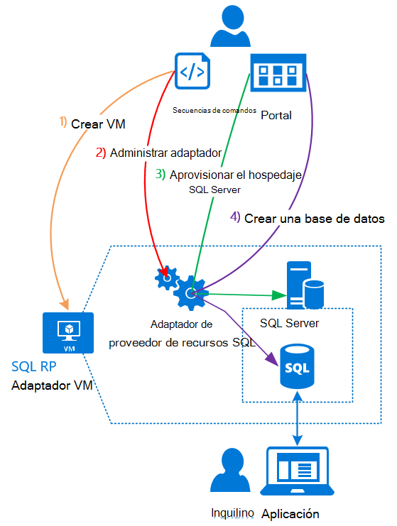

<properties
    pageTitle="Utilizando bases de datos SQL de la pila de Azure | Microsoft Azure"
    description="Obtenga información sobre cómo puede implementar bases de datos SQL como un servicio en la pila de Azure y los pasos rápidos para implementar el adaptador de proveedor de recursos de SQL Server."
    services="azure-stack"
    documentationCenter=""
    authors="Dumagar"
    manager="byronr"
    editor=""/>

<tags
    ms.service="multiple"
    ms.workload="na"
    ms.tgt_pltfrm="na"
    ms.devlang="na"
    ms.topic="article"
    ms.date="09/26/2016"
    ms.author="dumagar"/>

# Usar bases de datos SQL en la pila de Azure

> [AZURE.NOTE] La siguiente información solo se aplica a implementaciones TP1 de pila de Azure.

Utilizar el adaptador de proveedor de recursos de SQL Server para exponer las bases de datos SQL como un servicio de pila de Azure. Después de instalar al proveedor de recursos, usted y los usuarios pueden crear bases de datos para aplicaciones de nube nativo, sitio Web que se basan en SQL y cargas de trabajo que se basan en SQL sin tener que proporcionar una máquina virtual (VM) que aloja SQL Server cada vez.

Dado que el proveedor de recursos no tiene todas las capacidades de base de datos de SQL Azure durante la prueba de concepto (prueba de concepto), en este artículo comienza con información general sobre la arquitectura de proveedor de recursos. A continuación, obtener una introducción rápida de los pasos para configurar el proveedor de recursos, con vínculos a los pasos más detallados de [implementar la adaptador de proveedor de recursos de base de datos SQL de prueba de concepto de pila de Azure](azure-stack-sql-rp-deploy-long.md).

## Arquitectura de adaptador de proveedor de recursos de SQL Server
El proveedor de recursos no ofrece capacidades de administración de la base de datos de SQL Azure de la base de datos. Por ejemplo, un fondo de elásticos de la base de datos y la capacidad para marcar el rendimiento de la base de datos hacia arriba y abajo sobre la marcha no están disponibles. Sin embargo, el proveedor de recursos es compatible con la misma crear, operaciones de lectura, actualización y eliminación (CRUD) que está disponibles en la base de datos de SQL Azure.

El proveedor de recursos se compone de los tres componentes:

- **Adaptador de proveedor de recursos de SQL VM**, que abarca el proceso de proveedor de recursos y los servidores que alojan SQL Server.
- **El proveedor de servicios de recursos**, que procesa las solicitudes de aprovisionamiento y expone recursos de base de datos.
- **Los servidores que alojan SQL Server**, que proporciona la capacidad para bases de datos.

El siguiente diagrama conceptual muestra estos componentes y los pasos que atraviesan cuando implementar el proveedor de recursos, configurar un servidor que hospeda SQL Server y, a continuación, crear una base de datos.

## Pasos rápidos para implementar el proveedor de recursos
Siga estos pasos si ya está familiarizado con la pila de Azure. Si desea obtener más detalles, siga los vínculos de cada sección o ir directamente a [implementar el adaptador de proveedor de recursos de base de datos SQL de prueba de concepto de pila de Azure](azure-stack-sql-rp-deploy-long.md).

1.  Asegúrese de que haya completado todos los [Configurar pasos antes de implementar](azure-stack-sql-rp-deploy-long.md#set-up-steps-before-you-deploy) el proveedor de recursos:

  - 3.5 de .NET framework ya está configurado en la imagen base de Windows Server. (Si ha descargado los bits de Azure pila después de 23 de febrero de 2016, puede omitir este paso.)
  - [Está instalada una versión de Azure PowerShell, que es compatible con la pila de Azure](http://aka.ms/azStackPsh).
  - En configuración de seguridad de Internet Explorer en el ClientVM, [Internet Explorer seguridad mejorada está desactivada y cookies están habilitadas](azure-stack-sql-rp-deploy-long.md#Turn-off-IE-enhanced-security-and-enable-cookies).

2. [Descargar el archivo de los archivos binarios de SQL Server RP](http://aka.ms/massqlrprfrsh) y extraer a la ClientVM en la prueba de concepto de pila de Azure.

3. [Ejecutar secuencias de comandos y bootstrap.cmd](azure-stack-sql-rp-deploy-long.md#Bootstrap-the-resource-provider-deployment-PowerShell-and-Prepare-for-deployment).

    Un conjunto de secuencias de comandos se agrupa por dos fichas principales abiertas en el entorno de Scripting integrado en PowerShell (ISE). Ejecutar todas las secuencias de comandos cargados en secuencia de izquierda a derecha en cada ficha.

    1. Ejecutar secuencias de comandos en la pestaña de **la preparación** de izquierda a derecha para:

        - Crear un certificado comodín para proteger la comunicación entre el proveedor de recursos y el Administrador de recursos de Azure.
        - Cargue los certificados y todos los otros defectos a una cuenta de almacenamiento para la pila de Azure.
        - Publicar paquetes de galería de modo que puede implementar SQL y recursos a través de la galería.

        > [AZURE.IMPORTANT] Si cualquiera de las secuencias de comandos se bloquea sin motivo aparente después de enviar a su inquilino de Azure Active Directory, la configuración de seguridad está bloqueando un DLL necesario para que la implementación ejecutar. Para resolver este problema, busque la Microsoft.AzureStack.Deployment.Telemetry.Dll en la carpeta de proveedor de recursos, haga clic en él, haga clic en **Propiedades**y después active **desbloquear** en la pestaña **General** .

    1. Ejecutar secuencias de comandos en la pestaña **implementar** de izquierda a derecha para:

        - [Implementar una máquina virtual](azure-stack-sql-rp-deploy-long.md#Deploy-the-SQL-Server-Resource-Provider-VM) que hospeda su proveedor de recursos y el SQL Server. Esta secuencia de comandos hace referencia a un archivo de parámetros JSON, deberá actualizar con algunos valores antes de ejecutar la secuencia de comandos.
        - [Registrar un registro DNS local](azure-stack-sql-rp-deploy-long.md#Update-the-local-DNS) que asigna a su proveedor de recursos VM.
        - [Registrar su proveedor de recursos](azure-stack-sql-rp-deploy-long.md#Register-the-SQL-RP-Resource-Provider) el Administrador de recursos con Azure local.

        > [AZURE.IMPORTANT] Todas las secuencias de comandos, se suponen que la imagen de sistema operativo cumple los requisitos previos (.NET 3.5 instalado, JavaScript y las cookies habilitadas en el ClientVM y una versión compatible de Azure PowerShell instalado). Si se producen errores al ejecutar las secuencias de comandos, vuelva a comprobar que cumplen los requisitos previos.

6. [Conectar el proveedor de recursos en un servidor que aloja SQL Server](#Provide-capacity-to-your-SQL-Resource-Provider-by-connecting-it-to-a-hosting-SQL-server) en el portal de pila de Azure. Haga clic en **Examinar** &gt; **proveedores de recursos** &gt; **SQLRP** &gt; **vaya a administración de recursos de proveedor** &gt; **servidores** &gt; **Agregar**.

    Use "sa" nombre de usuario y la contraseña que usa cuando se implementa el proveedor de recursos VM.

7. Para [probar el nuevo proveedor de recursos de SQL Server](/azure-stack-sql-rp-deploy-long.md#create-your-first-sql-database-to-test-your-deployment), implementar una base de datos SQL en el portal de pila de Azure. Haga clic en **crear** &gt; **personalizado** &gt; **base de datos SQL Server**.

Debe obtener de su proveedor de recursos de SQL Server hacia arriba y ejecutando en aproximadamente 45 minutos (dependiendo del hardware).
