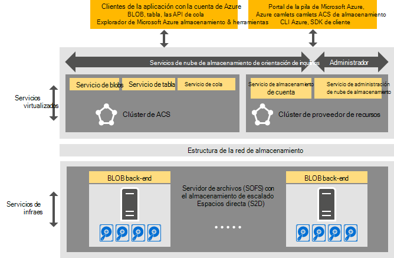

<properties
    pageTitle="Introducción al almacenamiento de Azure coherente | Microsoft Azure"
    description="Obtenga más información sobre el almacenamiento de Azure coherente"
    services="azure-stack"
    documentationCenter=""
    authors="AniAnirudh"
    manager="darmour"
    editor=""/>

<tags
    ms.service="azure-stack"
    ms.workload="na"
    ms.tgt_pltfrm="na"
    ms.devlang="na"
    ms.topic="get-started-article"
    ms.date="09/26/2016"
    ms.author="anirudha"/>

# Introducción al almacenamiento de Azure coherente
Almacenamiento de Azure coherente es el conjunto de servicios de nube de almacenamiento en la pila de Microsoft Azure. Almacenamiento de Azure coherente proporciona blobs, tabla, cola y funcionalidad de administración de cuenta con una semántica coherente de Azure. También proporciona funcionalidad para ayudar a un administrador de la nube administrar servicios de almacenamiento. Este artículo presenta almacenamiento Azure coherente y explica cómo servicios de nube de almacenamiento en la pila de Azure complementan satisfactoriamente las eficaces [capacidades de almacenamiento definida por el software en Windows Server 2016](https://blogs.technet.microsoft.com/windowsserver/2016/04/14/ten-reasons-youll-love-windows-server-2016-5-software-defined-storage/).

Almacenamiento de Azure coherente ofrece las siguientes categorías de funcionalidad:

- **BLOB**: página BLOB, bloquear BLOB y anexar BLOB con   [blobs de Windows Azure coherente](https://msdn.microsoft.com/library/azure/dd179355.aspx#Anchor_1) 
   comportamiento

- **Tablas**: entidades, particiones y otras propiedades de tabla con   [Azure coherente tabla](https://msdn.microsoft.com/library/azure/dd179355.aspx#Anchor_3) 
   comportamiento

- **Colas**: confiables y persistentes mensajes y colas con   [cola Azure coherente](https://msdn.microsoft.com/library/azure/dd179355.aspx#Anchor_2) 
   comportamiento

- **Cuentas**: administración de recursos de almacenamiento cuenta con la   [cuenta de Azure coherente](https://azure.microsoft.com/documentation/articles/storage-create-storage-account/) 
   comportamiento para las cuentas de almacenamiento general se aprovisione a través del [modelo de implementación de administrador de recursos de Azure](https://azure.microsoft.com/documentation/articles/resource-manager-deployment-model/)

- **Administración**: administración de servicios de almacenamiento interno inquilino orientación y coherentes de Azure almacenamiento (analizados en otros artículos)

## Arquitectura de almacenamiento de Azure coherente

Figura 1. Almacenamiento de Azure coherente: vista de la solución

## Almacenamiento de Azure coherente virtualizado servicios y clústeres

En la arquitectura de almacenamiento Azure coherente, se virtualizado todos los inquilinos o servicios de almacenamiento de acceso de administrador. Es decir, se ejecutan en el servicio administrados por el proveedor, altamente disponible que máquinas virtuales basadas en la funcionalidad de [Hyper-V](https://technet.microsoft.com/library/dn765471.aspx) en [Windows Server 2016](http://www.microsoft.com/server-cloud/products/windows-server-2016/).
Aunque las máquinas virtuales están altamente disponibles basados en la tecnología de [Clústeres de migración tras error de Windows Server](https://technet.microsoft.com/library/dn765474.aspx) , los propios servicios de almacenamiento virtualizado Azure coherente están agrupadas invitado altamente disponibles servicios basados en la [tecnología de Azure servicio tela](http://azure.microsoft.com/campaigns/service-fabric/).

Almacenamiento de Azure coherente emplea dos clústeres tela de servicio en una implementación de la pila de Azure.
El servicio de proveedor de recursos de almacenamiento se implementa en un clúster de servicio tela ("clúster RP") que también está compartido por otros servicios de proveedor de recursos básicos. Servicios de ruta de acceso de datos--incluidos blobs, tabla y cola virtuales, el resto del almacenamiento servicios--se hospedan en un segundo clúster de tela de servicio ("clúster de almacenamiento Azure coherente").

## Servicio de blobs de Windows y definidas por el software de almacenamiento

El Blob finalizar servicio atrás, por otro lado, se ejecuta directamente en los nodos de clúster de [Servidor de archivos de escalado](https://technet.microsoft.com/library/hh831349.aspx) . En la arquitectura de la solución de pila de Azure, servidor de archivos de escalado se basa en el [Almacenamiento espacios directo](https://technet.microsoft.com/library/mt126109.aspx)-clúster según, compartir nada. Figura 1 representa los servicios de componentes de almacenamiento de Azure coherente principales y su modelo de implementación distribuida. A medida que ve en el diagrama, almacenamiento Azure coherente encaja con las características existentes de almacenamiento definida por el software en Windows Server 2016. No se requiere para el almacenamiento de Azure coherente más allá de los requisitos de la plataforma de Windows Server hardware especial.

## Granja de almacenamiento

Granja de almacenamiento es la colección de infraestructura de almacenamiento, recursos y servicios de back-end que juntos proporcionan orientación del inquilino y orientación del Administrador de servicios de almacenamiento Azure coherente en una implementación de la pila de Azure. Más concretamente, la granja de servidores de almacenamiento incluye lo siguiente:

- Hardware de almacenamiento (por ejemplo, los nodos de servidor de archivos de escalado, discos)

- Recursos de entramado de almacenamiento (por ejemplo, recursos compartidos de SMB)

- Servicios de tela de servicio relacionados con el almacenamiento (por ejemplo, Blob extremo servicio desactivar el clúster de almacenamiento Azure coherentes)

- Servicios relacionados con el almacenamiento de información que se ejecutan en los nodos de servidor de archivos de escalado (por ejemplo, el servicio de blobs de Windows)

## Escenarios de uso de almacenamiento de IaaS y PaaS

Blobs de página de almacenamiento Azure coherentes, como en Azure, proporcionan los discos virtuales de infraestructura todos como un uso del servicio (IaaS) escenarios:

- Crear una máquina virtual mediante el disco de OS personalizado en un blob de página

- Crear una máquina virtual mediante la imagen de sistema operativo personalizada de un blob de página

- Crear una máquina virtual con una imagen de Azure Marketplace de un blob de página nueva

- Crear una máquina virtual con un disco en blanco en una nueva blobs de página

Del mismo modo, para plataforma como escenarios de servicio (PaaS), Azure coherente blobs de bloque de almacenamiento, anexar BLOB, colas y tablas funcionan como en Azure.

## Roles de usuario

Almacenamiento de Azure coherente es útil para dos roles de usuario:

- Propietarios de aplicaciones, incluidos los programadores y TI de la empresa. Ya no tienen que mantener o implementar dos versiones de una aplicación y secuencias de comandos para realizar la misma tarea a través de una nube pública y una nube privada y alojado en un centro de datos. Almacenamiento de Azure coherente proporciona servicios de almacenamiento a través de la API de REST, SDK, cmdlet y portal de pila de Azure.

- Proveedores de servicios, incluyendo TI, empresariales que implementación y administración Servicios de nube de Microsoft Azure pila y para varios inquilinos de almacenamiento.

## Pasos siguientes

- [Almacenamiento azure coherente: diferencias y consideraciones] (azure-pila-acs-diferencias-tp2.md)
