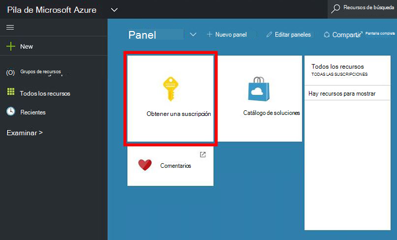
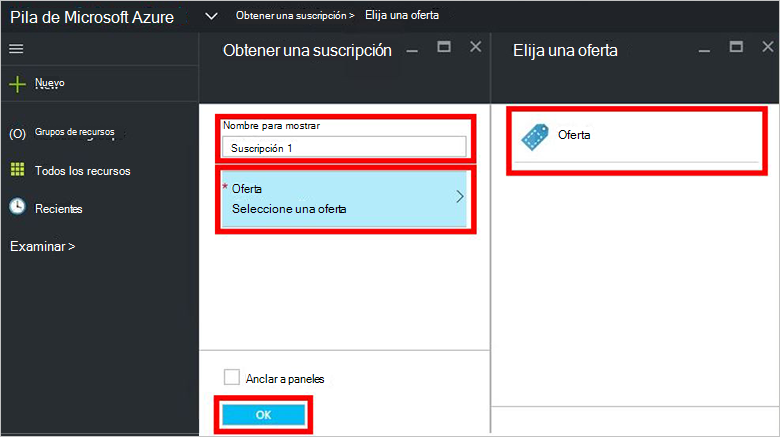
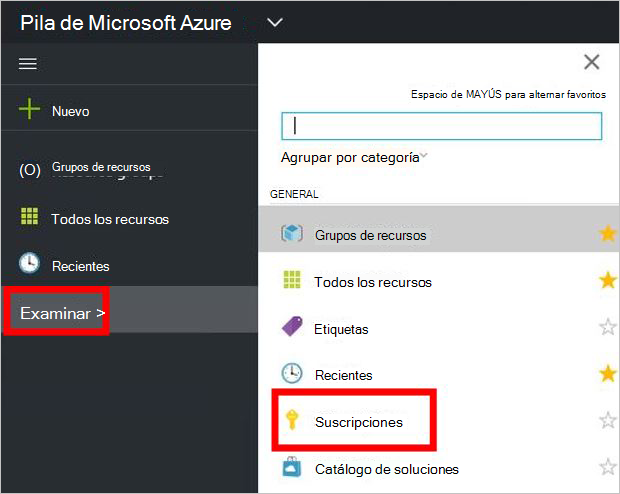

<properties
    pageTitle="Suscribirse a una oferta y, a continuación, proporcionar una máquina virtual en pila de Azure (inquilino) | Microsoft Azure"
    description="Como un inquilino, obtenga información sobre cómo suscribirse a una oferta y, a continuación, proporcionando una máquina virtual en pila de Azure."
    services="azure-stack"
    documentationCenter=""
    authors="ErikjeMS"
    manager="byronr"
    editor=""/>

<tags
    ms.service="azure-stack"
    ms.workload="na"
    ms.tgt_pltfrm="na"
    ms.devlang="na"
    ms.topic="get-started-article"
    ms.date="09/26/2016"
    ms.author="erikje"/>

# Suscribirse a una oferta

Ahora que ya ha [creado una oferta](azure-stack-create-offer.md), compruebe que los inquilinos pueden crear una suscripción.

1.  En el equipo de prueba de concepto de pila de Azure, inicie sesión en `https://portal.azurestack.local` como [un inquilino](azure-stack-connect-azure-stack.md#log-in-as-a-tenant) y haga clic en **obtener una suscripción**.

    

2.  En el campo **Nombre para mostrar** , escriba un nombre para la suscripción, haga clic en **la oferta**, haga clic en una de las ofertas en el módulo de **Elegir una oferta** y, a continuación, haga clic en **crear**.

    

4.  Para ver la suscripción que ha creado, haga clic en **Examinar**, haga clic en **suscripciones**, haga clic en la nueva suscripción.  

    

Después de suscribirse a una oferta, actualice el portal para ver los servicios que forman parte de la nueva suscripción.

## Pasos siguientes

[Aprovisionar una máquina virtual](azure-stack-provision-vm.md)
