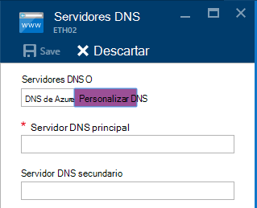
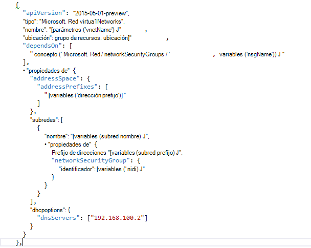

<properties
    pageTitle="Descripción de DNS en pila Azure TP2 | Microsoft Azure"
    description="Comprender las nuevas características de DNS y las capacidades de Azure pila TP2"
    services="azure-stack"
    documentationCenter=""
    authors="ScottNapolitan"
    manager="darmour"
    editor=""/>

<tags
    ms.service="azure-stack"
    ms.workload="na"
    ms.tgt_pltfrm="na"
    ms.devlang="na"
    ms.topic="get-started-article"
    ms.date="09/26/2016"
    ms.author="scottnap"/>

# Presentación de pila de Azure IDN
================================

IDN es una nueva característica de vista previa técnica 2 de pila de Azure que permite resolver nombres DNS externos (como http://www.bing.com).
También permite registrar los nombres de red virtual interna. De este modo, puede resolver máquinas virtuales en la misma red virtual por nombre en lugar de la dirección IP, sin tener que proporcionar entradas personalizadas de servidor DNS.

Se trata de algo que ha sido siempre hay en Azure, pero ahora está disponible en Windows Server 2016 y pila de Azure, demasiado.

¿Qué hace IDN?
------------------

Con IDN en pila de Azure, obtendrá las siguientes capacidades, sin tener que especificar entradas personalizadas de servidor DNS.

-   Compartir los servicios de resolución de nombres DNS para cargas de trabajo del inquilino.

-   Servicio DNS autorizado de resolución de nombres y registro DNS dentro de la red virtual del inquilino.

-   Servicio de Recursive DNS para la resolución de nombres de Internet de inquilino máquinas virtuales. Ya no necesitan los inquilinos especificar entradas personalizadas de DNS para resolver los nombres de Internet (por ejemplo, www.bing.com).

Puede traer su propio DNS y usar los servidores DNS personalizados si lo desea. Pero ahora, si solo desea poder resolver nombres de DNS de Internet y que pueda conectarse a otros equipos virtuales en la misma red virtual, no es necesario especificar nada y solo funcionará.

¿Qué hace IDN no?
---------------------

¿Qué IDN no permite hacer es crear un registro DNS para el nombre que se puede resolver desde fuera de la red virtual.

En Azure, tiene la opción de especificar una etiqueta de nombre DNS que se puede asociar con una dirección IP pública. Puede elegir la etiqueta (prefijo), pero Azure elige el sufijo, que se basa en la región en la que se crea la dirección IP pública.

En la imagen anterior, Azure creará un registro "A" en el DNS para la etiqueta de nombre DNS especificado en la zona **westus.cloudapp.azure.com**. El prefijo y el sufijo junto redacción un dominio nombre completo (FQDN) que se pueden resolver desde cualquier lugar en Internet.

En TP2, pila de Azure solo admite IDN para el registro de nombre interno, por lo que no puede hacer lo siguiente.

-   Crear un registro DNS en una zona DNS alojado existente (por ejemplo, azurestack.local).

-   Crear una zona DNS (como Contoso.com).

-   Crear un registro en su propia zona DNS personalizada.

-   Permitir la compra de nombres de dominio.

Cambios en el DNS de pila Azure TP1
-----------------------------------

En la versión Preview 1 (TP1) de tecnología de pila de Azure, había que proporcionan servidores DNS personalizados si desea poder resolver hosts por nombre en lugar de por dirección IP. Esto significa que si estuviera creando una red virtual o una máquina virtual, había que proporcionan al menos una entrada de servidor DNS. Para el entorno de prueba de concepto TP1, esto significa que escribir la dirección IP del servidor DNS de tela de prueba de concepto, es decir, 192.168.200.2.

Si ha creado una máquina virtual a través del portal, había que seleccione **Custom DNS** en la red virtual o configuración de adaptador ethernet.

En TP2, puede seleccionar Azure DNS y no es necesario especificar entradas personalizadas de servidor DNS.

Si ha creado una máquina virtual a través de una plantilla con su propia imagen, había que agregar la propiedad **DHCPOptions** y resolución para que funcione el nombre del servidor DNS con el fin de obtener el DNS. La imagen siguiente muestra este examinó como.

En TP2, ya no necesita realizar estos cambios en las plantillas de máquina virtual para permitir que sus máquinas virtuales resolver los nombres de Internet. Debería funcionar nada más.