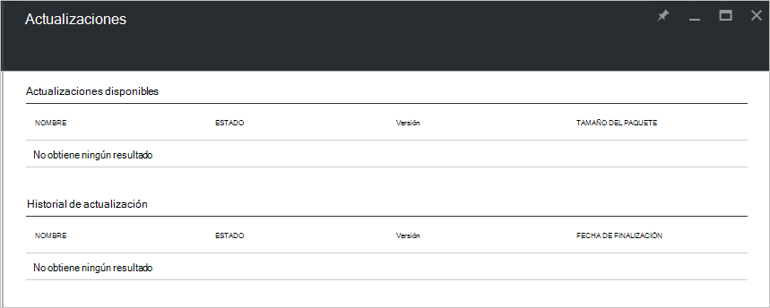

<properties
    pageTitle="Actualizaciones de pila de Azure | Microsoft Azure"
    description="Obtenga más información sobre las actualizaciones en pila de Azure"
    services="azure-stack"
    documentationCenter=""
    authors="HeathL17"
    manager="byronr"
    editor=""/>

<tags
    ms.service="azure-stack"
    ms.workload="na"
    ms.tgt_pltfrm="na"
    ms.devlang="na"
    ms.topic="article"
    ms.date="09/26/2016"
    ms.author="Helaw"/>

# Administración de actualizaciones en pila de Azure
Vista previa técnica 2 presenta una vista previa de la experiencia de administración de actualizaciones de pila de Azure.  En este tema, podrá navegar hasta el nodo de actualizaciones.  

## Módulo de actualizaciones
1.  Para obtener acceso a la hoja de actualizaciones, haga clic en **Examinar** y, a continuación, haga clic en **actualizaciones**.

2.  Haga clic en la ubicación **local** .

3.  Verá una pantalla en la lista de actualizaciones disponibles e historial de actualización.  En Technical Preview 2, no hay actualizaciones estarán disponibles para la instalación.  

    

## Pasos siguientes
- [Comprender la arquitectura de prueba de concepto de pila de Azure](azure-stack-architecture.md)      
- [Comprender los requisitos previos de implementación](azure-stack-deploy.md)
- [Implementar la pila de Azure](azure-stack-run-powershell-script.md)
 
    
  

  

