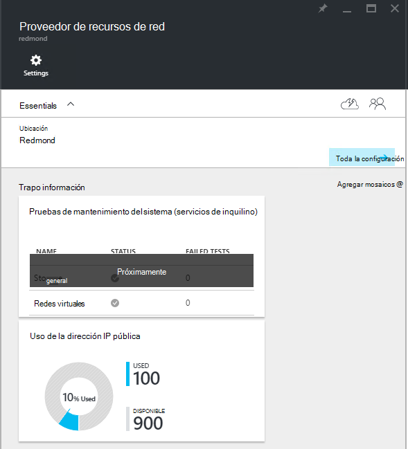
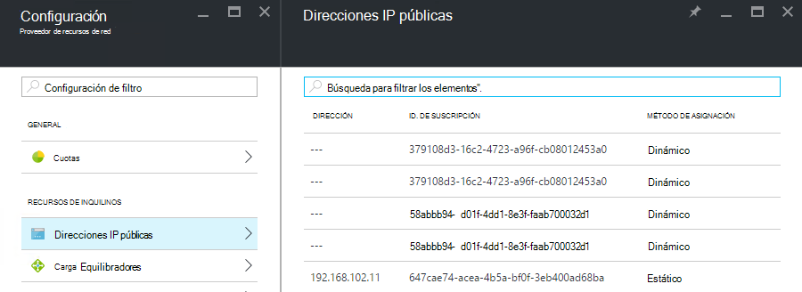

<properties
    pageTitle="Ver el consumo de direcciones IP público en TP2 | Microsoft Azure"
    description="Los administradores pueden ver el consumo de direcciones IP públicas en una región"
    services="azure-stack"
    documentationCenter=""
    authors="ScottNapolitan"
    manager="darmour"
    editor=""/>

<tags
    ms.service="azure-stack"
    ms.workload="na"
    ms.tgt_pltfrm="na"
    ms.devlang="na"
    ms.topic="get-started-article"
    ms.date="09/26/2016"
    ms.author="scottnap"/>

# Ver el consumo de direcciones IP público en TP2 de pila de Azure

Como administrador del servicio, puede ver el número de direcciones IP públicas que se han asignado a los inquilinos, el número de direcciones IP públicas que siguen estando disponibles para la asignación y el porcentaje de direcciones IP públicas que se han asignado en esa ubicación.

El mosaico de **Uso de direcciones IP públicas** muestra el número total de direcciones IP públicas que se han consumido por todos los grupos de direcciones IP públicos en la estructura, si se han utilizado para inquilinos instancias IaaS VM, servicios de infraestructura de tela o públicos recursos de direcciones IP que se crearon explícitamente los inquilinos.

El propósito de este mosaico es para hacerse una idea del número total de direcciones IP públicas que se han consumido en esta ubicación de los administradores de la pila de Azure. Esto ayuda a los administradores a determinar si está quedando sin este recurso.

En el módulo de **configuración** , el elemento de menú de **Direcciones IP públicas** en **recursos inquilino** muestra solo en las direcciones IP públicas que se han *creado explícitamente por los inquilinos*. Por lo tanto, el número de **utiliza** direcciones IP públicas sobre el **Uso de direcciones IP públicas** mosaico siempre es diferente (mayor que) el número en el mosaico de **Direcciones IP públicas** en **recursos del inquilino**.

## Ver la información de uso de dirección IP pública

Para ver el número total de direcciones IP públicas que se han consumido en la región:

1.  En el portal de la pila de Azure, haga clic en **Examinar**y, a continuación, seleccione los **Proveedores de recursos**.

2.  En la lista de **Proveedores de recursos**, seleccione **Administrador de proveedor de recursos de red**.

3.  Como alternativa, puede hacer clic en Examinar de **| Ubicaciones** y seleccione la ubicación que desea ver de la lista. A continuación, en el mosaico de **Proveedores de recursos** , seleccione **Administrador de proveedor de recursos de red**.

4.  El módulo de inicio de **Proveedor de recursos de red** muestra el mosaico de **Uso de direcciones IP públicas** en la sección **información general** .

Tenga en cuenta que el número de **utilizado** representa el número de público direcciones IP de IP pública todos los grupos en esa ubicación asignados de direcciones. El número de **disponibles** representa el número de público direcciones IP de IP pública todos los grupos que no se ha asignado y siguen estando disponibles de direcciones. El número de **% utilizado** representa el número de direcciones usadas o asignadas como un porcentaje del total de IP pública direcciones en IP pública todas las direcciones de grupos en esa ubicación.

## Ver las direcciones IP públicas creadas por suscripciones de inquilinos

Para ver una lista de direcciones IP públicas creadas explícitamente las suscripciones de inquilinos de una región específica, vaya a la hoja de **configuración** de la **Administración de proveedor de recursos de red**y, a continuación, seleccione **Las direcciones IP públicas**.

Es posible que note que algunas direcciones IP públicas que se han asignado dinámicamente aparecen en la lista, pero no tiene una dirección asociada con ellos todavía. Esto es porque la dirección recurso se ha creado en el proveedor de recursos de red, pero no en el controlador de red todavía.

El controlador de red no asigna una dirección de este recurso hasta que realmente está enlazado a una interfaz, una tarjeta de interfaz de red (NIC), un equilibrador de carga o una puerta de enlace de red virtual. Cuando una interfaz depende de la dirección IP pública, el controlador de red asigna una dirección IP a él y aparece en el campo **dirección** .

## Ver el público información resumen tabla de direcciones IP

Hay un número de diferentes casos en que se asignan direcciones IP públicas que determinan si la dirección aparece en una lista o en otra.

| **Caso de asignación de dirección IP pública** | **Aparece en resumen de uso** | **Aparece en la lista de direcciones IP pública inquilino** |
| ------------------------------------- | ----------------------------| ---------------------------------------------- |
| Dirección IP de público dinámica aún no se ha asignado a un equilibrador de carga o NIC (temporal) | No | Sí |
| Público dirección IP dinámica asignada a un equilibrador de carga NIC. | Sí | Sí |
| Público dirección IP estática asignada a un equilibrador de carga o NIC del inquilino. | Sí | Sí |
| Público dirección IP estática asignada a un extremo de servicios de infraestructura de tela. | Sí | No |
| Dirección IP pública implícitamente para instancias de IaaS VM y utilizado para NAT saliente de la red virtual. Estos se crean en segundo plano cuando un inquilino crea una instancia de máquina virtual para que las máquinas virtuales pueden enviar información a Internet. | Sí | No |
