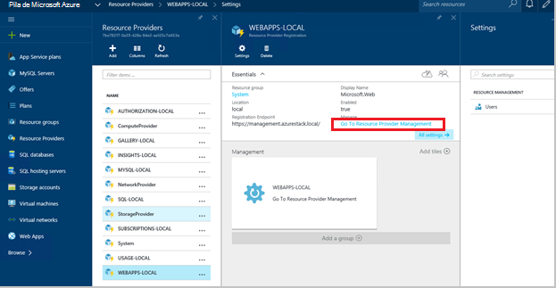
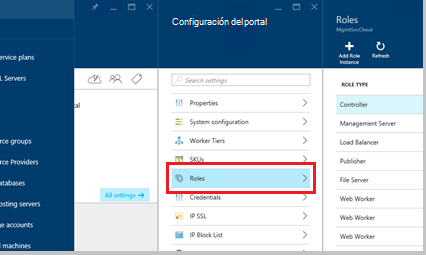
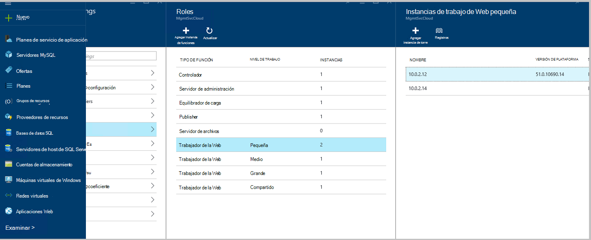
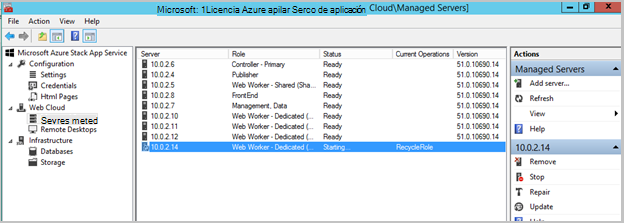
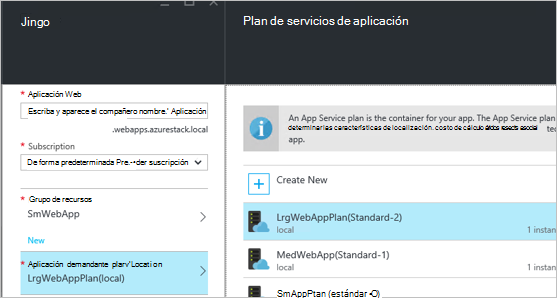

<properties
    pageTitle="Aplicaciones Web agregando más Web Roles de trabajo | Microsoft Azure"
    description="Instrucciones detalladas para ajustar Azure pila Web App"
    services="azure-stack"
    documentationCenter=""
    authors="kathm"
    manager="slinehan"
    editor=""/>

<tags
    ms.service="azure-stack"
    ms.workload="app-service"
    ms.tgt_pltfrm="na"
    ms.devlang="na"
    ms.topic="article"
    ms.date="09/26/2016"
    ms.author="kathm"/>

#   <a name="web-apps-adding-more-web-worker-roles"></a>Aplicaciones Web: Agregar más funciones de trabajo de web

> [AZURE.NOTE] La siguiente información solo se aplica a implementaciones TP1 de pila de Azure.

Este documento proporciona instrucciones sobre cómo ajustar el tamaño de las funciones de trabajo de aplicaciones Web web. Contiene pasos para crear las funciones de trabajo de web adicionales para admitir ofertas de aplicaciones web de cualquier tamaño.

Pila de Azure admite implementaciones de aplicación web gratuitas y compartido. Para agregar otros tipos, debe agregar más funciones de trabajo de web.

Si no está seguro de qué se ha implementado con la instalación de aplicaciones Web de forma predeterminada, puede revisar información adicional [aquí](azure-stack-webapps-overview.md).

Los pasos siguientes son necesarios a escala web trabajo roles:

1.  [Crear una nueva máquina virtual](#step-1-create-a-new-vm-to-support-the-new-instance-size)

2.  [Configurar la máquina virtual](#step-2-configure-the-virtual-machine)

3.  [Configurar la función de trabajo de web en el portal de pila de Azure](#step-3-configure-the-web-worker-role-in-the-azure-stack-portal)

4.  [Configurar los planes de servicio de aplicación](#step-4-configure-app-service-plans)

##<a name="step-1-create-a-new-vm-to-support-the-new-instance-size"></a>Paso 1: Crear una nueva máquina virtual para admitir el nuevo tamaño de instancia

Crear una máquina virtual tal como se describe en [este artículo](azure-stack-provision-vm.md), asegurarse de que se realizan las siguientes opciones:

 - Nombre de usuario y contraseña: proporcione el mismo nombre de usuario y la contraseña que haya proporcionado al instalar aplicaciones Web.

 - Suscripción: Usar la suscripción de proveedor predeterminado.

 - Grupo de recursos: elija **AppService Local**.

> [AZURE.NOTE]Almacenar las máquinas virtuales de funciones de trabajo en el mismo grupo de recursos, como las aplicaciones Web aplicación se implementa en. (Se recomienda para esta versión).

##<a name="step-2-configure-the-virtual-machine"></a>Paso 2: Configurar la máquina Virtual

Una vez completada la implementación, la configuración siguiente es necesario para admitir la función de trabajo de web:

1.  Abra el administrador del servidor en el equipo host y haga clic en **Herramientas** &gt; **HyperV Manager**.

2.  Conectar mediante el protocolo de escritorio remoto (RDP) para la nueva máquina virtual que creó en el paso 1. El nombre del servidor que se encuentra en el panel de resumen cuando se selecciona cada máquina virtual.

3.  Abra el PowerShell haciendo clic en el botón **Inicio** y escribiendo PowerShell. Haga clic con el botón **PowerShell.exe**y seleccione **Ejecutar como administrador** para abrir PowerShell en modo de administrador.

4.  Copiar y pegue cada de los comandos siguientes (de uno en uno) en la ventana de PowerShell y a continuación, presione ENTRAR:

    ```netsh advfirewall firewall set rule group="File and Printer Sharing" new enable=Yes```
    ```netsh advfirewall firewall set rule group="Windows Management Instrumentation (WMI)" new enable=yes```
    ```reg add HKLM\\SOFTWARE\\Microsoft\\Windows\\CurrentVersion\\Policies\\system /v LocalAccountTokenFilterPolicy /t REG\_DWORD /d 1 /f```

5.  Reinicie el equipo virtual.

> [AZURE.NOTE]Nota: Estos son los requisitos mínimos para las aplicaciones Web. Son la configuración predeterminada de la imagen de Windows 2012 R2 incluido con la pila de Azure. Se proporcionan las instrucciones para futuras referencias y para los usuarios de una imagen distinta.

##<a name="step-3-configure-the-web-worker-role-in-the-azure-stack-portal"></a>Paso 3: Configurar la función de trabajo de web en el portal de pila de Azure

1.  Abra el portal como administrador del servicio en **ClientVM**.

2.  Vaya a **proveedores de recursos** &gt; **LOCAL de aplicaciones Web**.

    
 
3.  Haga clic en **Ir a la administración de proveedor de recursos**.

4.  Haga clic en **Roles**.

    
 
5.  Haga clic en **Agregar instancia de rol**.

6.  Haga clic en el **nivel** que desea implementar la nueva instancia a (pequeño, mediano o grande o compartido).

    
 
7.  Configure las siguientes opciones:
 - Nombre_de_servidor: Proporcione la dirección IP del servidor que creó anteriormente (en la sección 1).
 - Tipo de función: Web trabajador.
 - Nivel de trabajo: Coincidencias nivel tamaño seleccionado.

8. Haga clic en **Aceptar.**

9. Inicie sesión en CN0 VM y abra la **MMC de administración de nube de Web**.

10. Vaya a la **nube de Web** &gt; **servidores administrados**.

11. Haga clic en el nombre del servidor que acaba de implementar. Revise la columna Estado y espere para ir al siguiente paso hasta que el estado es "Listo".

    

##<a name="step-4-configure-app-service-plans"></a>Paso 4: Configurar los planes de servicio de aplicación

> [AZURE.NOTE]En la versión actual de aplicaciones Web, planes de servicio de aplicación deben estar almacenados en grupos de recursos independientes. Crear un grupo de recursos para cada tamaño de la aplicación web y a continuación, sitúe los planes de aplicación en sus grupos de recursos adecuado.

1.  Inicie sesión en el portal de la ClientVM.

2.  Vaya al **nuevo** &gt; **móvil y la Web**.

3.  Seleccione la aplicación web que le gustaría implementar.

4.  Proporcione la información para la aplicación web y, a continuación, seleccione **AppService Plan / ubicación**.

-   Haga clic en **Crear nuevo**.

-   Crear el nuevo plan, seleccionar el nivel de precios correspondiente para el plan.

> [AZURE.NOTE]Puede crear varios planes mientras está en este módulo. Antes de implementar, sin embargo, asegúrese de que ha seleccionado el plan adecuado.

La siguiente muestra un ejemplo de varios planes de disponibles:    

##<a name="final-web-app-service-vm-configuration"></a>Configuración de máquina virtual de servicio Web App final

La imagen siguiente proporciona una vista del entorno una vez que se ha escalado los roles de trabajo de web. Los elementos verdes representan las novedades de la función.
    
