<properties
     pageTitle="Cómo crear una solicitud de soporte técnico de Azure | Microsoft Azure"
     description="Cómo crear una solicitud de soporte técnico de Azure."
     services="Azure Supportability"
     documentationCenter=""
     authors="ganganarayanan"
     manager="scotthit"
     editor=""/>

<tags
     ms.service="azure-supportability"
     ms.workload="na"
     ms.tgt_pltfrm="na"
     ms.devlang="na"
     ms.topic="article"
     ms.date="10/25/2016"
     ms.author="gangan"/>

# Cómo crear una solicitud de soporte técnico de Azure

## Resumen
Los clientes de Azure pueden crear y administrar solicitudes de soporte técnico en el portal de Azure, [https://portal.azure.com](https://portal.azure.com).
>[AZURE.NOTE] El portal de Azure para Alemania es [https://portal.microsoftazure.de](https://portal.microsoftazure.de) y para el portal de administración pública de Azure es [https://portal.azure.us](https://portal.azure.us).

En función de los comentarios de los clientes, hemos actualizado la experiencia de solicitud de soporte técnico para centrarse en tres objetivos principales:

- **Racional**: reducir los clics y módulos para simplificar el proceso de enviar una solicitud de soporte técnico.
- **Integrado**: cuando está solucionando un problema con un recurso de Azure, debe ser fácil abrir una solicitud de soporte para ese recurso sin tener que cambiar de contexto.
- **Eficiente**: recopilar la información clave que su técnico de soporte tendrán que resuelve el problema de forma eficaz.

## Introducción
Puede crear una solicitud de soporte desde el menú de navegación superior o directamente desde una hoja de recursos.

**Desde la barra de navegación**

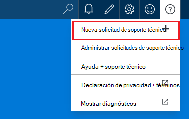

**Desde una hoja de recursos**

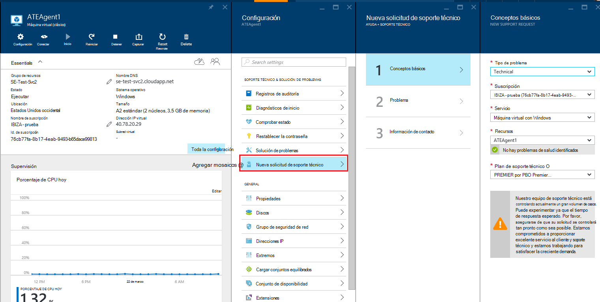

## Conceptos básicos
El primer paso del proceso de solicitud de soporte técnico recopila información básica sobre el problema y su plan de soporte técnico.

Veamos un ejemplo: enfrenta dificultades técnicas con la máquina virtual y cree un problema de conectividad de red.
Seleccionar el servicio ("máquina Virtual con Windows") y el recurso (el nombre de la máquina virtual) en el primer paso del asistente, inicia el proceso de obtener ayuda para solucionar este problema.

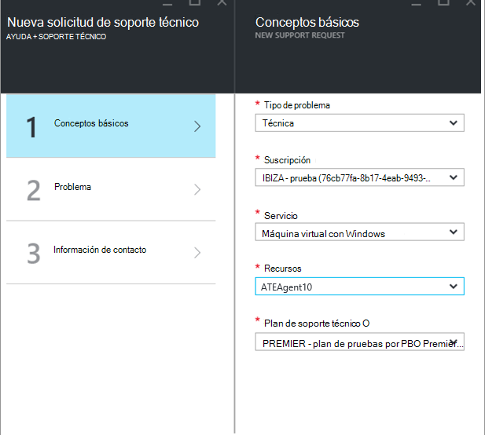

>[AZURE.NOTE] Azure proporciona soporte ilimitado para la administración de la suscripción (cosas como la facturación, los ajustes de cuota y transferencias de cuenta). Para obtener soporte técnico, necesita un plan de soporte técnico. [Más información acerca de los planes de soporte técnico](https://azure.microsoft.com/support/plans).

## Problema
El segundo paso del asistente recopila detalles adicionales sobre el problema. Proporcionar detalles precisos en este paso nos permite para redirigir el caso al mejor soporte técnico para el problema y comenzar diagnosticar el problema tan pronto como sea posible.

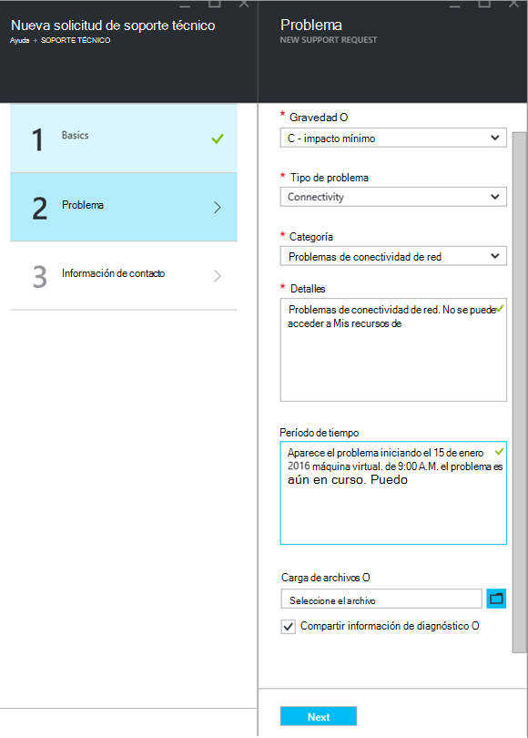

Continuar con el ejemplo de conectividad de máquina virtual de arriba, se rellene este formulario para indicar un problema de conectividad de red y, a continuación, se proporcionan más detalles sobre el problema, incluido el tiempo aproximado cuando se produjo el problema.

## Relacionados con la Ayuda
Para algunos problemas, le proporcionamos los vínculos relacionados con la ayuda para solucionar el problema. Si los documentos recomendados no ayuda, puede seguir a través del proceso para crear una solicitud de soporte técnico.
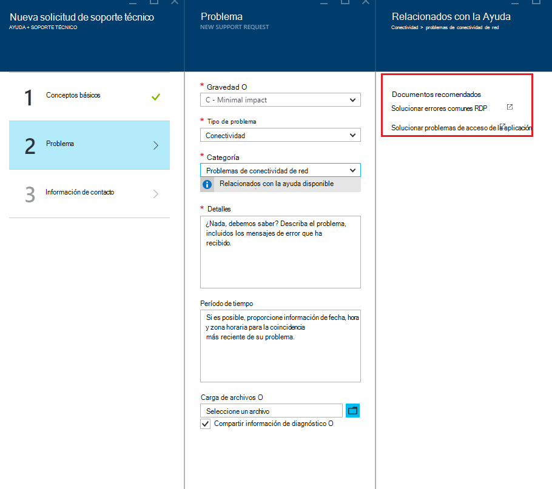

## Información de contacto
El último paso del asistente confirma la información de contacto para saber cómo llegar a usted.
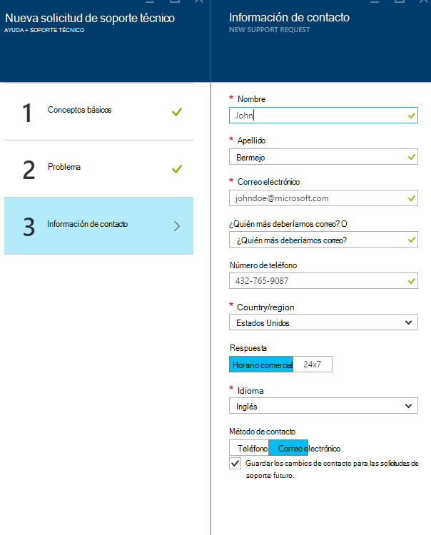

Según la gravedad del problema, le pedirá que indique si desea ponernos en contacto con usted durante las horas de trabajo o si prefiere una respuesta de 24 x 7, lo que significa que podemos ponernos en contacto en cualquier momento.
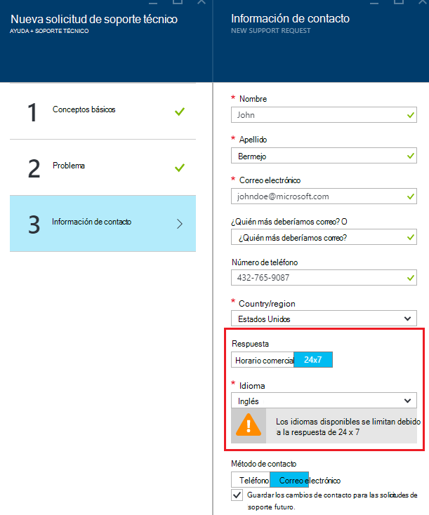

## Administrar solicitudes de soporte técnico
Después de crear la solicitud de soporte técnico, puede ver los detalles de la página **Administrar solicitudes de soporte técnico** .

**Desde la barra de navegación**

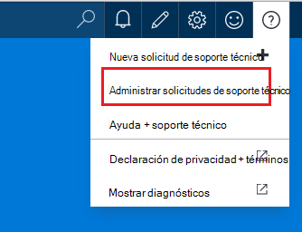

En la página **Administrar solicitudes de soporte técnico** , puede ver todas las solicitudes de soporte técnico y su estado.
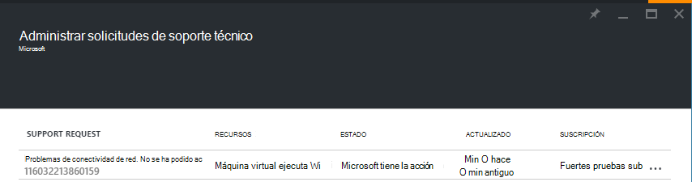

Seleccione la solicitud de soporte técnico para ver los detalles, incluidos gravedad y la hora esperada tardará un técnico de soporte técnico responder.
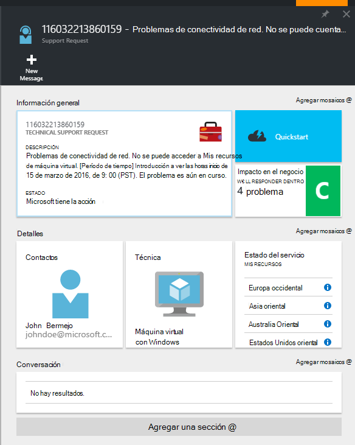

Si desea cambiar la gravedad de la solicitud, haga clic en el mosaico de **impacto en el negocio** . En el ejemplo anterior, la solicitud está configurada para gravedad C.

Haga clic en el mosaico, se muestra la lista de gravedad que se pueden asignar a una solicitud de soporte abiertos.

>[AZURE.NOTE] El nivel de gravedad máxima depende de su plan de soporte técnico. [Más información acerca de los planes de soporte técnico](https://azure.microsoft.com/support/plans).

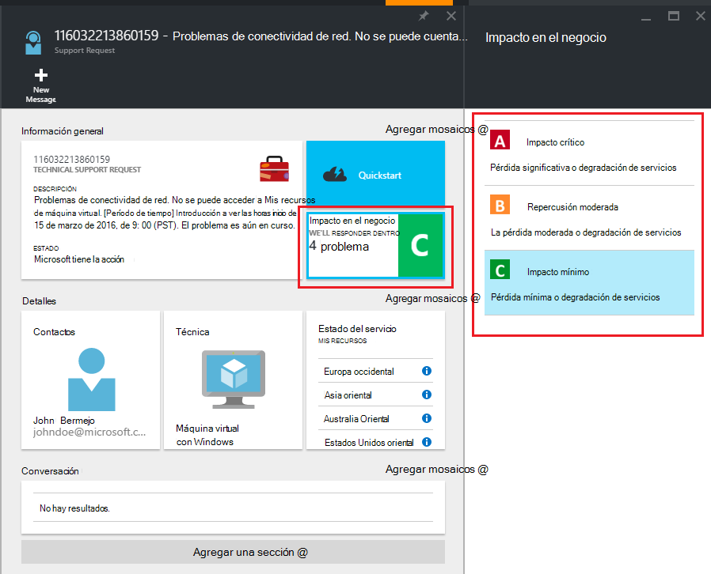

## Comentarios
¡Siempre estamos abiertos a comentarios y sugerencias! Envíenos sus [sugerencias](https://feedback.azure.com/forums/266794-support-feedback). Además, puede integrarse con nosotros a través de los [foros de MSDN](https://social.msdn.microsoft.com/Forums/azure)o [Twitter](https://twitter.com/azuresupport) .

## Aprende más
[Preguntas más frecuentes de soporte técnico de Azure](https://azure.microsoft.com/support/faq)
