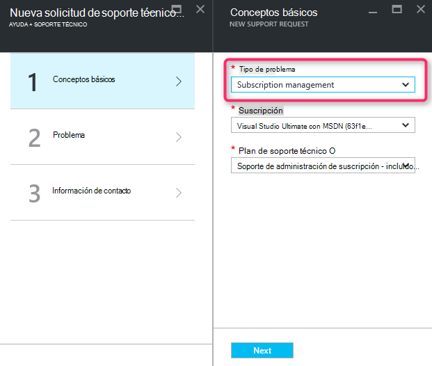
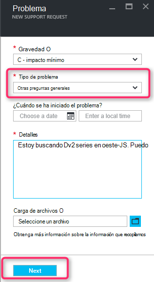
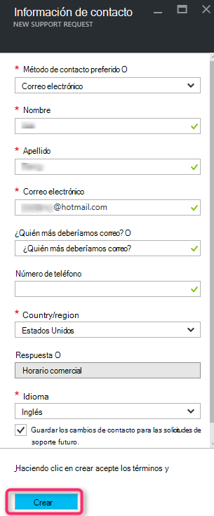

<properties
     pageTitle="Serie SKU disponible | Microsoft Azure"
     description="Algunas series SKU no están disponibles para la suscripción seleccionada para esta área."
     services="Azure Supportability"
     documentationCenter=""
     authors="ganganarayanan"
     manager="scotthit"
     editor=""/>

<tags
     ms.service="azure-supportability"
     ms.workload="na"
     ms.tgt_pltfrm="na"
     ms.devlang="na"
     ms.topic="article"
     ms.date="08/12/2016"
     ms.author="gangan"/>

# Serie SKU disponible

En algunas regiones, ciertas SKU no está disponibles automáticamente en las nuevas suscripciones.  Esto puede ocurrir cuando [se introducen SKU más eficaces en una región](https://azure.microsoft.com/updates/announcing-new-dv2-series-virtual-machine-size/) y la popularidad de la heredado rechaza SKU.
Se muestra el mensaje "*serie algunos SKU no está disponible para la suscripción seleccionada para esta área*" al crear una solicitud de soporte para aumentar la cuota de núcleo de cálculo.

Puede revisar la disponibilidad SKU en la página [Servicios de Azure por región](https://azure.microsoft.com/regions/#services) . 

Para solicitar acceso a un SKU que se ha restringido de la suscripción, cree una solicitud de soporte técnico de "Administración de la suscripción".

- En la página de conceptos básicos, seleccione el tipo de problema como "Administración de la suscripción" y haga clic en "Siguiente".

- En la página del problema, seleccione el tipo de problema como "Otras preguntas generales" y escriba la región exacta y SKU no ven.
Esto le permite acelerar el proceso de soporte técnico.

- En la página de información de contacto, escriba los detalles de contacto y haga clic en "Crear".

## Comentarios
¡Siempre estamos abiertos a comentarios y sugerencias! Envíenos sus [sugerencias](https://feedback.azure.com/forums/266794-support-feedback). Además, puede integrarse con nosotros a través de los [foros de MSDN](https://social.msdn.microsoft.com/Forums/azure)o [Twitter](https://twitter.com/azuresupport) .

## Aprende más
[Preguntas más frecuentes de soporte técnico de Azure](https://azure.microsoft.com/support/faq)
