<properties
    pageTitle="Recuperar datos de otro servidor DPM en depósito de copia de seguridad | Microsoft Azure"
    description="Recuperar los datos que se ha protegido a un depósito de copia de seguridad de Azure desde cualquier servidor DPM registrado para ese depósito."
    services="backup"
    documentationCenter=""
    authors="nkolli1"
    manager="shreeshd"
    editor=""/>

<tags
    ms.service="backup"
    ms.workload="storage-backup-recovery"
    ms.tgt_pltfrm="na"
    ms.devlang="na"
    ms.topic="article"
    ms.date="08/08/2016"
    ms.author="giridham;jimpark;trinadhk;markgal"/>

# Recuperar datos de otro servidor DPM en depósito de copia de seguridad
Ahora puede recuperar los datos que se ha protegido a un depósito de copia de seguridad de Azure desde cualquier servidor DPM registrado para ese depósito. El proceso para hacerlo lo está completamente integrado en la consola de administración de DPM y es similar a los otros flujos de trabajo de recuperación.

Para recuperar datos de otro servidor DPM en depósito de copia de seguridad necesitará [UR7 de administrador de protección de datos del centro de sistema](https://support.microsoft.com/en-us/kb/3065246) y el [agente de copia de seguridad de Azure más reciente](http://aka.ms/azurebackup_agent).

## Recuperar datos de otro servidor DPM
Para recuperar datos de otro servidor DPM:

1. En la pestaña de **recuperación** de la consola de administración de DPM, haga clic en **' Agregar DPM externos '** (en la parte superior izquierda de la pantalla).

    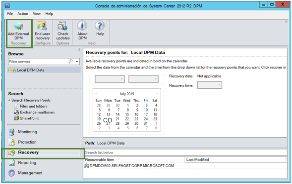

2. Descargar nuevas **credenciales de cámara** de la cámara asociado con el **servidor DPM** donde se está recuperando los datos, elija el servidor DPM de la lista de los servidores DPM registrado con la cámara de copia de seguridad y proporcione la **frase de contraseña de cifrado** asociado con el servidor DPM se está recuperando cuyos datos.

    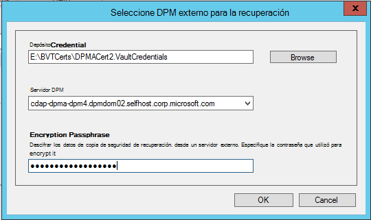

    >[AZURE.NOTE] Sólo los servidores DPM asociados con el mismo depósito de registro pueden recuperar datos de los demás.

    Una vez que el servidor DPM externo se agrega correctamente, puede examinar los datos de servidor externo de DPM y servidor DPM local desde la pestaña de **recuperación** .

3. Examine la lista disponible de servidores de producción protegidos por el servidor DPM externo y seleccione el origen de datos adecuado.

    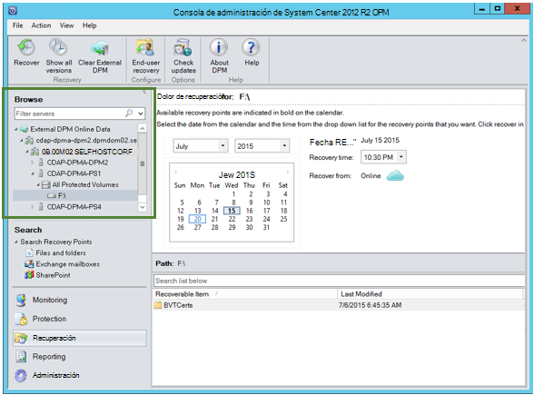

4. Seleccione **el mes y año** de los **puntos de recuperación** de lista desplegable, seleccione la **fecha de recuperación** de requerida para cuando se creó el punto de recuperación y seleccione el **tiempo de recuperación**.

    Aparecerá una lista de archivos y carpetas en el panel inferior puede examinar y recuperar en cualquier ubicación.

    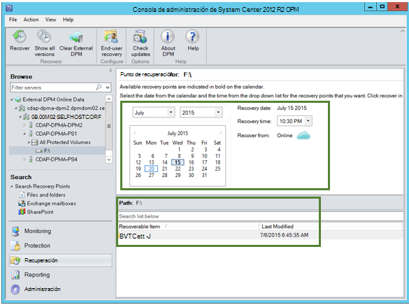

5. Haga clic con el botón secundario del mouse en el elemento apropiado y haga clic en **recuperar**.

    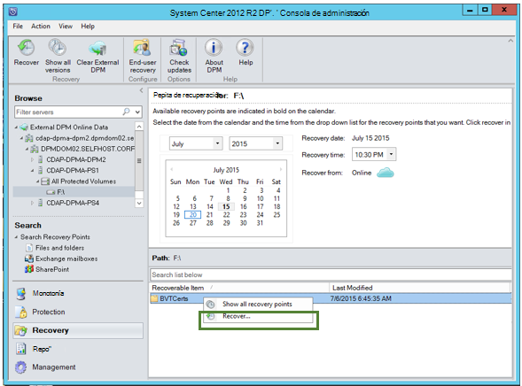

6. Revise la **selección de recuperar**. Comprobar los datos y la hora de la copia de seguridad que se está recuperada, así como el origen desde la que se creó la copia de seguridad. Si la selección es correcta, haga clic en **Cancelar** para regresar a la ficha de recuperación para seleccionar el punto de recuperación adecuado. Si la selección es correcta, haga clic en **siguiente**.

    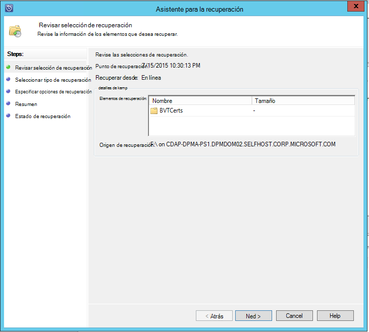

7. Seleccione **recuperar en una ubicación alternativa**. **Vaya** a la ubicación correcta para la recuperación.

    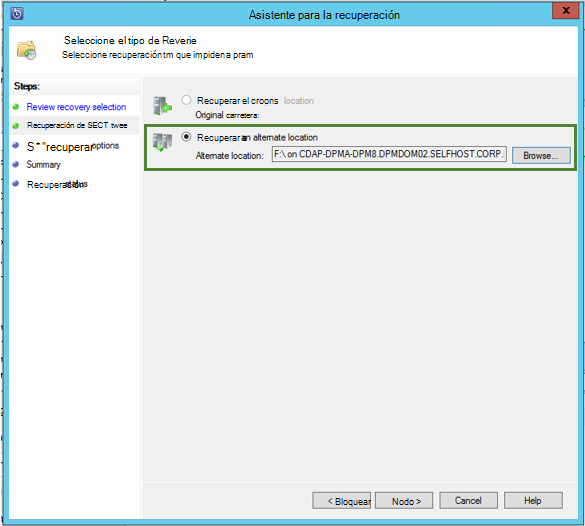

8. Elija la opción relacionados con **Crear copia**, **Saltar**o **Sobrescribir**.
    - **Crear copia** creará una copia del archivo en el caso de que hay un conflicto de nombre.
    - **Saltar** omitirá recuperar el archivo en el caso de que hay un conflicto de nombre.
    - **Sobrescribir** sobrescribirá la copia existente en la ubicación especificada en el caso de un conflicto de nombres.

    Elija la opción adecuada para **restaurar la seguridad**. Puede aplicar la configuración de seguridad del equipo de destino donde se está recuperando los datos o la configuración de seguridad que estaba aplicable al producto en el momento en que se creó el punto de recuperación.

    Identificar si se enviará una **notificación** cuando la recuperación se completa correctamente.

    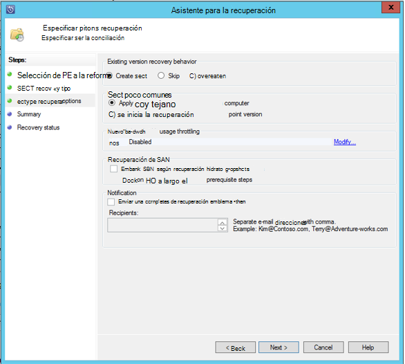

9. La pantalla **Resumen** muestra las opciones elegidas hasta ese momento. Una vez que haga clic en **"Recuperar"**, los datos se recuperarán a la ubicación apropiada en local.

    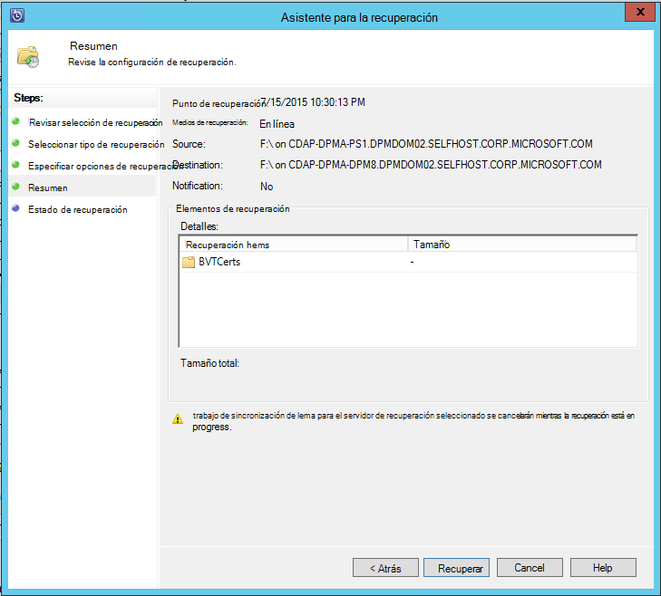

    >[AZURE.NOTE] En la ficha **supervisión** del servidor DPM se puede supervisar el trabajo de recuperación.

    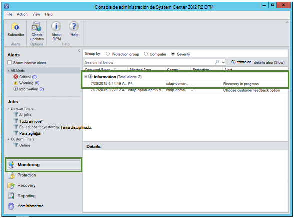

10. Puede hacer clic en **Borrar DPM externos** en la pestaña de **recuperación** del servidor DPM para quitar la vista del servidor DPM externo.

    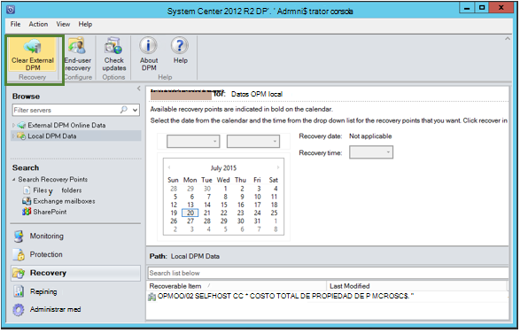

## Solucionar problemas de los mensajes de Error
|No. |  Mensaje de error | Pasos de solución de problemas |
| :-------------: |:-------------| :-----|
|1.|        Este servidor no está registrado en el depósito especificado por la credencial de cámara.|  **Causa:** Este error aparece cuando el archivo de credenciales de depósito seleccionado no pertenece a la copia de seguridad depósito asociado con el servidor DPM en que se intentó realizar la recuperación.   **Resolución:** Descargue el archivo de credenciales de la cámara desde el depósito de copia de seguridad a los que está registrado el servidor DPM.|
|2.|        En los datos recuperables no están disponibles o el servidor seleccionado no es un servidor DPM.|   **Causa:** Hay que no hay otros servidores DPM con DPM 2012 R2 UR7 registrado en la caja fuerte de copia de seguridad, los servidores DPM con DPM 2012 R2 UR7 todavía no carga los metadatos o el servidor seleccionado no es un servidor DPM (también conocido como Windows Server o cliente Windows).   **Resolución:** Si hay otros servidores DPM registrados en la caja fuerte de copia de seguridad, asegúrese de SCDPM 2012 R2 UR7 y copia de seguridad de Azure más reciente está instalado el agente.  Si hay otros servidores DPM registrados en la copia de seguridad depósito con DPM 2012 R2 UR7, espere un día después de la instalación de UR7 para iniciar el proceso de recuperación. El trabajo noche cargará los metadatos de las copias de seguridad protegidos anteriormente en la nube. Los datos estarán disponibles para la recuperación.|
|3.|        Ningún otro servidor DPM está registrado en este depósito.|   **Causa:** No hay otros servidores DPM con DPM 2012 R2 UR7 encima o que están registrados en el depósito desde el que se está intentando la recuperación. **Resolución:** Si hay otros servidores DPM registrados en la caja fuerte de copia de seguridad, asegúrese de SCDPM 2012 R2 UR7 y copia de seguridad de Azure más reciente está instalado el agente. Si hay otros servidores DPM registrados en la copia de seguridad depósito con DPM 2012 R2 UR7, espere un día después de la instalación de UR7 para iniciar el proceso de recuperación. El trabajo noche cargará los metadatos de las copias de seguridad protegidos anteriormente en la nube. Los datos estarán disponibles para la recuperación.|
|4.|        La contraseña de cifrado suministrada no coincide con la frase de contraseña asociada con el siguiente servidor:**<server name>**|  **Causa:** La frase de contraseña de cifrado que se usa en el proceso de cifrado de los datos de los datos del servidor DPM que se recupera no coincide con la contraseña de cifrado suministrada. El agente es no puede descifrar los datos. Por lo tanto, se produce un error en la recuperación. **Resolución:** Proporcione la contraseña de cifrado mismo exacta asociada con el servidor DPM se está recuperando cuyos datos.|

## Preguntas más frecuentes:
1. **¿Por qué no puedo agregar un servidor DPM externo desde otro servidor DPM después de instalar el UR7 y el agente de copia de seguridad de Azure más reciente?**

    (A) para los servidores DPM existentes con los orígenes de datos que están protegidos en la nube (por utilizando un paquete acumulativo anterior a Update Rollup 7), tiene que esperar al menos un día después de instalar el UR7 y el agente de copia de seguridad de Azure más reciente para empezar a *Agregar externos DPM server*. Esto es necesario para cargar los metadatos de los grupos de protección de DPM en Azure. Esto ocurre la primera vez a través de una tarea diaria.

2. **¿Qué es la versión mínima de agente de copia de seguridad de Azure es necesario?**

    (A) la versión mínima de agente de copia de seguridad de Azure para habilitar esta característica es 2.0.8719.0.  Se puede comprobar la versión de agente de copia de seguridad de Azure desplazándose hasta el Panel de Control **>** elementos del Panel de Control de todos los **>** programas y características **>** agente de servicios de recuperación de Microsoft Azure. Si la versión es menor que 2.0.8719.0, el [agente de copia de seguridad de Azure más reciente](https://go.microsoft.com/fwLink/?LinkID=288905) de descargar e instalar.

    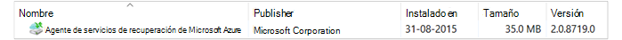

## Pasos siguientes:
• [P+F de copia de seguridad de azure](backup-azure-backup-faq.md)
