<properties
    pageTitle="Restaurar máquinas virtuales de copia de seguridad con el portal de Azure | Microsoft Azure"
    description="Restaurar una máquina virtual Azure desde un punto de recuperación con Azure portal"
    services="backup"
    documentationCenter=""
    authors="markgalioto"
    manager="cfreeman"
    editor=""
    keywords="restaurar copia de seguridad; Cómo restaurar; punto de recuperación;"/>

<tags
    ms.service="backup"
    ms.workload="storage-backup-recovery"
    ms.tgt_pltfrm="na"
    ms.devlang="na"
    ms.topic="article"
    ms.date="08/10/2016"
    ms.author="trinadhk; jimpark;"/>

# Usar el portal de Azure para restaurar máquinas virtuales de Windows

> [AZURE.SELECTOR]
- [Restaurar máquinas virtuales de portal clásico](backup-azure-restore-vms.md)
- [Restaurar máquinas virtuales en el portal de Azure](backup-azure-arm-restore-vms.md)

Proteger los datos, tomar instantáneas de los datos a intervalos definidos. Estas instantáneas se denominan puntos de recuperación y se almacenan en depósitos de servicios de recuperación. Si o cuando es necesario reparar o volver a crear una máquina virtual, puede restaurar la máquina virtual desde cualquiera de los puntos de guardado de recuperación. Cuando se restaura un punto de recuperación, se devuelven o revertir la VM el estado cuando se tomó el punto de recuperación. En este artículo se explica cómo restaurar una máquina virtual.

> [AZURE.NOTE] Azure tiene dos modelos de implementación para crear y trabajar con recursos: [Administrador de recursos y clásica](../resource-manager-deployment-model.md). En este artículo se proporciona la información y procedimientos para restaurar máquinas virtuales de implementada mediante el modelo de administrador de recursos.

## Restaurar un punto de recuperación

1. Inicie sesión en el [portal de Azure](http://portal.azure.com/)

2. En el menú de Azure, haga clic en **Examinar** y en la lista de servicios, escriba **Servicios de recuperación**. La lista de servicios que se ajusta a lo que escribe. Cuando vea **Servicios de recuperación de depósitos**, selecciónela.

    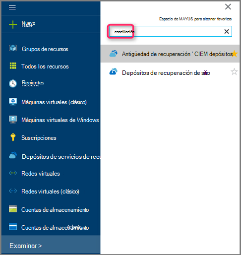

    Se muestra la lista de depósitos en la suscripción.

    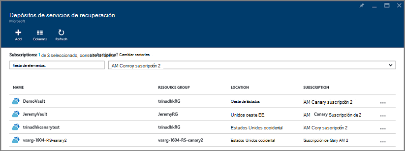

3. En la lista, seleccione el depósito asociado a la máquina virtual que desea restaurar. Al hacer clic en la cámara, se abre su panel.

    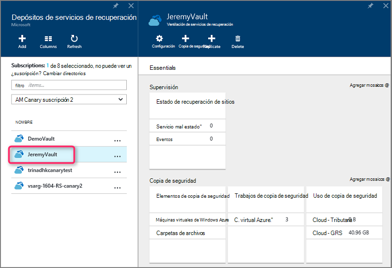

4. Ahora que está en el panel de la cámara. En la **Copia de seguridad de elementos** en mosaico, haga clic en **máquinas virtuales de Azure** para mostrar las VM asociadas con la cámara.

    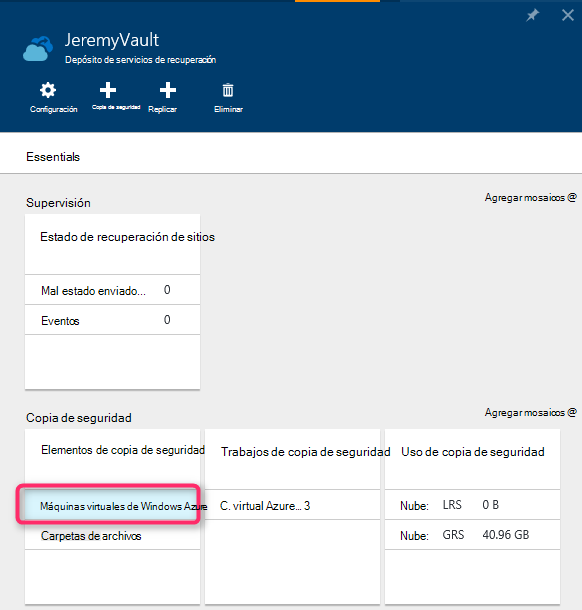

    El módulo de **Copia de seguridad de elementos** se abre y muestra la lista de máquinas virtuales de Windows Azure.

    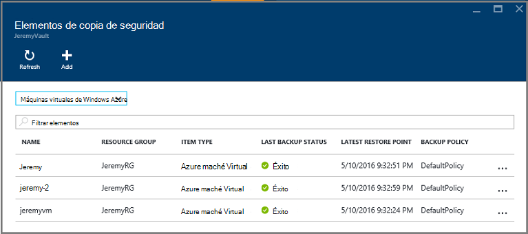

5. En la lista, seleccione una máquina virtual para abrir el panel. Se abre el panel de la máquina virtual para el área de supervisión, que contiene el icono de puntos de restauración.

    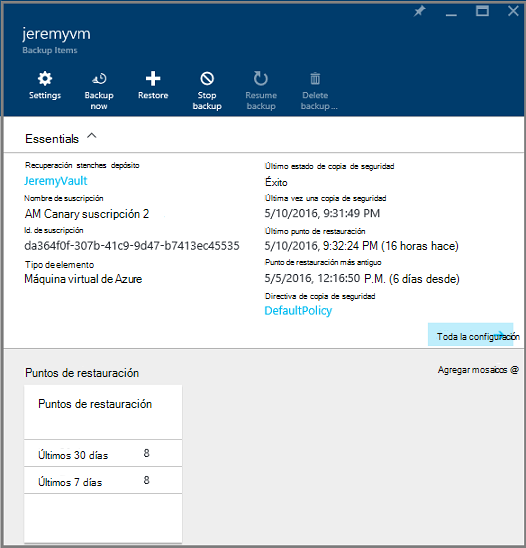

6. En el menú del panel de máquina virtual, haga clic en **Restaurar**

    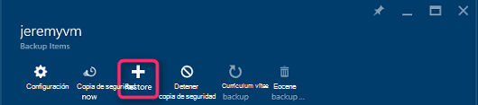

    Se abre el módulo de restaurar.

    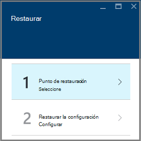

7. En el módulo **Restaurar** , haga clic en el **punto de restauración** para abrir el módulo de **punto seleccione Restaurar** .

    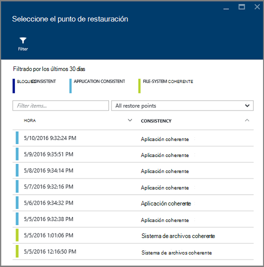

    De forma predeterminada, el cuadro de diálogo muestra todos los puntos de restauración de los últimos 30 días. Use el **filtro** para modificar el intervalo de tiempo de los puntos de restauración que aparece. De forma predeterminada, se muestran puntos de restauración de toda la coherencia. Modificar filtro **Restaurar todos los puntos** para seleccionar una coherencia específico de puntos de restauración. Para obtener más información acerca de cada tipo de restauración punto, consulte la explicación de la [coherencia de los datos](./backup-azure-vms-introduction.md#data-consistency).  
    - Elija la **coherencia de punto de restauración** de esta lista:
        - Bloquee los puntos de restauración coherente,
        - Puntos de restauración coherente de aplicación,
        - Puntos de restauración coherente de sistema de archivos
        - Todos los puntos de restauración.  

8. Elija un punto de restauración y haga clic en **Aceptar**.

    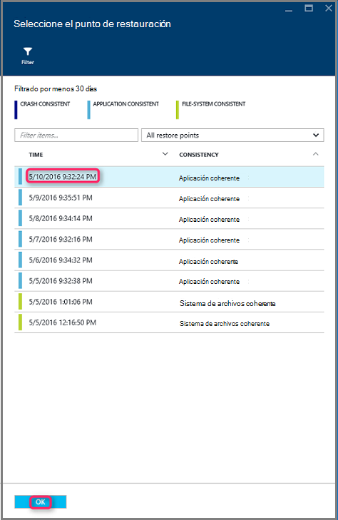

    El módulo **Restaurar** muestra que se establece el punto de restauración.

    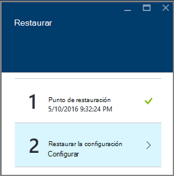

9. En el módulo **Restaurar** , **restaurar la configuración** se abrirá automáticamente después de establece el punto de restauración.

    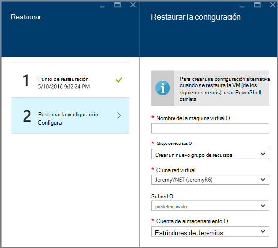

## Elegir una configuración de restauración de VM

Ahora que ha seleccionado el punto de restauración, seleccione una configuración para la restauración de la máquina virtual. Las opciones para configurar la VM restaurados son usar: portal de Azure o PowerShell.

> [AZURE.NOTE] Portal proporciona una opción de crear rápido para VM restaurados. Si desea personalizar la configuración de la máquina virtual de VM restaurada futura, usar PowerShell para restaurar la copia de seguridad de discos y adjúntelos a la opción de configuración de la máquina. Consulte [cómo restaurar una máquina virtual con las configuraciones de red especiales](#restoring-vms-with-special-network-configurations).

1. Si no todavía existe, vaya a la placa **Restaurar** . Asegúrese de que un **punto de restauración** se ha seleccionado y haga clic en **Restaurar configuración** para abrir el módulo de **configuración de recuperación** .

    

2. En el módulo **restaurar la configuración** , escriba o seleccione valores para cada uno de los siguientes campos:
    - **Nombre de la máquina Virtual** : proporcione un nombre para la máquina virtual. El nombre debe ser único en el grupo de recursos (para una máquina virtual implementado por el Administrador de recursos) o el servicio de nube (para una VM clásico). No puede reemplazar la máquina virtual si ya existe en la suscripción.
    - **Grupo de recursos** : usar un grupo de recursos existente o cree uno nuevo. Si está restaurando una VM clásica, use este campo para especificar el nombre de un nuevo servicio de nube. Si se crea un nuevo servicio de nube o grupo de recursos, el nombre debe ser único global. Normalmente, el nombre de servicio de nube está asociado con una dirección URL del público: por ejemplo: [cloudservice]. cloudapp.net. Si intenta usar un nombre para el servicio de nube o grupo de recursos de nube que ya se ha usado, Azure asigna el servicio de nube o grupo de recursos en el mismo nombre que la máquina virtual. Azure muestra los servicios de nube o grupos de recursos y máquinas virtuales no asociadas con los grupos de afinidad. Para obtener más información, vea [cómo migrar de grupos de afinidad a una red Virtual Regional (VNet)](../virtual-network/virtual-networks-migrate-to-regional-vnet.md).
    - **Una red virtual** : seleccione la red virtual (VNET) al crear la máquina virtual. El campo proporciona todos los VNETs asociadas con la suscripción. Grupo de recursos de la máquina virtual se muestra entre paréntesis.
    - **Subred** - si la VNET tiene subredes, la primera subred está activada de forma predeterminada. Si hay subredes adicionales, seleccione la subred deseada.
    - **Cuenta de almacenamiento** , este menú enumera las cuentas de almacenamiento en la misma ubicación que la cámara de servicios de recuperación. Al elegir una cuenta de almacenamiento, seleccione una cuenta que comparte la misma ubicación que la cámara de servicios de recuperación. No se admiten las cuentas de almacenamiento que son redundantes de la zona. Si no hay ninguna cuenta de almacenamiento con la misma ubicación que la cámara de servicios de recuperación, debe crearla antes de iniciar la operación de restauración. Tipo de replicación de la cuenta de almacenamiento se menciona entre paréntesis.

    > [AZURE.NOTE] Si está restaurando una máquina virtual implementado por el Administrador de recursos, debe identificar una red virtual (VNET). Una red virtual (VNET) es opcional para una VM clásico.

3. En el módulo **restaurar la configuración** , haga clic en **Aceptar** para finalizar la configuración de restauración.

4. En el módulo **Restaurar** , haga clic en **Restaurar** para desencadenar la operación de restauración.

    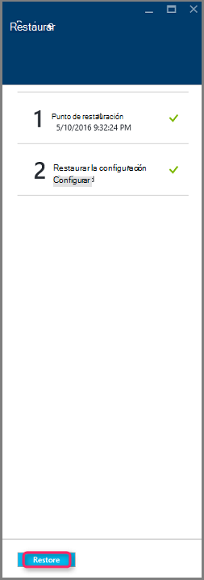

## Realizar un seguimiento de la operación de restauración

Una vez desencadenar la operación de restauración, el servicio de copia de seguridad crea un trabajo para realizar el seguimiento de la operación de restauración. El servicio de copia de seguridad también crea y muestra temporalmente la notificación en el área de notificación del portal. Si no ve la notificación, siempre puede haga clic en el icono de notificaciones para ver las notificaciones.

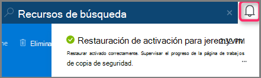

Para ver la operación mientras se está procesando, o ver cuando se ha completado, abra la lista de trabajos de copia de seguridad.

1. En el menú de Azure, haga clic en **Examinar** y en la lista de servicios, escriba **Servicios de recuperación**. La lista de servicios que se ajusta a lo que escribe. Cuando vea **Servicios de recuperación de depósitos**, selecciónela.

    

    Se muestra la lista de depósitos en la suscripción.

    

2. En la lista, seleccione el depósito asociado a la máquina virtual que se ha restaurado. Al hacer clic en la cámara, se abre su panel.

3. En el panel de la cámara en los **Trabajos de copia de seguridad** en mosaico, haga clic en **máquinas virtuales de Azure** para mostrar los trabajos asociados con la cámara.

    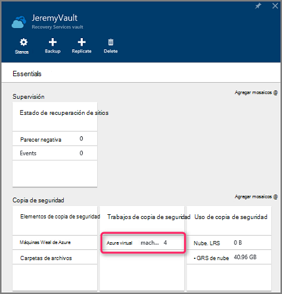

    El módulo de **Trabajos de copia de seguridad** se abre y muestra la lista de trabajos.

    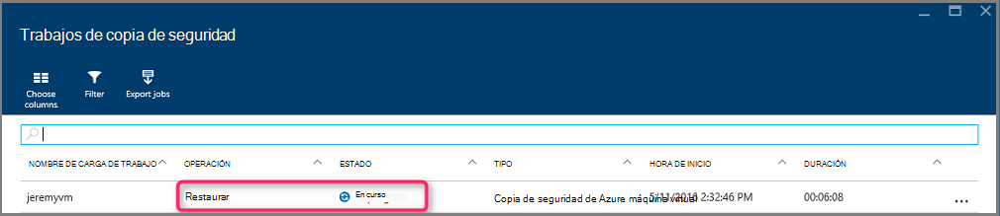

## Restaurar VM con las configuraciones de red especiales
Es posible hacer copia de seguridad y restauración de máquinas virtuales con las siguientes configuraciones de red especiales. Sin embargo, estas configuraciones requieren algunos consideración especial al pasar por el proceso de restauración.

- Máquinas virtuales en equilibrador de carga (interno y externo)
- Máquinas virtuales con varias direcciones IP reservada
- Máquinas virtuales con varias NIC

>[AZURE.IMPORTANT] Al crear la configuración de red especiales para máquinas virtuales, debe usar PowerShell para crear máquinas virtuales desde los discos restaurados.

Para recrear totalmente las máquinas virtuales después de restaurar en disco, siga estos pasos:

1. Restaurar los discos de un depósito de servicios de recuperación con [PowerShell](../backup-azure-vms-automation.md#restore-an-azure-vm)

2. Crear la configuración de VM necesaria para equilibrador de carga / IP reservada de NIC o varios múltiples con los cmdlets de PowerShell y el uso que se cree la máquina virtual de deseado configuración.
    - Crear VM en servicio de nube con [equilibrador de carga interno](https://azure.microsoft.com/documentation/articles/load-balancer-internal-getstarted/)
    - Crear VM para conectarse a [opuestas equilibrador de carga de Internet] (https://azure.microsoft.com/en-us/documentation/articles/load-balancer-internet-getstarted/)
    - Crear VM con [varias NIC](https://azure.microsoft.com/documentation/articles/virtual-networks-multiple-nics/)
    - Crear VM con [varias direcciones IP reservada](https://azure.microsoft.com/documentation/articles/virtual-networks-reserved-public-ip/)

## Pasos siguientes
Ahora que puede restaurar sus máquinas virtuales, consulte el artículo de solución de problemas para obtener información sobre los errores comunes de máquinas virtuales. Además, consulte el artículo sobre cómo administrar las tareas con sus máquinas virtuales.

- [Solución de errores](backup-azure-vms-troubleshoot.md#restore)
- [Administrar máquinas virtuales](backup-azure-manage-vms.md)
