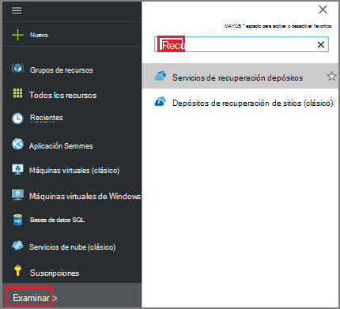
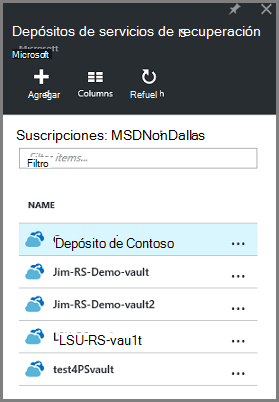
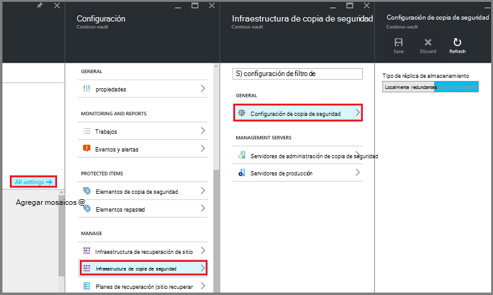
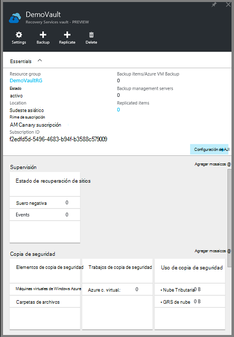
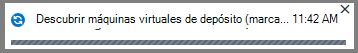
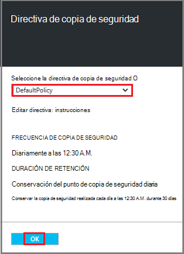
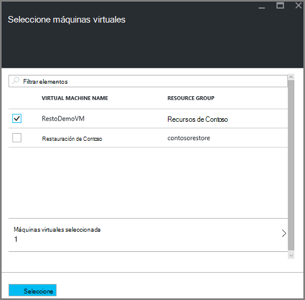
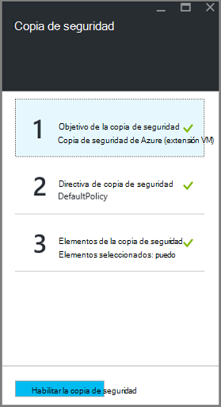
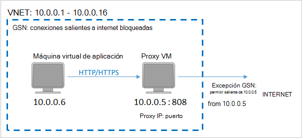
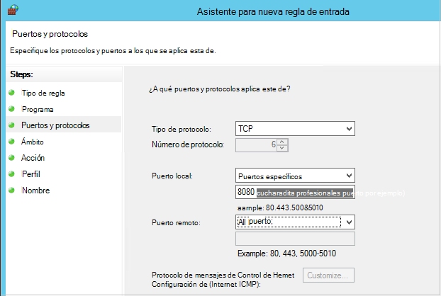

<properties
    pageTitle="Preparar el entorno para realizar copias de seguridad implementado por el Administrador de recursos máquinas virtuales de Windows | Microsoft Azure"
    description="Asegúrese de que su entorno está preparado para realizar copias de seguridad máquinas virtuales de Azure"
    services="backup"
    documentationCenter=""
    authors="markgalioto"
    manager="cfreeman"
    editor=""
    keywords="copias de seguridad. una copia de seguridad;"/>

<tags
    ms.service="backup"
    ms.workload="storage-backup-recovery"
    ms.tgt_pltfrm="na"
    ms.devlang="na"
    ms.topic="article"
    ms.date="08/21/2016"
    ms.author="trinadhk; jimpark; markgal;"/>


# <a name="prepare-your-environment-to-back-up-resource-manager-deployed-virtual-machines"></a>Preparar el entorno para realizar copias de seguridad implementado por el Administrador de recursos máquinas virtuales de Windows

> [AZURE.SELECTOR]
- [Modelo de administrador de recursos](backup-azure-arm-vms-prepare.md)
- [Modelo clásico](backup-azure-vms-prepare.md)

Este artículo proporciona los pasos para preparar su entorno para realizar copias de seguridad una implementado por el Administrador de recursos de máquina virtual (). Los pasos que se muestra en los procedimientos de usar el portal de Azure.  

El servicio de copia de seguridad de Azure tiene dos tipos de depósitos (back depósitos y depósitos de servicios de recuperación) para proteger sus máquinas virtuales. Un depósito de copia de seguridad protege máquinas virtuales de implementada mediante el modelo de implementación de clásico. Un depósito de servicios de recuperación protege **máquinas virtuales de ambos implementado clásico o implementado por el Administrador de recursos** . Debe usar un depósito de servicios de recuperación para proteger una máquina virtual implementado por el Administrador de recursos.

>[AZURE.NOTE] Azure tiene dos modelos de implementación para crear y trabajar con recursos: [Administrador de recursos y clásica](../resource-manager-deployment-model.md). Para obtener más información sobre cómo trabajar con el modelo de implementación de clásico máquinas virtuales, vea [Preparar su entorno para realizar copias de seguridad máquinas virtuales de Windows Azure](backup-azure-vms-prepare.md) .

Antes de poder proteger o realizar copias de seguridad una implementado por el Administrador de recursos de máquina virtual (), asegúrese de que existen estos requisitos previos:

- Crear un depósito de servicios de recuperación (o identificar un depósito de servicios de recuperación existente) *en la misma ubicación que la máquina virtual*.
- Seleccione un escenario, definir la directiva de copia de seguridad y definir los elementos que se va a proteger.
- Comprobar la instalación de agente de VM en máquina virtual.
- Compruebe la conectividad de red

Si sabe que estas condiciones ya existen en su entorno de continuar para [realizar copias de seguridad de su artículo máquinas virtuales](backup-azure-vms.md). Si necesita configurar o comprobar cualquiera de estos requisitos previos, este artículo le guía a través de los pasos para preparar esa requisito previo.


## <a name="limitations-when-backing-up-and-restoring-a-vm"></a>Limitaciones al realizar copias de seguridad y restaurar una máquina virtual

Antes de preparar el entorno, por favor, conoce las limitaciones.

- No se admite la copia de seguridad de máquinas virtuales con más de 16 discos de datos.
- No se admite la copia de seguridad de máquinas virtuales con una dirección IP reservada y ningún extremo definido.
- No se admite la copia de seguridad de máquinas virtuales de Linux con la extensión Docker. 
- Datos de copia de seguridad no incluyen unidades de red montada conectadas a máquina virtual. 
- Reemplazar una máquina virtual existente durante la restauración no es compatible. Si intenta restaurar la máquina virtual cuando existe la máquina virtual, se produce un error en la operación de restauración.
- No se admite la restauración y copia de seguridad entre región.
- Hacer copia de seguridad de máquinas virtuales en todas las regiones públicas de Azure (consulte la [lista de comprobación](https://azure.microsoft.com/regions/#services) de regiones compatibles). Si la región que está buscando no es compatible actualmente, no aparecerá en la lista desplegable durante la creación de la cámara.
- Puede hacer una copia máquinas virtuales sólo para versiones seleccione sistema operativo:
  - **Linux**: copia de seguridad de Azure es compatible con [una lista de las distribuciones que están apoyo de Azure](../virtual-machines/virtual-machines-linux-endorsed-distros.md) excepto Core OS Linux.  Otras distribuciones Traer-su-propietario-Linux también podrían funcionan como el agente VM está disponible en la máquina virtual y la compatibilidad con Python existe.
  - **Windows Server**: no se admiten las versiones anteriores a Windows Server 2008 R2.
- Restaurar un controlador de dominio VM (CC) que forma parte de una configuración de múltiples DC es compatible sólo a través de PowerShell. Obtenga más acerca de cómo [restaurar un controlador de dominio entre varios DC](backup-azure-restore-vms.md#restoring-domain-controller-vms).
- Se admite la restauración de máquinas virtuales que tiene las siguientes configuraciones de red especiales sólo a través de PowerShell. Máquinas virtuales creadas con el flujo de trabajo de restauración de la interfaz de usuario no tendrán estas configuraciones de red cuando se complete la operación de restauración. Para obtener más información, vea [Restaurar máquinas virtuales con las configuraciones de red especiales](backup-azure-restore-vms.md#restoring-vms-with-special-netwrok-configurations).
  - Máquinas virtuales de Windows en configuración del equilibrador de carga (interno y externo)
  - Máquinas virtuales con varias direcciones IP reservadas
  - Máquinas virtuales con varios adaptadores de red

## <a name="create-a-recovery-services-vault-for-a-vm"></a>Crear un depósito de servicios de recuperación de una máquina virtual

Un depósito de servicios de recuperación es una entidad que almacena las copias de seguridad y los puntos de recuperación que se han creado a lo largo del tiempo. El depósito de servicios de recuperación también contiene las directivas de copia de seguridad asociadas a los equipos virtuales protegidos.

Para crear un depósito de servicios de recuperación:

1. Inicie sesión en el [portal de Azure](https://portal.azure.com/).

2. En el menú de concentrador, haga clic en **Examinar** y en la lista de recursos, escriba **Servicios de recuperación**. Cuando comience a escribir, filtrará la lista basada en la entrada. Haga clic en **Servicios de recuperación de cámara**.

     <br/>

    Se muestra la lista de servicios de recuperación depósitos.

3. En el menú de **Servicios de recuperación de depósitos** , haga clic en **Agregar**.

    

    Se abre el módulo de cámara de servicios de recuperación, que le pide que proporcione un **nombre**, la **suscripción**, el **grupo de recursos**y la **ubicación**.

    

4. En **nombre**, escriba un nombre descriptivo para identificar la cámara. El nombre debe ser único para la suscripción de Azure. Escriba un nombre que contenga entre 2 y 50 caracteres. Debe comenzar con una letra y puede contener sólo letras, números y guiones.

5. Haga clic en la **suscripción** para ver la lista de suscripciones disponibles. Si no está seguro de qué suscripción a usar, use el valor predeterminado (o sugeridos) suscripción. Habrá varias opciones solo si su cuenta profesional está asociado con varias suscripciones de Azure.

6. Haga clic en el **grupo de recursos** para ver la lista de grupos de recursos disponibles o haga clic en **nuevo** para crear un nuevo grupo de recursos. Para obtener información completa sobre los grupos de recursos, consulte [información general del Administrador de recursos de Azure](../azure-resource-manager/resource-group-overview.md)

7. Haga clic en **ubicación** para seleccionar la región geográfica de la cámara. La cámara **debe** estar en la misma región como las máquinas virtuales que desea proteger.

    >[AZURE.IMPORTANT] Si no está seguro de la ubicación donde se encuentra su máquina virtual, cerrar el cuadro de diálogo de creación de cámara y vaya a la lista de máquinas virtuales en el portal. Si tiene máquinas virtuales de Windows en varias regiones, debe crear un depósito de servicios de recuperación de cada región. Crear la cámara en la primera ubicación antes de pasar a la siguiente ubicación. No es necesario para especificar las cuentas de almacenamiento para almacenar los datos de copia de seguridad: el depósito de servicios de recuperación y el servicio de copia de seguridad de Azure controle automáticamente.

8. Haga clic en **crear**. Puede pasar un tiempo para el depósito de servicios de recuperación que debe crearse. Supervisar las notificaciones de estado en el área superior derecha en el portal. Una vez creada la cámara, aparece en la lista de servicios de recuperación depósitos.

    

    Ahora que ha creado su cámara, obtenga información sobre cómo configurar la replicación de almacenamiento.

## <a name="set-storage-replication"></a>Configurar la replicación de almacenamiento

La opción de replicación de almacenamiento le permite elegir entre almacenamiento geo redundantes y almacenamiento redundante local. De forma predeterminada, el depósito tiene almacenamiento geo redundantes. Deje la opción establecida en almacenamiento geo redundantes si se trata de la copia de seguridad principal. Si desea una opción económica que no es bastante como resistente, elija almacenamiento redundante local. Leer más sobre [geo redundantes](../storage/storage-redundancy.md#geo-redundant-storage) y las opciones de almacenamiento [redundante local](../storage/storage-redundancy.md#locally-redundant-storage) en la [Visión general de la replicación de almacenamiento de Azure](../storage/storage-redundancy.md).

Para editar la configuración de replicación de almacenamiento:

1. Seleccione el depósito para abrir el panel de la cámara y el módulo de configuración. Si no se abre el módulo de **configuración** , haga clic en **todas las opciones** en el panel de la cámara.

2. En el módulo de **configuración** , haga clic en **La infraestructura de copia de seguridad** > **Configuración de copia de seguridad** para abrir el módulo de **Configuración de copia de seguridad** . En el módulo de **Configuración de copia de seguridad** , elija la opción de replicación de almacenamiento de la cámara.

    

    Después de elegir la opción de almacenamiento de la cámara, ya está listo para asociar la máquina virtual con la cámara. Para comenzar la asociación, debe descubrir y registrar los equipos virtuales Azure.


## <a name="select-a-backup-goal-set-policy-and-define-items-to-protect"></a>Seleccione un objetivo de copia de seguridad, establecer la directiva y definir elementos para proteger

Antes de registrar una máquina virtual con un depósito, ejecute el proceso de detección para asegurarse de que se identifica las nuevas máquinas virtuales que se han agregado a la suscripción. Las consultas de proceso Azure para la lista de máquinas virtuales de la suscripción, junto con información adicional, como el nombre de servicio de nube y la región. En el portal de Azure escenario se refiere a lo que se va a colocar en la cámara de servicios de recuperación. Directiva es el plan para la frecuencia y cuándo se toman puntos de recuperación. Directiva también incluye el intervalo de retención para los puntos de recuperación.

1. Si ya tiene un abierto del depósito de servicios de recuperación, vaya al paso 2. Si no tiene un servicio de recuperación depósito abierta, pero se encuentran en el portal de Azure, en el menú de concentrador, haga clic en **Examinar**.

  - En la lista de recursos, escriba **Servicios de recuperación**.
  - Cuando comience a escribir, filtrará la lista basada en la entrada. Cuando vea **depósitos de servicios de recuperación**, haga clic en él.

     <br/>

    Aparece la lista de servicios de recuperación depósitos.
  - En la lista de servicios de recuperación depósitos, seleccione un depósito.

    Se abre el panel de depósito seleccionado.

    

2. En el menú del panel de cámara, haga clic en **copia de seguridad** para abrir el módulo de copia de seguridad.

    

    Cuando se abre el módulo, el servicio de copia de seguridad busca cualquier nuevas máquinas virtuales de la suscripción.

    

3. En el módulo de copia de seguridad, haga clic en el **objetivo de copia de seguridad** para abrir el módulo de objetivo de copia de seguridad.

    

4. En el módulo de objetivo de la copia de seguridad, establezca **donde se ejecuta la carga de trabajo** en Azure y **Especifique qué desea hacer una copia de seguridad** a máquina Virtual, a continuación, haga clic en **Aceptar**.

    El módulo de objetivo de copia de seguridad se cierra y se abre el módulo de directivas de copia de seguridad.

    

5. En el módulo de directivas de copia de seguridad, seleccione la directiva de copia de seguridad que desea aplicar a la cámara y haga clic en **Aceptar**.

    

    Los detalles de la directiva predeterminada se muestran en los detalles. Si desea crear una nueva directiva, seleccione **Crear nuevo** en el menú desplegable. El menú desplegable también proporciona una opción para cambiar la hora cuando se toma la instantánea a 7 PM. Para obtener instrucciones sobre cómo definir una directiva de copia de seguridad, consulte [definir una directiva de copia de seguridad](backup-azure-vms-first-look-arm.md#defining-a-backup-policy). Una vez que haga clic en **Aceptar**, la directiva de copia de seguridad está asociada con la cámara.

    A continuación, seleccione las máquinas virtuales para asociarla con la cámara.

6. Elija los equipos virtuales para asociar con la directiva especificada y haga clic en **Seleccionar**.

    

    Si no ve la VM deseada, compruebe que se encuentra en la misma ubicación de Azure como depósito de servicios de recuperación.

7. Ahora que ha definido toda la configuración de la cámara, en el módulo de copia de seguridad, haga clic en **Habilitar la copia de seguridad** en la parte inferior de la página. Esto implementa la directiva a la cámara y las máquinas virtuales.

    

La siguiente fase de preparación está configurado para instalar al agente de VM o asegurarse de que el agente de VM está instalado.


## <a name="install-the-vm-agent-on-the-virtual-machine"></a>Instalar al agente de máquina virtual en la máquina virtual

El agente de Azure VM debe instalarse en la máquina virtual de Azure para que funcione la extensión de copia de seguridad. Si ha creado la máquina virtual de la Galería de Azure, el agente de VM ya está presente en la máquina virtual. Esta información está siempre en las situaciones donde se encuentra *no* usar una máquina virtual creado a partir de la Galería de Azure: por ejemplo, que migrar una máquina virtual de un centro de datos local. En este caso, el agente de VM debe instalarse para proteger la máquina virtual.

Obtenga información sobre el [Agente de VM](https://go.microsoft.com/fwLink/?LinkID=390493&clcid=0x409) y [cómo instalar el agente de máquina virtual](../virtual-machines/virtual-machines-windows-classic-manage-extensions.md).

Si tiene problemas de la copia de seguridad de la máquina virtual de Azure, compruebe que el agente de Azure VM está instalado correctamente en la máquina virtual (consulte la tabla siguiente). Si ha creado una máquina virtual personalizada, [Asegúrese de que está seleccionada la casilla de verificación **instalar el agente de VM** ](../virtual-machines/virtual-machines-windows-classic-agents-and-extensions.md) antes de la máquina virtual está configurado.

En la tabla siguiente proporciona información adicional acerca de la máquina virtual agente para Windows y máquinas virtuales de Linux.

| **Operación** | **Windows** | **Linux** |
| --- | --- | --- |
| Instalar al agente VM | <li>Descargue e instale el [agente de MSI](http://go.microsoft.com/fwlink/?LinkID=394789&clcid=0x409). Necesitará privilegios de administrador para completar la instalación. <li>[Actualizar la propiedad VM](http://blogs.msdn.com/b/mast/archive/2014/04/08/install-the-vm-agent-on-an-existing-azure-vm.aspx) para indicar que está instalado el agente. | <li> Instale la última [Linux agente](https://github.com/Azure/WALinuxAgent) de GitHub. Necesitará privilegios de administrador para completar la instalación. <li> [Actualizar la propiedad VM](http://blogs.msdn.com/b/mast/archive/2014/04/08/install-the-vm-agent-on-an-existing-azure-vm.aspx) para indicar que está instalado el agente. |
| Actualizar al agente VM | Actualizar al agente de VM es tan sencillo como volver a instalar los [archivos binarios de agente de máquina virtual](http://go.microsoft.com/fwlink/?LinkID=394789&clcid=0x409). <br>Asegúrese de que ninguna operación de copia de seguridad se está ejecutando mientras se actualiza el agente de máquina virtual. | Siga las instrucciones sobre cómo [actualizar el agente de máquina virtual Linux ](../virtual-machines-linux-update-agent.md). <br>Asegúrese de que ninguna operación de copia de seguridad se está ejecutando mientras se actualiza el agente de máquina virtual. |
| Validar la instalación del agente de VM | <li>Vaya a la carpeta *C:\WindowsAzure\Packages* en la máquina virtual de Azure. <li>Encontrará el archivo de WaAppAgent.exe.<li> Haga clic en el archivo, vaya a las **Propiedades**y, a continuación, seleccione la ficha **Detalles** . El campo de versión del producto debe ser 2.6.1198.718 o superior. | N/A. |


### <a name="backup-extension"></a>Extensión de copia de seguridad

Una vez instalado el agente de máquina virtual en la máquina virtual, el servicio de copia de seguridad de Azure instala la extensión de copia de seguridad en el agente de máquina virtual. El servicio de copia de seguridad de Azure sin problemas actualizaciones y revisiones de la extensión de copia de seguridad.

La extensión de copia de seguridad está instalada en el servicio de copia de seguridad si no se está ejecutando la máquina virtual. Una VM en ejecución proporciona las mayores posibilidades de obtener un punto de recuperación consistente para la aplicación. Sin embargo, el servicio de copia de seguridad de Azure continúa hacer una copia de la máquina virtual incluso si está desactivada y no se pudo instalar la extensión. Esto se conoce como VM sin conexión. En este caso, el punto de recuperación será *coherente con los bloqueos*.


## <a name="network-connectivity"></a>Conectividad de red

Para administrar las instantáneas de máquina virtual, la extensión de copia de seguridad necesita conectividad con las direcciones IP públicas Azure. Sin la conectividad de Internet adecuada HTTP de la máquina virtual solicitudes de tiempo de espera y se produce un error en la operación de copia de seguridad. Si la implementación tiene las restricciones de acceso en su lugar (a través de un grupo de seguridad de la red (GSN), por ejemplo), a continuación, elija una de estas opciones para proporcionar un camino claro para el tráfico de copia de seguridad:

- [Rangos blanca la IP del centro de datos de Azure](http://www.microsoft.com/en-us/download/details.aspx?id=41653) : consulte el artículo para obtener instrucciones sobre cómo a la lista blanca las direcciones IP.
- Implementar un servidor de proxy HTTP para enrutar el tráfico.

Al decidir qué opción utilizar, son las ventajas y desventajas entre capacidad de administración, el control detallado y el costo.

|Opción|Ventajas|Desventajas|
|------|----------|-------------|
|Intervalos de IP Whitelist| No hay costes adicionales.<br><br>Para abrir el acceso de un GSN, use el cmdlet <i>Set-AzureNetworkSecurityRule</i> . | Compleja de administrar como la afectada intervalos IP cambian con el tiempo.<br><br>Proporciona acceso a la totalidad de Azure y no solo almacenamiento.|
|Proxy HTTP| Control detallado de en el servidor proxy de las direcciones URL de almacenamiento permitidos.<br>Un único punto de Internet de acceso a máquinas virtuales.<br>No están sujetos a cambios de direcciones IP de Azure.| Costes adicionales para ejecutar una máquina virtual con el software de proxy.|

### <a name="whitelist-the-azure-datacenter-ip-ranges"></a>Intervalos de IP blanca del centro de datos de Azure

A la lista blanca los intervalos de IP del centro de datos de Azure, por favor, consulte el [sitio Web de Azure](http://www.microsoft.com/en-us/download/details.aspx?id=41653) para obtener más información sobre los intervalos de IP e instrucciones.

### <a name="using-an-http-proxy-for-vm-backups"></a>Usar a un servidor proxy HTTP para las copias de seguridad VM
Cuando copia una máquina virtual, la extensión de copia de seguridad de la máquina virtual envía los comandos de administración de instantánea al almacenamiento de Azure con la API HTTPS. Enrutar el tráfico de copia de seguridad de extensión a través del proxy HTTP, ya que es el único componente configurado para el acceso a Internet.

>[AZURE.NOTE] No hay ninguna recomendación para el software de proxy que se debe usar. Asegúrese de que seleccione a un proxy que sea compatible con los siguientes pasos de configuración.

La imagen de ejemplo siguiente muestra los pasos de configuración de tres necesarios para usar a un servidor proxy HTTP:

- Aplicación VM enruta todo el tráfico HTTP enlazado para Internet pública a través de la máquina virtual de Proxy.
- Proxy VM permite el tráfico entrante de máquinas virtuales en la red virtual.
- El grupo de seguridad de red (GSN) denominada bloqueo sin fondos necesita un seguridad regla permitir Internet el tráfico saliente de máquina virtual de Proxy.



Para usar a un servidor proxy HTTP para comunicar a Internet, siga estos pasos:

#### <a name="step-1-configure-outgoing-network-connections"></a>Paso 1. Configurar conexiones de red salientes

###### <a name="for-windows-machines"></a>Para equipos con Windows
Esto realizará la instalación de configuración del servidor proxy para la cuenta del sistema Local.

1. Descargar [PsExec](https://technet.microsoft.com/sysinternals/bb897553)
2. Ejecutar el comando siguiente desde el símbolo del sistema con privilegios elevados,

     ```
     psexec -i -s "c:\Program Files\Internet Explorer\iexplore.exe"
     ```
     Se abrirá la ventana de internet explorer.
3. Vaya a Herramientas -> Opciones de Internet -> conexiones -> configuración de LAN.
4. Compruebe la configuración de proxy para la cuenta del sistema. Establecer IP de Proxy y puerto.
5. Cierre el Explorador de Internet.

Esto establecerá una configuración de proxy de todo el equipo y se utilizará para el tráfico saliente de HTTP/HTTPS.

Si tiene un servidor proxy de configuración en una cuenta de usuario actual (no una cuenta de sistema Local), utilice la siguiente secuencia de comandos para aplicarlos a SYSTEMACCOUNT:

```
   $obj = Get-ItemProperty -Path Registry::”HKEY_CURRENT_USER\Software\Microsoft\Windows\CurrentVersion\Internet Settings\Connections"
   Set-ItemProperty -Path Registry::”HKEY_USERS\S-1-5-18\Software\Microsoft\Windows\CurrentVersion\Internet Settings\Connections" -Name DefaultConnectionSettings -Value $obj.DefaultConnectionSettings
   Set-ItemProperty -Path Registry::”HKEY_USERS\S-1-5-18\Software\Microsoft\Windows\CurrentVersion\Internet Settings\Connections" -Name SavedLegacySettings -Value $obj.SavedLegacySettings
   $obj = Get-ItemProperty -Path Registry::”HKEY_CURRENT_USER\Software\Microsoft\Windows\CurrentVersion\Internet Settings"
   Set-ItemProperty -Path Registry::”HKEY_USERS\S-1-5-18\Software\Microsoft\Windows\CurrentVersion\Internet Settings" -Name ProxyEnable -Value $obj.ProxyEnable
   Set-ItemProperty -Path Registry::”HKEY_USERS\S-1-5-18\Software\Microsoft\Windows\CurrentVersion\Internet Settings" -Name Proxyserver -Value $obj.Proxyserver
```

>[AZURE.NOTE] Si observa "(407) requiere autenticación de Proxy" en el registro del servidor proxy, active que la autenticación está configurado correctamente.

######<a name="for-linux-machines"></a>Para equipos Linux

Agregue la línea siguiente a la ```/etc/environment``` archivo:

```
http_proxy=http://<proxy IP>:<proxy port>
```

Agregue las siguientes líneas a la ```/etc/waagent.conf``` archivo:

```
HttpProxy.Host=<proxy IP>
HttpProxy.Port=<proxy port>
```

#### <a name="step-2-allow-incoming-connections-on-the-proxy-server"></a>Paso 2. Permitir las conexiones entrantes en el servidor proxy:

1. En el servidor proxy, abra Firewall de Windows. La manera más sencilla de acceso del firewall es buscar Firewall de Windows con seguridad avanzada.

    

2. En el cuadro de diálogo Firewall de Windows, haga clic en **Reglas de entrada** y haga clic en **Nueva regla...**.

    

3. En el **Asistente para reglas de entrada nuevo**, elija la opción **personalizada** para el **Tipo de regla** y haga clic en **siguiente**.
4. En la página para seleccionar el **programa**, elija **Todos los programas** y haga clic en **siguiente**.

5. En la página de **puertos y protocolos** , escriba la información siguiente y haga clic en **siguiente**:

    

    - elegir *tipo de protocolo* *TCP*
    - para el *puerto Local* elija *Puertos específicos*, en el campo siguiente, especifique la ```<Proxy Port>``` que se ha configurado.
    - para el *puerto remoto* , seleccione *Todos los puertos*

    Para el resto del asistente, haga clic en hasta el final y escriba un nombre para esta regla.

#### <a name="step-3-add-an-exception-rule-to-the-nsg"></a>Paso 3. Agregar una regla de excepción a la GSN:

En un símbolo del sistema de PowerShell de Azure, escriba el siguiente comando:

El siguiente comando agrega una excepción a la GSN. Esta excepción permite el tráfico TCP desde cualquier puerto 10.0.0.5 a cualquier dirección de Internet en los puertos 80 (HTTP) o 443 (HTTPS). Si necesita un puerto específico en Internet público, asegúrese de agregar el puerto para la ```-DestinationPortRange``` también.

```
Get-AzureNetworkSecurityGroup -Name "NSG-lockdown" |
Set-AzureNetworkSecurityRule -Name "allow-proxy " -Action Allow -Protocol TCP -Type Outbound -Priority 200 -SourceAddressPrefix "10.0.0.5/32" -SourcePortRange "*" -DestinationAddressPrefix Internet -DestinationPortRange "80-443"
```


*Estos pasos use nombres específicos y valores para este ejemplo. Utilice los nombres y valores para su implementación al escribir, o cortar y pegar detalles en el código.*


Ahora que sabe que tiene conectividad de red, está listo para realizar copias de seguridad de la máquina virtual. Vea [realizar copias de seguridad VM implementado por el Administrador de recursos](backup-azure-arm-vms.md).

## <a name="questions"></a>¿Preguntas?
Si tiene preguntas, o si no hay ninguna característica que le gustaría ver incluyen, [envíenos sus comentarios](http://aka.ms/azurebackup_feedback).

## <a name="next-steps"></a>Pasos siguientes
Ahora que ha preparado el entorno para la copia de seguridad de la máquina virtual, el siguiente paso es crear una copia de seguridad. El artículo planificación proporciona información más detallada sobre la copia de seguridad de máquinas virtuales.

- [Realizar copias de seguridad de máquinas virtuales](backup-azure-vms.md)
- [Planear la infraestructura de copia de seguridad de VM](backup-azure-vms-introduction.md)
- [Administrar las copias de seguridad de la máquina virtual](backup-azure-manage-vms.md)
