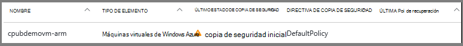
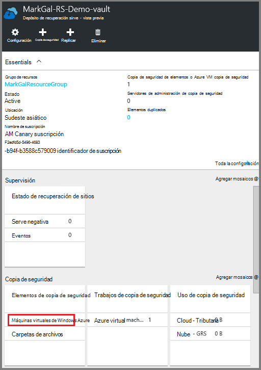
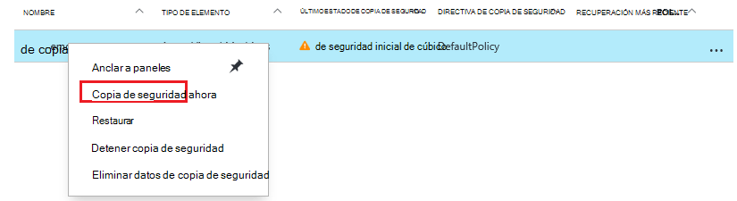
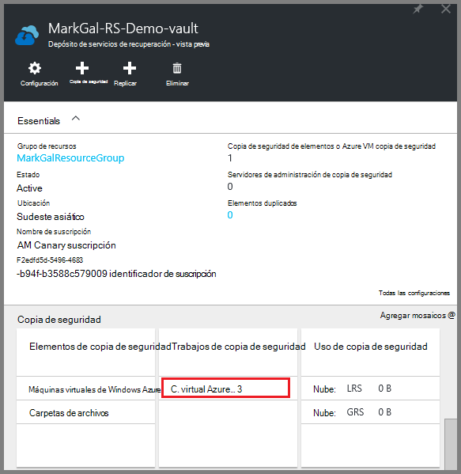
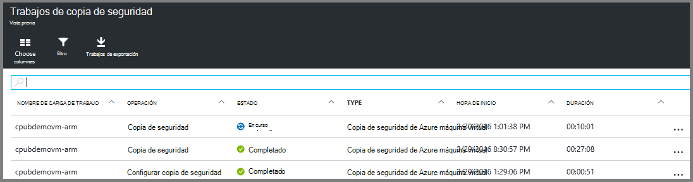

<properties
    pageTitle="Haga una copia de seguridad de Azure VM a un depósito de servicios de recuperación | Microsoft Azure"
    description="Descubrir, registrar y realizar copias de seguridad máquinas virtuales de Windows Azure a un depósito de servicios de recuperación con estos procedimientos para la copia de seguridad de Azure máquina virtual."
    services="backup"
    documentationCenter=""
    authors="markgalioto"
    manager="cfreeman"
    editor=""
    keywords="copia de seguridad de la máquina virtual; realizar copias de seguridad de la máquina virtual; copia de seguridad y recuperación de desastres; copia de seguridad de ARM vm"/>

<tags
    ms.service="backup"
    ms.workload="storage-backup-recovery"
    ms.tgt_pltfrm="na"
    ms.devlang="na"
    ms.topic="article"
    ms.date="07/29/2016"
    ms.author="trinadhk; jimpark; markgal;"/>

# Realizar copias de seguridad Azure VM a un depósito de servicios de recuperación

> [AZURE.SELECTOR]
- [Realizar copias de seguridad VM en depósito de servicios de recuperación](backup-azure-arm-vms.md)
- [Realizar copias de seguridad VM en depósito de copia de seguridad](backup-azure-vms.md)

En este artículo se proporciona el procedimiento para crear copias de seguridad de Azure VM (implementado por el Administrador de recursos e implementado clásico) a un depósito de servicios de recuperación. La mayoría de trabajo de copia de seguridad VM pasa a la preparación. Antes de poder realizar copias de seguridad o proteger una máquina virtual, debe completar los [requisitos previos](backup-azure-arm-vms-prepare.md) para preparar su entorno para proteger sus máquinas virtuales. Una vez haya completado los requisitos previos, puede iniciar la copia de seguridad de la operación que debe tomar instantáneas de la máquina virtual.

>[AZURE.NOTE] Azure tiene dos modelos de implementación para crear y trabajar con recursos: [Administrador de recursos y clásica](../resource-manager-deployment-model.md). Puede proteger máquinas virtuales implementado por el Administrador de recursos y máquinas virtuales clásica con depósitos de servicios de recuperación. Para obtener más información sobre cómo trabajar con el modelo de implementación de clásico máquinas virtuales, vea [copia de seguridad de máquinas virtuales de Windows Azure](backup-azure-vms.md) .

Para obtener más información, vea los artículos en [máquinas virtuales de Windows Azure](https://azure.microsoft.com/documentation/services/virtual-machines/)y [Planear la infraestructura de copia de seguridad de VM en Azure](backup-azure-vms-introduction.md) .

## Activación de la copia de seguridad de trabajo

La copia de seguridad de la directiva asociada con la cámara de servicios de recuperación, define con qué frecuencia y cuándo se ejecuta la operación de copia de seguridad. De forma predeterminada, la primera copia de seguridad programada es la copia de seguridad inicial. Hasta que se produce la copia de seguridad inicial, el último estado de copia de seguridad en el módulo de **Trabajos de copia de seguridad** se muestra como **Advertencia (copia de seguridad inicial pendiente)**.

A menos que la copia de seguridad inicial vence comenzar muy lo antes posible, se recomienda que ejecute la **copia de seguridad ahora**. El procedimiento siguiente se inicia desde el panel de la cámara. Este procedimiento sirve para ejecutar el trabajo de copia de seguridad inicial después de haber completado todos los requisitos previos. Si ya se ha ejecutado el trabajo de copia de seguridad inicial, este procedimiento no está disponible. La directiva de copia de seguridad asociada determina el siguiente trabajo de copia de seguridad.  

Para ejecutar el trabajo de copia de seguridad inicial:

1. En el panel de la cámara, en el mosaico de la **copia de seguridad** , haga clic en **máquinas virtuales de Azure**.  
    

    Se abre el módulo de **Copia de seguridad de elementos** .

2. En el módulo de **Copia de seguridad de elementos** , contextual depósito que desea hacer copia de seguridad y haga clic en **copia de seguridad ahora**.

    

    El trabajo de copia de seguridad se activa.  

    

3. Para ver que se ha completado la copia de seguridad inicial, en el panel de la cámara, en el mosaico de **Trabajos de copia de seguridad** , haga clic en **máquinas virtuales de Windows Azure**.

    

    Se abre el módulo de trabajos de copia de seguridad.

4. En el módulo de **trabajos de copia de seguridad** , puede ver el estado de todas las tareas.

    

    >[AZURE.NOTE] Como parte de la operación de copia de seguridad, el servicio de copia de seguridad de Azure emite un comando a la extensión de copia de seguridad en cada máquina virtual para vaciar escribe todos y tomar una instantánea coherente.

    Cuando haya finalizado el trabajo de copia de seguridad, el estado es *completada*.

## Solución de errores
Si tiene problemas mientras se está realizando la máquina virtual, vea el [artículo de solución de problemas de VM](backup-azure-vms-troubleshoot.md) para obtener ayuda.

## Pasos siguientes

Ahora que ha protegido su máquina virtual, consulte los artículos siguientes para tareas de administración adicionales puede hacer con sus máquinas virtuales y cómo restaurar máquinas virtuales.

- [Administrar y supervisar los equipos virtuales](backup-azure-manage-vms.md)
- [Restaurar máquinas virtuales de Windows](backup-azure-arm-restore-vms.md)
