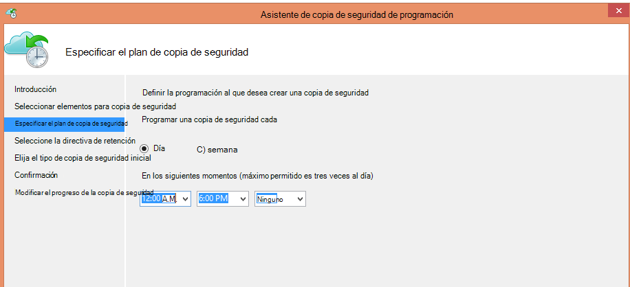
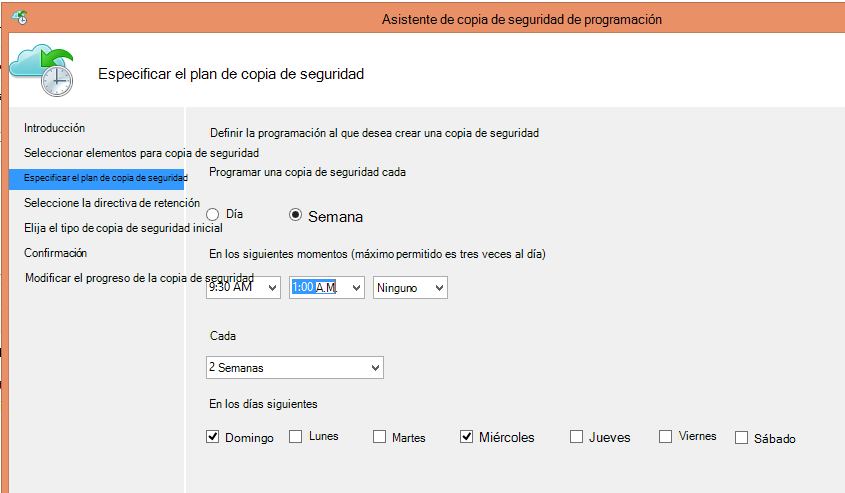
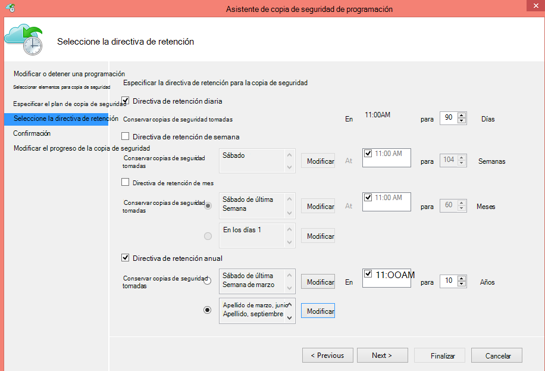
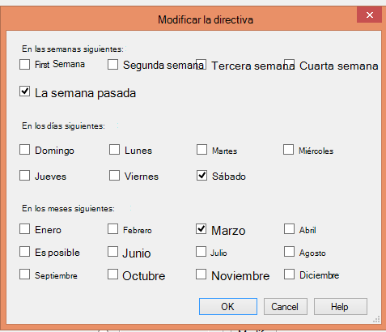

<properties
   pageTitle="Utilizar copia de seguridad de Azure para reemplazar la infraestructura de cinta | Microsoft Azure"
   description="Obtenga información sobre cómo copia de seguridad de Azure proporciona semántica de cinta que le permite hacer copia de seguridad y restaurar datos de Azure"
   services="backup"
   documentationCenter=""
   authors="trinadhk"
   manager="vijayts"
   editor=""/>
<tags
   ms.service="backup"
   ms.devlang="na"
   ms.topic="article"
   ms.tgt_pltfrm="na"
   ms.workload="storage-backup-recovery"
   ms.date="09/27/2016"
   ms.author="jimpark;trinadhk;markgal"/>

# Utilizar copia de seguridad de Azure para reemplazar la infraestructura de cinta

Los clientes de copia de seguridad y el Administrador de protección de datos de System Center Azure pueden:

- Copia de seguridad de datos en los planes que mejor se ajusten a las necesidades de la organización.
- Conservar los datos de copia de seguridad durante más tiempo
- Asegúrese de Azure necesita una parte de su retención a largo plazo (en lugar de la cinta).

En este artículo se explica cómo los clientes pueden hacer copia de seguridad y políticas de retención. Los clientes que usan cintas su largo-plazo retención de direcciones ahora deben tener una alternativa viable y eficaz con la disponibilidad de esta característica. La característica está habilitada en la última versión de la copia de seguridad de Azure (que está disponible [aquí](http://aka.ms/azurebackup_agent)). Los clientes de System Center DPM deben actualizar, al menos, DPM 2012 R2 UR5 antes de utilizar DPM con el servicio de copia de seguridad de Azure.

## ¿Qué es la programación de copia de seguridad?
La programación de copia de seguridad indica la frecuencia de la operación de copia de seguridad. Por ejemplo, la configuración en la pantalla siguiente indica que se realizan diariamente a 6 p.m. y medianoche.

Los clientes también pueden programar una copia de seguridad semanal. Por ejemplo, la configuración en la pantalla siguiente indica que se realizan cada domingo alternativo y el miércoles a 9:30 A.M. y 1:00 A.M..

## ¿Qué es la directiva de retención?
La directiva de retención especifica la duración que debe almacenarse la copia de seguridad. En lugar de especificar simplemente "directiva plana" para todos los puntos de copia de seguridad, los clientes pueden especificar directivas de retención diferente en función de cuándo se realizó la copia de seguridad. Por ejemplo, se mantiene el punto de copia de seguridad tomado diariamente, que sirve como un punto de recuperación de las operaciones, 90 días. Se conserva el punto de copia de seguridad al final de cada trimestre con fines de auditoría para una mayor duración.

El número total de "puntos de retención" especificado en esta directiva es 90 (diarias puntos) + 40 (uno cada trimestre a 10 años) = 130.

## Ejemplo: reunir ambos

1. **Directiva de retención diaria**: copias de seguridad realizadas diariamente se almacenan siete días.
2. **Directiva de retención semanal**: se conservan copias de seguridad realizadas cada día a medianoche y 6 P.M. el sábado de cuatro semanas
3. **Directiva de retención mensual**: copias de seguridad realizadas a medianoche y 6 p.m. del último sábado de cada mes se conservan de 12 meses
4. **Directiva de retención anual**: copias de seguridad realizadas en la medianoche del último sábado de cada marzo se conservan durante 10 años

El número total de "puntos de retención" (desde el que un cliente puede restaurar los datos de destino) en el diagrama anterior se calcula como sigue:

- dos puntos por día para siete días = 14 puntos de recuperación
- dos puntos por semana de cuatro semanas = 8 puntos de recuperación
- dos puntos al mes durante los 12 meses = 24 puntos de recuperación
- un punto por año por recuperación de 10 años = 10 puntos

El número total de puntos de recuperación es 56.

> [AZURE.NOTE] Copia de seguridad de Azure no tiene una restricción en el número de puntos de recuperación.

## Configuración avanzada
Haciendo clic en **Modificar** en la pantalla anterior, los clientes tienen más flexibilidad para especificar las programaciones de retención.

## Pasos siguientes
Para obtener más información acerca de la copia de seguridad de Azure, consulte:

- [Introducción a la copia de seguridad de Azure](backup-introduction-to-azure-backup.md)
- [Pruebe la copia de seguridad de Azure](backup-try-azure-backup-in-10-mins.md)
