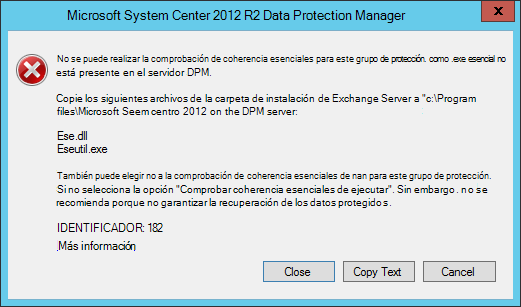
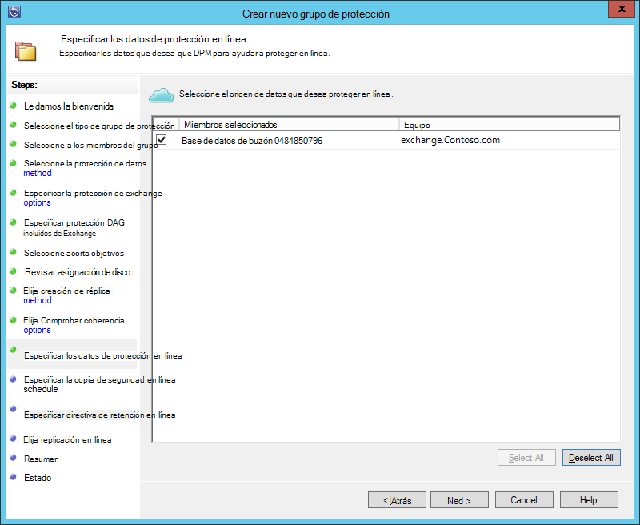
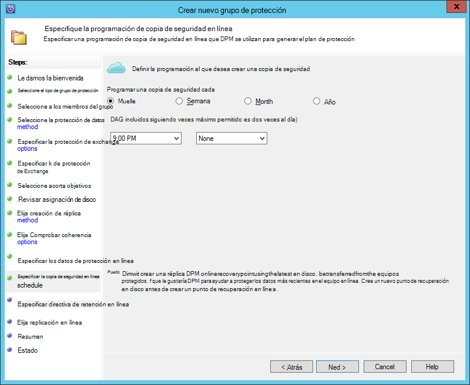
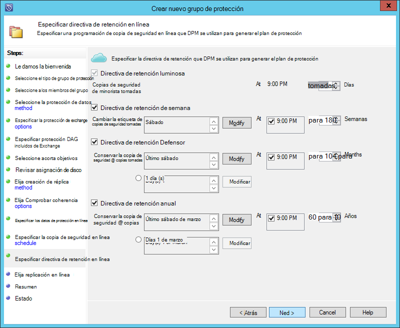

<properties
    pageTitle="Copia de seguridad de un servidor de Exchange para la copia de seguridad de Azure con System Center 2012 R2 DPM | Microsoft Azure"
    description="Obtenga información sobre cómo hacer una copia de un servidor de Exchange con System Center 2012 R2 DPM de copia de seguridad de Azure"
    services="backup"
    documentationCenter=""
    authors="MaanasSaran"
    manager="NKolli1"
    editor=""/>

<tags
    ms.service="backup"
    ms.workload="storage-backup-recovery"
    ms.tgt_pltfrm="na"
    ms.devlang="na"
    ms.topic="article"
    ms.date="08/15/2016"
    ms.author="anuragm;jimpark;delhan;trinadhk;markgal"/>

# Copia de seguridad de un servidor de Exchange en copia de seguridad de Azure con System Center 2012 R2 DPM
En este artículo se describe cómo configurar un servidor de System Center 2012 R2 Data Protection Manager (DPM) para realizar copias de seguridad un servidor de Microsoft Exchange para la copia de seguridad de Azure.  

## Actualizaciones
Para registrar correctamente el servidor DPM con copia de seguridad de Azure, debe instalar la actualización de rollup más reciente de System Center 2012 R2 DPM y la versión más reciente del agente de copia de seguridad de Azure. Obtener la última actualización de rollup desde el [Catálogo de Microsoft](http://catalog.update.microsoft.com/v7/site/Search.aspx?q=System%20Center%202012%20R2%20Data%20protection%20manager).

>[AZURE.NOTE] Para los ejemplos de este artículo, se instala la versión 2.0.8719.0 del agente de copia de seguridad de Azure y Update Rollup 6 está instalado en System Center 2012 R2 DPM.

## Requisitos previos
Antes de continuar, asegúrese de que se cumplen todas las los [requisitos previos](backup-azure-dpm-introduction.md#prerequisites) para el uso de copia de seguridad de Microsoft Azure proteger cargas de trabajo. Estos requisitos previos incluyen las siguientes:

- Se ha creado un depósito de copia de seguridad en el sitio de Azure.
- Credenciales de agente y depósito se hayan descargado en el servidor DPM.
- El agente está instalado en el servidor DPM.
- Las credenciales de la cámara se utilizaron para registrar el servidor DPM.
- Si va a proteger Exchange 2016, actualice a DPM 2012 R2 UR9 o posterior

## Agente de protección DPM  
Para instalar al agente de protección DPM en el servidor de Exchange, siga estos pasos:

1. Asegúrese de que los firewalls están configurados correctamente. Vea [configurar excepciones de firewall para el agente](https://technet.microsoft.com/library/Hh758204.aspx).

2. Instalar el agente en el servidor de Exchange, haga clic en **Administración > agentes > instalar** en la consola de administración de DPM. Para conocer los pasos detallados, vea [instalar al agente de protección DPM](https://technet.microsoft.com/library/hh758186.aspx?f=255&MSPPError=-2147217396) .

## Crear un grupo de protección para el servidor de Exchange

1. En la consola de administrador DPM, haga clic en **protección**y, a continuación, haga clic en **nuevo** en la cinta de opciones de la herramienta para abrir al asistente **Crear nuevo grupo de protección** .

2. En la pantalla de **bienvenida** del asistente, haga clic en **siguiente**.

3. En la pantalla **Seleccione el tipo de grupo de protección** , seleccione **servidores** y haga clic en **siguiente**.

4. Seleccione la base de datos del servidor de Exchange que desea proteger y haga clic en **siguiente**.

    >[AZURE.NOTE] Si va a proteger Exchange 2013, compruebe los [requisitos previos de Exchange 2013](https://technet.microsoft.com/library/dn751029.aspx).

    En el ejemplo siguiente, se selecciona la base de datos de Exchange 2010.

    

5. Seleccione el método de protección de datos.

    Nombre del grupo de protección y, a continuación, seleccione las dos siguientes opciones:

    - Deseo protección a corto plazo mediante disco.
    - Deseo protección en línea.

6. Haga clic en **siguiente**.

7. Seleccione la opción de **Ejecutar Eseutil para comprobar la integridad de datos** si desea comprobar la integridad de las bases de datos de Exchange Server.

    Después de seleccionar esta opción, se ejecutará en el servidor DPM para evitar el tráfico de i/OS que se genera al ejecutar el comando **eseutil** en el servidor de Exchange de comprobación de coherencia de copia de seguridad.

    >[AZURE.NOTE]Para usar esta opción, debe copiar los archivos Ese.dll y Eseutil.exe en el directorio C:\Program Files\Microsoft System Center 2012 R2\DPM\DPM\bin en el servidor DPM. En caso contrario, se activa el siguiente error:  
    

8. Haga clic en **siguiente**.

9. Seleccione la base de datos de **Copia de seguridad**y, a continuación, haga clic en **siguiente**.

    >[AZURE.NOTE] Si no selecciona "Copia de seguridad completa" para al menos una copia de DAG incluidos de una base de datos, no se truncará los registros.

10. Configurar los objetivos de **copia de seguridad a corto plazo**y, a continuación, haga clic en **siguiente**.

11. Revise el espacio en disco disponible y, a continuación, haga clic en **siguiente**.

12. Seleccione la hora a la que el servidor DPM crear la replicación inicial y, a continuación, haga clic en **siguiente**.

13. Seleccione las opciones de comprobación de la coherencia y, a continuación, haga clic en **siguiente**.

14. Elija la base de datos que desea hacer una copia de seguridad de Azure y, a continuación, haga clic en **siguiente**. Por ejemplo:

    

15. Definir la programación de **Copia de seguridad de Azure**y, a continuación, haga clic en **siguiente**. Por ejemplo:

    

    >[AZURE.NOTE] Tenga en cuenta los puntos de recuperación en línea se basan en express completa de puntos de recuperación. Por consiguiente, debe programar el punto de recuperación en línea después de la hora especificada para el completa rápida de punto de recuperación.

16. Configurar la directiva de retención para **Copia de seguridad de Azure**y, a continuación, haga clic en **siguiente**.

17. Elija una opción de replicación en línea y haga clic en **siguiente**.

    Si tiene una base de datos de gran tamaño, podría tardar mucho tiempo para la copia de seguridad inicial que se creen en la red. Para evitar este problema, puede crear una copia de seguridad sin conexión.  

    

18. Confirmar la configuración y, a continuación, haga clic en **Crear grupo**.

19. Haga clic en **Cerrar**.

## Recuperar la base de datos de Exchange

1. Para recuperar una base de datos de Exchange, haga clic en **recuperación** en la consola de administración de DPM.

2. Busque la base de datos de Exchange que desea recuperar.

3. Seleccione un punto de recuperación en línea de la lista desplegable de *tiempo de recuperación* .

4. Haga clic en **recuperar** para iniciar el **Asistente para la recuperación**.

Puntos de recuperación en línea, hay cinco tipos de recuperación:

- **Recuperar en ubicación original de Exchange Server:** Los datos se recuperarán en el servidor de Exchange original.
- **Recuperar en otra base de datos en un servidor de Exchange:** Los datos se recuperarán a otra base de datos en otro servidor de Exchange.
- **Recuperar una base de datos de recuperación:** Los datos se recuperarán a una base de datos de recuperación de Exchange (RDB).
- **Copia a una carpeta de red:** Los datos se recuperarán a una carpeta de red.
- **Copia en la cinta:** Si tiene una biblioteca de cintas o una unidad de cinta independiente conectado y configurado en el servidor DPM, el punto de recuperación se copiarán en una cinta.

    

## Pasos siguientes

- [P+F de copia de seguridad de Azure](backup-azure-backup-faq.md)
