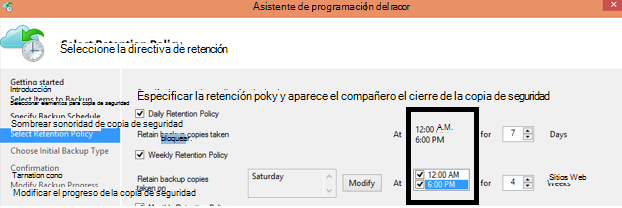

<properties
   pageTitle="P+F de copia de seguridad de Azure | Microsoft Azure"
   description="Respuestas a las preguntas más frecuentes sobre el servicio de copia de seguridad, agente de copia de seguridad, copia de seguridad y retención, recuperación, seguridad y otras preguntas comunes sobre la copia de seguridad y recuperación de desastres."
   services="backup"
   documentationCenter=""
   authors="markgalioto"
   manager="jwhit"
   editor=""
   keywords="copia de seguridad y recuperación de desastres; servicio de copia de seguridad"/>

<tags
   ms.service="backup"
   ms.workload="storage-backup-recovery"
     ms.tgt_pltfrm="na"
     ms.devlang="na"
     ms.topic="get-started-article"
     ms.date="10/21/2016"
     ms.author="trinadhk; giridham; arunak; markgal; jimpark;"/>

# <a name="azure-backup-service--faq"></a>P+F de servicio de copia de seguridad Azure


En este artículo es una lista de las preguntas más frecuentes (y las respuestas correspondientes) sobre el servicio de copia de seguridad de Azure. Nuestra comunidad respuestas rápidamente, y si una pregunta se solicita a menudo, se agregue a este artículo. Normalmente, las respuestas a preguntas proporcionan referencia o información de soporte técnico. Puede formular preguntas acerca de la copia de seguridad de Azure en la sección Disqus de este artículo o un artículo relacionado. También puede publicar preguntas sobre el servicio de copia de seguridad de Azure en el [foro de discusión](https://social.msdn.microsoft.com/forums/azure/home?forum=windowsazureonlinebackup).


## <a name="what-is-the-list-of-supported-operating-systems-from-which-i-can-back-up-to-azure-using-azure-backup-br"></a>¿Qué es la lista de sistemas operativos compatibles desde donde puedo hacer una copia en Azure mediante copia de seguridad de Azure? <br/>
Copia de seguridad de Azure es compatible con la siguiente lista de sistemas operativos para copia de seguridad de la carpeta de archivos, con el servidor de copia de seguridad de Azure y SCDPM de copia de seguridad de aplicación.

| Sistema operativo        | Plataforma           | SKU  |
| :------------- |-------------| :-----|
| Windows 8 y SPs más recientes      | 64 bits | Enterprise, Pro |
| Windows 7 y SPs más recientes      | 64 bits | Ultimate, Enterprise, Professional, Home Premium, Home Basic, Starter |
| Windows 8.1 y SPs más recientes | 64 bits      |    Enterprise, Pro |
| Windows 10      | 64 bits | Enterprise, Pro, Home |
|Windows Server 2012 R2 y SPs más recientes| 64 bits| Foundation estándar, centro de datos|
|Windows Server 2012 y SPs más recientes|    64 bits| Centro de datos, Foundation, estándar|
|Almacenamiento de Windows Server 2012 R2 y SPs más recientes  |64 bits|    Estándar, grupo de trabajo|
|Almacenamiento de Windows Server 2012 y SPs más recientes |64 bits |Estándar, grupo de trabajo
|Windows Server 2012 R2 y SPs más recientes  |64 bits|    Esenciales|
|Windows Server 2008 R2 SP1 |64 bits|    Estándar, empresa, centro de datos, Foundation|
|Windows Server 2008 SP2    |64 bits|    Estándar, empresa, centro de datos, Foundation|

Copia de seguridad de Azure VM

- **Linux**: copia de seguridad de Azure es compatible con [una lista de las distribuciones que están apoyo de Azure](../virtual-machines/virtual-machines-linux-endorsed-distros.md) excepto Core OS Linux.  Otras distribuciones Traer-su-propietario-Linux también podrían funcionan como el agente VM está disponible en la máquina virtual y la compatibilidad con Python existe.
- **Windows Server**: no se admiten las versiones anteriores a Windows Server 2008 R2.

## <a name="where-can-i-download-the-latest-azure-backup-agent-br"></a>¿Dónde puedo descargar el agente de copia de seguridad de Azure más reciente? <br/>
Puede descargar al agente más reciente de copia de seguridad de Windows Server, System Center DPM o cliente de Windows, desde [aquí](http://aka.ms/azurebackup_agent). Si desea hacer copia de seguridad una máquina virtual, utilice al agente de VM (que se instala automáticamente la extensión de nombre propio). El agente de VM ya está presente en máquinas virtuales creadas desde la Galería de Azure.

## <a name="which-version-of-scdpm-server-is-supported-br"></a>¿Se admite la versión de servidor SCDPM? <br/>
Le recomendamos que instale el agente de copia de seguridad de Azure [más reciente](http://aka.ms/azurebackup_agent) en la actualización de rollup más reciente de SCDPM (UR11 a partir de agosto de 2016)

## <a name="when-configuring-the-azure-backup-agent-i-am-prompted-to-enter-the-vault-credentials-do-vault-credentials-expire"></a>Al configurar al agente de copia de seguridad de Azure, se solicita que escriba las credenciales de la cámara. ¿Credenciales de depósito expiren?
Sí, las credenciales de depósito caducan después de 48 horas. Si el archivo caduca, inicie sesión en el portal de Azure y descargar los archivos de credenciales de depósito desde su cámara.

## <a name="is-there-any-limit-on-the-number-of-vaults-that-can-be-created-in-each-azure-subscription-br"></a>¿Hay algún límite en el número de depósitos que pueden crearse en cada suscripción Azure? <br/>
Sí. A partir de septiembre de 2016, puede crear 25 depósitos de copia de seguridad por suscripción. Puede crear hasta 25 depósitos de servicios de recuperación por cada región compatible de copia de seguridad de Azure por suscripción. Si necesita más depósitos, cree una nueva suscripción.

## <a name="are-there-any-limits-on-the-number-of-serversmachines-that-can-be-registered-against-each-vault-br"></a>¿Hay los límites del número de servidores o equipos que se pueden registrar con cada depósito? <br/>
Sí, puede registrar máquinas hasta 50 por depósito. Máquinas virtuales de Azure IaaS, el límite es 200 máquinas virtuales por depósito. Si necesita registrar más máquinas, cree un nuevo depósito.

## <a name="how-do-i-register-my-server-to-another-datacenterbr"></a>¿Cómo se puede registrar mi servidor al centro de datos de otra?<br/>
Datos de copia de seguridad se envían al centro de datos del depósito al que se registra. Cambiar el centro de datos de la manera más sencilla es desinstalar al agente y reinstalar al agente y registrar a un depósito nuevo que pertenece al centro de datos que desee.

## <a name="what-happens-if-i-rename-a-windows-server-that-is-backing-up-data-to-azurebr"></a>¿Qué ocurre si cambio el nombre de un servidor de Windows que es una copia de seguridad de datos en Azure?<br/>
Al cambiar el nombre de un servidor, se detienen todas las copias de seguridad configurados actualmente.
Debe registrar el nuevo nombre del servidor con la cámara de copia de seguridad. Cuando se crea un nuevo registro, la primera operación de copia de seguridad es una copia completa y no una copia de seguridad incremental. Si necesita recuperar los datos que se copiaron previamente en el depósito con el nombre de servidor anterior, puede recuperar datos con la opción de [**otro servidor**](backup-azure-restore-windows-server.md#recover-to-an-alternate-machine) en el Asistente para **Recuperar datos** .

## <a name="what-types-of-drives-can-i-backup-files-and-folders-from-br"></a>¿Qué tipos de unidades ¿hacer copia de seguridad de carpetas y archivos? <br/>
El siguiente conjunto de unidades o volúmenes no se puede obtener una copia de seguridad:

- Medios extraíbles: La unidad debe notificar como fija utiliza un origen de elemento de copia de seguridad.
- Volúmenes de sólo lectura: el volumen debe ser grabable al servicio de copia de sombra de volumen (VSS) para la función.
- Volúmenes sin conexión: El volumen debe ser en línea para VSS a función.
- Recurso compartido de red: el volumen debe ser local al servidor para realizar una copia mediante copia de seguridad en línea.
- BitLocker volúmenes protegidos: debe desbloquear el volumen antes de que comience la copia de seguridad.
- Identificación de sistema de archivo: NTFS es el único sistema de archivos compatible con esta versión del servicio de copia de seguridad en línea.

## <a name="what-file-and-folder-types-can-i-back-up-from-my-serverbr"></a>¿Qué tipos de archivos y carpetas ¿realizar copias de seguridad de mi servidor?<br/>
Se admiten los siguientes tipos:

- Cifrado
- Comprimido
- Disperso
- Comprimido + disperso
- Vínculos de disco duro: No compatibles, omite
- Punto de análisis: No compatibles, omite
- Cifrado + comprimido: No compatibles, omite
- Cifrado + disperso: No compatibles, omite
- Secuencia comprimida: No compatibles, omite
- Secuencia disperso: No compatibles, omite

## <a name="whats-the-minimum-size-requirement-for-the-cache-folder-br"></a>¿Qué es el requisito de tamaño mínimo de la carpeta de caché? <br/>
El tamaño de la carpeta de caché determina la cantidad de datos que se copia. La carpeta caché debería 5% sobre el espacio de almacenamiento de datos.

## <a name="if-my-organization-has-one-vault-how-can-i-isolate-one-servers-data-from-another-server-when-restoring-databr"></a>Si la organización tiene un depósito, ¿cómo puedo aislar los datos de un servidor de otro servidor cuando restaure datos?<br/>
Todos los servidores que están registrados para el mismo depósito pueden recuperar los datos de copia de seguridad por otros servidores *que usan la misma contraseña*. Si tiene servidores cuyos datos de copia de seguridad que desea aislar de otros servidores de su organización, use una frase de contraseña designado para los servidores. Por ejemplo, servidores de recursos humanos podrían usar una frase de contraseña de cifrado, accounting servidores otra y servidores de almacenamiento de un tercero.

## <a name="can-i-migrate-my-backup-data-or-vault-between-subscriptions-br"></a>¿Puedo "migrar" Mis datos de copia de seguridad o depósito entre suscripciones? <br/>
No. La cámara se crea en un nivel de suscripción y no se pueden reasignar a otra suscripción después de crearlo.

## <a name="does-the-azure-backup-agent-work-on-a-server-that-uses-windows-server-2012-deduplication-br"></a>¿Funciona el agente de copia de seguridad de Azure en un servidor que usa Windows Server 2012 desduplicación? <br/>
Sí. El servicio de agente convierte los datos desduplicados a datos normales cuando prepara la operación de copia de seguridad. A continuación, optimiza los datos de copia de seguridad, cifra los datos y, a continuación, envía los datos cifrados en el servicio de copia de seguridad en línea.

## <a name="if-i-cancel-a-backup-job-once-it-has-started-is-the-transferred-backup-data-deleted-br"></a>¿Si cancelo un trabajo de copia de seguridad una vez que se ha iniciado, se eliminan los datos de copia de seguridad transferidos? <br/>
No. La copia de seguridad depósito almacena los datos de copia de seguridad que habían sido transferidos hasta el momento de la cancelación. Copia de seguridad de Azure usa un mecanismo de comprobación en ocasiones agregar puntos de control a los datos de copia de seguridad durante la copia de seguridad. Porque hay puntos de control en los datos de copia de seguridad, el proceso de copia de seguridad siguiente puede validar la integridad de los archivos. La siguiente copia de seguridad activa sería incremental en los datos que habían copiados previamente. Una copia de seguridad incremental proporciona una mejor utilización del ancho de banda, por lo que no es necesario transferir los mismos datos varias veces.

En caso de copia de seguridad de Azure VM, una vez que el trabajo se cancela, se omiten datos transferidos y copia de seguridad actualizada transfiere datos incrementales de trabajo de copia de seguridad previamente correcta.

## <a name="why-am-i-seeing-the-warning-azure-backups-have-not-been-configured-for-this-server-even-though-i-had-scheduled-regular-backups-previously-br"></a>¿Por qué estoy viendo la advertencia "Copias de seguridad de Azure no se han configurado para este servidor" aunque había programado copias de seguridad periódicas previamente? <br/>
Esta advertencia se produce cuando la configuración de programación de copia de seguridad almacenada en el servidor local no es idéntica a la configuración almacenada en la caja fuerte de copia de seguridad. Cuando se han recuperado el servidor o la configuración de un buen estado conocido, las programaciones de copia de seguridad pueden perder la sincronización. Si recibe esta advertencia, [vuelva a configurar la directiva de copia de seguridad](backup-azure-manage-windows-server.md) y, a continuación, **Ejecutar copia de seguridad ahora** para volver a sincronizar el servidor local con Azure.

## <a name="what-firewall-rules-should-be-configured-for-azure-backup-br"></a>¿Qué firewall se deben configurar reglas para copia de seguridad de Azure? <br/>
Perfecta protección de datos en local-a Azure y carga de trabajo a Azure, se recomienda que permite el firewall para comunicarse con las direcciones URL siguientes:

- www.msftncsi.com
- \*. Microsoft.com
- \*. WindowsAzure.com
- \*. microsoftonline.com
- \*. windows.net

##<a name="can-i-install-the-azure-backup-agent-on-an-azure-vm-already-backed-by-the-azure-backup-service-using-the-vm-extension-br"></a>¿Puedo instalar al agente de copia de seguridad de Azure en una máquina virtual de Azure ya se copia en el servicio de copia de seguridad de Azure con la extensión VM? <br/>
Estrictamente. Copia de seguridad de Azure proporciona copia de seguridad de nivel de máquina virtual para máquinas virtuales de Azure con la extensión de máquina virtual. Puede instalar al agente de copia de seguridad de Azure en un sistema operativo Windows de invitado para proteger los archivos y carpetas en ese sistema operativo de invitado.

## <a name="can-i-install-the-azure-backup-agent-on-an-azure-vm-to-back-up-files-and-folders-present-on-temporary-storage-provided-by-the-azure-vm-br"></a>¿Puedo instalar al agente de copia de seguridad de Azure en una máquina virtual de Azure copia de seguridad de los archivos y carpetas que aparece en almacenamiento temporal proporcionada por la máquina virtual de Azure? <br/>
Puede instalar al agente de copia de seguridad de Azure en el sistema operativo Windows de invitado y copia de seguridad de los archivos y carpetas en almacenamiento temporal. Sin embargo, tenga en cuenta que las copias de seguridad no se realice correctamente cuando se borra los datos de almacenamiento temporal. Además, si los datos de almacenamiento temporal se ha eliminado, solo puede restaurar al almacenamiento volátiles.

## <a name="i-have-installed-azure-backup-agent-to-protect-my-files-and-folders-can-i-now-install-scdpm-to-work-with-azure-backup-agent-to-protect-on-premises-applicationvm-workloads-to-azure-br"></a>He instalado el agente de copia de seguridad de Azure para proteger los archivos y carpetas. ¿Instalar ahora SCDPM para trabajar con el agente de copia de seguridad de Azure proteger cargas de trabajo de aplicación/VM de local a Azure? <br/>
Para usar la copia de seguridad de Azure con SCDPM, se recomienda instalar SCDPM en primer lugar y luego solo para instalar al agente de copia de seguridad de Azure. Esto garantiza la integración perfecta con el agente de copia de seguridad de Azure con SCDPM y permite proteger archivos y carpetas, cargas de trabajo de aplicaciones y máquinas virtuales en Azure, directamente desde la consola de administración de SCDPM. Instalar SCDPM después de instalar la copia de seguridad de Azure agente fines mencionados no es aconsejable o compatible.

## <a name="what-is-the-length-of-file-path-that-can-be-specified-as-part-of-azure-backup-policy-using-azure-backup-agent-br"></a>¿Qué es la longitud de la ruta de acceso del archivo que se puede especificar como parte de la directiva de copia de seguridad de Azure con el agente de copia de seguridad de Azure? <br/>  
Agente de copia de seguridad de Azure se basa en NTFS. [Especificación de longitud de la ruta del archivo está limitado por la API de Windows](https://msdn.microsoft.com/library/aa365247.aspx#fully_qualified_vs._relative_paths). En el caso de una copia de seguridad de los archivos con la longitud de la ruta de acceso del archivo mayor que los especificados por la API de Windows, pueden elegir los clientes a la carpeta principal o la unidad de disco de archivos de copia de seguridad de la copia de seguridad.  

## <a name="what-characters-are-allowed-in-file-path-of-azure-backup-policy-using-azure-backup-agent-br"></a>¿Caracteres permitidos en la ruta de acceso del archivo de directiva de copia de seguridad de Azure con el agente de copia de seguridad de Azure? <br>  
 Agente de copia de seguridad de Azure se basa en NTFS. Le permite [NTFS admite caracteres](https://msdn.microsoft.com/library/aa365247.aspx#naming_conventions) como parte de la especificación de archivo.  

## <a name="can-i-use-azure-backup-server-to-create-a-bare-metal-recovery-bmr-backup-for-a-physical-server-br"></a>¿Puedo usar servidor de copia de seguridad de Azure para crear una copia de seguridad de recuperación de Metal descubierto (BMR) para un servidor físico? <br/>
Sí.

## <a name="can-i-configure-the-backup-service-to-send-mail-if-a-backup-job-fails-br"></a>¿Configurar el servicio de copia de seguridad para enviar correo si se produce un error en un trabajo de copia de seguridad? <br/>
Sí, el servicio de copia de seguridad tiene varias alertas basadas en eventos que se pueden usar con una secuencia de comandos de PowerShell. Para obtener una descripción completa, consulte [las notificaciones de alerta](backup-azure-manage-vms.md#alert-notifications)

## <a name="is-there-a-limit-on-the-size-of-each-data-source-being-backed-up-br"></a>¿Hay algún límite en el tamaño de cada origen de datos que se realizan copias de seguridad? <br/>
Mientras en el nivel de la cámara no hay ningún límite en la cantidad de datos que puede hacer copia de seguridad, copia de seguridad de Azure imponer una restricción (en la práctica, estos límites son muy altos) en tamaño máximo del origen de datos. A partir de agosto de 2015, es el origen de datos de tamaño máximo de los sistemas operativos compatibles:

|S.No | Sistema operativo |  Tamaño máximo del origen de datos |
| :-------------: |:-------------| :-----|
|1| Windows Server 2012 o posterior| 54400 GB|
|2| Windows 8 o posterior| 54400 GB|
|3| Windows Server 2008, Windows Server 2008 R2 | 1700 GB|
|4| Windows 7 | 1700 GB|

En la tabla siguiente se explica cómo se determina el tamaño de cada origen de datos.

|   Origen de datos  |   Detalles |
| :-------------: |:-------------|
|Volumen |La cantidad de datos que se realizan copias de seguridad de volumen único de un equipo servidor o cliente|
|Máquina virtual Hyper-V | Suma de los datos de los archivos VHD de la máquina virtual de copia de seguridad|
|Base de datos de Microsoft SQL Server | Tamaño de base de datos SQL única copia de seguridad de |
|Microsoft SharePoint |Suma de las bases de datos de contenido y de configuración en una granja de SharePoint que se realizan copias de seguridad|
|Microsoft Exchange |Suma de todas las bases de datos de Exchange en un servidor de Exchange que se realizan copias de seguridad|
|Estado de BMR/sistema |Cada copia individual de BMR o estado del sistema del equipo que se realizan copias de seguridad|

## <a name="are-there-limits-on-the-number-of-times-a-backup-job-can-be-scheduled-per-daybr"></a>¿Hay límites en el número de veces que se puede programar un trabajo de copia de seguridad al día?<br/>
Sí, puede ejecutar trabajos de copia de seguridad en Windows Server o cliente Windows hasta tres veces por día. Puede ejecutar trabajos de copia de seguridad de System Center DPM hasta dos veces al día. Puede ejecutar un trabajo de copia de seguridad para máquinas virtuales de IaaS una vez al día.

## <a name="is-there-a-difference-between-the-scheduling-policy-for-dpm-and-windows-server-ie-on-windows-server-without-dpm-br"></a>¿Existe una diferencia entre la directiva de programación de DPM y Windows Server (es decir, Windows Server sin DPM)? <br/>
Sí. Con DPM, puede especificar programaciones diarias, semanales, mensuales y anuales. Windows Server (sin DPM) le permite especificar solo las programaciones diarias y semanales.

## <a name="is-there-a-difference-between-the-retention-policy-for-dpm-and-windows-serverclient-ie-on-windows-server-without-dpmbr"></a>¿Existe una diferencia entre la directiva de retención de DPM y el servidor y el cliente de Windows (es decir, en Windows Server sin DPM)?<br/>
No, ambos DPM y cliente de Windows Server diariamente, tienen las directivas de retención semanales, mensuales y anuales.

## <a name="can-i-configure-my-retention-policies-selectively--ie-configure-weekly-and-daily-but-not-yearly-and-monthlybr"></a>¿Puedo configurar mi retención directivas, es decir, configurar de forma selectiva semanales diaria pero anualmente y no mensual?<br/>
Sí, la estructura de retención de copia de seguridad de Azure le permite tener completa flexibilidad para definir la directiva de retención según sus necesidades.

## <a name="can-i-schedule-a-backup-at-6pm-and-specify-retention-policies-at-a-different-timebr"></a>¿Puedo "programar una copia de seguridad" a 6 p.m. y especificar "directivas de retención" en otro momento?<br/>
No. Solo se pueden aplicar las directivas de retención en puntos de copia de seguridad. En la siguiente imagen, se especifica la directiva de retención para copias de seguridad realizadas en 12 am y pm 6. <br/>


<br/>

## <a name="is-an-incremental-copy-transferred-for-the-retention-policies-scheduled-br"></a>¿Se transfiere una copia incremental para las directivas de retención programadas? <br/>
No, se envía la copia incremental basándose en el tiempo que se mencionan en la página programación de copia de seguridad. Los puntos que se pueden retener se determinan en función de la directiva de retención.

## <a name="if-a-backup-is-retained-for-a-long-duration-does-it-take-more-time-to-recover-an-older-data-point-br"></a>¿Si se conserva una copia de seguridad durante un período de tiempo, se tarda más tiempo para recuperar un punto de datos anterior? <br/>
 No, el tiempo para recuperar el más antiguo o el punto de más reciente es el mismo. Cada punto de recuperación se comporta como un punto completo.

## <a name="if-each-recovery-point-is-like-a-full-point-does-it-impact-the-total-billable-backup-storagebr"></a>¿Si cada punto de recuperación es similar a un punto completo, afecta al almacenamiento total de copia de seguridad facturable?<br/>
Típico productos de punto de retención a largo plazo almacenan los datos de copia de seguridad como destino completa. Los puntos completos almacenamiento *ineficaz* , pero están más fácil y rápido para restaurar. Copias incrementales son almacenamiento *eficaz* pero requieren que restaurar una cadena de datos, lo que afecta el tiempo de recuperación. Arquitectura de almacenamiento de copia de seguridad de Azure le ofrece lo mejor de ambos ámbitos óptima almacenando datos para la restauración rápida y provocar los costos de almacenamiento baja. Este enfoque de almacenamiento de datos garantiza que el ancho de banda de entrada y salida se utiliza eficazmente. La cantidad de almacenamiento de datos y el tiempo necesario para recuperar los datos que se mantiene al mínimo. Obtenga más información sobre cómo guardar [copias de seguridad incrementales](https://azure.microsoft.com/blog/microsoft-azure-backup-save-on-long-term-storage/) son eficaces.

## <a name="is-there-a-limit-on-the-number-of-recovery-points-that-can-be-createdbr"></a>¿Hay un límite del número de puntos de recuperación que se pueden crear?<br/>
No. Hemos eliminamos los límites de puntos de recuperación. Puede crear tantos puntos de recuperación como se desee.

## <a name="why-is-the-amount-of-data-transferred-in-backup-not-equal-to-the-amount-of-data-i-backed-upbr"></a>¿Por qué se transfiere la cantidad de datos de copia de seguridad no es igual a la cantidad de datos que realizan copias de seguridad?<br/>
 Todos los datos que se copian desde el agente de copia de seguridad de Azure o SCDPM o servidor de copia de seguridad de Azure, se comprimen y se cifra antes de que se transfieren. Una vez que se aplica la compresión y el cifrado, los datos de la copia de seguridad depósito están 30-40% más pequeño.

## <a name="is-there-a-way-to-adjust-the-amount-of-bandwidth-used-by-the-backup-servicebr"></a>¿Hay alguna forma para ajustar el ancho de banda utilizada por el servicio de copia de seguridad?<br/>
 Sí, use la opción de **Cambiar las propiedades** en el agente de copia de seguridad para ajustar el ancho de banda. Ajustar la cantidad de ancho de banda y las horas cuando utilice dicho ancho de banda. Para obtener más información, vea [El límite de red](../backup-configure-vault.md#enable-network-throttling).

## <a name="my-internet-bandwidth-is-limited-for-the-amount-of-data-i-need-to-back-up-is-there-a-way-i-can-move-data-to-a-certain-location-with-a-large-network-pipe-and-push-that-data-into-azure-br"></a>El ancho de banda de internet es limitada cantidad de datos que tiene que hacer copia de seguridad. ¿Hay alguna forma puedo pasar datos a una determinada ubicación con una red grande de canalización y que los datos de inserción en Azure? <br/>
Puede copiar los datos en Azure a través del proceso de copia de seguridad en línea estándar o puede usar el servicio de importación o exportación de Azure para transferir datos blobs almacenamiento en Azure. No hay ningún maneras adicionales de obtener la fecha de copia de seguridad en el almacenamiento de Azure. Para obtener información sobre cómo usar el servicio de importación o exportación de Azure con copia de seguridad de Azure, consulte el artículo de [flujo de trabajo de copia de seguridad sin conexión](backup-azure-backup-import-export.md) .

## <a name="how-many-recoveries-can-i-perform-on-the-data-that-is-backed-up-to-azurebr"></a>¿Cuántos recuperación se pueden realizar en los datos que se copia en Azure?<br/>
No hay ningún límite del número de recuperación de copia de seguridad de Azure.

## <a name="do-i-have-to-pay-for-the-egress-traffic-from-azure-data-center-during-recoveriesbr"></a>¿Tengo que pagar por el tráfico de salida desde el centro de datos de Azure durante la recuperación?<br/>
 No. La recuperación es gratuitas y no se cargan para el tráfico de salida.

## <a name="is-the-data-sent-to-azure-encrypted-br"></a>¿Se envían los datos a Azure cifrado? <br/>
Sí. Se cifran los datos en el equipo de cliente/servidor/SCDPM local con AES256 y se envían datos a través de un vínculo HTTPS seguro.

## <a name="is-the-backup-data-on-azure-encrypted-as-wellbr"></a>¿Son los datos de copia de seguridad en Azure cifrado también?<br/>
 Sí. Los datos enviados en Azure permanecen cifrados (al resto). Microsoft descifrar los datos de copia de seguridad en cualquier momento. Copia de seguridad de Azure VM de copia de seguridad de Azure se basa en el cifrado de la máquina virtual, es decir, si la máquina virtual está cifrada con cifrado de disco de Azure o alguna otra tecnología de cifrado, copia de seguridad de Azure usa cifrado para proteger los datos.

## <a name="what-is-the-minimum-length-of-encryption-key-used-to-encrypt-backup-data-br"></a>¿Qué es la longitud mínima de clave de cifrado utilizada para cifrar los datos de copia de seguridad? <br/>
 La clave de cifrado debe tener al menos 16 caracteres.

## <a name="what-happens-if-i-misplace-the-encryption-key-can-i-recover-the-data-or-can-microsoft-recover-the-data-br"></a>¿Qué ocurre si pierde la clave de cifrado? ¿Puedo recuperar los datos (o) puede Microsoft recuperar los datos? <br/>
La clave utilizada para cifrar los datos de copia de seguridad está presente únicamente en las instalaciones del cliente. Microsoft no mantener una copia en Azure y no tiene acceso a la clave. Si el cliente coloca incorrectamente la clave, Microsoft no puede recuperar los datos de copia de seguridad.

## <a name="how-do-i-change-the-cache-location-specified-for-the-azure-backup-agentbr"></a>¿Cómo puedo cambiar la ubicación de caché especificada para el agente de copia de seguridad de Azure?<br/>
 Vaya secuencialmente a través de la lista con viñetas para cambiar la ubicación en caché.
- Detenga el motor de copia de seguridad, ejecute el comando siguiente en un símbolo del sistema con privilegios elevados:

  ```PS C:\> Net stop obengine```

- No mover los archivos. En su lugar, copie la carpeta de caché de espacio en una unidad diferente con suficiente espacio. Después de confirmar que las copias de seguridad están trabajando con el nuevo espacio de caché, se puede quitar el espacio de caché original.

- Actualice las siguientes entradas de registro con la ruta de acceso a la nueva carpeta de espacio de la memoria caché.<br/>

|Ruta de acceso del registro | Clave del registro | Valor |
| ------ | ------- | ------|
| `HKEY_LOCAL_MACHINE\SOFTWARE\Microsoft\Windows Azure Backup\Config` | ScratchLocation | *Nueva ubicación de carpeta de caché* |
| `HKEY_LOCAL_MACHINE\SOFTWARE\Microsoft\Windows Azure Backup\Config\CloudBackupProvider` | ScratchLocation | *Nueva ubicación de carpeta de caché* |

- Reinicie el motor de copia de seguridad, ejecute el comando siguiente en un símbolo del sistema con privilegios elevados:

  ```PS C:\> Net start obengine```

  Una vez que la creación de una copia de seguridad se ha completado correctamente en la nueva ubicación de caché, puede quitar la carpeta caché original.

## <a name="where-can-i-put-the-cache-folder-for-the-azure-backup-agent-to-work-as-expectedbr"></a>¿Dónde se puede colocar la carpeta de caché para el agente de copia de seguridad de Azure funcione como se esperaba?<br/>
No se recomiendan las siguientes ubicaciones de la carpeta de caché:

- Compartir o medio extraíble de red: la carpeta de caché debe ser local en el servidor que debe realizar copias de seguridad mediante copia de seguridad en línea. Ubicaciones de red o medios extraíbles, como unidades USB no son compatibles.
- Volúmenes sin conexión: La carpeta de caché debe estar conectada para esperado copia de seguridad con el agente de copia de seguridad de Azure.

## <a name="are-there-any-attributes-of-the-cache-folder-that-are-not-supportedbr"></a>¿Hay todos los atributos de la carpeta de caché que no son compatibles?<br/>
 No se admiten los siguientes atributos o sus combinaciones de la carpeta de caché:

- Cifrado
- Anule la duplicado
- Comprimido
- Disperso
- Punto de análisis

Se recomienda que la carpeta de caché ni los metadatos de disco duro virtual tiene los atributos encima para que funcionen el agente de copia de seguridad de Azure esperado.
