<properties
   pageTitle="Copia de seguridad de Azure: copia de seguridad sin conexión o inicialización inicial mediante el servicio de importación o exportación de Azure | Microsoft Azure"
   description="Obtenga información sobre cómo copia de seguridad de Azure le permite enviar datos fuera de la red mediante el servicio de importación o exportación de Azure. En este artículo se explica la inicialización sin conexión de los datos de copia de seguridad iniciales mediante el servicio de Azure importar exportar."
   services="backup"
   documentationCenter=""
   authors="saurabhsensharma"
   manager="shivamg"
   editor=""/>
<tags
   ms.service="backup"
   ms.devlang="na"
   ms.topic="article"
   ms.tgt_pltfrm="na"
   ms.workload="storage-backup-recovery"
   ms.date="08/16/2016"
   ms.author="jimpark;saurabhsensharma;nkolli;trinadhk"/>

# Flujo de trabajo de copia de seguridad sin conexión de copia de seguridad de Azure
Copia de seguridad de Azure tiene varias eficacia integrada que ahorrar costos de red y almacenamiento durante las copias de seguridad completas iniciales de datos de Azure. Copias de seguridad completas iniciales normalmente transferir grandes cantidades de datos y requieren más ancho de banda de red cuando se comparan con copias de seguridad posteriores que transferir solo los diferencias/incrementales. Copia de seguridad de Azure comprime las copias de seguridad iniciales. El proceso de inicio sin conexión, copia de seguridad de Azure puede utilizar discos para cargar los comprimido iniciales datos de copia sin conexión en Azure.  

El proceso de inicio de conexión de copia de seguridad de Azure está estrechamente integrado con el [servicio de importación o exportación de Azure](../storage/storage-import-export-service.md) que permite transferir datos a Azure mediante los discos. Si tiene terabytes (TB) de datos de copia de seguridad iniciales que debe transferir a través de una red de latencia de alto y ancho de banda bajo, puede usar el flujo de trabajo sin conexión inicialización para enviar la copia de seguridad inicial de una o más unidades de disco duro a un centro de datos de Azure. Este artículo proporciona una descripción general de los pasos que completar este flujo de trabajo.

## Información general

Con la capacidad de inicio de conexión de copia de seguridad de Azure y Azure importar o exportar, es sencillo cargar los datos sin conexión en Azure mediante los discos. En lugar de transferir la copia completa inicial a través de la red, los datos de copia de seguridad se escriben en una *ubicación de ensayo*. Una vez completada la copia a la ubicación de ensayo mediante la herramienta de importación o exportación de Azure, estos datos se escriben en una o más unidades SATA, dependiendo de la cantidad de datos. Finalmente, estas unidades se envían al centro de datos de Azure más cercano.

La [actualización de 2016 de agosto de copia de seguridad de Azure (y posteriores)](http://go.microsoft.com/fwlink/?LinkID=229525) incluye la *herramienta de preparación de disco de Azure*, denominado AzureOfflineBackupDiskPrep, que:

   - Le ayuda a preparar las unidades para la importación de Azure mediante la herramienta de Azure importar o exportar.
   - Crea automáticamente un trabajo de importación de Azure para el servicio de importación o exportación de Azure en el [portal de clásico de Azure](https://manage.windowsazure.com) en lugar de crear la misma manualmente con versiones anteriores de copia de seguridad de Azure.

Una vez finalizada la carga los datos de copia de seguridad a Azure, copia de seguridad de Azure copia los datos de copia de seguridad en el depósito de copia de seguridad y se programan copias de seguridad incrementales.

  > [AZURE.NOTE] Para usar la herramienta de preparación de disco de Azure, asegúrese de que ha instalado la actualización de 2016 de agosto de copia de seguridad de Azure (o posterior) y realice todos los pasos del flujo de trabajo con él. Si está utilizando una versión anterior de copia de seguridad de Azure, puede preparar la unidad SATA mediante la herramienta de importación o exportación de Azure tal como se describe en las secciones posteriores de este artículo.

## Requisitos previos

- [Familiarizarse con el flujo de trabajo de Azure importar o exportar](../storage/storage-import-export-service.md).
- Antes de iniciar el flujo de trabajo, compruebe lo siguiente:
    - Se ha creado un depósito de copia de seguridad de Azure.
    - Se han descargado las credenciales de la cámara.
    - Se ha instalado el agente de copia de seguridad de Azure en Windows Server o Windows cliente o servidor de administrador de protección de datos de System Center y el equipo está registrado con la cámara de copia de seguridad de Azure.
- [Descargar la configuración de archivo de publicación de Azure](https://manage.windowsazure.com/publishsettings) en el equipo desde el que tiene previsto realizar copias de seguridad de sus datos.
- Preparar una ubicación provisional, que podría ser un recurso compartido de red o unidad adicional en el equipo. La ubicación de ensayo es almacenamiento transitoria y se usa temporalmente durante este flujo de trabajo. Asegúrese de que la ubicación de ensayo tiene suficiente espacio en disco para mantener la copia inicial. Por ejemplo, si está intentando realizar copias de seguridad de un servidor de archivos de 500 GB, asegúrese de que el área de ensayo es al menos 500 GB. (Un importe menor se usa debido a la compresión).
- Asegúrese de que está usando una unidad compatible. Unidades de disco duro SATA II/III 3,5 solo son compatibles para su uso con el servicio de importación o exportación. Unidades de disco duro mayores de 8 TB no son compatibles. Puede adjuntar un disco SATA II/III externamente a la mayoría de los equipos mediante un adaptador SATA II/III USB. Consulte la documentación de importación o exportación de Azure para el último conjunto de unidades que admite el servicio.
- Habilitar BitLocker en el equipo donde está conectado el escritor de unidad SATA.
- [Descargue la herramienta de importación o exportación de Azure](http://go.microsoft.com/fwlink/?LinkID=301900&clcid=0x409) en el equipo para que la SATA unidad escritor está conectado. Este paso no es necesario si haya descargado e instalado la actualización de 2016 de agosto de copia de seguridad de Azure (o posterior).

## Flujo de trabajo
La información de esta sección le ayuda a completar el flujo de trabajo de copia de seguridad sin conexión para que los datos se puedan entregar a un centro de datos de Azure y cargar en el almacenamiento de Azure. Si tiene preguntas sobre el servicio de importación o cualquier aspecto del proceso, consulte la documentación de [información general sobre el servicio de importación](../storage/storage-import-export-service.md) hace referencia a una versión anterior.

### Iniciar copia de seguridad sin conexión

1. Cuando programe una copia de seguridad, vea la pantalla siguiente (en Windows Server, el cliente de Windows o el Administrador de protección de datos de System Center).

    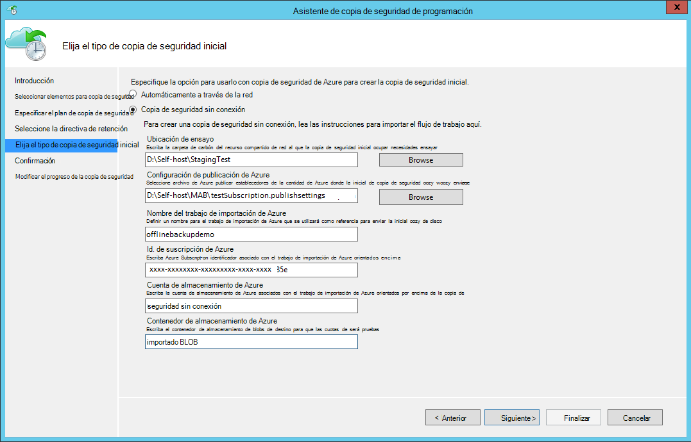

    Aquí es la pantalla correspondiente de System Center Data Protection Manager:  
    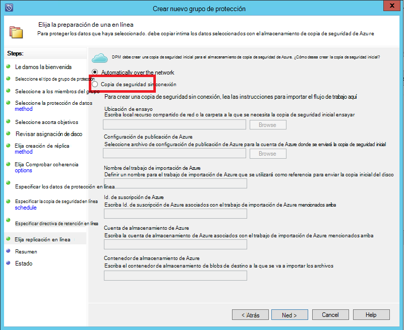

    La descripción de las entradas es la siguiente:

    - **Ubicación de ensayo**: la ubicación de almacenamiento temporal que se escribe la copia de seguridad inicial. Esto puede estar en un recurso compartido de red o un equipo local. Si el equipo de copia y origen son diferentes, se recomienda que especifique la ruta de acceso de red completa de la ubicación de ensayo.
    - **Nombre del trabajo de importación de Azure**: el nombre único por qué importar Azure servicio y copia de seguridad de Azure realizar un seguimiento de la transferencia de los datos enviados en discos en Azure.
    - **Configuración de publicación de Azure**: archivo XML que contiene información sobre el perfil de suscripción. También contiene credenciales seguras que están asociadas a su suscripción. Puede [descargar el archivo](https://manage.windowsazure.com/publishsettings). Proporcione la ruta de acceso local para el archivo de configuración de publicación.
    - **Id. de suscripción de Azure**: Azure el identificador de suscripción para la suscripción donde va a iniciar el trabajo de importación de Azure. Si tiene varias suscripciones de Azure, use el identificador de la suscripción que desea asociar con el trabajo de importación.
    - **Cuenta de almacenamiento de Azure**: la cuenta de almacenamiento de tipo clásico en la suscripción de Azure proporcionada que se asociará con el trabajo de importación de Azure.
    - **Contenedor de almacenamiento de Azure**: el nombre del objeto binario de almacenamiento de destino en la cuenta de almacenamiento de Azure donde se importan los datos de la tarea.

    > [AZURE.NOTE] Si ha registrado el servidor desde el [portal de Azure](https://portal.azure.com) a un depósito de servicios de recuperación de Azure para las copias de seguridad y no están en una suscripción de proveedor de soluciones de nube (CSP), puede crear una cuenta de almacenamiento de tipo clásico desde el portal de Azure y usarla para el flujo de trabajo de copia de seguridad sin conexión.

    Guardar toda esta información porque tiene que vuelva a escribir en los siguientes pasos. Solo la *ubicación de ensayo* es necesario si utiliza la herramienta de preparación de disco de Azure para preparar los discos.    

2. Completar el flujo de trabajo y, a continuación, seleccione **Copia de seguridad ahora** en la consola de administración de copia de seguridad de Azure para iniciar la copia sin conexión. La copia de seguridad inicial se escribe en el área de ensayo como parte de este paso.

    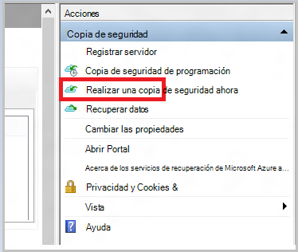

    Para completar el flujo de trabajo correspondiente de System Center Data Protection Manager, haga clic en el **Grupo de protección**y, a continuación, elija la opción **Crear punto de recuperación** . A continuación, elija la opción de **Protección en línea** .

    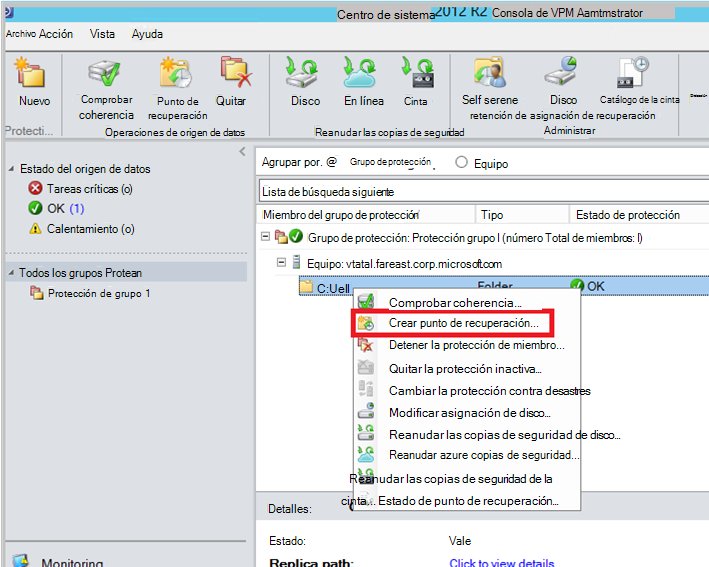

    Una vez finalizada la operación, la ubicación de ensayo está lista para usarse para la preparación del disco.

    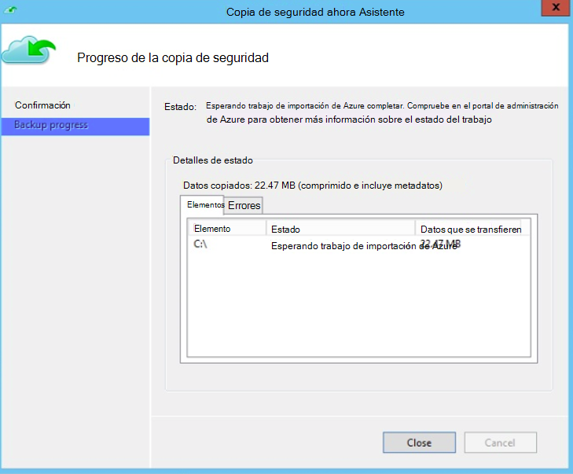

### Preparar una unidad SATA y crear un trabajo de importación de Azure mediante la herramienta de preparación de disco de Azure
La herramienta de preparación de disco de Azure está disponible en el directorio de instalación de agente de servicios de recuperación (actualización de agosto de 2016 y versiones posteriores) en la siguiente ruta.

   *\Microsoft* *Azure* *Recuperación* *Servicios* * Agent\Utils\*

1. Vaya al directorio y copie el directorio de **AzureOfflineBackupDiskPrep** en un equipo de copia en el cual se instala las unidades a estar preparado. Asegúrese de lo siguiente en relación con el equipo de copia:

      - El equipo de copia puede tener acceso a la ubicación del flujo de trabajo sin conexión inicialización provisional usando la misma ruta de red que se proporcionó en el flujo de trabajo **Iniciar copia de seguridad sin conexión** .

      - BitLocker está habilitado en el equipo.

      - El equipo puede acceder al portal de Azure.

      Si es necesario, el equipo de copia puede ser el mismo que el equipo de origen.

2. Abra un símbolo del sistema con privilegios elevados en el equipo de copia con el directorio de la herramienta de preparación de disco de Azure como el directorio actual y ejecute el siguiente comando:

      *.\AzureOfflineBackupDiskPrep.exe* s: <*Ruta de acceso de ubicación de ensayo*> [p: <*ruta de acceso a PublishSettingsFile*>]

| Parámetro | Descripción
|-------------|-------------|
|s: <*Ruta de acceso de ubicación de ensayo*> | Entrada obligatoria que se utiliza para proporcionar la ruta de acceso a la ubicación de ensayo que escribió en el flujo de trabajo **Iniciar copia de seguridad sin conexión** . |
|p: <*ruta de acceso a PublishSettingsFile*> | Entrada opcional que se utiliza para proporcionar la ruta de acceso al archivo de **Configuración de publicación de Azure** que escribió en el flujo de trabajo **Iniciar copia de seguridad sin conexión** . |

> [AZURE.NOTE] La &lt;ruta de acceso a PublishSettingFile&gt; valor es obligatorio cuando el equipo de copia y origen son diferentes.

Cuando se ejecuta el comando, la herramienta solicita la selección de la tarea de importación de Azure que corresponde a las unidades que deben estar preparado. Si solo un trabajo de importación solo está asociado a la ubicación de ensayo proporcionada, verá una pantalla como el que sigue.

   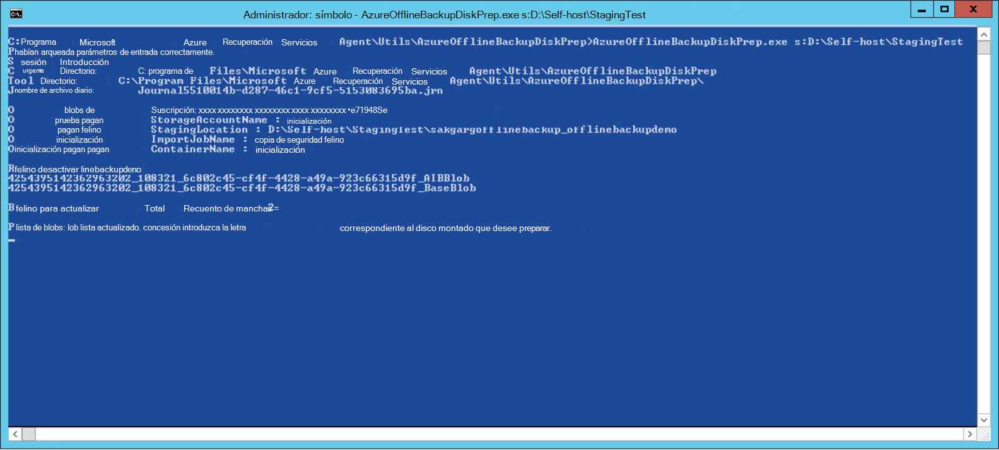  
3. Escriba la letra sin los dos puntos finales para el disco montado que desee preparar para la transferencia de Azure. Proporcionar una confirmación por el formato de la unidad cuando se le solicite.

A continuación, comienza la herramienta preparar el disco con los datos de copia de seguridad. Debe adjuntar discos adicionales cuando se le solicite la herramienta en caso de que el disco proporcionado no tiene suficiente espacio para los datos de copia de seguridad.  

Al final de la ejecución correcta de la herramienta de uno o más discos que facilitó están preparados para envío a Azure. Además, se crea un trabajo de importación con el nombre proporcionado durante el flujo de trabajo **Iniciar copia de seguridad sin conexión** en el portal de clásico de Azure. Por último, la herramienta muestra la dirección de envío al centro de datos Azure donde es necesario enviar los discos y el vínculo para localizar el trabajo de importación en el portal de clásico de Azure.

    
4. Enviar los discos a la dirección que proporcionan la herramienta y mantener el número de seguimiento para referencia futura. 
5. Cuando ve el vínculo que muestra la herramienta, verá la cuenta de almacenamiento de Azure que especificó en el flujo de trabajo **Iniciar copia de seguridad sin conexión** . Aquí puede ver el trabajo de importación recién creado en la pestaña de **Importación o exportación** de la cuenta de almacenamiento.

   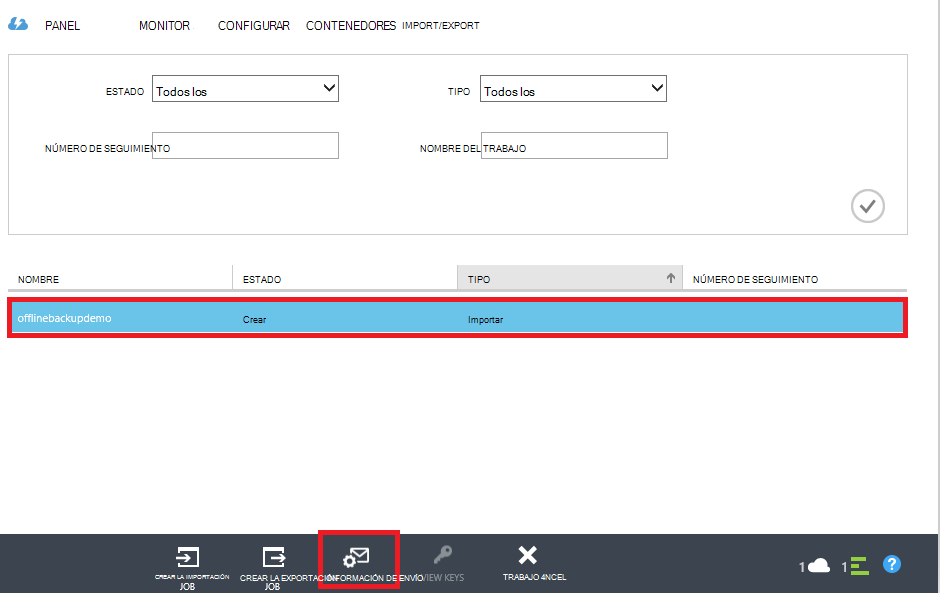 
6. Haga clic en **Información de envío** en la parte inferior de la página para actualizar su información de contacto, tal como se muestra en la pantalla siguiente. Microsoft usa esta información para enviar su discos una vez finalizado el trabajo de importación.

   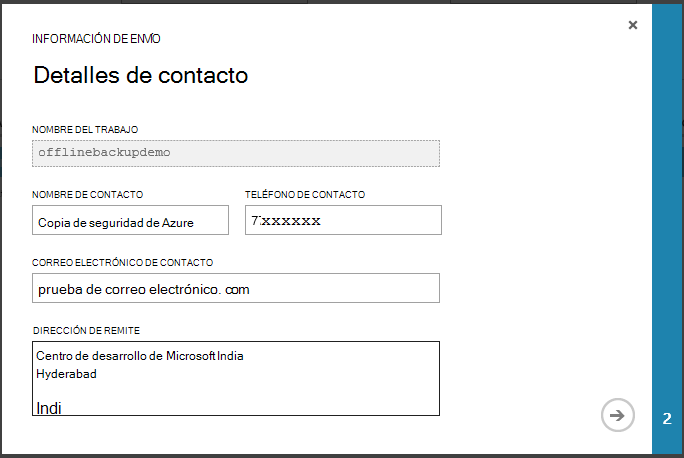 
7. Escriba los detalles de envío en la pantalla siguiente. Proporcionar los detalles de **Transportista de entrega** y **Número de seguimiento** que se corresponden con los discos que se incluye en el centro de datos de Azure.

   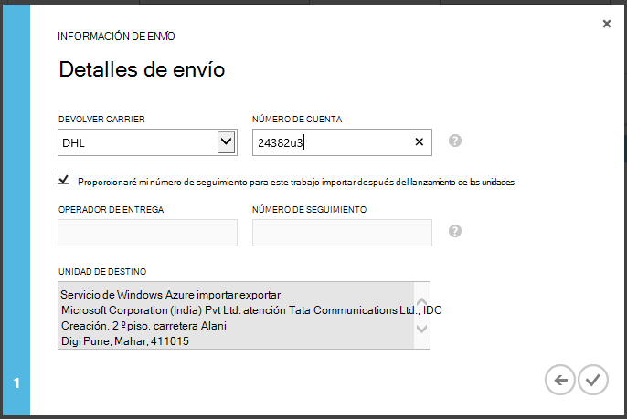 

### Completar el flujo de trabajo
Una vez finalizado el trabajo de importación, los datos de copia de seguridad iniciales están disponibles en su cuenta de almacenamiento. A continuación, el agente de servicios de recuperación copia el contenido de los datos desde esta cuenta a la cámara de copia de seguridad o servicios de recuperación de depósito, lo que sea aplicable. En la próxima vez una copia de seguridad programada, el agente de copia de seguridad de Azure realiza la copia de seguridad incremental en la copia de seguridad inicial.

> [AZURE.NOTE] Las secciones siguientes se aplican a los usuarios de versiones anteriores de copia de seguridad de Azure que no tengan acceso a la herramienta de preparación de disco de Azure.

### Preparar una unidad SATA

1. Descargue la [Herramienta de importación o exportación de Microsoft Azure](http://go.microsoft.com/fwlink/?linkid=301900&clcid=0x409) en el equipo de copia. Asegúrese de que la ubicación de ensayo es accesible desde el equipo en el que desea ejecutar el siguiente conjunto de comandos. Si es necesario, el equipo de copia puede ser el mismo que el equipo de origen.

2. Descomprima el archivo WAImportExport.zip. Ejecutar la herramienta WAImportExport que da formato a la unidad SATA, escribe los datos de copia de seguridad en la unidad SATA y cifra. Antes de ejecutar el comando siguiente, asegúrese de que BitLocker está habilitado en el equipo.  

    *.\WAImportExport.exe PrepImport /j: <* JournalFile*> .jrn /id: <*ID*> /sk: <*StorageAccountKey*> /BlobType:**PageBlob* * /t: <*TargetDriveLetter*>, dar formato y cifrar /srcdir: <*ubicación provisional*> /dstdir: <*DestinationBlobVirtualDirectory*>/*

    > [AZURE.NOTE] Si ha instalado la actualización de 2016 de agosto de copia de seguridad de Azure (o posterior), asegúrese de que la ubicación de ensayo que ha introducido es el mismo que en la pantalla de **Copia de seguridad ahora** y contiene los archivos AIB y Blob Base.

| Parámetro | Descripción
|-------------|-------------|
| /j: <*JournalFile*>| La ruta de acceso del archivo de diario. Cada unidad debe tener exactamente un archivo de diario. El archivo de diario no debe estar en la unidad de destino. La extensión de archivo de diario .jrn y se crea como parte de la ejecución de este comando.|
|/Id: <*ID*> | El identificador de sesión identifica una sesión de copia. Se usa para garantizar la recuperación precisa de una sesión de copia interrumpida. Archivos que se copian en una sesión de copia se almacenan en un directorio denominado después el identificador de sesión en la unidad de destino.|
| /SK: <*StorageAccountKey*> | Clave de cuenta para la cuenta de almacenamiento a la que se importan los datos. La clave debe ser los mismos que se especificó durante la creación de grupos de copia de seguridad y protección de la directiva.|
| / BlobType | El tipo de blob. Este flujo de trabajo se realiza correctamente solo si se especifica **PageBlob** . Esto no es la opción predeterminada y debería ser mencionado en este comando. |
|/ t: <*TargetDriveLetter*> | La letra de unidad sin los dos puntos finales de la unidad de disco duro de destino de la sesión de copia actual.|
|/ Format | La opción para formatear la unidad. Especifique este parámetro cuando la unidad debe tener el formato; en caso contrario, la omite. Antes de que la herramienta da formato a la unidad, pide confirmación de la consola. Para suprimir la confirmación, especifique el parámetro /silentmode.|
|/ cifrar | La opción para cifrar la unidad. Especificar este parámetro cuando la unidad aún no se ha cifrado con BitLocker y necesita la herramienta de cifrado. Si la unidad ya se ha cifrado con BitLocker, omita este parámetro, especifique el parámetro /bk y proporcione la clave de BitLocker existente. Si especifica el parámetro/Format, también debe especificar el / cifrar el parámetro. |
|/srcdir: <*SourceDirectory*> | El directorio de origen que contiene los archivos que se copiarán a la unidad de destino. Asegúrese de que el nombre del directorio especificado tiene una ruta de acceso completa en lugar de relativa.|
|/dstdir: <*DestinationBlobVirtualDirectory*> | La ruta de acceso del directorio virtual de destino en su cuenta de almacenamiento de Azure. Asegúrese de usar nombres de contenedor válido al especificar que los directorios virtuales de destino o BLOB. Tenga en cuenta que los nombres de contenedor deben ser minúsculas.  Este nombre de contenedor debe ser el que ha introducido durante la creación de grupos de copia de seguridad y protección de la directiva.|

  > [AZURE.NOTE] En la carpeta WAImportExport que capture la información completa del flujo de trabajo, se crea un archivo de diario. Necesita este archivo cuando se crea un trabajo de importación en el portal de Azure.

  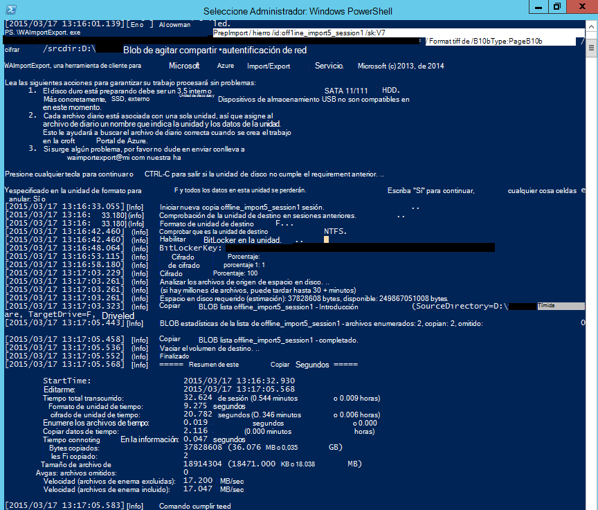

### Crear un trabajo de importación en el portal de Azure
1. Vaya a su cuenta de almacenamiento en el [portal de clásica Azure](https://manage.windowsazure.com/), haga clic en **Importar o exportar**y, a continuación, **Crear el trabajo de importación** , en el panel de tareas.

    

2. En el paso 1 del asistente, indique que ha preparado la unidad de disco y de que tiene el archivo de diario de unidad disponible.
3. En el paso 2 del asistente, proporcione la información de contacto de la persona que es el responsable de trabajo de importación.
4. En el paso 3, cargue los archivos de diario de unidad que obtuvo en la sección anterior.
5. En el paso 4, escriba un nombre descriptivo para el trabajo de importación que ha introducido durante la creación de grupos de copia de seguridad y protección de la directiva. El nombre que especifique puede contener sólo letras minúsculas, números, guiones y caracteres de subrayado, debe comenzar con una letra y no pueden contener espacios. El nombre que elija se usa para realizar un seguimiento de los trabajos mientras se encuentran en curso y después de que se han completado.
6. A continuación, seleccione su región centro de datos de la lista. El centro de datos de la región indica el centro de datos y la dirección a la que debe enviar el paquete.

    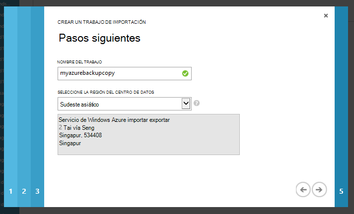

7. En el paso 5, seleccione el transportista retorno de la lista y escriba su número de cuenta de transportista. Microsoft usa esta cuenta para enviar su unidades después de completa el trabajo de importación.

8. Enviar el disco y escriba el número de seguimiento para realizar un seguimiento del estado de envío. Cuando llega el disco en el centro de datos, se copia en la cuenta de almacenamiento y el estado se actualiza.

    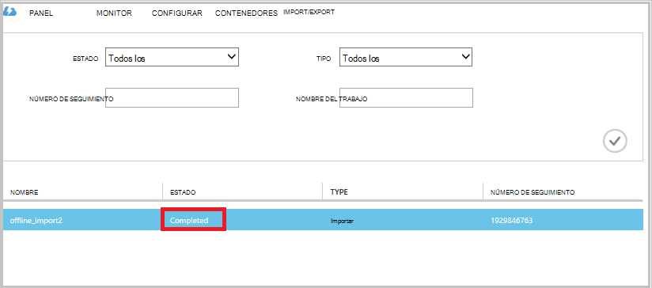

### Completar el flujo de trabajo
Después de que los datos de copia de seguridad iniciales están disponibles en su cuenta de almacenamiento, el agente de servicios de recuperación de Microsoft Azure copia el contenido de los datos desde esta cuenta en depósito de copia de seguridad o depósito de servicios de recuperación, según corresponda. En la próxima vez de copia de seguridad de programación, el agente de copia de seguridad de Azure realiza la copia de seguridad incremental en la copia de seguridad inicial.

## Pasos siguientes
- Si tiene alguna pregunta en el flujo de trabajo de importación o exportación de Azure, consulte [usar el servicio de importación o exportación de Microsoft Azure para transferir datos al almacenamiento de blobs de Windows](../storage/storage-import-export-service.md).
- Consulte la sección de copia de seguridad sin conexión de la copia de seguridad de Azure [preguntas más frecuentes](backup-azure-backup-faq.md) para las preguntas sobre el flujo de trabajo.
