<properties
    pageTitle="Copia de seguridad de Azure para cargas de trabajo de SQL Server mediante DPM | Microsoft Azure"
    description="Introducción a la copia de seguridad de las bases de datos de SQL Server usando el servicio de copia de seguridad de Azure"
    services="backup"
    documentationCenter=""
    authors="adigan"
    manager="Nkolli1"
    editor=""/>

<tags
    ms.service="backup"
    ms.workload="storage-backup-recovery"
    ms.tgt_pltfrm="na"
    ms.devlang="na"
    ms.topic="article"
    ms.date="09/27/2016"
    ms.author="adigan;giridham; jimpark;markgal;trinadhk"/>

# Copia de seguridad de Azure para cargas de trabajo de SQL Server mediante DPM

En este artículo le guía a través de los pasos de configuración de copia de seguridad de bases de datos de SQL Server con copia de seguridad de Azure.

Para la copia de seguridad de las bases de datos de SQL Server en Azure, necesita una cuenta de Azure. Si no tiene una cuenta, puede crear una cuenta de prueba gratuita de par simplemente de minutos. Para obtener información detallada, vea [Prueba gratuita de Azure](https://azure.microsoft.com/pricing/free-trial/).

La administración de copia de seguridad de base de datos de SQL Server para la recuperación de Azure y Azure implica tres pasos:

1. Crear una directiva de copia de seguridad para proteger bases de datos de SQL Server en Azure.
2. Crear copias de seguridad a petición en Azure.
3. Recuperar la base de datos de Azure.

## Antes de empezar
Antes de empezar, asegúrese de que se cumplen todas las los [requisitos previos](../backup-azure-dpm-introduction.md#prerequisites) para el uso de copia de seguridad de Microsoft Azure proteger cargas de trabajo. Los requisitos previos tratan tareas como: crear un depósito de copia de seguridad, descargando credenciales de cámara, instalar el agente de copia de seguridad de Azure y registro del servidor con la cámara.

## Crear una directiva de copia de seguridad para proteger bases de datos de SQL Server en Azure

1. En el servidor DPM, haga clic en el área de trabajo de **protección** .

2. En la cinta de opciones de herramientas, haga clic en **nuevo** para crear un nuevo grupo de protección.

    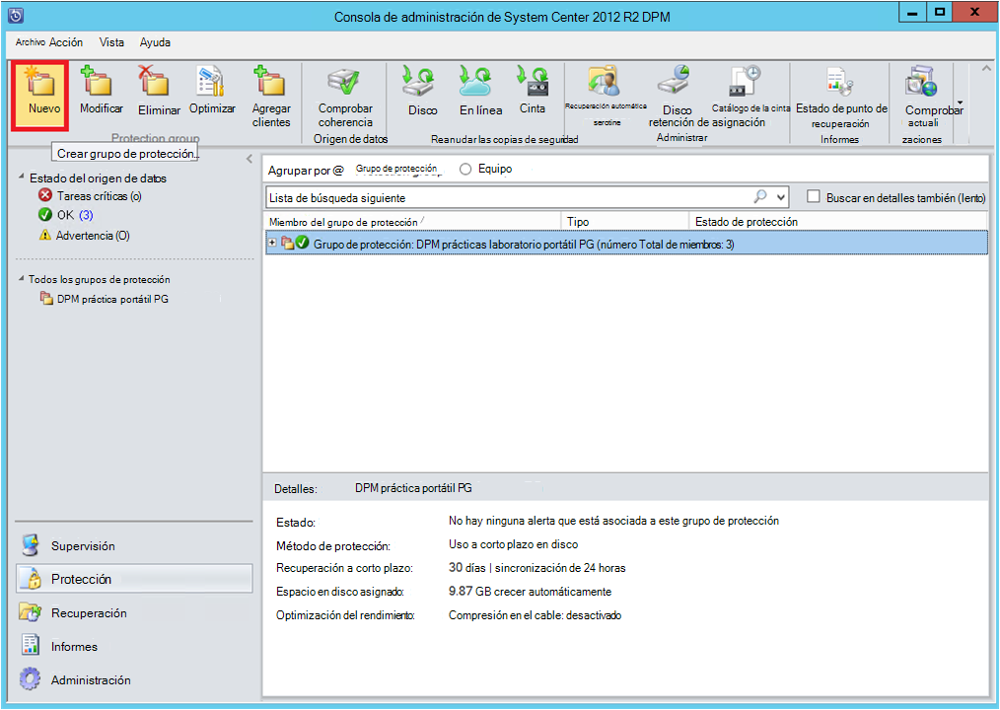

3. DPM muestra la pantalla de inicio con las instrucciones sobre cómo crear un **Grupo de protección**. Haga clic en **siguiente**.

4. Seleccione **servidores**.

    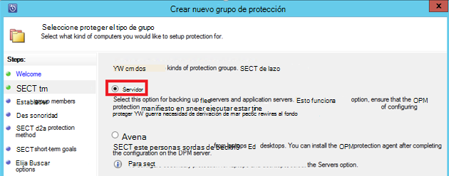

5. Expanda el equipo de SQL Server donde se realizan copias de seguridad de las bases de datos están presentes. DPM muestra varios orígenes de datos que pueden hacer copia de seguridad desde el servidor. Expanda la **Todos los recursos compartidos de SQL** y seleccione las bases de datos (en este caso seleccionamos $MSDPM2012 de servidor de informes y el servidor de informes$ MSDPM2012TempDB) hacer copia de seguridad. Haga clic en **siguiente**.

    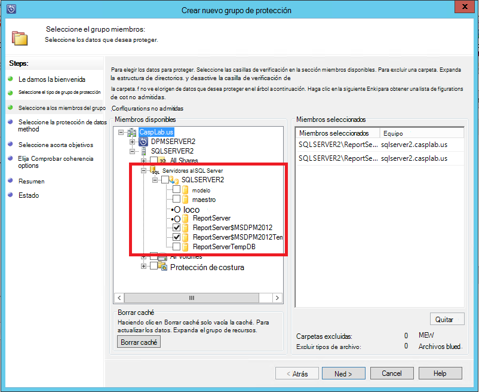

6. Proporcione un nombre para el grupo de protección y seleccione la casilla de verificación **deseo protección en línea** .

    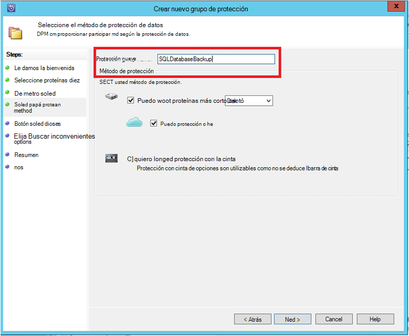

7. En la pantalla de **Objetivos a corto plazo de especificar** , incluir las entradas necesarias para crear una copia de seguridad de destino en el disco.

    Aquí vemos que se establece el **intervalo de retención** a *5 días*, **frecuencia de sincronización** se establece en una vez cada *15 minutos* que es la frecuencia a la que se realizó la copia de seguridad. **Copia de seguridad completa Express** se establece en *8:00 P.M.*.

    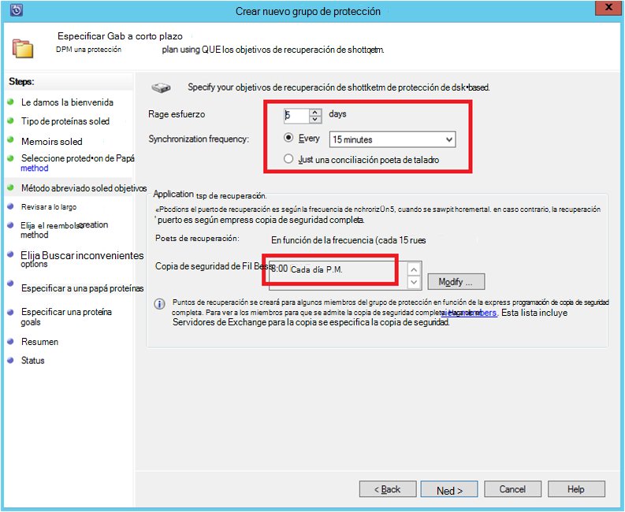

    >[AZURE.NOTE] A 8:00 P.M. (según la entrada de la pantalla) se crea un punto de copia de seguridad cada día mediante la transferencia de los datos que se ha modificado desde el punto de copia de seguridad de 8:00 P.M. del día anterior. Este proceso se denomina **Express de copia de seguridad completa**. Mientras la transacción registros se sincronizan cada 15 minutos, si es necesario para recuperar la base de datos a 9:00 P.M. – el punto se crea mediante la reproducción de los registros desde la última express punto de copia de seguridad completa (8 pm en este caso).

8. Haga clic en **siguiente**

    DPM muestra el espacio de almacenamiento total disponible y el uso del espacio de disco posibles.

    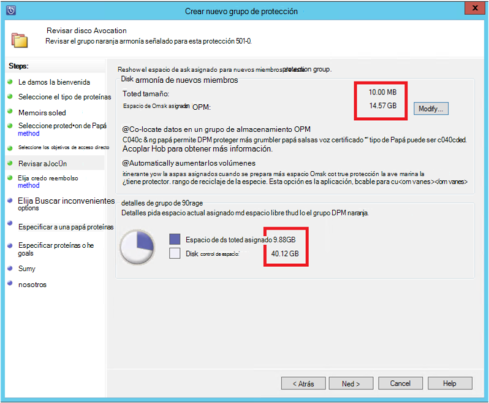

    De forma predeterminada, DPM crea un volumen por el origen de datos (base de datos de SQL Server) que se usa para la copia inicial. Con este método, el Administrador de discos lógicos (LDM) limita la protección de DPM a orígenes de datos de 300 (bases de datos de SQL Server). Para evitar esta limitación, seleccione la **ubicar datos en el grupo de almacenamiento de DPM**, opción. Si usa esta opción, DPM usa un único volumen para varios orígenes de datos, que permite a DPM proteger hasta 2000 bases de datos SQL.

    Si se selecciona la opción de **crecimiento automático de los volúmenes** , DPM puede tener en cuenta para el mayor volumen de copia de seguridad a medida que crecen de los datos de producción. Si no se selecciona la opción de **crecimiento automático de los volúmenes** , DPM limita el almacenamiento de copia de seguridad que utiliza para los orígenes de datos en el grupo de protección.

9. Los administradores se le ofrezca la opción de transferencia de esta copia de seguridad inicial manualmente (desactivar red) para evitar congestiones de ancho de banda o a través de la red. También puede configurar el tiempo en el que puede ocurrir la transferencia inicial. Haga clic en **siguiente**.

    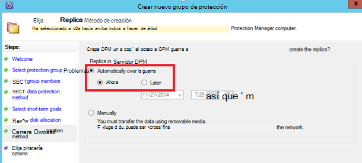

    La copia de seguridad inicial requiere a transferencia del origen de datos completo (base de datos de SQL Server) desde el servidor de producción (equipo de SQL Server) en el servidor DPM. Estos datos podrían ser grandes, y transferir los datos a través de la red podría superan el ancho de banda. Por este motivo, los administradores pueden elegir transferir la copia de seguridad inicial: **manualmente** (medio extraíble) para evitar la congestión de ancho de banda o **automáticamente a través de la red** (en un momento determinado).

    Una vez completada la copia de seguridad inicial, el resto de las copias de seguridad son incrementales en la copia de seguridad inicial. Incrementales pequeños y se transfieren fácilmente a través de la red.

10. Elija si desea que la comprobación de coherencia para ejecutar y haga clic en **siguiente**.

    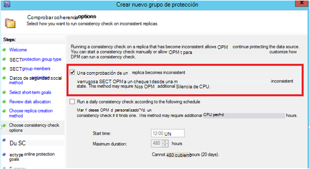

    DPM puede realizar una coherencia desproteger para proteger la integridad del punto de copia de seguridad. Calcula la suma de comprobación del archivo de copia de seguridad en el servidor de producción (equipo de SQL Server en este escenario) y los datos de copia de seguridad del archivo en DPM. En el caso de un conflicto, se supone que el archivo de copia de seguridad en DPM está dañado. DPM rectifica los datos de copia de seguridad mediante el envío de los bloques correspondiente a la desigualdad de suma de comprobación. Como la comprobación de coherencia es una operación de rendimiento intensivo, los administradores tienen la opción de programación de la comprobación de coherencia o ejecutarlo automáticamente.

11. Para especificar la protección en línea de los orígenes de datos, seleccione las bases de datos protegidos en Azure y haga clic en **siguiente**.

    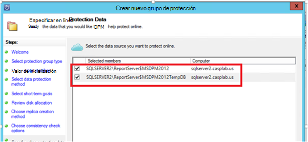

12. Los administradores pueden elegir las programaciones de copia de seguridad y directivas de retención que se adapten a sus directivas de la organización.

    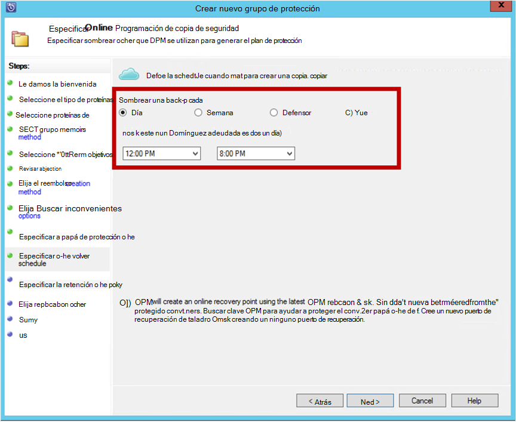

    En este ejemplo, se realizan una vez al día a 12:00 P.M. y 8 P.M. (parte inferior de la pantalla)

    >[AZURE.NOTE] Es una buena práctica tener algunos puntos de recuperación a corto plazo en disco para recuperación rápida. Estos puntos de recuperación se usan para "recuperación de las operaciones". Azure sirve como ubicación buena fuera del sitio con mayor SLA y garantiza la disponibilidad.

    **Procedimiento recomendado**: asegúrese de que se programan copias de seguridad de Azure tras la realización de copias de seguridad de disco local con DPM. Esto permite la última copia de seguridad de disco que se copiarán a Azure.

13. Elija la programación de la directiva de retención. Los detalles sobre el funcionamiento de la directiva de retención se proporcionan al [Usar la copia de seguridad de Azure para reemplazar el artículo de la infraestructura de cinta](backup-azure-backup-cloud-as-tape.md).

    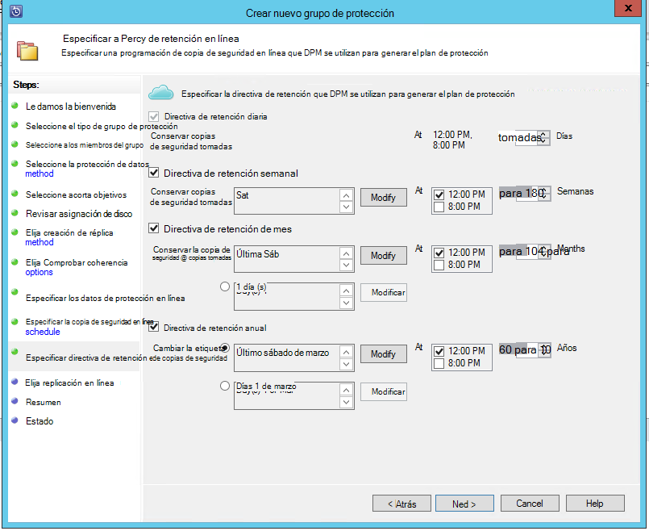

    En este ejemplo:

    - Realizar copias de seguridad se toman una vez al día a 12:00 P.M. y 8 P.M. (parte inferior de la pantalla) y se conservan durante 180 días.
    - La copia de seguridad el sábado a las 12:00 P.M. se conserva para 104 semanas
    - La copia de seguridad en el último sábado a las 12:00 P.M. se conserva para 60 meses
    - La copia de seguridad en el último sábado de marzo a las 12:00 P.M. se conserva de 10 años

14. Haga clic en **siguiente** y seleccione la opción adecuada para la transferencia de la copia de seguridad inicial en Azure. Puede elegir **automáticamente a través de la red** o **Copia de seguridad sin conexión**.

    - **Automáticamente a través de la red** se transfiere los datos de copia de seguridad en Azure según la programación elegida para la copia de seguridad.
    - Se explica el funcionamiento de la **Copia de seguridad sin conexión** en el [flujo de trabajo de copia de seguridad sin conexión de copia de seguridad de Azure](backup-azure-backup-import-export.md).

    Elija el mecanismo de transferencia relevantes para enviar la copia inicial a Azure y haga clic en **siguiente**.

15. Una vez que revise los detalles de directiva en la pantalla de **Resumen** , haga clic en el botón **Crear grupo** para completar el flujo de trabajo. Puede haga clic en el botón **Cerrar** y supervisar el progreso de tarea en el área de trabajo de supervisión.

    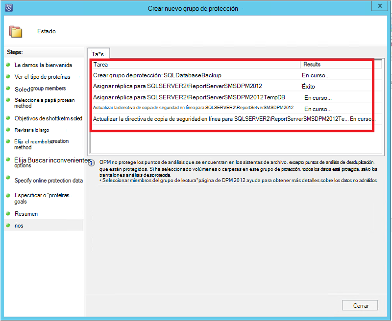

## Copia de seguridad a petición de una base de datos de SQL Server
Mientras los pasos anteriores, crean una directiva de copia de seguridad, se crea un punto de recuperación de"" solo cuando se produce la primera copia de seguridad. En lugar de esperar a que el programador que entra en vigor, los pasos siguientes la creación de una recuperación de desencadenador seleccione manualmente.

1. Espere a que el estado de grupo de protección es **correcto** para la base de datos antes de crear el punto de recuperación.

    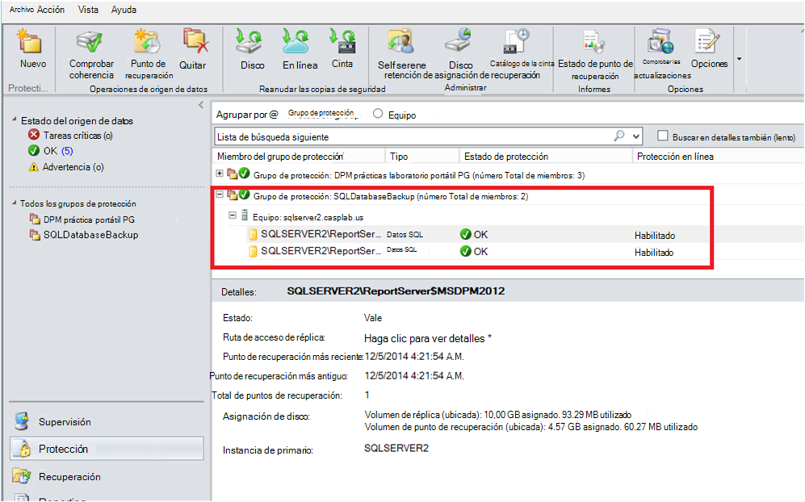

2. Haga clic en la base de datos y seleccione **Crear punto de recuperación**.

    

3. Elija **Protección en línea** en el menú desplegable y haga clic en **Aceptar**. Se inicia la creación de un punto de recuperación en Azure.

    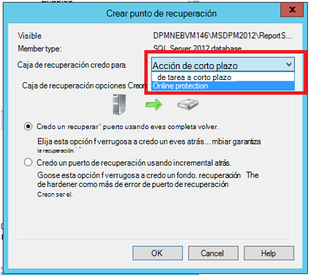

4. Puede ver el progreso de tarea en el área de trabajo de **supervisión** donde encontrará una en curso trabajo como el que se muestra en la figura siguiente.

    

## Recuperar una base de datos de SQL Server de Azure
Los pasos siguientes son necesarios para recuperar una entidad protegida (base de datos de SQL Server) de Azure.

1. Abra la consola de administración del servidor DPM. Vaya al área de trabajo de **recuperación** donde puede ver los servidores de copia de seguridad por DPM. Busque la base de datos necesario (en este servidor de informes mayúsculas $MSDPM2012). Seleccione una hora de **recuperación de** que termina con **en línea**.

    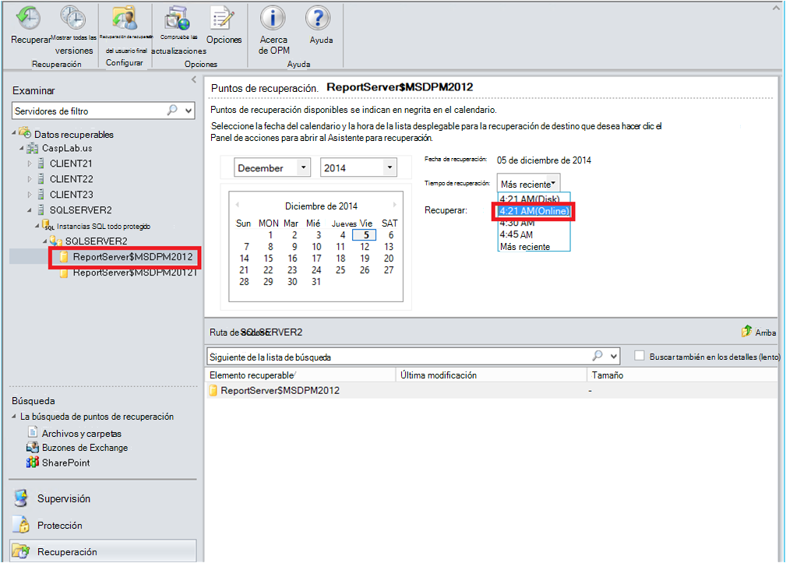

2. Haga clic en el nombre de la base de datos y haga clic en **recuperar**.

    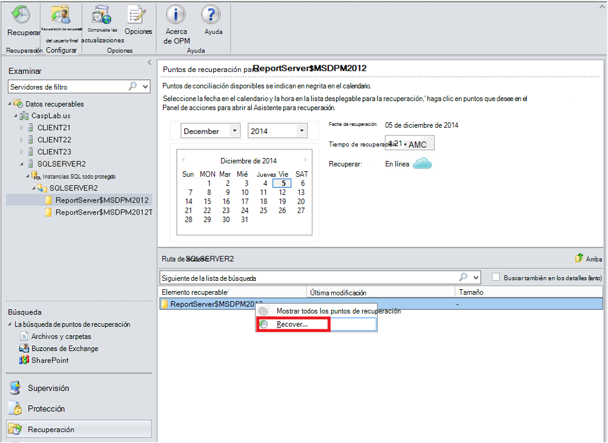

3. DPM muestra los detalles del punto de recuperación. Haga clic en **siguiente**. Para sobrescribir la base de datos, seleccione el tipo de recuperación **recuperar en instancia original de SQL Server**. Haga clic en **siguiente**.

    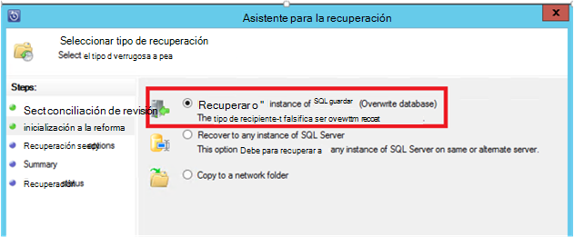

    En este ejemplo, DPM permite la recuperación de la base de datos a otra instancia de SQL Server o a una carpeta de red independiente.

4. En la pantalla de **Opciones de recuperación de especificar** , puede seleccionar las opciones de recuperación como límite de uso de ancho de banda de red para limitar el ancho de banda usado por la recuperación. Haga clic en **siguiente**.

5. En la pantalla de **Resumen** , vea todas las configuraciones de recuperación proporcionadas hasta el momento. Haga clic en **recuperar**.

    El estado de recuperación muestra la base de datos que se está recuperando. Puede hacer clic en **Cerrar** para cerrar al asistente y ver el progreso en el área de trabajo de **supervisión** .

    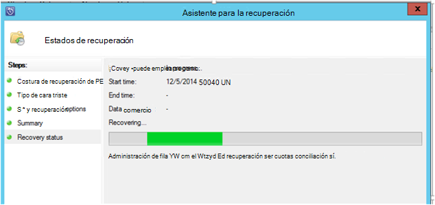

    Una vez se haya completado la recuperación, la base de datos es coherente de la aplicación.

### Pasos siguientes:

• [P+F de copia de seguridad de azure](backup-azure-backup-faq.md)
