<properties
   pageTitle="Eliminar un depósito de copia de seguridad de Azure | Microsoft Azure"
   description="Cómo eliminar un depósito de copia de seguridad de Azure. Solución de problemas por qué no se puede eliminar un depósito de copia de seguridad. "
   services="service-name"
   documentationCenter="dev-center-name"
   authors="markgalioto"
   manager="cfreeman"
   editor=""/>

<tags
   ms.service="backup"
   ms.devlang="na"
   ms.topic="article"
   ms.tgt_pltfrm="na"
   ms.workload="storage-backup-recovery"
   ms.date="08/29/2016"
   ms.author="markgal;trinadhk"/>

# Eliminar un depósito de copia de seguridad de Azure

El servicio de copia de seguridad de Azure tiene dos tipos de depósitos - depósito de copia de seguridad y el depósito de servicios de recuperación. Depósito de copia de seguridad aparece primero. A continuación, la cámara de servicios de recuperación llegó a las implementaciones expandida del Administrador de recursos de soporte técnico. Debido a las capacidades ampliadas y las dependencias de información que deben estar almacenadas en la cámara, puede parecer más difícil de lo que se pueden eliminar un depósito de servicios de recuperación.

|**Tipo de implementación**|**Portal**|**Nombre de depósito**|
|--------------|----------|---------|
|Clásico|Clásico|Depósito de copia de seguridad|
|Administrador de recursos|Azure|Depósito de servicios de recuperación|

> [AZURE.NOTE] Depósitos de copia de seguridad no pueden proteger soluciones implementado por el Administrador de recursos. Sin embargo, puede usar un depósito de servicios de recuperación para proteger los servidores implementados tradicionalmente y máquinas virtuales.  

En este artículo, hemos usado el término, cámara, para hacer referencia a la forma genérica del depósito de copia de seguridad o depósito de servicios de recuperación. Usamos el nombre formal, depósito de copia de seguridad o depósito de servicios de recuperación, cuando sea necesario distinguir entre los depósitos.

## Eliminar un depósito de servicios de recuperación

Eliminar un depósito de servicios de recuperación es un proceso de un paso - *proporciona que la cámara no contiene todos los recursos*. Antes de eliminar un depósito de servicios de recuperación, debe quitar o eliminar todos los recursos de la cámara. Si intenta eliminar un depósito que contiene recursos, recibe un error similar a la siguiente imagen.

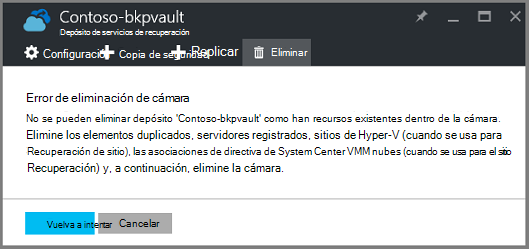  

Hasta que haya borrado los recursos de la cámara, haga clic en **Reintentar** genera el error. Si está atascado en este mensaje de error, haga clic en **Cancelar** y siga los pasos siguientes para eliminar los recursos de la cámara de servicios de recuperación.

### Quitar los elementos de un depósito proteger una máquina virtual

Si ya tiene abierto el depósito de servicios de recuperación, vaya al segundo paso.

1.  Abra el portal de Azure y desde el panel, abra la cámara que desea eliminar.

    Si no tiene el depósito de servicios de recuperación anclado a paneles, en el menú de concentrador, haga clic en **Más servicios** y en la lista de recursos, escriba **Servicios de recuperación**. Cuando comience a escribir, los filtros de la lista en función de la entrada. Haga clic en **Servicios de recuperación de depósitos**.

    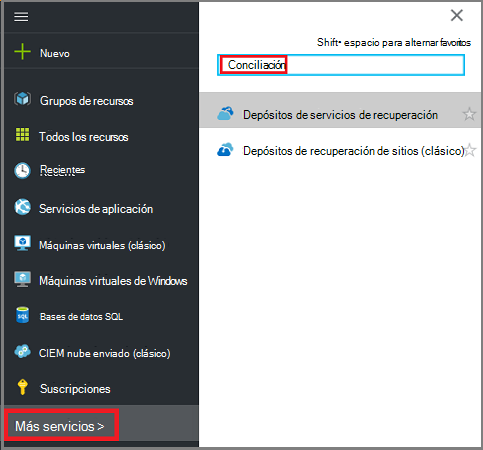  

    Se muestra la lista de servicios de recuperación depósitos. En la lista, seleccione el depósito que desea eliminar.

    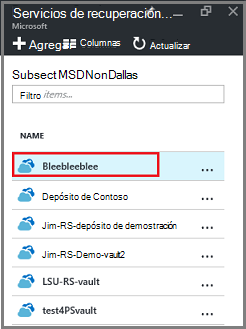

2. En la vista de cámara, mire el panel **Essentials** . Para eliminar un depósito, no pueden ser los elementos protegidos. Si ve un número distinto de cero, en **Elementos de copia de seguridad** o **servidores de administración de copia de seguridad**, debe quitar estos elementos antes de eliminar la cámara.

    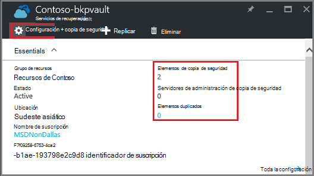

    Máquinas virtuales de archivos o carpetas se consideran elementos de copia de seguridad y se muestran en el área de **Copia de seguridad de elementos** del panel Essentials. Un servidor DPM se muestra en el área de **Copia de seguridad de servidor de administración** del panel de Essentials. **Elementos replicar** pertenecen al servicio de recuperación de sitios de Azure.

3. Para empezar a quitar los elementos protegidos de la caja fuerte, busque los elementos de la cámara. En el panel de cámara haga clic en **configuración**y, a continuación, haga clic en **elementos de copia de seguridad** para abrir esa hoja.

    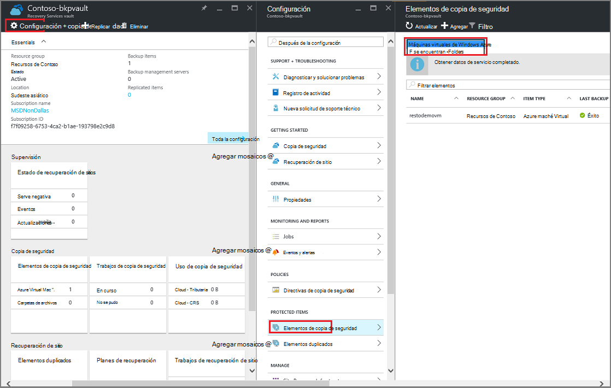

    El módulo de **Copia de seguridad de elementos** tiene listas separadas, en función del tipo de elemento: máquinas virtuales de Azure o carpetas de archivos (consulte la imagen). La lista de tipo de elemento predeterminado que aparece es máquinas virtuales de Azure. Para ver la lista de elementos de carpetas de archivos en la cámara, seleccione **Carpetas de archivos** en el menú desplegable.

4. Antes de eliminar un elemento de la caja fuerte proteger una máquina virtual, debe detener el trabajo de copia de seguridad del elemento y eliminar los datos de punto de recuperación. Para cada elemento de la cámara, siga estos pasos:

    una. En el módulo de **Copia de seguridad de elementos** , haga clic en el elemento y, en el menú contextual, seleccione **Detener copia de seguridad**.

    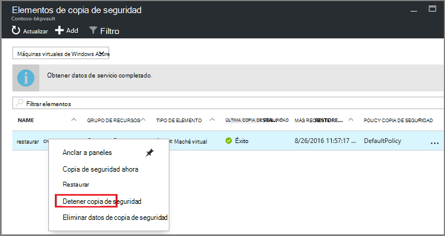

    Se abre el módulo de dejar de copia de seguridad.

    b. En el módulo **Dejar una copia de seguridad** , en el menú de **Elegir una opción** , seleccione **Eliminar datos de copia de seguridad** > escriba el nombre del elemento > y haga clic en **Detener copia de seguridad**.

      Escriba el nombre del elemento para verificar que desea eliminar. El botón **Detener copia de seguridad** no se activará hasta que se compruebe el elemento para detener. Si no ve el cuadro de diálogo para escribir el nombre del elemento de copia de seguridad, ha elegido la opción **Conservar datos de copia de seguridad** .

    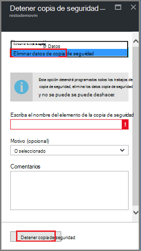

      Si lo desea, puede proporcionar un motivo por qué va a eliminar los datos y agregar comentarios. Después de hacer clic en **Detener la copia de seguridad**, permitir el trabajo de eliminación se complete antes de intentar eliminar de la cámara. Para comprobar que el trabajo se ha completado, compruebe los mensajes de Azure .  
   Una vez completada la tarea, recibirá un mensaje que indica el proceso de copia de seguridad se ha detenido y se eliminan los datos de copia de seguridad para ese elemento.

    c. Después de eliminar un elemento en la lista, en el menú **Elementos de copia de seguridad** , haga clic en **Actualizar** para ver los elementos restantes de la cámara.

      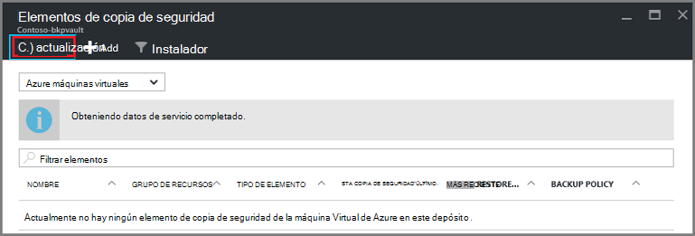

      Cuando no hay ningún elemento en la lista, desplácese hasta el panel **Essentials** en el módulo de cámara de copia de seguridad. No debe haber los **elementos de copia de seguridad**, **servidores de administración de copia de seguridad**o **replicada elementos** de la lista. Si siguen aparecen elementos de la caja fuerte, vuelva al paso tres anterior y elija una lista de tipo de elemento diferente.  

5. Cuando no hay ningún más elementos en la barra de herramientas de cámara, haga clic en **Eliminar**.

    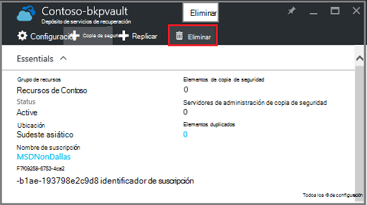

6. Cuando se le pida que compruebe que desea eliminar la cámara, haga clic en **Sí**.

    Se elimina la cámara y el portal devuelve el menú de servicio de **nuevo** .

## ¿Qué ocurre si lo ha detenido el proceso de copia de seguridad pero se conservan los datos?

Si ha detenido el proceso de copia de seguridad, pero por accidente *se conservan* los datos, debe eliminar los datos de copia de seguridad antes de eliminar la cámara. Para eliminar los datos de copia de seguridad:

1. En el módulo de **Copia de seguridad de elementos** , haga clic en el elemento y, en el menú contextual, haga clic en **Eliminar datos de copia de seguridad**.

    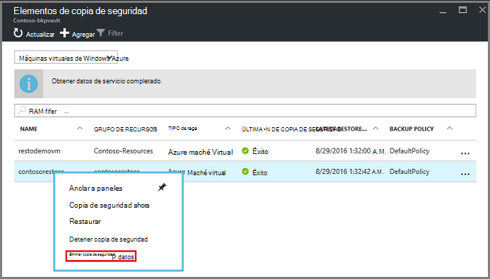

    Se abre el módulo de **Eliminar datos de copia de seguridad** .

2. En el módulo de **Eliminar datos de copia de seguridad** , escriba el nombre del elemento y haga clic en **Eliminar**.

    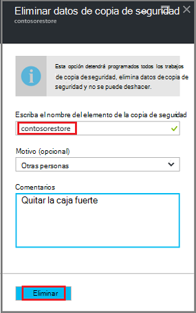

    Una vez que haya eliminado los datos, vaya al paso 4c, anteriormente y continúe con el proceso.

## Eliminar un depósito que se utiliza para proteger un servidor DPM

Antes de eliminar un depósito que se utiliza para proteger un servidor DPM, debe desactivar los puntos de recuperación que se han creado y anular el registro del servidor de la cámara.

Para eliminar los datos asociados a un grupo de protección:

1. En la consola de administrador DPM, haga clic en **protección**, seleccione un grupo de protección, seleccione al miembro del grupo de protección y en la cinta de opciones de herramientas, haga clic en **Quitar**. Debe seleccionar el miembro para el botón **Quitar** que aparezcan en la cinta de opciones de la herramienta. En el ejemplo, el miembro es **dummyvm9**. Si hay varios miembros del grupo de protección, mantenga presionada la tecla Ctrl para seleccionar a varios miembros.

    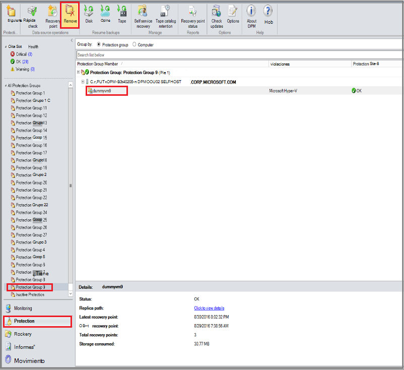

    Se abre el cuadro de diálogo **Detener protección** .

2. En el cuadro de diálogo **Detener protección** , seleccione **Eliminar datos protegidos**y haga clic en **Detener protección**.

    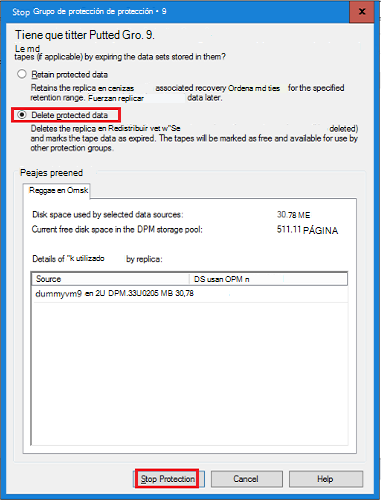

    No desea conservar los datos protegidos porque tiene que borrar la cámara para eliminarla. Función recuperación cuántos puntos y la cantidad de datos está en el grupo de protección, pueden tardar en cualquier lugar de unos pocos segundos unos minutos para eliminar los datos. El cuadro de diálogo **Detener protección** muestra el estado cuando haya finalizado el trabajo.

    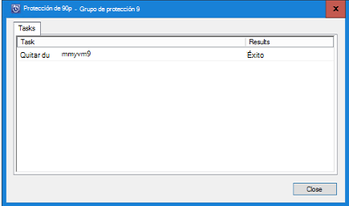

3. Repita este proceso para todos los miembros de todos los grupos de protección.

    Debe quitar protegidas todos los datos y los grupos de protección.

4. Después de eliminar a todos los miembros del grupo de protección, cambie el portal de Azure. Abra el panel de la cámara y asegúrese de que no existen **Elementos de copia de seguridad**, **servidores de administración de copia de seguridad**o **replicada elementos**. En la barra de herramientas de la cámara, haga clic en **Eliminar**.

    

    Si se han registrado en la caja fuerte de servidores de administración de copia de seguridad, no podrá eliminar el depósito incluso si no hay ningún dato de la cámara. Si cree eliminó los servidores de administración de copia de seguridad asociados con la cámara, pero aún hay servidores que se muestra en el panel de **Essentials** , vea [Buscar los servidores de administración de copia de seguridad registrados con la cámara](backup-azure-delete-vault.md#find-the-backup-management-servers-registered-to-the-vault).

5. Cuando se le pida que compruebe que desea eliminar la cámara, haga clic en **Sí**.

    Se elimina la cámara y el portal devuelve el menú de servicio de **nuevo** .

## Eliminar un depósito que se utiliza para proteger un servidor de producción

Antes de eliminar un depósito que se utiliza para proteger un servidor de producción, debe eliminar o anular el registro del servidor de la cámara.

Para eliminar el servidor de producción asociado con la cámara:

1. En el portal de Azure, abra el panel de la cámara y haga clic en **configuración** > **Infraestructura de copia de seguridad** > **Servidores de producción**.

    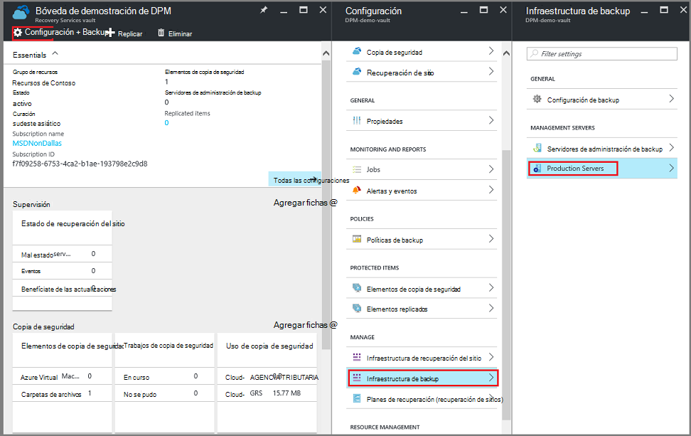

    El módulo de **Servidores de producción** se abre y muestra todos los servidores de producción de la cámara.

    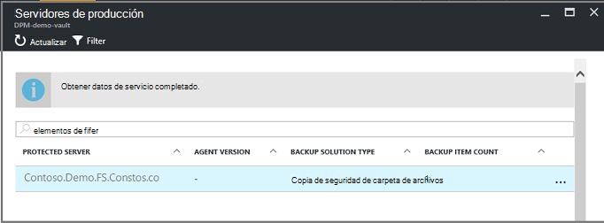

2. En el módulo de **Servidores de producción** , haga clic en el servidor y haga clic en **Eliminar**.

    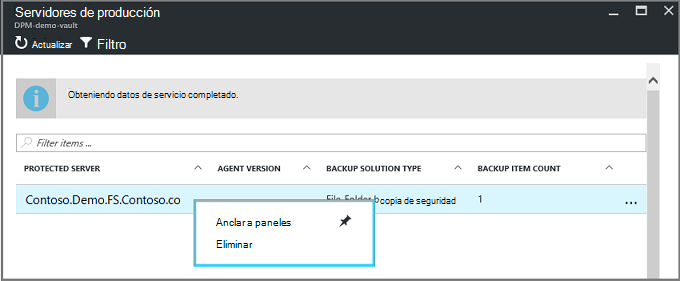

    Se abre el módulo de **Eliminar** .

    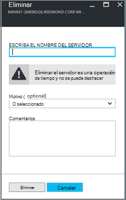

3. En el módulo de **Eliminar** , confirme el nombre del servidor que se va a eliminar y haga clic en **Eliminar**. Correctamente, debe escribir el nombre del servidor para activar el botón **Eliminar** .

    Una vez que se ha eliminado la cámara, recibirá un mensaje que indica que la cámara se ha eliminado. Después de eliminar todos los servidores de la cámara, desplácese al panel Essentials en el panel de la cámara.

4. En el panel de la cámara, asegúrese de que no existen **Elementos de copia de seguridad**, **servidores de administración de copia de seguridad**o **replicada elementos**. En la barra de herramientas de la cámara, haga clic en **Eliminar**.

5. Cuando se le pida que compruebe que desea eliminar la cámara, haga clic en **Sí**.

    Se elimina la cámara y el portal devuelve el menú de servicio de **nuevo** .

## Eliminar un depósito de copia de seguridad

Son las siguientes instrucciones para eliminar un depósito de copia de seguridad en el portal de clásico. Un depósito de copia de seguridad y servicios de recuperación depósito son los mismos: antes de eliminar la cámara, eliminar los elementos y los datos que se conservan.

1. Abra el portal de clásico.

2. En la lista de depósitos de copia de seguridad, seleccione el depósito que desea eliminar.

    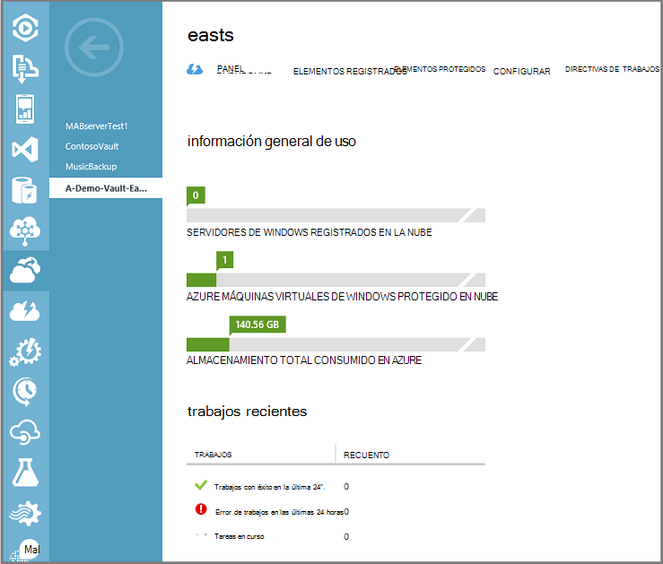

    Se abre el panel de la cámara. Observe el número de servidores de Windows y Azure máquinas virtuales asociados con la cámara. Además, mire el almacenamiento total consumido en Azure. Debe detener los trabajos de copia de seguridad y eliminar los datos existentes antes de eliminar la cámara.

3. Haga clic en la pestaña **Elementos protegidos** y, a continuación, haga clic en **Detener protección**

    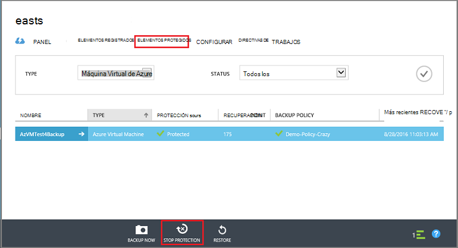

    Aparece el cuadro de diálogo **Detener protección de 'su cámara'** .

4. En el cuadro de diálogo **Detener protección de 'su cámara'** , consulte **Eliminar datos de copia de seguridad asociados** y haga clic en .  
   Si lo desea, puede elegir un motivo para detener protección y proporcione un comentario.

    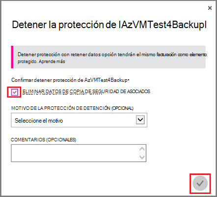

    Después de eliminar los elementos de la cámara, la cámara estará vacía.

    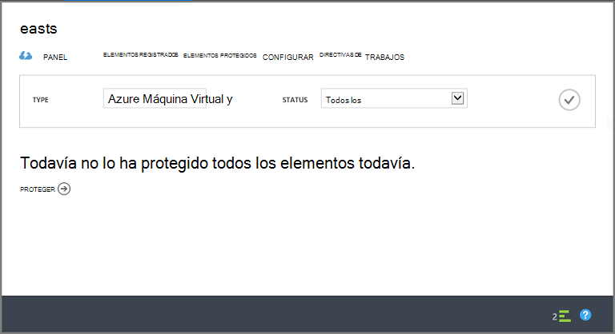

5. En la lista de pestañas, haga clic en **Elementos registrados**. Para cada elemento registrado en la cámara, seleccione el elemento y haga clic en **Anular registro**.

    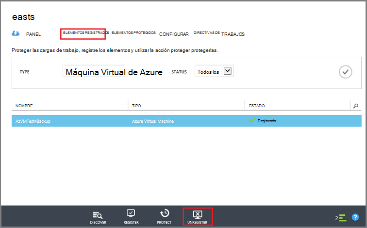

6. En la lista de pestañas, haga clic en el **panel** para abrir esa pestaña. Compruebe que no hay servidores registrados o Azure máquinas virtuales de Windows protegido en la nube. Además, compruebe que no hay ningún dato de almacenamiento. Haga clic en **Eliminar** para eliminar la cámara.

    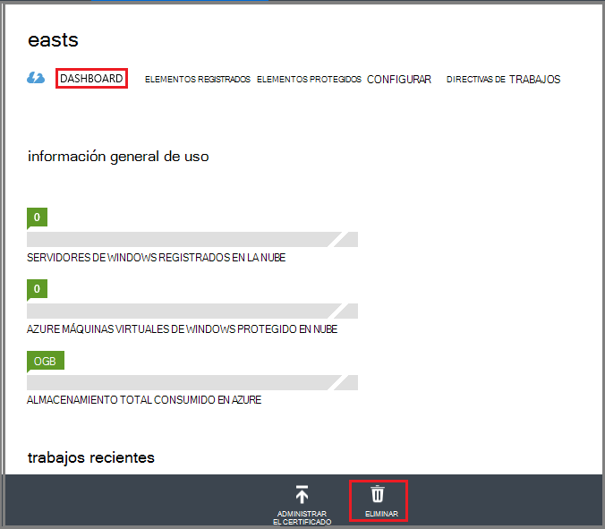

    Se abrirá la pantalla de confirmación de la cámara de eliminar la copia de seguridad. Seleccione una opción, ¿por qué va a eliminar la cámara y haga clic en .  

    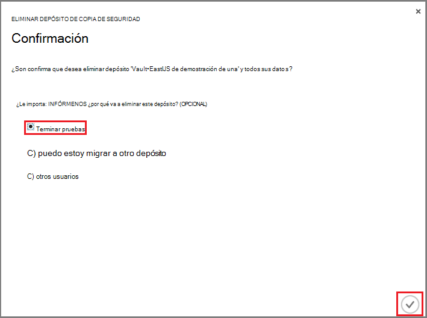

    Se elimina el depósito y vuelva al panel de portal clásico.

### Buscar los servidores de administración de copia de seguridad registrados en la caja fuerte

Si tiene varios servidores registrados a un depósito, puede ser difícil recordar. Para ver los servidores registrados para la cámara y elimínelas:

1. Abra el panel de la cámara.

2. En el panel **Essentials** , haga clic en **configuración** para abrir esa hoja.

    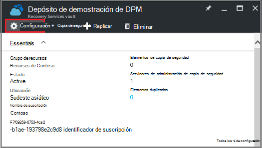

3. En el **módulo de configuración**, haga clic en **La infraestructura de copia de seguridad**.

4. En el módulo de **Infraestructura de copia de seguridad** , haga clic en **Servidores de administración de copia de seguridad**. Se abre el módulo de servidores de administración de copia de seguridad.

    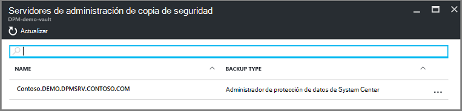

5. Para eliminar un servidor de la lista, haga clic en el nombre del servidor y, a continuación, haga clic en **Eliminar**.
    Se abre el módulo de **Eliminar** .

6. En el módulo de **Eliminar** , proporcione el nombre del servidor. Si es un nombre largo, puede copiar y pegar de la lista de servidores de administración de copia de seguridad. A continuación, haga clic en **Eliminar**.  
