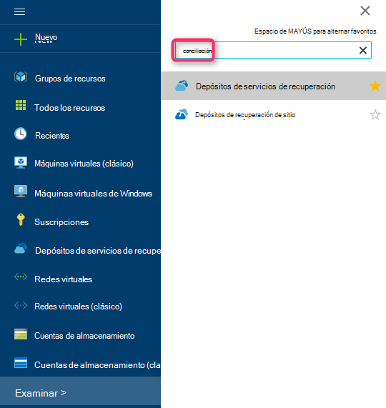
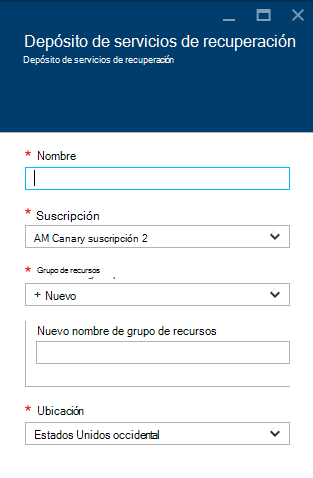
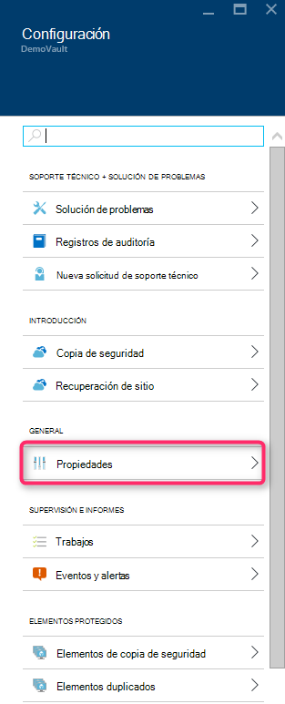
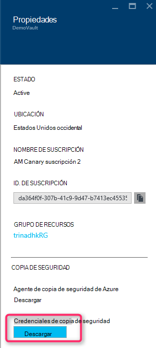
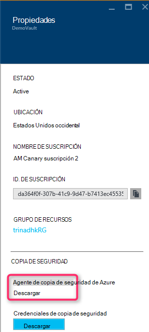
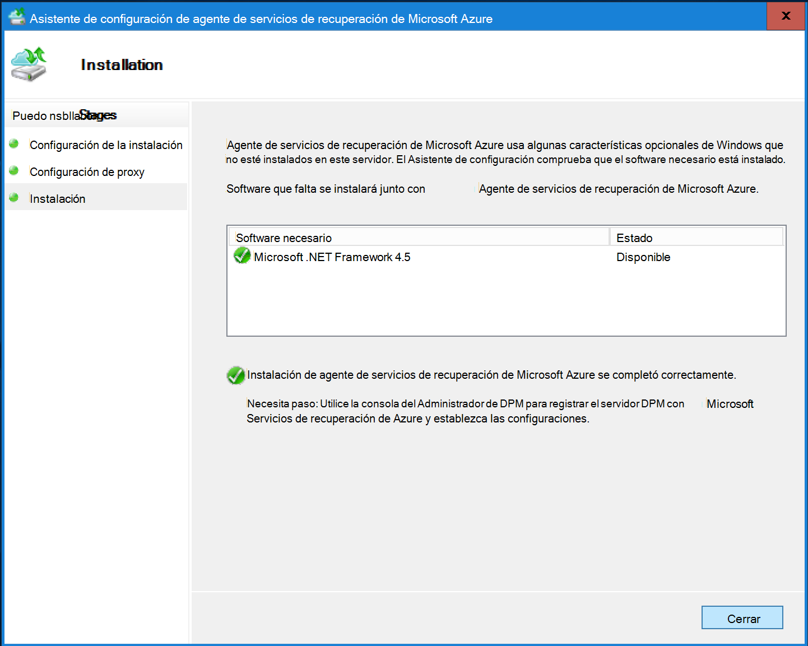
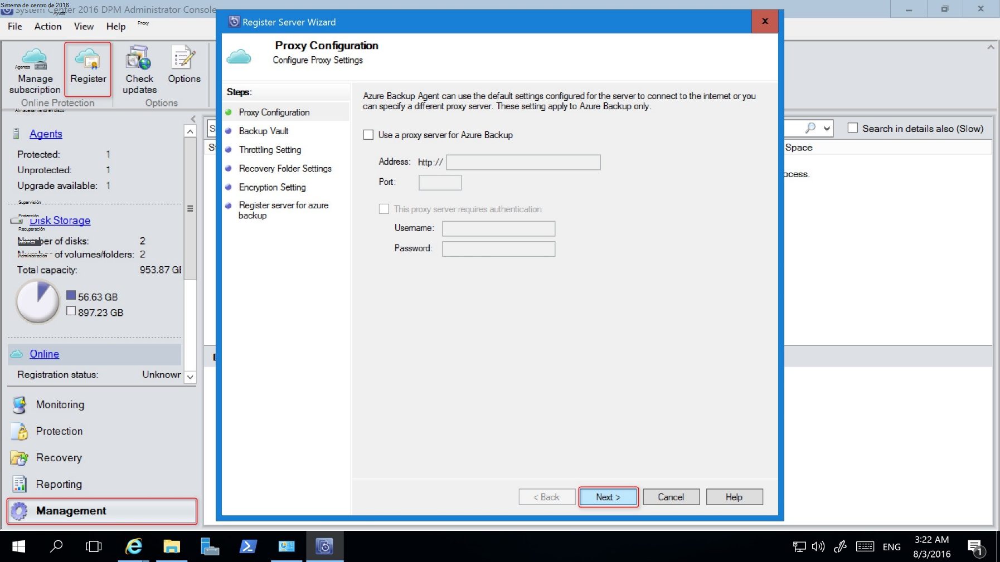
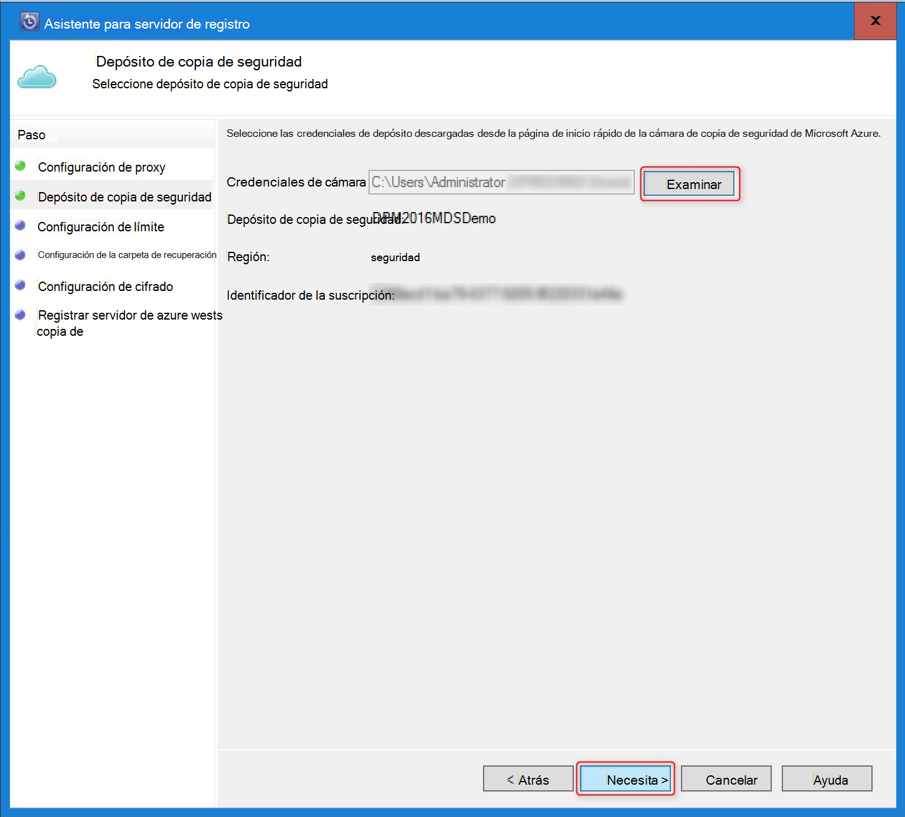
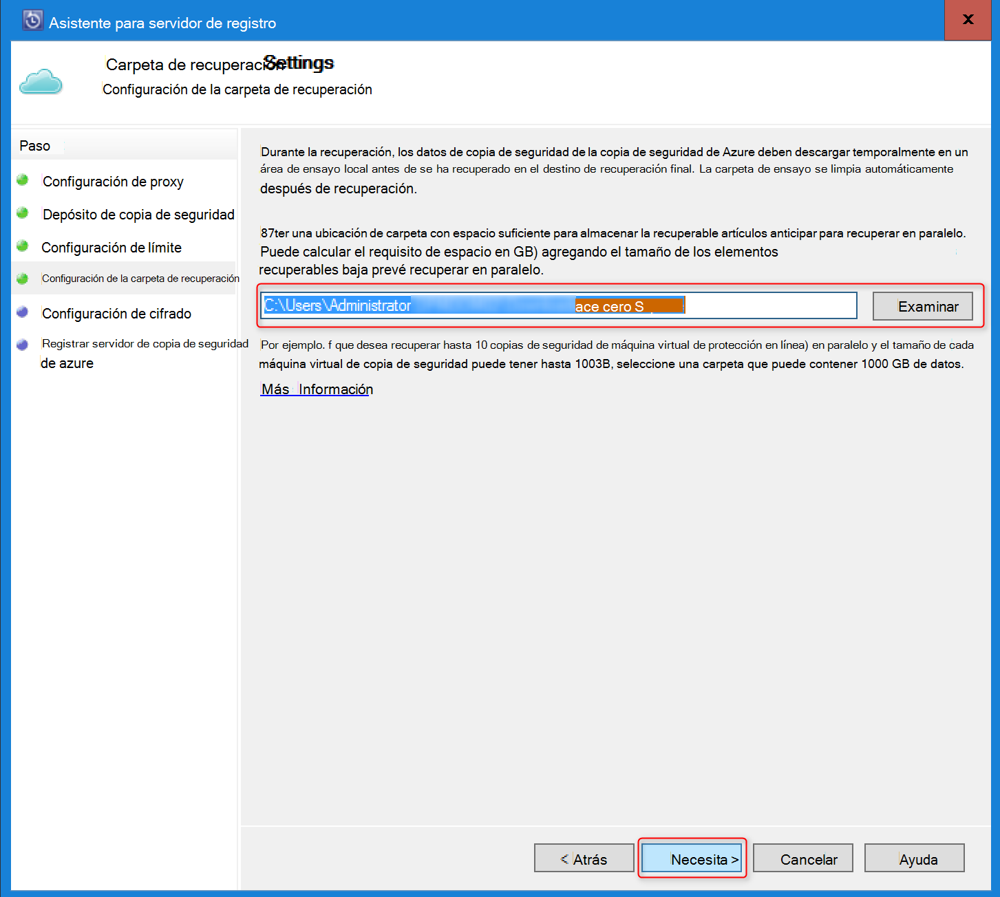
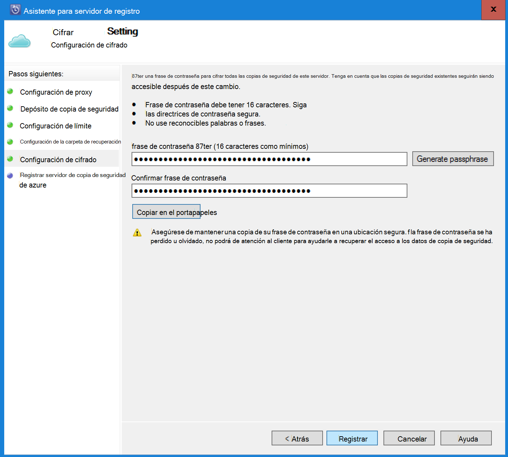

<properties
    pageTitle="Introducción a la copia de seguridad de Azure DPM | Microsoft Azure"
    description="Introducción a la copia de seguridad de los servidores DPM mediante el servicio de copia de seguridad de Azure"
    services="backup"
    documentationCenter=""
    authors="Nkolli1"
    manager="shreeshd"
    editor=""
    keywords="Administrador de protección de datos de centro de sistema, Administrador de protección de datos, la copia de seguridad de dpm"/>

<tags
    ms.service="backup"
    ms.workload="storage-backup-recovery"
    ms.tgt_pltfrm="na"
    ms.devlang="na"
    ms.topic="article"
    ms.date="08/08/2016"
    ms.author="trinadhk;giridham;jimpark;markgal;adigan"/>

# Preparar la copia de seguridad de las cargas de trabajo en Azure con DPM

> [AZURE.SELECTOR]
- [Servidor de copia de seguridad de Azure](backup-azure-microsoft-azure-backup.md)
- [SCDPM](backup-azure-dpm-introduction.md)
- [Servidor de copia de seguridad de Azure (clásico)](backup-azure-microsoft-azure-backup-classic.md)
- [SCDPM (clásico)](backup-azure-dpm-introduction-classic.md)

Este artículo proporciona una introducción al uso de copia de seguridad de Microsoft Azure para proteger los servidores de System Center Data Protection Manager (DPM) y las cargas de trabajo. Leerlo, podrá comprender:

- Funcionamiento de la copia de seguridad de servidor DPM de Azure
- Los requisitos previos para lograr una experiencia de copia de seguridad suave
- Los errores típicos encontrados y cómo tratar con ellos
- Escenarios compatibles

> [AZURE.NOTE] Azure tiene dos modelos de implementación para crear y trabajar con recursos: [Administrador de recursos y clásica](../resource-manager-deployment-model.md). En este artículo se proporciona la información y procedimientos para restaurar máquinas virtuales de implementada mediante el modelo de administrador de recursos.

System Center DPM copia los datos de aplicaciones y archivos. Los datos copiados a DPM pueden ser almacenados en la cinta, en el disco, o una copia en Azure con copia de seguridad de Microsoft Azure. DPM interactúa con copia de seguridad de Azure como sigue:

- **DPM implementado como una máquina virtual de servidor o local física** : DPM si se implementa como un servidor físico o como una máquina virtual Hyper-V en local puede hacer copia de seguridad de datos a un depósito de servicios de recuperación además de disco y la cinta una copia de seguridad.
- **DPM implementado como una máquina virtual Azure** — de System Center 2012 R2 con 3 de actualización, se puede implementar DPM como una máquina virtual Azure. Si DPM se implementa como una máquina virtual Azure que puede crear una copia de datos de Azure discos adjuntos a la máquina virtual de Azure DPM o puede descargar el almacenamiento de datos realizando hasta un depósito de servicios de recuperación.

## ¿Por qué hacer copia de seguridad de DPM en Azure?

Las ventajas de la empresa del uso de copia de seguridad de Azure para la copia de seguridad de servidores DPM incluyen:

- Para la implementación local de DPM, puede usar Azure como alternativa a la implementación a largo plazo en cinta.
- Para implementaciones de DPM en Azure, copia de seguridad de Azure le permite descargar almacenamiento desde el disco de Azure, lo que le permite escalar por almacenar datos antiguos en depósito de servicios de recuperación y los nuevos datos en el disco.

## Requisitos previos
Preparar la copia de seguridad de Azure para realizar copias de seguridad de datos DPM como sigue:

1. **Crear un depósito de servicios de recuperación** : crear un depósito en el portal de Azure.
2. **Credenciales de descarga depósito** : descargar las credenciales que se usa para registrar el servidor DPM en depósito de servicios de recuperación.
3. **Instalar el agente de copia de seguridad de Azure** : copias de seguridad de Azure, instale el agente en cada servidor DPM.
4. **Registrar el servidor** : registrar el servidor DPM en depósito de servicios de recuperación.

### 1. crear un depósito de servicios de recuperación
Para crear un depósito de servicios de recuperación:

1. Inicie sesión en el [portal de Azure](https://portal.azure.com/).

2. En el menú de concentrador, haga clic en **Examinar** y en la lista de recursos, escriba **Servicios de recuperación**. Cuando comience a escribir, filtrará la lista basada en la entrada. Haga clic en **Servicios de recuperación de cámara**.

    

    Se muestra la lista de servicios de recuperación depósitos.

3. En el menú de **Servicios de recuperación de depósitos** , haga clic en **Agregar**.

    

    Se abre el módulo de cámara de servicios de recuperación, que le pide que proporcione un **nombre**, la **suscripción**, el **grupo de recursos**y la **ubicación**.

    

4. En **nombre**, escriba un nombre descriptivo para identificar la cámara. El nombre debe ser único para la suscripción de Azure. Escriba un nombre que contenga entre 2 y 50 caracteres. Debe comenzar con una letra y puede contener sólo letras, números y guiones.

5. Haga clic en la **suscripción** para ver la lista de suscripciones disponibles. Si no está seguro de qué suscripción a usar, use el valor predeterminado (o sugeridos) suscripción. Habrá varias opciones solo si su cuenta profesional está asociado con varias suscripciones de Azure.

6. Haga clic en el **grupo de recursos** para ver la lista de grupos de recursos disponibles o haga clic en **nuevo** para crear un nuevo grupo de recursos. Para obtener información completa sobre los grupos de recursos, consulte [información general del Administrador de recursos de Azure](../azure-resource-manager/resource-group-overview.md)

7. Haga clic en **ubicación** para seleccionar la región geográfica de la cámara.

8. Haga clic en **crear**. Puede pasar un tiempo para el depósito de servicios de recuperación que debe crearse. Supervisar las notificaciones de estado en el área superior derecha en el portal.
Una vez creada la cámara, se abre en el portal.

### Configurar la replicación de almacenamiento

La opción de replicación de almacenamiento le permite elegir entre almacenamiento geo redundantes y almacenamiento redundante local. De forma predeterminada, el depósito tiene almacenamiento geo redundantes. Deje la opción establecida en almacenamiento geo redundantes si se trata de la copia de seguridad principal. Si desea una opción económica que no es bastante como resistente, elija almacenamiento redundante local. Leer más sobre [geo redundantes](../storage/storage-redundancy.md#geo-redundant-storage) y las opciones de almacenamiento [redundante local](../storage/storage-redundancy.md#locally-redundant-storage) en la [Visión general de la replicación de almacenamiento de Azure](../storage/storage-redundancy.md).

Para editar la configuración de replicación de almacenamiento:

1. Seleccione el depósito para abrir el panel de la cámara y el módulo de configuración. Si no se abre el módulo de **configuración** , haga clic en **todas las opciones** en el panel de la cámara.

2. En el módulo de **configuración** , haga clic en **La infraestructura de copia de seguridad** > **Configuración de copia de seguridad** para abrir el módulo de **Configuración de copia de seguridad** . En el módulo de **Configuración de copia de seguridad** , elija la opción de replicación de almacenamiento de la cámara.

    

    Después de elegir la opción de almacenamiento de la cámara, ya está listo para asociar la máquina virtual con la cámara. Para comenzar la asociación, debe descubrir y registrar los equipos virtuales Azure.

### 2. credenciales de depósito de descarga de

El archivo de credenciales de depósito es un certificado generado por el portal para cada depósito de copia de seguridad. El portal de carga, a continuación, la clave pública para el servicio de Control de acceso (ACS). La clave privada del certificado estará disponible para el usuario como parte del flujo de trabajo que se expresa como una entrada del flujo de trabajo de registro de equipo. Esto autentica el equipo para enviar los datos de copia de seguridad a un depósito identificado en el servicio de copia de seguridad de Azure.

Se utiliza la credencial de cámara solo durante el flujo de trabajo de registro. Es responsabilidad del usuario para asegurarse de que el archivo de credenciales de la cámara no está comprometido. Si se encuentra en manos de cualquier usuario malintencionado, el archivo de credenciales de cámara puede usarse para registrar otros equipos con el mismo depósito. Sin embargo, como los datos de copia de seguridad se cifran con una contraseña que pertenece al cliente, los datos de copia de seguridad existentes no pueden ser confidencial. Para mitigar este problema, se establecen las credenciales de la cámara para que expire en 48 horas. Puede descargar las credenciales de la cámara de los servicios de recuperación cualquier número de veces, pero solo el archivo más reciente de la credencial depósito es aplicable durante el flujo de trabajo de registro.

El archivo de credenciales de la cámara se descargará a través de un canal seguro desde el portal de Azure. El servicio de copia de seguridad de Azure no conoce la clave privada del certificado y la clave privada no se conserva en el portal o el servicio. Realice los pasos siguientes para descargar el archivo de credenciales de la cámara en un equipo local.

1. Inicie sesión en el [portal de Azure](https://portal.azure.com/).

2. Abrir depósito de servicios de recuperación a la que desea registrar DPM del equipo.

3. Módulo de configuración se abre de forma predeterminada. Si está cerrada, haga clic en **configuración** en el panel de cámara para abrir el módulo de configuración. En el módulo de configuración, haga clic en **Propiedades**.

    

4. En la página de propiedades, haga clic en **Descargar** **Credenciales de copia de seguridad**. El portal genera el archivo de credenciales de la cámara, que está disponible para su descarga.

    

El portal genera una credencial de cámara mediante una combinación de nombre de la cámara y la fecha actual. Haga clic en **Guardar** para descargar las credenciales de la cámara en la carpeta de descargas de la cuenta local, o seleccione Guardar como en el menú Guardar para especificar una ubicación para las credenciales de la cámara. Se tardar hasta un minuto generar el archivo.

### Nota
- Asegúrese de que el archivo de credenciales de la cámara se guarda en una ubicación que se puede acceder desde su equipo. Si se almacena en un recurso compartido de archivo pequeñas y medianas, compruebe los permisos de acceso.
- Se usa el archivo de credenciales de cámara solo durante el flujo de trabajo de registro.
- El archivo de credenciales de depósito caduca después de 48 horas y puede descargarse desde el portal.

### 3. instalar el agente de copia de seguridad

Después de crear el depósito de copia de seguridad de Azure, debe instalarse un agente en cada uno de los equipos de Windows (Windows Server, el cliente de Windows, Administrador de protección de datos de System Center server o equipo servidor de copia de seguridad de Azure) que permite la copia de seguridad de datos y aplicaciones para Azure.

1. Abrir depósito de servicios de recuperación a la que desea registrar DPM del equipo.

2. Módulo de configuración se abre de forma predeterminada. Si está cerrada, haga clic en **configuración** para abrir la hoja de configuración. En el módulo de configuración, haga clic en **Propiedades**.

    

3. En la página Configuración, haga clic en **Descargar** **Agente de copia de seguridad de Azure**.

    

   Una vez que se descarga el agente, haga doble clic en MARSAgentInstaller.exe para iniciar la instalación del agente de copia de seguridad de Azure. Elija la carpeta de instalación y la carpeta Borrador requerido para el agente. La ubicación de caché especificada debe tener espacio libre que se encuentra al menos del 5% de los datos de copia de seguridad.

4.  Si usa un servidor proxy para conectarse a internet, en la pantalla de **configuración de Proxy** , escriba los detalles del servidor proxy. Si utiliza a un proxy autenticado, escriba los detalles de nombre y contraseña de usuario en esta pantalla.

5.  El agente de copia de seguridad de Azure instala .NET Framework 4.5 y Windows PowerShell (si aún no está disponible) para completar la instalación.

6.  Una vez instalado el agente, **cierre** la ventana.

    

7. **Registrar el servidor DPM** a la cámara, en la pestaña **administración** , haga clic en **línea**. A continuación, seleccione **registrar**. Se abrirá al Asistente para configuración de registro.

8. Si usa un servidor proxy para conectarse a internet, en la pantalla de **configuración de Proxy** , escriba los detalles del servidor proxy. Si utiliza a un proxy autenticado, escriba los detalles de nombre y contraseña de usuario en esta pantalla.

    

9. En la pantalla de las credenciales de la cámara, busque y seleccione el archivo de credenciales de cámara que se ha descargado anteriormente.

    

    El archivo de credenciales de cámara solo es válido para 48 horas (después de descargarlo desde el portal). Si encuentra cualquier error en esta pantalla (por ejemplo, "depósito credenciales archivo proporcionado ha expirado"), inicie sesión en el portal de Azure y las credenciales de depósito nuevo archivo de descarga.

    Asegúrese de que el archivo de credenciales de la cámara está disponible en una ubicación que puede tener acceso a la aplicación de configuración. Si se producen errores relacionados de acceso, copie el archivo de credenciales de la cámara a una ubicación temporal en este equipo y vuelva a intentar la operación.

    Si se produce un error de credenciales de cámara no válido (por ejemplo, "no válido depósito credenciales siempre") el archivo está dañado o no tienen las últimas credenciales asociadas con el servicio de recuperación. Reintentar la operación después de descargar un nuevo archivo de credenciales de depósito desde el portal. Este error suele aparecer si el usuario hace clic en la opción de **credenciales de la cámara de descarga** en el portal de Azure, seguidas rápido. En este caso, solo el segundo archivo de credenciales de depósito es válido.

10. Para controlar el uso de ancho de banda durante el trabajo y horas de trabajo no, en la pantalla **Configuración límite** , puede establecer los límites de uso de ancho de banda y defina el trabajo y no-trabajo de horas.

    

11. En la pantalla de **Configuración de la carpeta de recuperación** , busque la carpeta donde se almacenarán temporalmente los archivos descargados de Azure.

    

12. En la pantalla de **configuración de cifrado** , puede generar una frase de contraseña o proporcione una frase de contraseña (mínimo de 16 caracteres). Recuerde guardar la frase de contraseña en una ubicación segura.

    

    > [AZURE.WARNING] Si la frase de contraseña es perdido u olvidado; Microsoft no puede ayudar a recuperar los datos de copia de seguridad. El usuario final posee la frase de contraseña de cifrado y Microsoft no tiene visibilidad en la frase de contraseña usado por el usuario final. Guarde el archivo en una ubicación segura sea necesario durante una operación de recuperación.

13. Una vez que haga clic en el botón **registrar** , el equipo está registrado correctamente en la cámara y ya está listo para iniciar copias de Microsoft Azure.

14. Al utilizar el Administrador de protección de datos, puede modificar la configuración especificada durante el flujo de trabajo de registro haciendo clic en la opción **Configurar** seleccionando **en línea** en la pestaña **administración** .

## Requisitos (y limitaciones)

- DPM se puede ejecutar como un servidor físico o una máquina virtual de Hyper-V instalado en System Center 2012 SP1 o System Center 2012 R2. También se puede ejecutar como una máquina virtual Azure ejecuta en System Center 2012 R2 con al menos DPM 2012 R2 Update Rollup 3 o una máquina virtual de Windows en VMWare ejecutando en System Center 2012 R2 con al menos paquete acumulativo 5.
- Si está ejecutando DPM con System Center 2012 SP1 debe instalar la actualización funcionar 2 de System Center Data Protection Manager SP1. Esto es necesario antes de poder instalar al agente de copia de seguridad de Azure.
- El servidor DPM debe tener Windows PowerShell y .net Framework 4.5 instalado.
- DPM puede respaldar la mayoría de las cargas de trabajo para la copia de seguridad de Azure. Para obtener una lista completa de lo que ha compatible Véase la copia de seguridad de Azure admite elementos siguientes.
- No se puede recuperar los datos almacenados en la copia de seguridad de Azure con la opción "copiar en cinta".
- Tendrá una cuenta de Azure con la característica de copia de seguridad de Azure habilitada. Si no tiene una cuenta, puede crear una cuenta de prueba gratuita de dos minutos. Obtenga información sobre [precios de copia de seguridad de Azure](https://azure.microsoft.com/pricing/details/backup/).
- Usar copias de seguridad de Azure requiere el agente de copia de seguridad de Azure esté instalado en los servidores que desea hacer copia de seguridad. Cada servidor debe tener al menos un 5% del tamaño de los datos que la copia de seguridad, disponible como espacio de almacenamiento local. Por ejemplo, la copia de seguridad de 100 GB de datos, requiere un mínimo de 5 GB de espacio libre en la ubicación de borrador.
- Datos se almacenarán en el almacenamiento de Azure depósito. No hay ningún límite en la cantidad de datos que puede hacer copia de seguridad una copia de seguridad de Azure depósito pero el tamaño de un origen de datos (por ejemplo una máquina virtual o una base de datos) no debe superar 54400 GB.

Estos tipos de archivos son compatibles con copia de seguridad en Azure:

- Cifrado (sólo copias de seguridad completas)
- Comprimir (incrementales compatibles)
- Sparse (incrementales compatibles)
- Comprimido y disperso (considera Sparse)

Y estos son compatibles:

- No se admiten los servidores de sistemas de archivos entre mayúsculas y minúsculas.
- Vínculos de disco duro (omitido)
- Puntos (omitido) de análisis
- Cifrado y comprimido (omitido)
- Cifrado y disperso (omitir)
- Secuencia comprimida
- Secuencia de dispersión

>[AZURE.NOTE] Desde en System Center 2012 DPM con SP1 o posterior para hacer una copia de cargas de trabajo protegidos por DPM en Azure con copia de seguridad de Microsoft Azure.
