<properties
    pageTitle="Administrar y supervisar las copias de seguridad de Azure máquina virtual | Microsoft Azure"
    description="Obtenga información sobre cómo administrar y supervisar un copias de seguridad de Azure máquina virtual"
    services="backup"
    documentationCenter=""
    authors="trinadhk"
    manager="shreeshd"
    editor=""/>

<tags
    ms.service="backup"
    ms.workload="storage-backup-recovery"
    ms.tgt_pltfrm="na"
    ms.devlang="na"
    ms.topic="article"
    ms.date="08/31/2016"
    ms.author="trinadhk; jimpark; markgal;"/>

# <a name="manage-and-monitor-azure-virtual-machine-backups"></a>Administrar y supervisar las copias de seguridad de Azure máquina virtual

> [AZURE.SELECTOR]
- [Administrar las copias de seguridad de Azure VM](backup-azure-manage-vms.md)
- [Administrar las copias de seguridad de VM clásica](backup-azure-manage-vms-classic.md)

En este artículo se proporciona información sobre comunes tareas de administración y supervisión para máquinas virtuales de modelo clásico protegidos en Azure.  

>[AZURE.NOTE] Azure tiene dos modelos de implementación para crear y trabajar con recursos: [Administrador de recursos y clásica](../resource-manager-deployment-model.md). Para obtener más información sobre cómo trabajar con el modelo de implementación de clásico máquinas virtuales, vea [Preparar su entorno para realizar copias de seguridad máquinas virtuales de Windows Azure](backup-azure-vms-prepare.md) .

## <a name="manage-protected-virtual-machines"></a>Administrar protegidas máquinas virtuales

Para administrar protegidos máquinas virtuales de Windows:

1. Para ver y administrar la configuración de copia de seguridad para una máquina virtual, haga clic en la pestaña **Elementos protegidos** .

2. Haga clic en el nombre de un elemento protegido para ver la ficha **Detalles de la copia de seguridad** , que muestra información sobre la última copia de seguridad.

    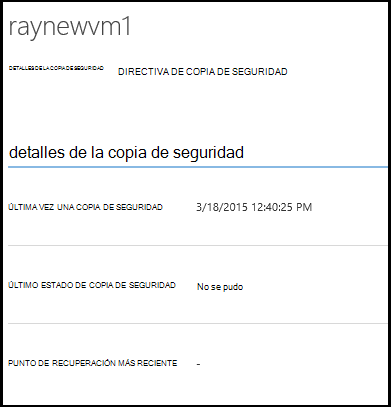

3. Para ver y administrar las directivas de copia de seguridad configuración de una máquina virtual, haga clic en la ficha **directivas** .

    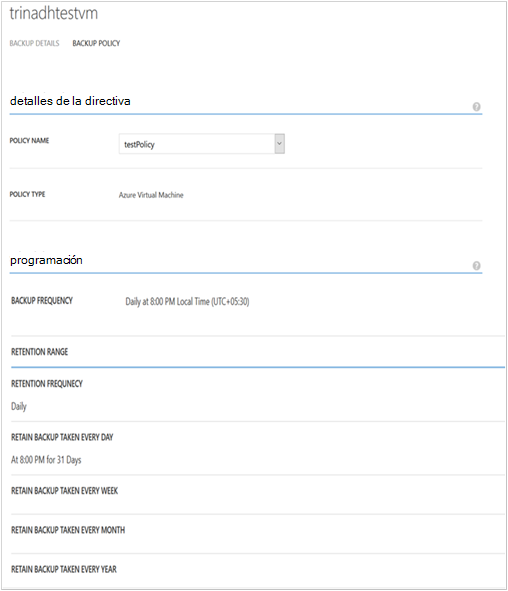

    La ficha **Directivas de copia de seguridad** muestra la directiva existente. Puede modificar según sea necesario. Si tiene que crear una nueva directiva haga clic en **crear** en la página **directivas** . Tenga en cuenta que si desea quitar una directiva no debería tener cualquier máquinas virtuales asociadas.

    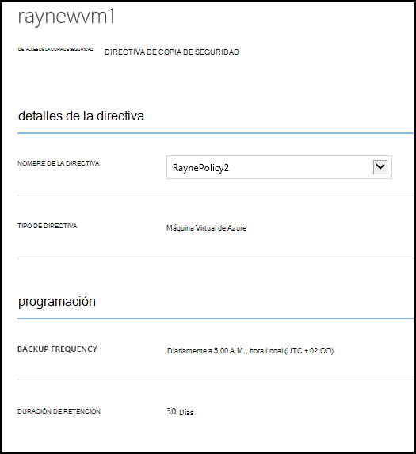

4. Puede obtener más información acerca de acciones o estado de una máquina virtual en la página de **trabajos** . Haga clic en un trabajo en la lista para obtener más detalles o filtrar trabajos para una máquina virtual específica.

    

## <a name="on-demand-backup-of-a-virtual-machine"></a>Copia de seguridad a petición de una máquina virtual
Puede tomar una petición copia de seguridad de una máquina virtual una vez configurada para la protección. Si la copia de seguridad inicial está pendiente de la máquina virtual, copia de seguridad a petición creará una copia completa de la máquina virtual en depósito de copia de seguridad de Azure. Si se completa la primera copia de seguridad, será de copia de seguridad a petición solo envío de cambios de copia de seguridad anterior a la copia de seguridad de Azure depósito, es decir, es siempre incremental.

>[AZURE.NOTE] Duración de retención de una copia de seguridad a petición se establece en el valor de retención especificado para el período de retención diaria de directiva de copia de seguridad correspondiente a la máquina virtual.  

Para realizar una copia de seguridad de una máquina virtual a petición:

1. Vaya a la página de **Elementos protegidos** y seleccione **Máquina Virtual de Azure** como **tipo** (si no está seleccionada) y haga clic en el botón **Seleccionar** .

    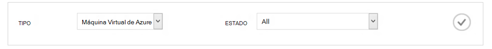

2. Seleccione la máquina virtual en la que desea tomar una petición de copia de seguridad y haga clic en el botón de **Copia de seguridad ahora** en la parte inferior de la página.

    

    Se creará un trabajo de copia de seguridad en la máquina virtual seleccionada. Intervalo de retención de punto de recuperación creado mediante este trabajo será igual que especificó en la directiva asociada con la máquina virtual.

    

    >[AZURE.NOTE] Para ver la directiva asociada con un equipo virtual, profundizar en máquina virtual en la página de **Elementos protegidos** y vaya a la ficha Directiva de copia de seguridad.

3. Una vez creado el trabajo, puede hacer clic en el botón de **trabajo de la vista** de la barra de brindar para ver el trabajo correspondiente en la página de trabajos.

    

4. Después de completar el trabajo correctamente, un punto de recuperación se creará que puede usar para restaurar la máquina virtual. Esto también incrementará el valor de columna de punto de recuperación por 1 en la página de **Elementos protegidos** .

## <a name="stop-protecting-virtual-machines"></a>Dejar de proteger máquinas virtuales de Windows
Puede dejar las futuras copias de seguridad de una máquina virtual con las siguientes opciones:

- Conservar los datos de copia de seguridad asociados a máquina virtual en depósito de copia de seguridad de Azure
- Eliminar los datos de copia de seguridad asociados con máquina virtual

Si ha seleccionado para conservar los datos de copia de seguridad asociados a máquina virtual, puede usar los datos de copia de seguridad para restaurar la máquina virtual. Detalles de precios de dichas máquinas virtuales de Windows, haga clic en [aquí](https://azure.microsoft.com/pricing/details/backup/).

Detener la protección de una máquina virtual:

1. Vaya a la página de **Elementos protegidos** y seleccione **Azure máquina virtual** como el tipo de filtro (si no está seleccionada) y haga clic en el botón **Seleccionar** .

    

2. Seleccione la máquina virtual y haga clic en **Detener protección** en la parte inferior de la página.

    

3. De forma predeterminada, copia de seguridad de Azure no eliminar los datos de copia de seguridad asociados con la máquina virtual.

    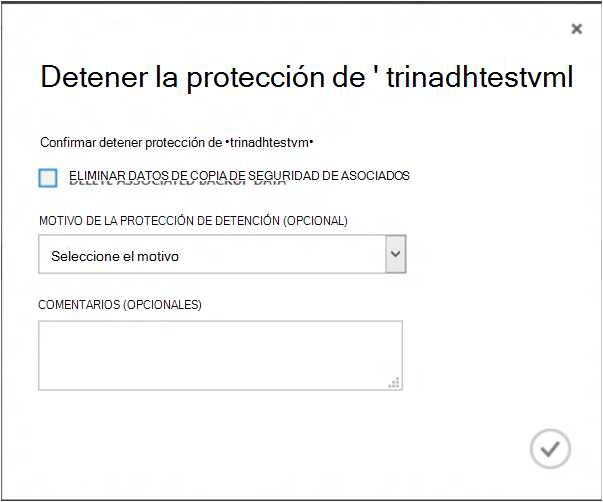

    Si desea eliminar datos de copia de seguridad, seleccione la casilla de verificación.

    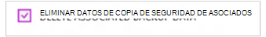

    Seleccione un motivo para detener la copia de seguridad. Aunque es opcional, proporcionar un motivo le ayudará a copia de seguridad de Azure para trabajar en los comentarios y prioridades a los escenarios de cliente.

4. Haga clic en el botón **Enviar** para enviar el trabajo **Detener protección** . Haga clic en **Vista de trabajo** para ver el trabajo en la página **trabajos** correspondiente.

    

    Si no ha seleccionado la opción de **Eliminar datos de copia de seguridad asociados** durante el Asistente para **Suspender la protección** y luego conclusión del trabajo de publicación, estado de protección cambia a **Detener protección**. Los datos se mantienen con copia de seguridad de Azure hasta que se elimine explícitamente. Siempre puede eliminar los datos, seleccione la máquina virtual en la página de **Elementos protegidos** y haciendo clic en **Eliminar**.

    

    Si ha seleccionado la opción de **Eliminar datos de copia de seguridad asociados** , la máquina virtual no formar parte de la página de **Elementos protegidos** .

## <a name="re-protect-virtual-machine"></a>Volver a proteger el equipo Virtual
Si no ha seleccionado la opción de **Eliminar datos de copia de seguridad asociados** en **Detener protección**, puede volver a proteger la máquina virtual siguiendo los pasos similares a una copia de seguridad registrados máquinas virtuales de Windows. Una vez protegido, esta máquina virtual tendrá datos de copia de seguridad que se conservan antes de detener protección y puntos de recuperación crean después de volver a proteger.

Después de volver a proteger, se cambiará el estado de protección de la máquina virtual a **protegido** si hay puntos de recuperación antes de **Suspender la protección**.

  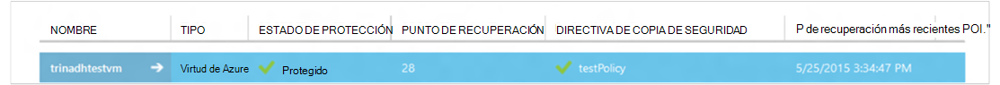

>[AZURE.NOTE] Cuando vuelva a proteger la máquina virtual, puede elegir una directiva diferente a la directiva que máquina virtual estaba protegida inicialmente.

## <a name="unregister-virtual-machines"></a>Anular el registro de máquinas virtuales

Si desea quitar la máquina virtual de la cámara de copia de seguridad:

1. Haga clic en el botón de **eliminación del registro** en la parte inferior de la página.

    

    Aparecerá una notificación en la parte inferior de la pantalla de solicitud de confirmación. Haga clic en **Sí** para continuar.

    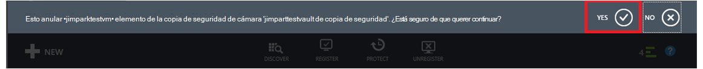

## <a name="delete-backup-data"></a>Eliminar datos de copia de seguridad
Puede eliminar los datos de copia de seguridad asociados con una máquina virtual, ya sea:

- Durante la tarea de protección de detención
- Después de una protección Detener trabajo se ha completado en una máquina virtual

Para eliminar datos de copia de seguridad en una máquina virtual, que se encuentra en el estado de *Protección detenido* registrar éxito de un trabajo **Dejar una copia de seguridad** :

1. Vaya a la página de **Elementos protegidos** y seleccione **Máquina Virtual de Azure** como *tipo* , haga clic en el botón **Seleccionar** .

    

2. Seleccione la máquina virtual. La máquina virtual estará en **Detener protección de** estado.

    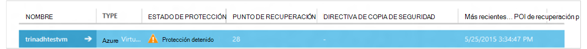

3. Haga clic en el botón **Eliminar** en la parte inferior de la página.

    

4. En el Asistente para **Eliminar datos de copia de seguridad** , seleccione un motivo para eliminar los datos de copia de seguridad (es muy recomendados) y haga clic en **Enviar**.

    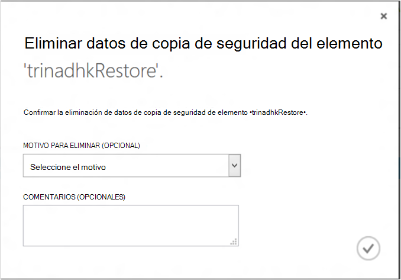

5. Esta opción creará un trabajo para eliminar los datos de copia de seguridad de la máquina virtual seleccionada. Haga clic en el **trabajo de la vista** para ver el trabajo correspondiente en la página trabajos.

    

    Una vez completada la tarea, se eliminarán la entrada correspondiente a la máquina virtual de la página de **elementos protegidos** .

## <a name="dashboard"></a>Panel
En la página de **panel** puede revisar información sobre máquinas virtuales de Windows Azure, su almacenamiento y trabajos asociados con ellos en las últimas 24 horas. Puede ver el estado de copia de seguridad y los errores de copia de seguridad asociados.


>[AZURE.NOTE] Valores en el panel se actualizan cada 24 horas.

## <a name="auditing-operations"></a>Operaciones de auditoría
Copia de seguridad de Azure proporciona revisión de los "registros de operación" de las operaciones de copia de seguridad desencadenados por el cliente lo que posibilita ver exactamente qué operaciones de administración se realizaron en depósito de copia de seguridad. Registros de operaciones Habilitar evaluación excelente y las operaciones de copia de seguridad de auditoría.

Las siguientes operaciones se graban en registros de operación:

- Registrar
- Eliminar del registro
- Configurar la protección
- Copia de seguridad (ambos programadas así como copia de seguridad a petición a través de BackupNow)
- Restaurar
- Detener la protección
- Eliminar datos de copia de seguridad
- Agregar directiva
- Eliminar la directiva
- Directiva de actualización
- Cancelar trabajo

Para ver los registros de operación correspondiente a un depósito de copia de seguridad:

1. Vaya a **Servicios de administración** en el portal de Azure y, a continuación, haga clic en la pestaña de la **Operación de registros** .

    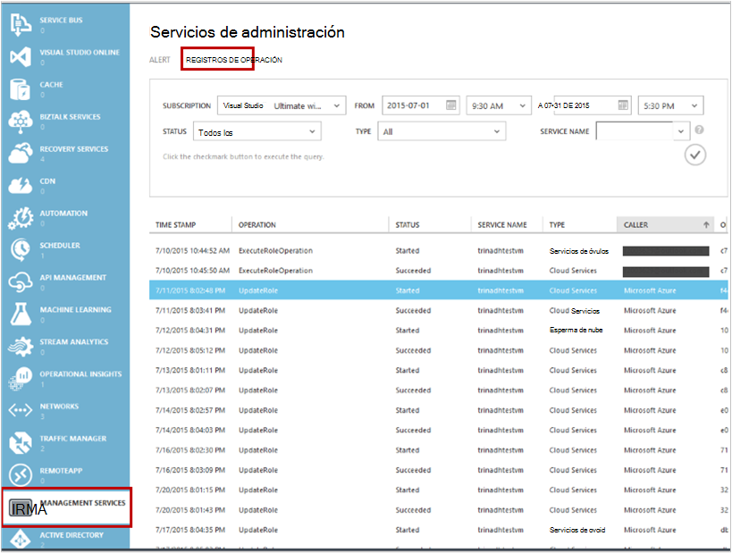

2. En los filtros, seleccione **una copia de seguridad** como *tipo* y especifique el nombre de la copia de seguridad de cámara en *nombre de servicio* y haga clic en **Enviar**.

    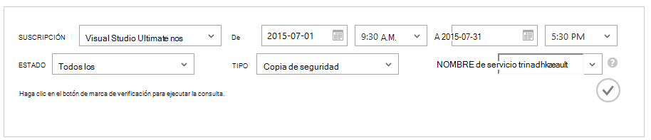

3. En los registros de las operaciones, seleccione cualquier operación y haga clic en **Detalles** para ver los detalles correspondiente a una operación.

    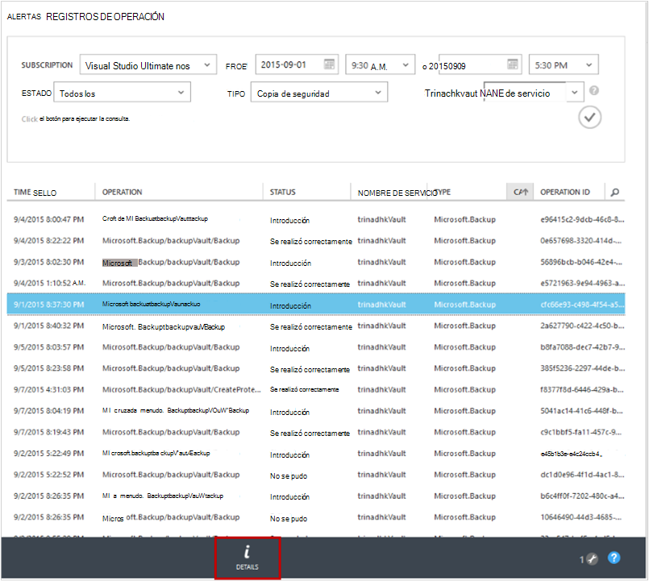

    El **Asistente detalles** contiene información sobre la operación activada, Id, en el que se activa esta operación y hora de inicio de la operación de recursos de trabajo.

    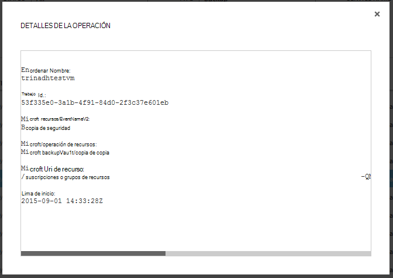

## <a name="alert-notifications"></a>Notificaciones de alerta
Puede obtener notificaciones de alerta personalizadas para las tareas en el portal. Esto se logra definiendo reglas de alerta de PowerShell en eventos de registros operativos. Se recomienda usar *PowerShell versión 1.3.0 o anterior*.

Para definir una notificación personalizada para errores de copia de seguridad, un comando de ejemplo será similar:

```
PS C:\> $actionEmail = New-AzureRmAlertRuleEmail -CustomEmail contoso@microsoft.com
PS C:\> Add-AzureRmLogAlertRule -Name backupFailedAlert -Location "East US" -ResourceGroup RecoveryServices-DP2RCXUGWS3MLJF4LKPI3A3OMJ2DI4SRJK6HIJH22HFIHZVVELRQ-East-US -OperationName Microsoft.Backup/backupVault/Backup -Status Failed -TargetResourceId /subscriptions/86eeac34-eth9a-4de3-84db-7a27d121967e/resourceGroups/RecoveryServices-DP2RCXUGWS3MLJF4LKPI3A3OMJ2DI4SRJK6HIJH22HFIHZVVELRQ-East-US/providers/microsoft.backupbvtd2/BackupVault/trinadhVault -Actions $actionEmail
```

**ResourceId**: puede obtener esto desde el menú emergente de registros de operaciones descrito en la sección. ResourceUri en la ventana emergente de detalles de una operación es ResourceId suministrados para este cmdlet.

**OperationName**: se trata del formato de "Microsoft.Backup/backupvault/<EventName>" donde EventName es uno de registrar, anular, ConfigureProtection, hacer copia de seguridad, restaurar, StopProtection, DeleteBackupData, CreateProtectionPolicy, DeleteProtectionPolicy, UpdateProtectionPolicy

**Estado**: admite valores son-iniciado correctamente y errores.

**ResourceGroup**: ResourceGroup del recurso en el que se activa la operación. Se puede obtener el valor de ResourceId. Valor entre campos */resourceGroups/* y */providers/* ResourceId valor es el valor de ResourceGroup.

**Nombre**: nombre de la regla de alerta.

**CustomEmail**: especifique la dirección de correo electrónico personalizado a la que desea enviar notificación de alerta

**SendToServiceOwners**: esta opción envía notificaciones de alertas para todos los administradores y coadministradores de la suscripción. Se puede usar en cmdlet **AzureRmAlertRuleEmail de nuevo**

### <a name="limitations-on-alerts"></a>Limitaciones de alertas
Alertas basadas en eventos están sujetos a las limitaciones siguientes:

1. Los avisos se activan en todos los equipos virtuales en depósito de copia de seguridad. No se puede personalizar para recibir las alertas de un conjunto determinado de máquinas virtuales de un depósito de copia de seguridad.
2. Esta característica está en vista previa. [Aprende más](../monitoring-and-diagnostics/insights-powershell-samples.md#create-alert-rules)
3. Recibir alertas de "alerts-noreply@mail.windowsazure.com". Actualmente no se puede modificar el remitente de correo electrónico.

## <a name="next-steps"></a>Pasos siguientes

- [Restaurar máquinas virtuales de Azure](backup-azure-restore-vms.md)
