<properties
    pageTitle="Administrar las copias de seguridad de la máquina virtual de implementada por el Administrador de recursos | Microsoft Azure"
    description="Obtenga información sobre cómo administrar y supervisar las copias de seguridad de la máquina virtual de implementada por el Administrador de recursos"
    services="backup"
    documentationCenter=""
    authors="trinadhk"
    manager="shreeshd"
    editor=""/>

<tags
    ms.service="backup"
    ms.workload="storage-backup-recovery"
    ms.tgt_pltfrm="na"
    ms.devlang="na"
    ms.topic="article"
    ms.date="08/11/2016"
    ms.author="jimpark; markgal; trinadhk"/>

# Administrar las copias de seguridad de Azure máquina virtual

> [AZURE.SELECTOR]
- [Administrar las copias de seguridad de Azure VM](backup-azure-manage-vms.md)
- [Administrar las copias de seguridad de VM clásica](backup-azure-manage-vms-classic.md)

Este artículo proporciona instrucciones sobre cómo administrar las copias de seguridad de la máquina virtual y explica la información de alertas de copia de seguridad disponible en el panel de portal. Las instrucciones de este artículo se aplica a usar máquinas virtuales con depósitos de servicios de recuperación. Este artículo trata sobre la creación de máquinas virtuales ni le explican cómo proteger máquinas virtuales de Windows. Para instrucciones detalladas sobre cómo proteger máquinas virtuales implementado por el Administrador de recursos de Azure en Azure con un depósito de servicios de recuperación, consulte [busque primero: VM a un depósito de servicios de recuperación de copia de seguridad](backup-azure-vms-first-look-arm.md).

## Administrar depósitos y máquinas virtuales protegidos

En el portal de Azure, el panel de servicios de recuperación depósito proporciona acceso a información acerca de la cámara, incluyendo:

- instantánea de copia de seguridad más reciente, que es también el último punto de restauración < br\>
- la directiva de copia de seguridad < br\>
- tamaño de todas las instantáneas de copia de seguridad total < br\>
- número de máquinas virtuales que están protegidos con la cámara < br\>

Muchas de las tareas de administración con una copia de seguridad de la máquina virtual comiencen con la apertura de la cámara en el panel. Sin embargo, porque depósitos pueden usarse para proteger varios elementos (o varios VM), para ver los detalles de una máquina virtual determinada, abra el panel de elemento de la cámara. El procedimiento siguiente muestra cómo abrir el *panel de la cámara* y continúe con el *panel de elemento de cámara*. Hay "sugerencias" en ambos procedimientos que indique cómo agregar la cámara y depósito elemento al panel Azure usando el Pin al comando de paneles. Anclar al panel es una forma de crear un acceso directo a la cámara o el elemento. También puede ejecutar comandos comunes desde el acceso directo.

>[AZURE.TIP] Si tiene varios paneles y abra aspas, use el control deslizante del azul oscuro en la parte inferior de la ventana a la diapositiva en el panel de Azure y hacia atrás.

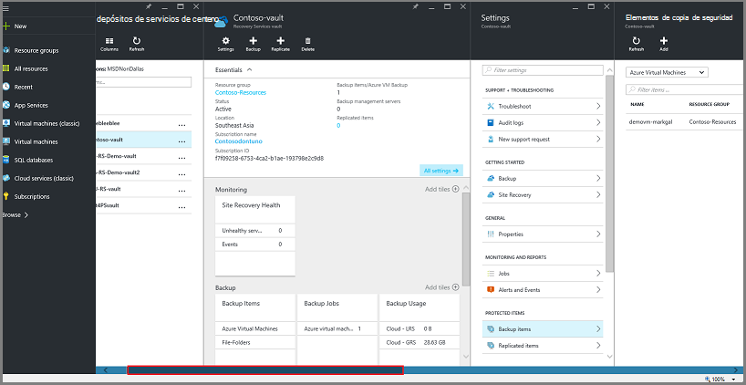

### Abrir un depósito de servicios de recuperación en el panel:

1. Inicie sesión en el [portal de Azure](https://portal.azure.com/).

2. En el menú de concentrador, haga clic en **Examinar** y en la lista de recursos, escriba **Servicios de recuperación**. Cuando comience a escribir, los filtros de la lista en función de la entrada. Haga clic en **Servicios de recuperación de cámara**.

      

    La lista de servicios de recuperación de depósitos se muestran.

    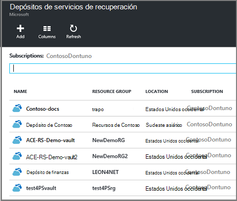  

    >[AZURE.TIP] Si ancla un depósito al panel de Azure, dicho depósito es accesible inmediatamente al abrir el portal de Azure. Para anclar un depósito al panel, en la lista de cámara, haga clic en la cámara y seleccione **Anclar al panel**.

3. En la lista de depósitos, seleccione el depósito para abrir su panel. Cuando seleccione el depósito, abren el panel de la cámara y el módulo de **configuración** . En la siguiente imagen, se resalta el panel de la **cámara de Contoso** .

    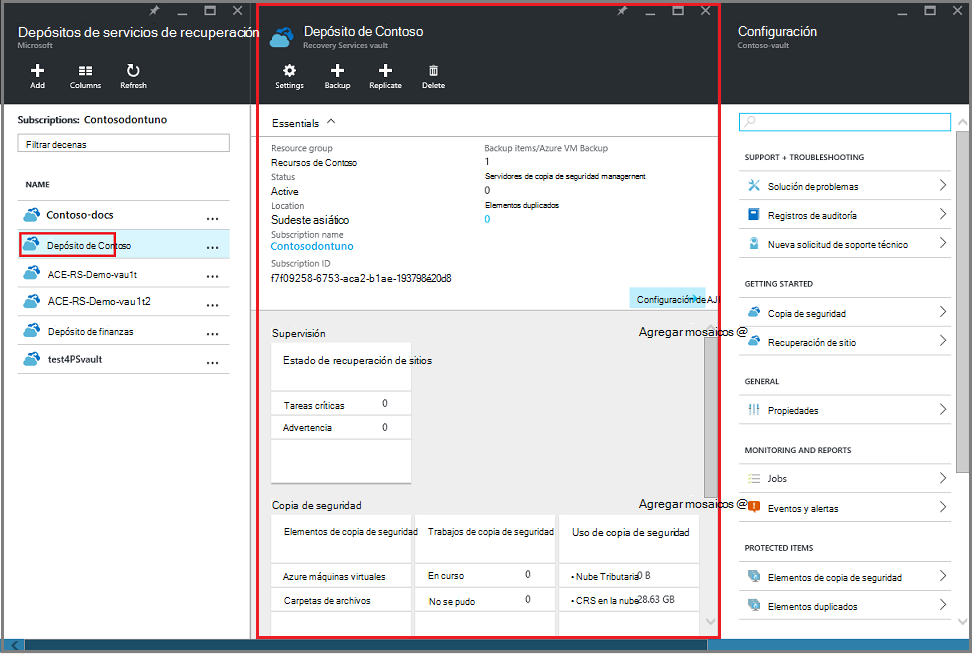

### Abrir un panel de elemento de cámara

En el procedimiento anterior al abrir el panel de la cámara. Para abrir el panel de elemento de la cámara:

1. En el panel de la cámara, en el mosaico de la **Copia de seguridad de elementos** , haga clic en **máquinas virtuales de Azure**.

    

    El módulo de **Copia de seguridad de elementos** muestra el último trabajo de copia de seguridad para cada elemento. En este ejemplo, hay una máquina virtual, demovm-markgal, protegida por este depósito.  

    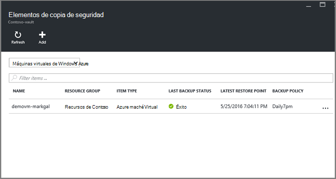

    >[AZURE.TIP] Para facilitar el acceso, puede anclar un elemento del depósito al panel de Azure. Para anclar un elemento de la cámara, en la lista de elementos de la cámara, haga clic en el elemento y seleccione **Anclar al escritorio**.

2. En el módulo de **Copia de seguridad de elementos** , haga clic en el elemento para abrir el panel de elemento de la cámara.

    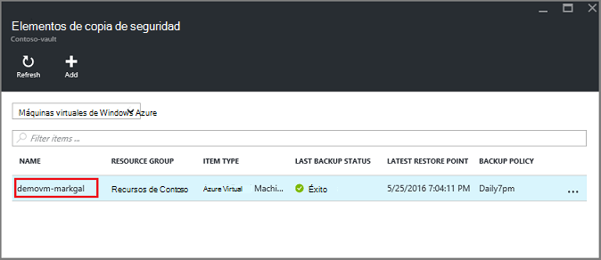

    Abren el panel de elemento de la cámara y su módulo de **configuración** .

    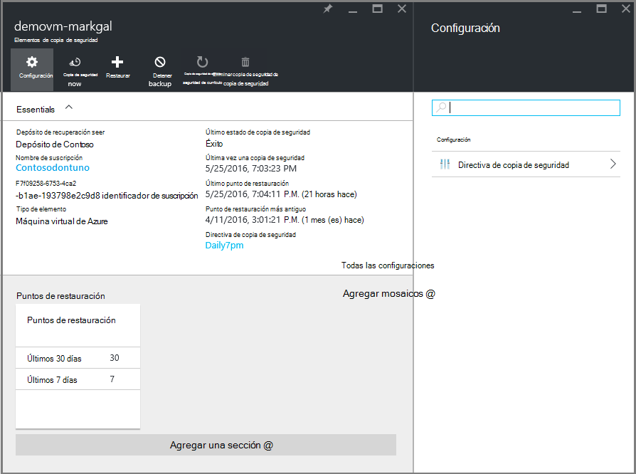

    Desde el panel de elemento de la cámara, puede realizar muchas de las tareas de administración de claves, como por ejemplo:

    - cambiar las directivas o crear una nueva directiva de copia de seguridad < br\>
    - ver los puntos de restauración y ver su estado de coherencia < br\>
    - copia de seguridad a petición de una máquina virtual < br\>
    - dejar de proteger máquinas virtuales < br\>
    - reanudar la protección de una máquina virtual < br\>
    - eliminar una copia de seguridad datos (o el punto de recuperación) < br\>
    - [restaurar una copia de seguridad (o el punto de recuperación)](./backup-azure-arm-restore-vms.md#restore-a-recovery-point) < br\>

Para los siguientes procedimientos, el punto de partida es el panel de elemento de la cámara.

## Administrar directivas de copia de seguridad

1. En el [panel de elemento de cámara](backup-azure-manage-vms.md#open-a-vault-item-dashboard), haga clic en **Todas las opciones** para abrir la hoja de **configuración** .

    

2. En el módulo de **configuración** , haga clic en **Directiva de copia de seguridad** para abrir esa hoja.

    En el módulo, se muestran los detalles de rango de retención y la frecuencia de copia de seguridad.

    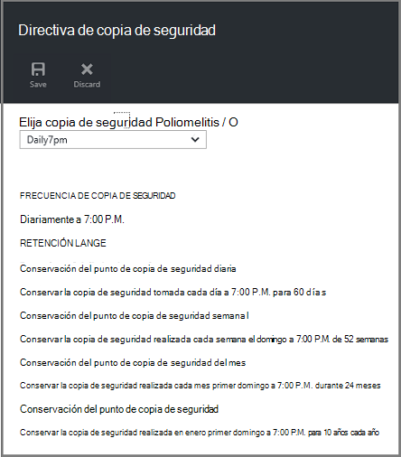

3. En el menú de la **Directiva de copia de seguridad de elegir** :
    - Para cambiar las directivas de, seleccione una directiva diferente y haga clic en **Guardar**. La nueva directiva se aplica inmediatamente a la cámara. < br\>
    - Para crear una directiva, seleccione **Crear nuevo**.

    

    Para obtener instrucciones sobre cómo crear una directiva de copia de seguridad, consulte [definir una directiva de copia de seguridad](backup-azure-manage-vms.md#defining-a-backup-policy).

[AZURE.INCLUDE [backup-create-backup-policy-for-vm](../../includes/backup-create-backup-policy-for-vm.md)]

## Copia de seguridad a petición de una máquina virtual
Puede tomar una petición copia de seguridad de una máquina virtual una vez configurada para la protección. Si la copia de seguridad inicial está pendiente, copia de seguridad a petición crea una copia completa de la máquina virtual en depósito de servicios de recuperación. Si se completa la copia de seguridad inicial, una copia de seguridad a petición sólo enviará cambios desde la instantánea anterior, en el depósito de servicios de recuperación. Es decir, las copias de seguridad de las siguientes son siempre incrementales.

>[AZURE.NOTE] El intervalo de retención de una copia de seguridad a petición es el valor de retención especificado para el punto de copia de seguridad diario de la directiva. Si no hay ningún punto de copia de seguridad diaria está activada, se utiliza el punto de copia de seguridad semanal.

Para activar una copia de seguridad a petición de una máquina virtual:

- En el [panel de elemento de cámara](backup-azure-manage-vms.md#open-a-vault-item-dashboard), haga clic en **copia de seguridad ahora**.

    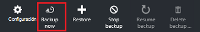

    El portal se asegura de que desea iniciar un trabajo de copia de seguridad a petición. Haga clic en **Sí** para iniciar el trabajo de copia de seguridad.

    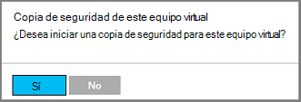

    El trabajo de copia de seguridad crea un punto de recuperación. El rango de retención del punto de recuperación es el mismo que el rango de retención especificado en la directiva asociada con la máquina virtual. Para realizar un seguimiento del progreso para el trabajo, en el panel de la cámara, haga clic en el mosaico de **Trabajos de copia de seguridad** .  

## Dejar de proteger máquinas virtuales de Windows
Si elige detener la protección de una máquina virtual, le pregunte si desea conservar los puntos de recuperación. Hay dos formas de detener la protección de máquinas virtuales de Windows:
- detener todos los futuros trabajos de copia de seguridad y eliminar todos los puntos de recuperación, o
- detener todos los futuros trabajos de copia de seguridad, pero dejar los puntos de recuperación  

Hay un coste asociado a salir de los puntos de recuperación de almacenamiento. Sin embargo, el beneficio de salir de los puntos de recuperación es que puede restaurar la máquina virtual más adelante, si lo desea. Para obtener información acerca de los costos de salir de los puntos de recuperación, consulte los [Detalles de precios](https://azure.microsoft.com/pricing/details/backup/). Si opta por eliminar todos los puntos de recuperación, no puede restaurar la máquina virtual.

Detener la protección de una máquina virtual:

1. En el [panel de elemento de cámara](backup-azure-manage-vms.md#open-a-vault-item-dashboard), haga clic en **Detener copia de seguridad**.

    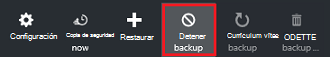

    Se abre el módulo de dejar de copia de seguridad.

    

2. En el módulo **Dejar una copia de seguridad** , elija si desea conservar o eliminar los datos de copia de seguridad. El cuadro información proporciona detalles acerca de su elección.

    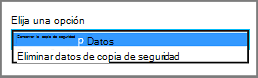

3. Si decide conservar los datos de copia de seguridad, vaya al paso 4. Si opta por eliminar los datos de copia de seguridad, confirme que desea dejar de los trabajos de copia de seguridad y eliminar los puntos de recuperación: escriba el nombre del elemento.

    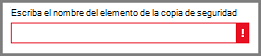

    Si no está seguro del nombre del elemento, mantenga el mouse sobre el signo de exclamación para ver el nombre. Además, el nombre del elemento es en **Detener la copia de seguridad** en la parte superior de la hoja.

4. Opcionalmente, proporcione un **motivo** o **comentario**.

5. Para detener el trabajo de copia de seguridad del elemento actual, haga clic en  

    Un mensaje de notificación le permite saber que se han detenido los trabajos de copia de seguridad.

    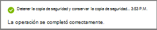

## Reanudar la protección de una máquina virtual
Si se selecciona la opción de **Conservar datos de copia de seguridad** cuando se ha detenido la protección de la máquina virtual, es posible reanudar la protección. Si se selecciona la opción de **Eliminar datos de copia de seguridad** , no puede reanudar la protección de la máquina virtual.

Para reanudar la protección de la máquina virtual

1. En el [panel de elemento de cámara](backup-azure-manage-vms.md#open-a-vault-item-dashboard), haga clic en **Reanudar copia de seguridad**.

    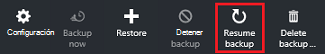

    Se abre el módulo de directivas de copia de seguridad.

    >[AZURE.NOTE] Cuando vuelva a proteger la máquina virtual, puede elegir una directiva diferente a la directiva que máquina virtual estaba protegida inicialmente.

2. Siga los pasos de [directivas de cambiar o crear una nueva directiva de copia de seguridad](backup-azure-manage-vms.md#change-policies-or-create-a-new-backup-policy), para asignar las directivas de la máquina virtual.

    Una vez que se aplique la directiva de copia de seguridad en la máquina virtual, vea el siguiente mensaje.

    

## Eliminar datos de copia de seguridad
Puede eliminar los datos de copia de seguridad asociados con un equipo virtual durante el trabajo de **copia de seguridad de detener** o en cualquier momento después de la copia de seguridad se haya completado el trabajo. Incluso puede ser conveniente que esperar días o semanas antes de eliminar los puntos de recuperación. A diferencia de restaurar puntos de recuperación, al eliminar datos de copia de seguridad, no puede elegir puntos de recuperación específicos para eliminar. Si opta por eliminar los datos de copia de seguridad, eliminar todos los puntos de recuperación asociados con el elemento.

El procedimiento siguiente asume el trabajo de copia de seguridad de la máquina virtual se ha detenido o deshabilitado. Una vez que el trabajo de copia de seguridad está deshabilitado, las opciones de **Reanudar copia de seguridad** y **eliminar la copia de seguridad** están disponibles en el panel de elemento de la cámara.

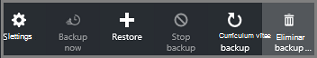

Para eliminar datos de copia de seguridad en una máquina virtual con la *copia de seguridad deshabilitada*:

1. En el [panel de elemento de cámara](backup-azure-manage-vms.md#open-a-vault-item-dashboard), haga clic en **Eliminar copia de seguridad**.

    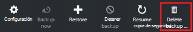

    Se abre el módulo de **Eliminar datos de copia de seguridad** .

    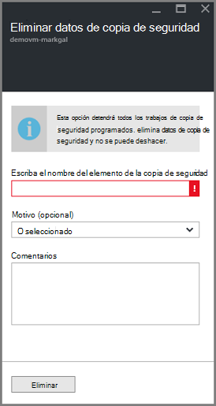

2. Escriba el nombre del elemento para confirmar que desea eliminar los puntos de recuperación.

    

    Si no está seguro del nombre del elemento, mantenga el mouse sobre el signo de exclamación para ver el nombre. Además, el nombre del elemento es en **Eliminar datos de copia de seguridad** en la parte superior de la hoja.

3. Opcionalmente, proporcione un **motivo** o **comentario**.

4. Para eliminar los datos de copia de seguridad del elemento actual, haga clic en  

    Un mensaje de notificación le permite saber que los datos de copia de seguridad se ha eliminado.

## Pasos siguientes

Para obtener información sobre cómo volver a crear una máquina virtual desde un punto de recuperación, consulte [Restaurar máquinas virtuales de Azure](backup-azure-restore-vms.md). Si necesita información sobre cómo proteger su máquinas virtuales de Windows, vea [busque primero: VM a un depósito de servicios de recuperación de copia de seguridad](backup-azure-vms-first-look-arm.md). Para obtener información acerca de cómo supervisar eventos, vea [alertas del Monitor para las copias de seguridad de la máquina virtual de Azure](backup-azure-monitor-vms.md).
