<properties
    pageTitle="Administrar servidores mediante el modelo de implementación clásico de Azure y depósitos de copia de seguridad de Azure | Microsoft Azure"
    description="Use este tutorial para aprender a administrar depósitos de copia de seguridad de Azure y servidores."
    services="backup"
    documentationCenter=""
    authors="markgalioto"
    manager="jwhit"
    editor="tysonn"/>

<tags
    ms.service="backup"
    ms.workload="storage-backup-recovery"
    ms.tgt_pltfrm="na"
    ms.devlang="na"
    ms.topic="article"
    ms.date="09/27/2016"
    ms.author="jimpark;markgal"/>

# Administrar depósitos de copia de seguridad de Azure y servidores mediante el modelo de implementación clásica

> [AZURE.SELECTOR]
- [Administrador de recursos](backup-azure-manage-windows-server.md)
- [Clásico](backup-azure-manage-windows-server-classic.md)

En este artículo encontrará una descripción general de las tareas de administración de copia de seguridad disponibles a través del portal clásico Azure y el agente de copia de seguridad de Microsoft Azure.

[AZURE.INCLUDE [learn-about-deployment-models](../../includes/learn-about-deployment-models-classic-include.md)]Modelo de implementación de administrador de recursos.

## Tareas de administración de portal
1. Inicie sesión en el [Portal de administración](https://manage.windowsazure.com).

2. Haga clic en **Servicios de recuperación**y luego haga clic en el nombre del depósito de copia de seguridad para ver la página de inicio rápido.

    

Seleccionando las opciones en la parte superior de la página de inicio rápido, puede ver las tareas de administración disponibles.

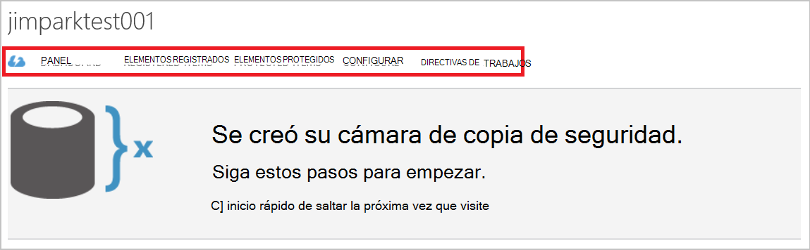

### Panel
Seleccione el **panel** para ver un resumen de uso para el servidor. La **información general de uso** incluye:

- El número de servidores de Windows registrado en la nube
- El número de Azure máquinas virtuales de Windows protegido en nube
- El almacenamiento total consumido en Azure
- El estado de los trabajos recientes

En la parte inferior del panel puede realizar las siguientes tareas:

- **Certificado de administrar** : si se ha usado un certificado para registrar el servidor, a continuación, use esta opción para actualizar el certificado. Si está utilizando las credenciales de la cámara, no utilice **Administrar certificado**.
- **Eliminar** : elimina el depósito de copia de seguridad actual. Si ya no se utiliza un depósito de copia de seguridad, puede eliminarlo para liberar espacio de almacenamiento. **Eliminar** sólo está habilitado después de que se hayan eliminado todos los servidores registrados desde la cámara.

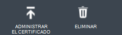

## Elementos registrados
Seleccionar **Elementos registrados** para ver los nombres de los servidores que están registrados en este depósito.

El filtro de **tipo** de forma predeterminada en Máquina Virtual de Azure. Para ver los nombres de los servidores que están registrados en este depósito, seleccione **Windows server** desde el menú desplegable.

Desde aquí puede realizar las siguientes tareas:

- **Permitir que el nuevo registro** : cuando se selecciona esta opción para un servidor puede utilizar el **Asistente de registro** en el agente de copia de seguridad de Microsoft Azure local para registrar el servidor con la copia de seguridad depósito una segunda vez. Debe volver a registrar debido a un error en el certificado o si tenía un servidor que volver a crearse.
- **Eliminar** - elimina un servidor de la cámara de copia de seguridad. Se elimina todos los datos almacenados asociados con el servidor inmediatamente.

    

## Elementos protegidos
Seleccionar **Elementos protegidos** para ver los elementos que han se ha realizado una copia de los servidores.

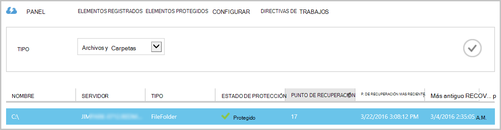

## Configurar

En la pestaña **Configurar** puede seleccionar la opción de redundancia de almacenamiento apropiado. La mejor hora para seleccionar la opción de redundancia de almacenamiento es correcta después de crear un depósito y antes de que todos los equipos están registrados en él.

>[AZURE.WARNING] Una vez que se ha registrado un elemento a la cámara, la opción de redundancia de almacenamiento está bloqueada y no se puede modificar.

Consulte este artículo para obtener más información acerca de [redundancia de almacenamiento](../storage/storage-redundancy.md).

## Tareas de agente de copia de seguridad de Microsoft Azure

### Consola

Abra el **agente de copia de seguridad de Microsoft Azure** (puede encontrarlo buscando en el equipo de *Copia de seguridad de Microsoft Azure*).

Puede realizar las siguientes tareas de administración de las **acciones** disponibles a la derecha de la consola de agente de copia de seguridad:

- Registrar servidor
- Copia de seguridad de programación
- Realizar una copia de seguridad ahora
- Cambiar las propiedades

>[AZURE.NOTE] Para **Recuperar datos**, consulte [Restaurar archivos en un servidor de Windows o el equipo cliente de Windows](backup-azure-restore-windows-server.md).

### Modificar una copia de seguridad existente

1. Haga clic en **Programar copia de seguridad**en el agente de copia de seguridad de Microsoft Azure.

    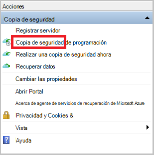

2. En el **Asistente para la programación de copia de seguridad** , deje seleccionada la opción **realizar cambios en los elementos de copia de seguridad u horas** y haga clic en **siguiente**.

    

3. Si desea agregar o modificar elementos, haga clic en **Agregar elementos**en la pantalla **Seleccionar elementos de la copia de seguridad** .

    También puede establecer la **Configuración de exclusión** de esta página del asistente. Si desea excluir archivos o tipos de archivo lea el procedimiento para agregar una [configuración de exclusiones](#exclusion-settings).

4. Seleccione los archivos y carpetas que desea hacer copia de seguridad y haga clic en **Aceptar**.

    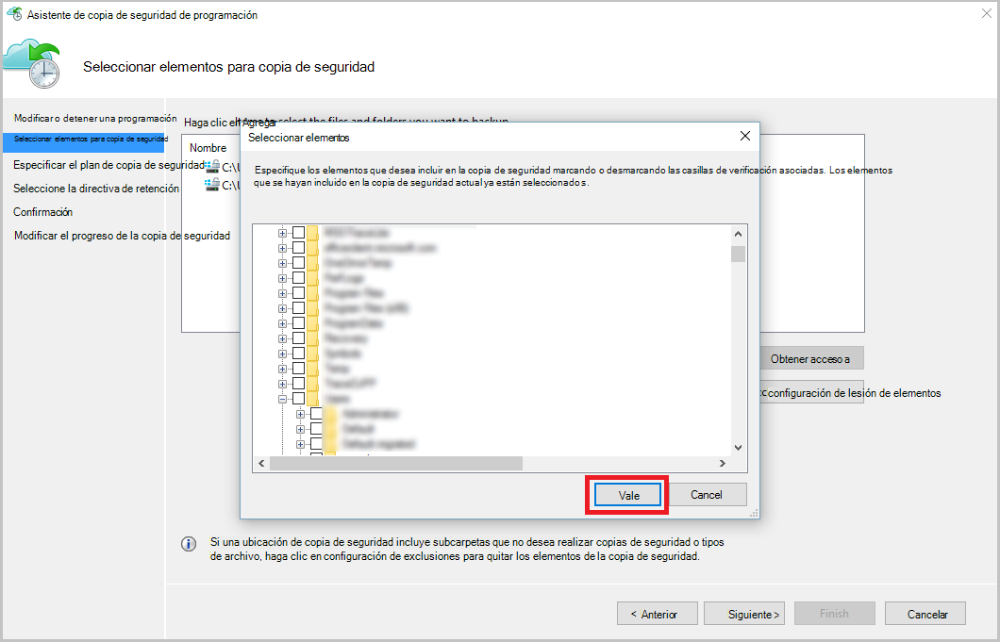

5. Especifique la **programación de copia de seguridad** y haga clic en **siguiente**.

    Puede programar diaria (con un máximo de 3 veces al día) o copias de seguridad semanales.

    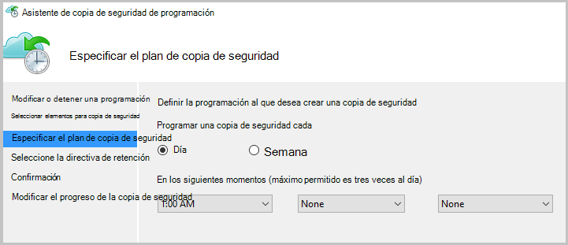

    >[AZURE.NOTE] Especificar la programación de copia de seguridad se explica detalladamente en este [artículo](backup-azure-backup-cloud-as-tape.md).

6. Seleccione la **Directiva de retención** de la copia de seguridad y haga clic en **siguiente**.

    

7. En la pantalla de **confirmación** , revise la información y haga clic en **Finalizar**.

8. Una vez que el asistente termine de crear la **programación de copia de seguridad**, haga clic en **Cerrar**.

    Después de modificar la protección, puede confirmar que las copias de seguridad activan correctamente, vaya a la pestaña **tareas** y confirmar que los cambios se reflejarán en los trabajos de copia de seguridad.

### Habilitar el límite de red  
El agente de copia de seguridad de Azure proporciona una ficha de regulación que le permite controlar cómo se usa el ancho de banda durante la transferencia de datos. Este control puede ser útil si necesita hacer una copia de los datos durante horas de trabajo pero no desea que el proceso de copia de seguridad para interferir con otro tráfico de internet. Limitación de datos se aplica transferencia para realizar copias de seguridad y restaurar las actividades.  

Habilitar el límite:

1. En el **agente de copia de seguridad**, haga clic en **Cambiar las propiedades**.

2. Seleccione la casilla de verificación **Habilitar límite para operaciones de copia de seguridad de uso de ancho de banda de internet** .

    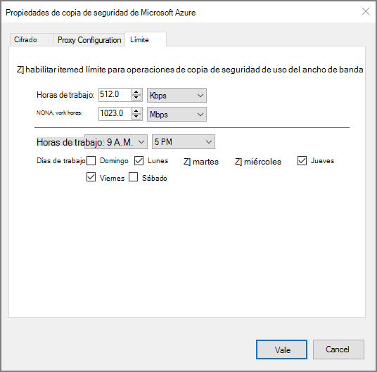

3. Una vez habilitada la limitación, especifique el ancho de banda permitido para transferir datos de copia de seguridad durante el **horario de trabajo** y las **horas de trabajo no**.

    Los valores de ancho de banda comienzan en 512 kilobytes por segundo y pueden ir hasta 1023 megabytes por segundo (Mbps). También puede designar el inicio y finalización para las **horas de trabajo**y los días de la semana se consideran trabajo días. Se considera el tiempo fuera de las horas de trabajo designados no jornada laboral.

4. Haga clic en **Aceptar**.

## Configuración de exclusiones

1. Abra el **agente de copia de seguridad de Microsoft Azure** (puede encontrarlo buscando en el equipo de *Copia de seguridad de Microsoft Azure*).

    

2. Haga clic en **Programar copia de seguridad**en el agente de copia de seguridad de Microsoft Azure.

    

3. En el Asistente de copia de seguridad de programación deje seleccionada la opción **realizar cambios en los elementos de copia de seguridad u horas** y haga clic en **siguiente**.

    

4. Haga clic en **configuración de exclusiones**.

    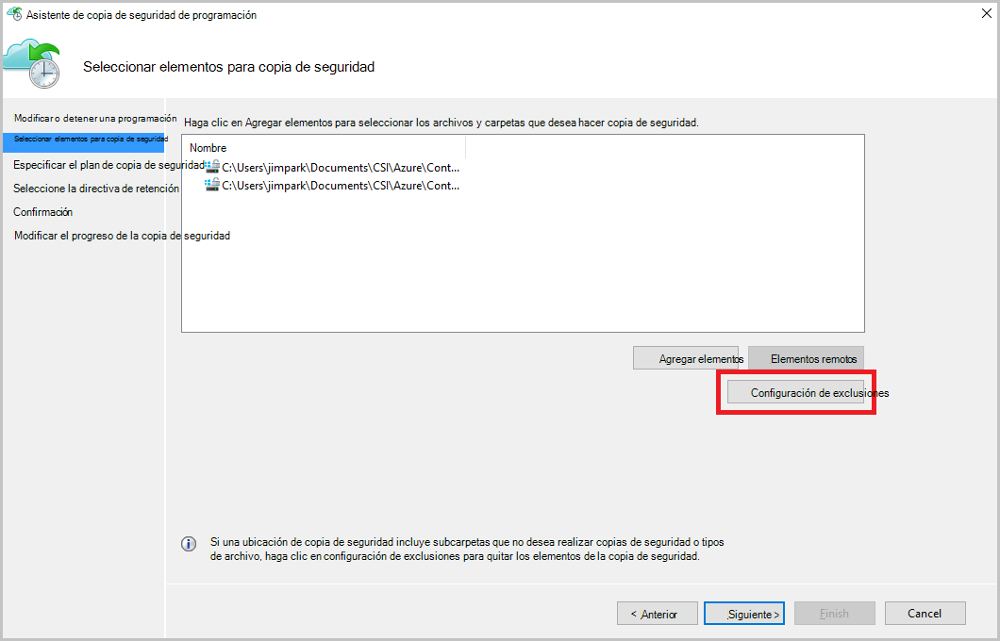

5. Haga clic en **Agregar exclusión**.

    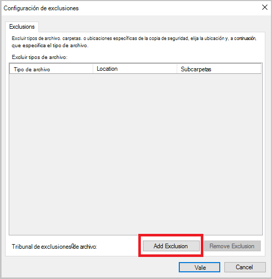

6. Seleccione la ubicación y, a continuación, haga clic en **Aceptar**.

    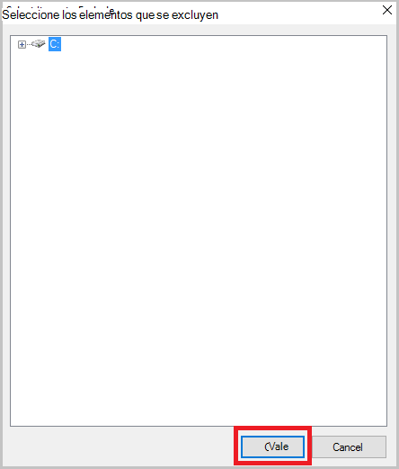

7. Agregar la extensión de archivo en el campo **Tipo de archivo** .

    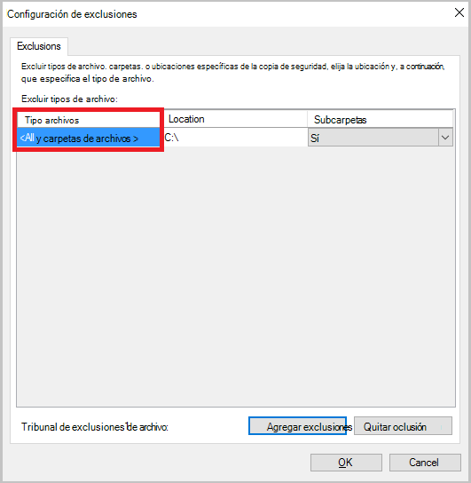

    Agregar una extensión. mp3

    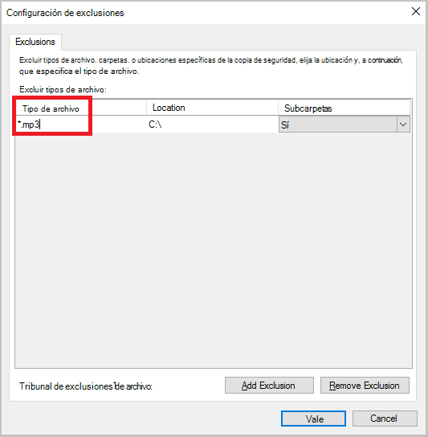

    Para agregar otra extensión, haga clic en **Agregar exclusión** y escriba otra extensión de tipo de archivo (agregando una extensión .jpeg).

    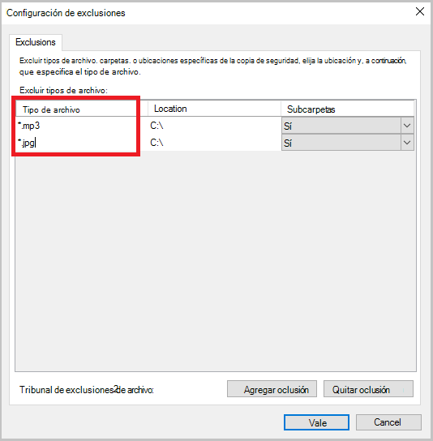

8. Cuando haya agregado todas las extensiones, haga clic en **Aceptar**.

9. Continúe con el Asistente de copia de seguridad de programación haciendo clic en **siguiente** hasta la **página de confirmación**, haga clic en **Finalizar**.

    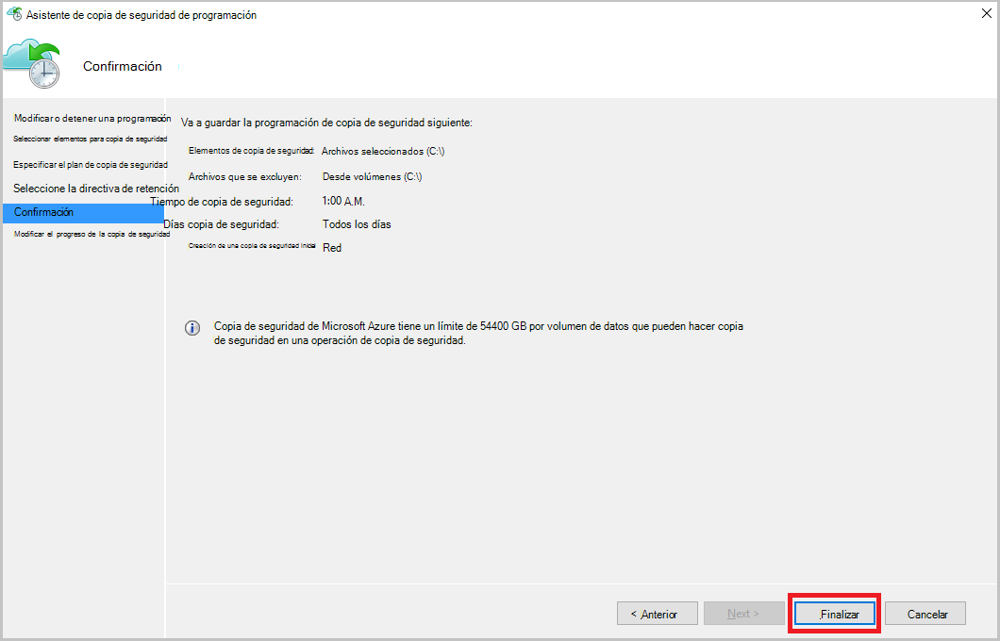

## Pasos siguientes
- [Restaurar Windows Server o cliente de Windows de Azure](backup-azure-restore-windows-server.md)
- Para obtener más información acerca de la copia de seguridad de Azure, consulte [Información general de copia de seguridad de Azure](backup-introduction-to-azure-backup.md)
- Visite el [foro de copia de seguridad de Azure](http://go.microsoft.com/fwlink/p/?LinkId=290933)
