<properties
    pageTitle="Administrar servidores y depósitos de servicios de recuperación de Azure | Microsoft Azure"
    description="Use este tutorial para obtener información sobre cómo administrar servidores y depósitos de servicios de recuperación de Azure."
    services="backup"
    documentationCenter=""
    authors="markgalioto"
    manager="cfreeman"
    editor="tysonn"/>

<tags
    ms.service="backup"
    ms.workload="storage-backup-recovery"
    ms.tgt_pltfrm="na"
    ms.devlang="na"
    ms.topic="article"
    ms.date="10/19/2016"
    ms.author="jimpark; markgal"/>


# <a name="monitor-and-manage-azure-recovery-services-vaults-and-servers-for-windows-machines"></a>Supervisar y administrar depósitos de servicios de recuperación de Azure y servidores para equipos con Windows

> [AZURE.SELECTOR]
- [Administrador de recursos](backup-azure-manage-windows-server.md)
- [Clásico](backup-azure-manage-windows-server-classic.md)

En este artículo encontrará una descripción general de las tareas de administración de copia de seguridad disponibles a través del portal de Azure y el agente de copia de seguridad de Microsoft Azure.

[AZURE.INCLUDE [learn-about-deployment-models](../../includes/learn-about-deployment-models-rm-include.md)]modelo de implementación clásico.

## <a name="management-portal-tasks"></a>Tareas de administración de portal

### <a name="access-your-recovery-services-vaults"></a>Obtener acceso a sus depósitos de servicios de recuperación

1. Inicie sesión en el [Portal de Azure](https://portal.azure.com/) con su suscripción de Azure.

2. En el menú de concentrador, haga clic en **Examinar** y en la lista de recursos, escriba **Servicios de recuperación**. Cuando comience a escribir, filtrará la lista basada en la entrada. Haga clic en **Servicios de recuperación de depósitos**.

    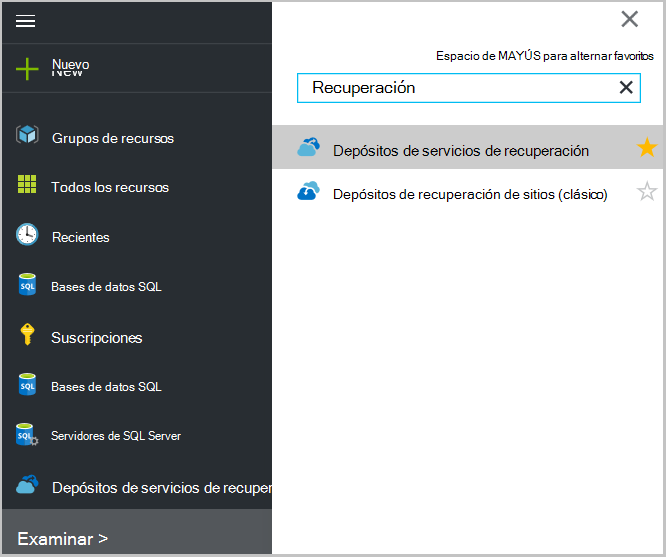 <br/>

2. Seleccione el nombre de la cámara que desea ver de la lista para abrir el módulo de paneles de depósito de servicios de recuperación.

    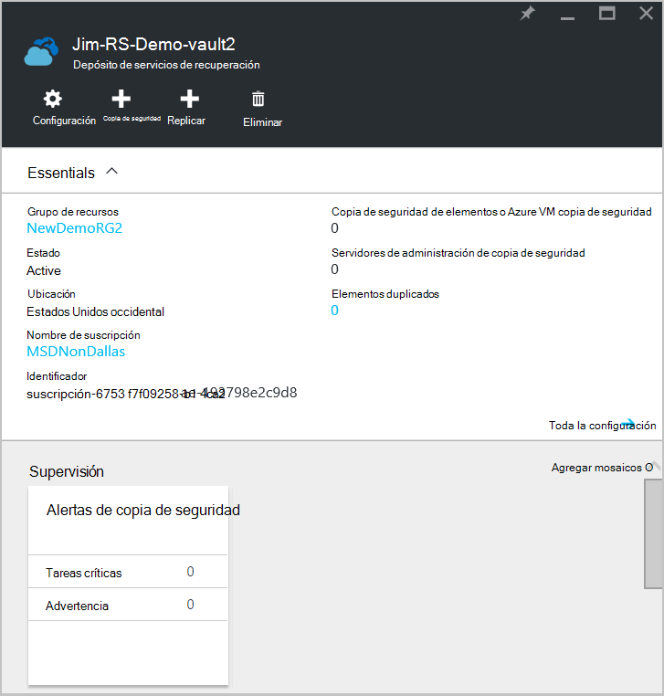 <br/>

## <a name="monitor-jobs-and-alerts"></a>Supervisar los trabajos y alertas
Supervisar los trabajos y alertas desde el panel de la cámara de servicios de recuperación, donde verá:

- Detalles de las alertas de copia de seguridad
- Archivos y carpetas, así como Azure máquinas virtuales de Windows protegido en nube
- Almacenamiento total consumido en Azure
- Estado del trabajo de copia de seguridad

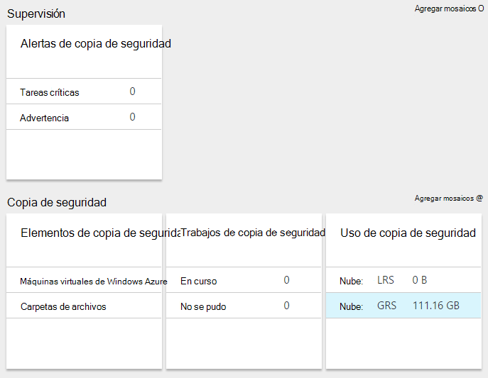

Haga clic en la información de cada uno de estos mosaicos se abrirá el módulo asociado donde se encarga de administrar tareas relacionadas.

Desde la parte superior del panel:

- Configuración proporciona acceso a tareas de copia de seguridad disponibles.
- Copia de seguridad: ayuda a realizar copias de seguridad nuevos archivos y carpetas (o máquinas virtuales de Azure) en depósito de servicios de recuperación.
- Eliminar - si ya no se utiliza un depósito de servicios de recuperación, puede eliminarlo para liberar espacio de almacenamiento. Eliminar está habilitada únicamente después de que se han eliminado todos los servidores protegidos de la cámara.

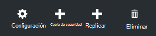
## <a name="alerts-for-backups-using-azure-backup-agent"></a>Alertas de copias de seguridad con el agente de copia de seguridad de Azure:
| Nivel de alerta  | Alertas enviadas |
| ------------- | ------------- |
| Tareas críticas | Error de copia de seguridad, recuperación de error  |
| Advertencia  | Copia de seguridad completada con advertencias (cuando no se copian archivos de menos de cien debido a problemas de daños y más de un millón de archivos se copia correctamente)  |
| Informativo  | Ninguno  |
## <a name="manage-backup-alerts"></a>Administrar alertas de copia de seguridad
Haga clic en el mosaico de **Alertas de copia de seguridad** para abrir el módulo de **Alertas de copia de seguridad** y administrar alertas.

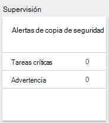

El mosaico de alertas de copia de seguridad muestra el número de:

- alertas críticas sin resolver en las últimas 24 horas
- alertas de advertencia sin resolver en las últimas 24 horas

Al hacer clic en cada uno de estos vínculos le lleva a la hoja de **Alertas de copia de seguridad** con una vista filtrada de estas alertas (críticas o de advertencia).

Desde el módulo de alertas de copia de seguridad,:

- Elija la información adecuada para incluir con las alertas.

    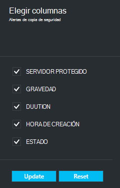

- Filtrar las alertas de horas de gravedad, estado e inicio o finalización.

    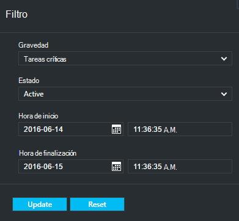

- Configurar las notificaciones de gravedad, frecuencia y los destinatarios, así como activar o desactivar los avisos.

    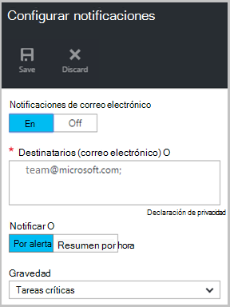

Si se selecciona **Por alerta** como la frecuencia de **notificación** se produce sin agrupación o reducción de los correos electrónicos. Resultados de todas las alertas de notificación de 1. Esta es la configuración predeterminada y el correo electrónico de resolución también se envía inmediatamente.

Si se selecciona **Resumen por hora** como la **notificación** frecuencia uno de correo electrónico se envía al usuario que le indica que hay sin resolver alertas nuevas generadas en la última hora. Se envía un correo electrónico de resolución al final de la hora.

Pueden enviar alertas a los niveles de gravedad siguientes:

- tareas críticas
- Advertencia
- información

Desactivar la alerta con el botón **desactivar** en el módulo de detalles de trabajo. Al hacer clic en desactivar, puede proporcionar notas de resolución.

Elija las columnas que desee que aparezca como parte de la alerta con el botón **Elegir columnas** .

>[AZURE.NOTE] Desde el módulo de **configuración** , administrar alertas de copia de seguridad seleccionando **supervisión e informes > eventos y alertas > alertas de copia de seguridad** y, a continuación, haciendo clic en **filtro** o **Configurar notificaciones**.

## <a name="manage-backup-items"></a>Administrar elementos de copia de seguridad
Administrar las copias de seguridad local está ahora disponible en el portal de administración. En la sección de copia de seguridad del escritorio, el mosaico de **Copia de seguridad de elementos** muestra el número de elementos de una copia de seguridad protegida al depósito.

Haga clic en **Carpetas de archivos** en el mosaico de elementos de la copia de seguridad.

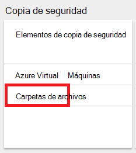

Se abre el módulo de elementos de una copia de seguridad con el filtro definido como carpeta de archivos donde ver cada elemento aparece de copia de seguridad específica.

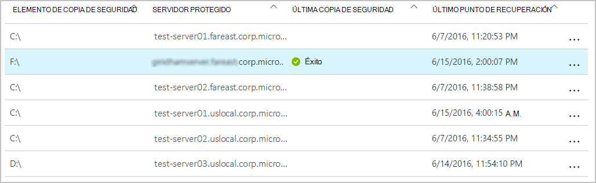

Si selecciona un elemento específico de una copia de seguridad de la lista, consulte los detalles esenciales para ese elemento.

>[AZURE.NOTE] Desde el módulo de **configuración** , administrar archivos y carpetas seleccionando **elementos protegidos > copia de seguridad de elementos** y seleccionando **Carpetas de archivos** en el menú desplegable.

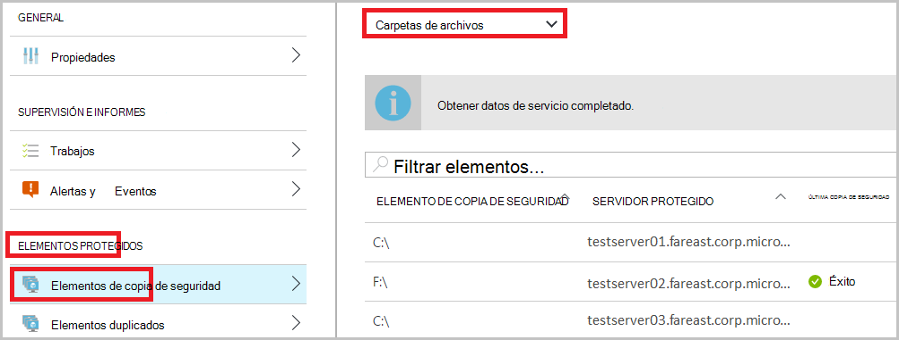

## <a name="manage-backup-jobs"></a>Administrar trabajos de copia de seguridad
Los trabajos de copia de seguridad para ambos local (cuando el servidor local es una copia de seguridad en Azure) y las copias de seguridad de Azure están visibles en el panel.

En la sección de copia de seguridad del escritorio, el mosaico de trabajo de copia de seguridad muestra el número de tareas:

- en curso
- Error en las últimas 24 horas.

Para administrar los trabajos de copia de seguridad, haga clic en el mosaico de **Trabajos de copia de seguridad** , que abre el módulo de trabajos de copia de seguridad.

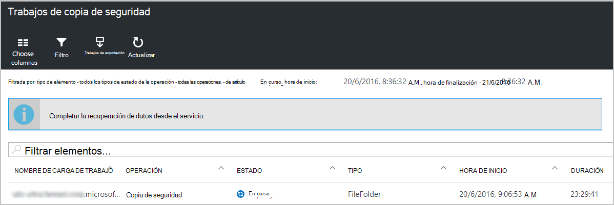

Modificar la información disponible en el módulo de trabajos de copia de seguridad con el botón **Elegir columnas** en la parte superior de la página.

Use el botón **filtro** para seleccionar entre los archivos y carpetas y copia de seguridad de Azure máquina virtual.

Si no ve la copia de seguridad de archivos y carpetas, haga clic en el botón **filtro** en la parte superior de la página y seleccione los **archivos y carpetas** en el menú de tipo de elemento.

>[AZURE.NOTE] Desde el módulo de **configuración** , administrar trabajos de copia de seguridad seleccionando **supervisión e informes > trabajos > trabajos de copia de seguridad** y seleccionando **Carpetas de archivos** en el menú desplegable.

## <a name="monitor-backup-usage"></a>Supervisar el uso de copia de seguridad
En la sección de copia de seguridad del escritorio, el mosaico de uso de la copia de seguridad mostrar el almacenamiento consumido en Azure. Uso de almacenamiento se proporciona para:
- Uso de almacenamiento LRS asociada con la cámara en la nube
- Uso de almacenamiento de nube GRS asociada con la cámara

## <a name="production-servers"></a>Servidores de producción
Para administrar los servidores de producción, haga clic en **configuración**. En administrar, haga clic en **infraestructura de copia de seguridad > servidores de producción**.

Las listas de módulos de servidores de producción de todos los servidores de producción disponibles. Haga clic en un servidor de la lista para abrir los detalles del servidor.


## <a name="microsoft-azure-backup-agent-tasks"></a>Tareas de agente de copia de seguridad de Microsoft Azure

## <a name="open-the-backup-agent"></a>Abra al agente de copia de seguridad

Abra el **agente de copia de seguridad de Microsoft Azure** (que encontrarlo buscando en el equipo de *Copia de seguridad de Microsoft Azure*).


Desde las **acciones** disponibles a la derecha de la consola de agente de copia de seguridad realizar las siguientes tareas de administración:

- Registrar servidor
- Copia de seguridad de programación
- Realizar una copia de seguridad ahora
- Cambiar las propiedades

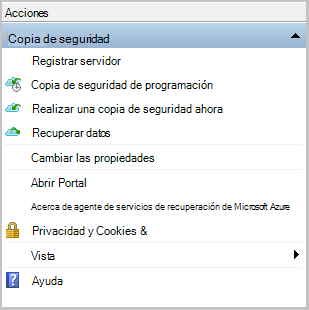

>[AZURE.NOTE] Para **Recuperar datos**, consulte [Restaurar archivos en un servidor de Windows o el equipo cliente de Windows](backup-azure-restore-windows-server.md).

## <a name="modify-an-existing-backup"></a>Modificar una copia de seguridad existente

1. Haga clic en **Programar copia de seguridad**en el agente de copia de seguridad de Microsoft Azure.

    

2. En el **Asistente para la programación de copia de seguridad** , deje seleccionada la opción **realizar cambios en los elementos de copia de seguridad u horas** y haga clic en **siguiente**.

    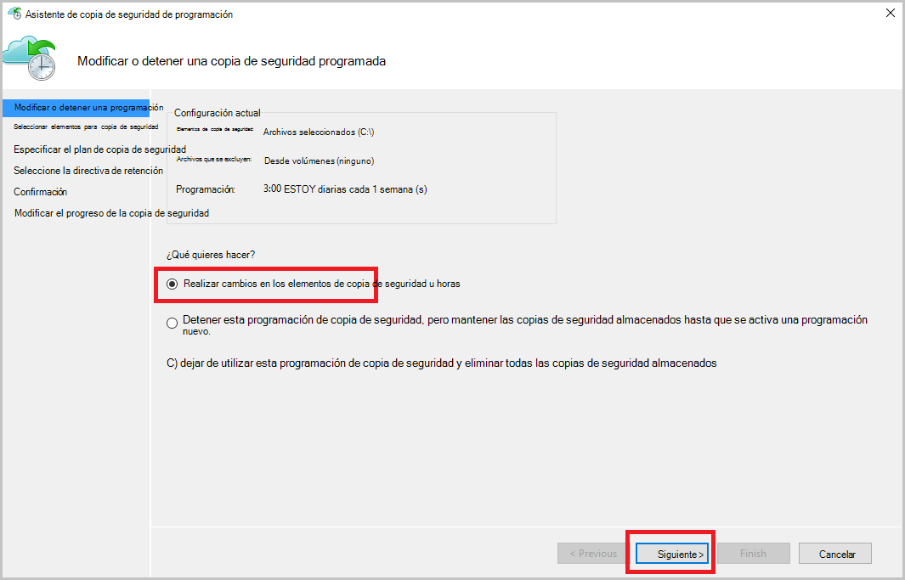

3. Si desea agregar o modificar elementos, haga clic en **Agregar elementos**en la pantalla **Seleccionar elementos de la copia de seguridad** .

    También puede establecer la **Configuración de exclusión** de esta página del asistente. Si desea excluir archivos o tipos de archivo lea el procedimiento para agregar una [configuración de exclusiones](#exclusion-settings).

4. Seleccione los archivos y carpetas que desea hacer copia de seguridad y haga clic en **Aceptar**.

    

5. Especifique la **programación de copia de seguridad** y haga clic en **siguiente**.

    Puede programar diaria (con un máximo de 3 veces al día) o copias de seguridad semanales.

    

    >[AZURE.NOTE] Especificar la programación de copia de seguridad se explica detalladamente en este [artículo](backup-azure-backup-cloud-as-tape.md).

6. Seleccione la **Directiva de retención** de la copia de seguridad y haga clic en **siguiente**.

    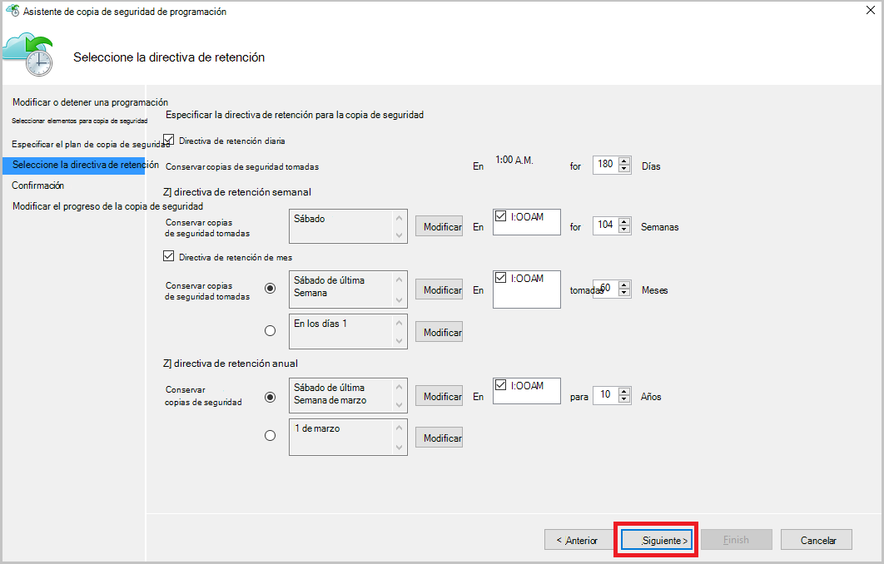

7. En la pantalla de **confirmación** , revise la información y haga clic en **Finalizar**.

8. Una vez que el asistente termine de crear la **programación de copia de seguridad**, haga clic en **Cerrar**.

    Después de modificar la protección, puede confirmar que las copias de seguridad activan correctamente, vaya a la pestaña **tareas** y confirmar que los cambios se reflejarán en los trabajos de copia de seguridad.

## <a name="enable-network-throttling"></a>Habilitar el límite de red  
El agente de copia de seguridad de Azure proporciona una ficha de regulación que le permite controlar cómo se usa el ancho de banda durante la transferencia de datos. Este control puede ser útil si necesita hacer una copia de los datos durante horas de trabajo pero no desea que el proceso de copia de seguridad para interferir con otro tráfico de internet. Limitación de datos se aplica transferencia para realizar copias de seguridad y restaurar las actividades.  

Habilitar el límite:

1. En el **agente de copia de seguridad**, haga clic en **Cambiar las propiedades**.

2. En la **limitación de la ficha, seleccione **Habilitar límite para operaciones de copia de seguridad ** de uso de ancho de banda de internet.

    

    Una vez habilitada la limitación, especifique el ancho de banda permitido para transferir datos de copia de seguridad durante el **horario de trabajo** y las **horas de trabajo no**.

    Los valores de ancho de banda comienzan en 512 kilobytes por segundo y pueden ir hasta 1023 megabytes por segundo (Mbps). También puede designar el inicio y finalización para las **horas de trabajo**y los días de la semana se consideran trabajo días. Se considera el tiempo fuera de las horas de trabajo designados no jornada laboral.

3. Haga clic en **Aceptar**.

## <a name="manage-exclusion-settings"></a>Administrar la configuración de exclusiones

1. Abra el **agente de copia de seguridad de Microsoft Azure** (puede encontrarlo buscando en el equipo de *Copia de seguridad de Microsoft Azure*).

    

2. Haga clic en **Programar copia de seguridad**en el agente de copia de seguridad de Microsoft Azure.

    

3. En el Asistente de copia de seguridad de programación deje seleccionada la opción **realizar cambios en los elementos de copia de seguridad u horas** y haga clic en **siguiente**.

    

4. Haga clic en **configuración de exclusiones**.

    

5. Haga clic en **Agregar exclusión**.

    

6. Seleccione la ubicación y, a continuación, haga clic en **Aceptar**.

    

7. Agregar la extensión de archivo en el campo **Tipo de archivo** .

    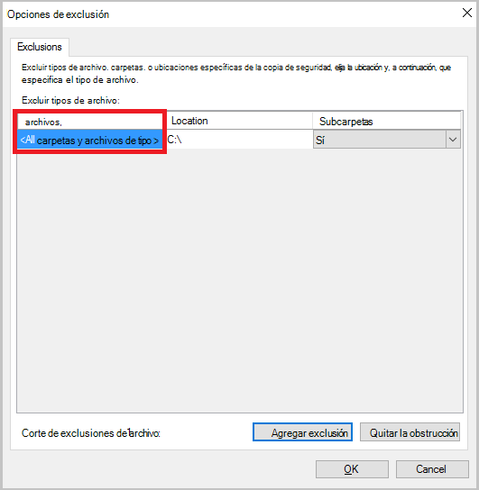

    Agregar una extensión. mp3

    

    Para agregar otra extensión, haga clic en **Agregar exclusión** y escriba otra extensión de tipo de archivo (agregando una extensión .jpeg).

    

8. Cuando haya agregado todas las extensiones, haga clic en **Aceptar**.

9. Continúe con el Asistente de copia de seguridad de programación haciendo clic en **siguiente** hasta la **página de confirmación**, haga clic en **Finalizar**.

    

## <a name="frequently-asked-questions"></a>Preguntas más frecuentes
**T1. El estado del trabajo de copia de seguridad se muestra como completada en el agente de copia de seguridad de Azure, ¿por qué no obtener reflejado inmediatamente en portal?**

A1. Allí se en retardo máximo de 15 minutos entre el estado del trabajo de copia de seguridad refleja en el agente de copia de seguridad de Azure y el portal de Azure.

**Q.2 cuando se produce un error en un trabajo de copia de seguridad, ¿cuánto tiempo se tarda en generar una alerta?**

A.2 una alerta se produce dentro de 20 minutos del error de copia de seguridad de Azure.

**T3. ¿Hay un caso donde no se enviará un correo electrónico si se han configurado las notificaciones?**

A3. A continuación encontrará los casos cuando no se enviará la notificación para reducir el ruido de alerta:

   - Si se configuran las notificaciones por hora y una alerta es elevada y resolver dentro de la hora
   - Trabajo se cancela.
   - Trabajo de copia de seguridad de segundo error porque el trabajo de copia de seguridad original está en curso.

## <a name="troubleshooting-monitoring-issues"></a>Solución de problemas de supervisión

**Problema:** Trabajos o alertas desde el agente de copia de seguridad de Azure no aparecen en el portal.

**Pasos de solución de problemas:** El proceso de ```OBRecoveryServicesManagementAgent```, envía los datos de trabajo y de alerta para el servicio de copia de seguridad de Azure. En ocasiones puede bloquearse este proceso o apagado.

1. Para comprobar el proceso no se está ejecutando, abra **El Administrador de tareas** y compruebe si la ```OBRecoveryServicesManagementAgent``` proceso se está ejecutando.

2. Suponiendo que el proceso no se está ejecutando, abra **El Panel de Control** y busque la lista de servicios. Iniciar o reiniciar el **Agente de administración de servicios de recuperación de Microsoft Azure**.

    Para obtener más información, busque los registros en:<br/>
`<AzureBackup_agent_install_folder>\Microsoft Azure Recovery Services Agent\Temp\GatewayProvider*`. Por ejemplo:<br/> `C:\Program Files\Microsoft Azure Recovery Services Agent\Temp\GatewayProvider0.errlog`.

## <a name="next-steps"></a>Pasos siguientes
- [Restaurar Windows Server o cliente de Windows de Azure](backup-azure-restore-windows-server.md)
- Para obtener más información acerca de la copia de seguridad de Azure, consulte [Información general de copia de seguridad de Azure](backup-introduction-to-azure-backup.md)
- Visite el [foro de copia de seguridad de Azure](http://go.microsoft.com/fwlink/p/?LinkId=290933)
