<properties
  pageTitle="Preparar el entorno para realizar copias de seguridad de las cargas de trabajo con el servidor de copia de seguridad de Azure | Microsoft Azure"
  description="Asegúrese de que su entorno correctamente está preparado para realizar copias de seguridad de las cargas de trabajo con el servidor de copia de seguridad de Azure"
  services="backup"
  documentationCenter=""
  authors="pvrk"
  manager="shivamg"
  editor=""
  keywords="servidor de copia de seguridad de Azure; depósito de copia de seguridad"/>

<tags
  ms.service="backup"
  ms.workload="storage-backup-recovery"
  ms.tgt_pltfrm="na"
  ms.devlang="na"
  ms.topic="article"
  ms.date="08/22/2016"
  ms.author="jimpark;trinadhk;pullabhk; markgal"/>

# <a name="preparing-to-back-up-workloads-using-azure-backup-server"></a>Prepararse para realizar copias de seguridad de las cargas de trabajo con el servidor de copia de seguridad de Azure

> [AZURE.SELECTOR]
- [Servidor de copia de seguridad de Azure](backup-azure-microsoft-azure-backup.md)
- [SCDPM](backup-azure-dpm-introduction.md)
- [Servidor de copia de seguridad de Azure (clásico)](backup-azure-microsoft-azure-backup-classic.md)
- [SCDPM (clásico)](backup-azure-dpm-introduction-classic.md)


Este artículo trata sobre preparar su entorno para realizar copias de seguridad de las cargas de trabajo con el servidor de copia de seguridad de Azure. Con el servidor de copia de seguridad de Azure, puede proteger cargas de trabajo como máquinas virtuales de Hyper-V, Microsoft SQL Server, SharePoint Server, Microsoft Exchange y los clientes de Windows desde una única consola.

>[AZURE.WARNING] Servidor de copia de seguridad de Azure hereda la funcionalidad de administrador de protección de datos (DPM) para la copia de seguridad de carga de trabajo. Encontrará punteros a la documentación de algunas de estas funciones. Sin embargo servidor de copia de seguridad de Azure proporcionar protección en la cinta o integrar con System Center.

## <a name="1-windows-server-machine"></a>1. equipo servidor Windows


El primer paso para obtener el servidor de copia de seguridad de Azure y ejecutar es tener un equipo Windows Server.

| Ubicación | Requisitos mínimos | Instrucciones adicionales |
| -------- | -------------------- | ----------------------- |
| Azure | Azure máquina virtual de IaaS<br><br>A2 Estándar: 2 núcleos, 3,5 GB de RAM | Puede empezar con una imagen de la Galería simple del centro de datos de Windows Server 2012 R2. [Proteger IaaS cargas de trabajo con el servidor de copia de seguridad de Azure (DPM)](https://technet.microsoft.com/library/jj852163.aspx) tiene muchas matices. Asegúrese de que lea el artículo completamente antes de implementar el equipo. |
| Local | Máquina virtual de Hyper-V<br> Máquina virtual de VMWare<br> o un host físico<br><br>2 núcleos y 4GB de RAM | Puede Deduplique el almacenamiento DPM con Windows Server desduplicación. Más información sobre cómo DPM desduplicación funcionar juntos [y](https://technet.microsoft.com/library/dn891438.aspx) cuando se implementa en máquinas virtuales de Hyper-V. |

> [AZURE.NOTE] Se recomienda que el servidor de copia de seguridad de Azure esté instalado en un equipo con Windows Server 2012 R2 centro de datos. Una gran cantidad de los requisitos previos están cubiertos automáticamente con la última versión del sistema operativo Windows.

Si va a unir este servidor a un dominio en algún momento, se recomienda que se realice la actividad de unirse a dominio antes de la instalación del servidor de copia de seguridad de Azure. Mover un equipo de servidor de copia de seguridad de Azure existente en un nuevo dominio después de la implementación es *incompatible*.

## <a name="2-backup-vault"></a>2. depósito copia de seguridad


Enviar datos de copia de seguridad a Azure o mantenerlo localmente, el software debe estar conectado a Azure. Para que sea más específico, el equipo del servidor de copia de seguridad de Azure debe estar registrado con un depósito de copia de seguridad.

Para crear un depósito de copia de seguridad:

1. Inicie sesión en el [Portal de administración](http://manage.windowsazure.com/).

2. Haga clic en **nuevo** > **Data Services** > **Servicios de recuperación** > **depósito de copia de seguridad** > **crear rápido**. Si tiene varias suscripciones asociadas a su cuenta profesional, elija la suscripción correcta para asociarla con la cámara de copia de seguridad.

3. En **nombre**, escriba un nombre descriptivo para identificar la cámara. Debe ser única para cada suscripción.

4. En la **región**, seleccione la región geográfica de la cámara. Normalmente, la región de la cámara se selecciona basada en restricciones de latencia soberanía o la red de datos.

    

5. Haga clic en **Crear depósito**. Puede pasar un tiempo para la copia de seguridad depósito que debe crearse. Supervisar las notificaciones de estado en la parte inferior del portal.

    

6. Un mensaje confirma que se ha creado correctamente el depósito y se mostrarán en la página de servicios de recuperación como activa.
    

  > [AZURE.IMPORTANT] Asegúrese de que está seleccionada la opción de redundancia de almacenamiento apropiado justo después de que se ha creado la cámara. Leer más sobre [geo redundantes](../storage/storage-redundancy.md#geo-redundant-storage) y opciones [redundantes localmente](../storage/storage-redundancy.md#locally-redundant-storage) en esta [información general](../storage/storage-redundancy.md).


## <a name="3-software-package"></a>3. paquete de software


### <a name="downloading-the-software-package"></a>Descargar el paquete de software

Similar a depósito credenciales, puede descargar una copia de seguridad de Microsoft Azure de cargas de trabajo desde la **Página de inicio rápido** de la cámara de copia de seguridad.

1. Haga clic en **aplicación de cargas de trabajo (disco a disco a la nube)**. Esto le llevará a la página Centro de descarga desde donde se puede descargar el paquete de software.

    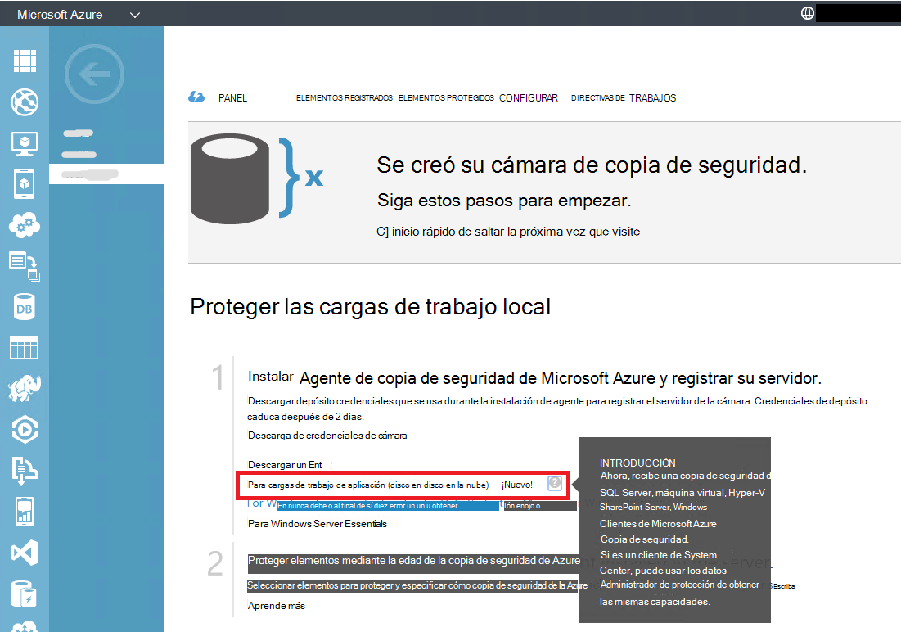

2. Haga clic en **Descargar**.

    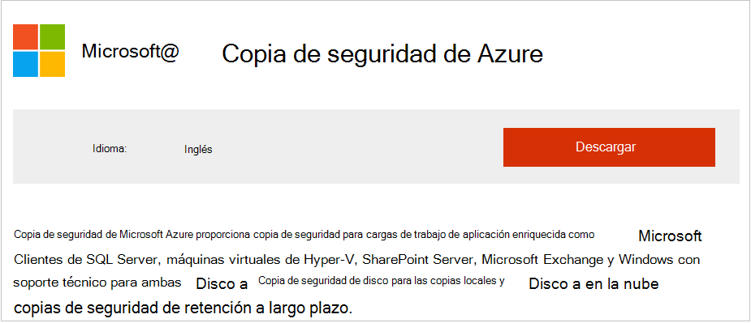

3. Seleccione todos los archivos y haga clic en **siguiente**. Descargar todos los archivos que provienen de la página de descarga de copia de seguridad de Microsoft Azure y coloque todos los archivos en la misma carpeta.
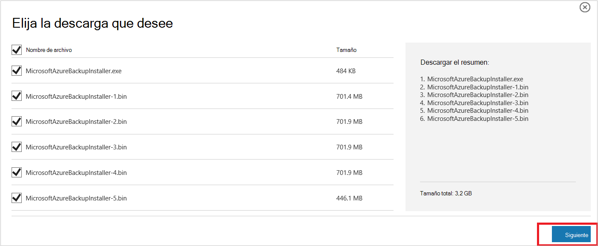

    Dado que el tamaño de la descarga de todos los archivos juntos > 3G, en un 10 descargue vínculo puede tardar hasta 60 minutos a que finalice la descarga.


### <a name="extracting-the-software-package"></a>Extraer el paquete de software

Una vez que haya descargado todos los archivos, haga clic en **MicrosoftAzureBackupInstaller.exe**. Se iniciará el **Asistente de configuración de copia de seguridad de Microsoft Azure** para extraer los archivos de instalación en una ubicación especificada por el usuario. Continúe con el asistente y haga clic en el botón **extraer** para empezar el proceso de extracción.

> [AZURE.WARNING] Se requiere al menos 4GB de espacio libre para extraer los archivos de instalación.


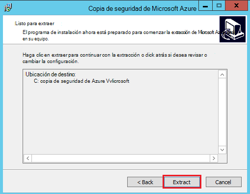

Una vez que la extracción de proceso completado, active la casilla para iniciar la recién extraídos *setup.exe* para comenzar a instalar el servidor de copia de seguridad de Microsoft Azure y haga clic en el botón **Finalizar** .

### <a name="installing-the-software-package"></a>Instalar el paquete de software

1. Haga clic en **Copia de seguridad de Microsoft Azure** para iniciar al Asistente de configuración.

    

2. En la pantalla, haga clic en el botón **siguiente** . Se abrirá la sección *Comprueba como requisito previo* . En esta pantalla, haga clic en el botón **Comprobar** para determinar si se cumplen los requisitos previos de hardware y software de servidor de copia de seguridad de Azure. Si todos los requisitos previos son han sido cumplen correctamente, verá un mensaje que indica que el equipo cumple los requisitos. Haga clic en el botón **siguiente** .

    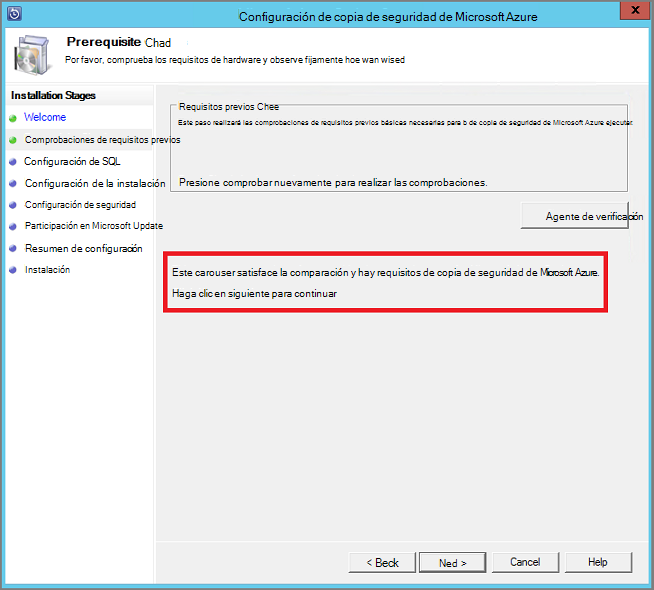

3. Servidor de copia de seguridad de Microsoft Azure requiere SQL Server Standard y el paquete de instalación del servidor de copia de seguridad de Azure viene incluido en los archivos binarios de SQL Server adecuados necesitados. Al iniciar con una instalación nueva del servidor de copia de seguridad de Azure, debe elegir la opción **Instalar nueva instancia de SQL Server con esta configuración** y haga clic en el botón **Comprobar e instalar** . Una vez que los requisitos previos se instalan correctamente, haga clic en **siguiente**.

    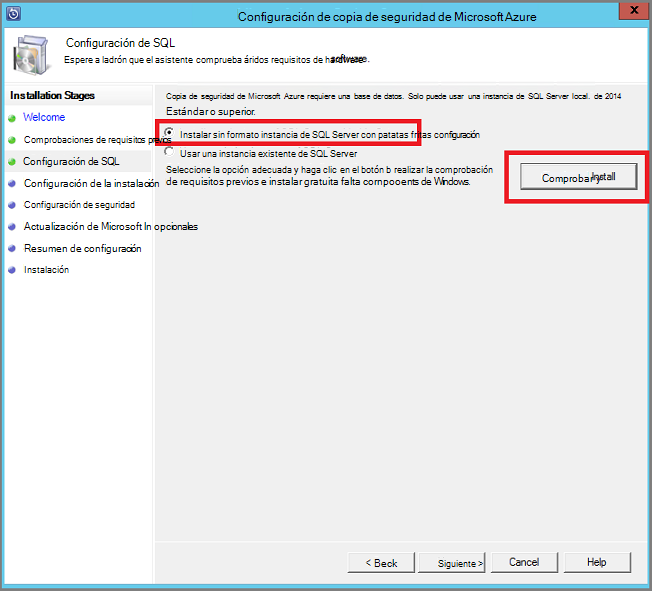

    Si se produce un error con la recomendación para reiniciar el equipo, hágalo y haga clic en **Comprobar nuevamente**.

    > [AZURE.NOTE] Servidor de copia de seguridad de Azure no funcionará con una instancia de SQL Server remota. La instancia que está usa el servidor de copia de seguridad de Azure debe ser local.

4. Proporcionar una ubicación para la instalación de archivos del servidor de copia de seguridad de Microsoft Azure y haga clic en **siguiente**.

    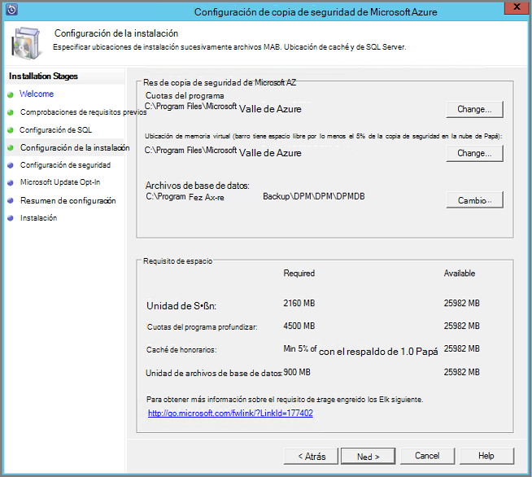

    La ubicación de borrador es necesario para realizar copias de seguridad de Azure. Asegúrese de que la ubicación de borrador al menos del 5% de los datos planificados hacer copia de seguridad en la nube. Para la protección de disco, discos independientes deben configurarse tras completar la instalación. Para obtener más información acerca de los grupos de almacenamiento, consulte [Configurar grupos de almacenamiento y almacenamiento en disco](https://technet.microsoft.com/library/hh758075.aspx).

5. Proporcione una contraseña segura para las cuentas de usuario con permisos restringidos local y haga clic en **siguiente**.

    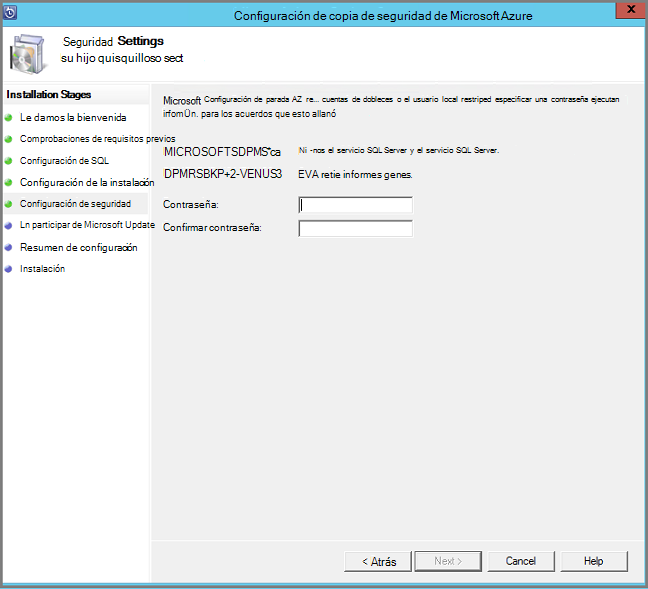

6. Seleccione si desea usar *Microsoft Update* para buscar actualizaciones y haga clic en **siguiente**.

    >[AZURE.NOTE] Le recomendamos que Windows Update redirigir a Microsoft Update, que ofrece seguridad y actualizaciones importantes para Windows y otros productos, como el servidor de copia de seguridad de Microsoft Azure.

    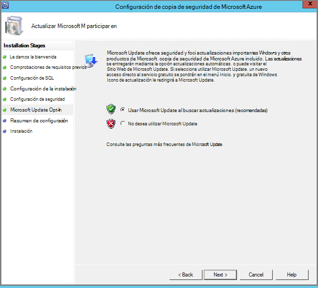

7. Revise el *Resumen de la configuración* y haga clic en **instalar**.

    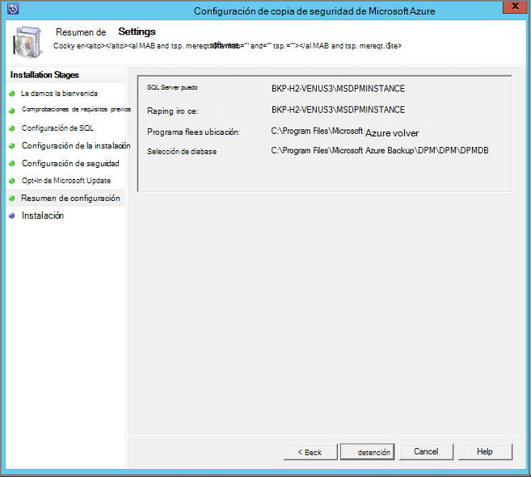

8. La instalación ocurre en fases. En la primera fase está instalado el agente de servicios de recuperación de Microsoft Azure en el servidor. También comprueba el Asistente para la conexión a Internet. Si está disponible la conexión a Internet puede continuar con la instalación, si no, debe proporcionar detalles del proxy para conectarse a Internet.

    El siguiente paso es configurar al agente de servicios de recuperación de Microsoft Azure. Como parte de la configuración, tendrá que proporcionar que está las credenciales de la cámara para registrar el equipo en el depósito de copia de seguridad. También le proporcionará una frase de contraseña para los datos enviados entre Azure y sus instalaciones de cifrado/descifrado. Automáticamente puede generar una frase de contraseña o proporcionar su propia contraseña 16 caracteres mínima. Continuar con el asistente hasta que se ha configurado el agente.

    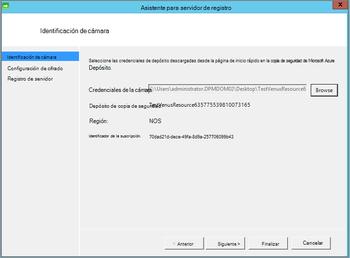

9. Una vez que se complete correctamente el registro del servidor de copia de seguridad de Microsoft Azure, el Asistente de configuración general continúa con la instalación y configuración de SQL Server y los componentes del servidor de copia de seguridad de Azure. Una vez finalizada la instalación de componentes de SQL Server, se instalan los componentes del servidor de copia de seguridad de Azure.

    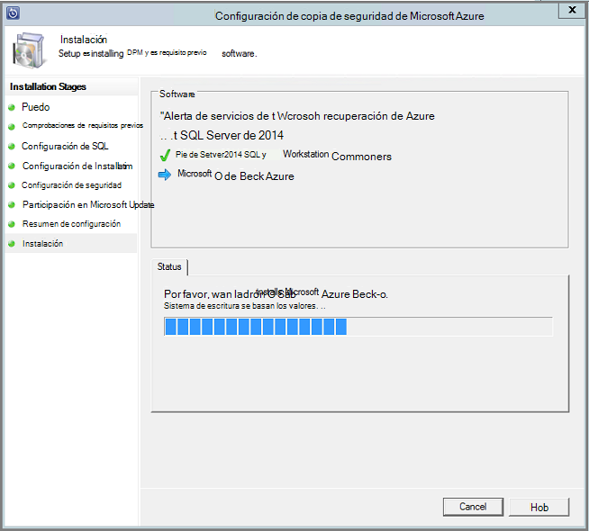


Cuando haya finalizado el paso de instalación, habrá creados también los iconos del escritorio del producto. Hacer doble clic en el icono para iniciar el producto.

### <a name="add-backup-storage"></a>Agregar almacenamiento de copia de seguridad

La primera copia se guarda en almacenamiento conectado al equipo servidor de copia de seguridad de Azure. Para obtener más información acerca de cómo agregar discos, vea [Configurar grupos de almacenamiento y almacenamiento en disco](https://technet.microsoft.com/library/hh758075.aspx).

> [AZURE.NOTE] Debe agregar almacenamiento de copia de seguridad, incluso si piensa enviar datos a Azure. En la arquitectura actual del servidor de copia de seguridad de Azure, la copia de seguridad de Azure depósito contiene la *segunda* copia de los datos mientras el almacenamiento local contiene la copia de seguridad de primera (y obligatoria).  

## <a name="4-network-connectivity"></a>4. conectividad de red de


Servidor de copia de seguridad de Azure requieren conectividad con el servicio de copia de seguridad de Azure del producto para que funcione correctamente. Para validar si el equipo tiene la conectividad de Azure, utilice la ```Get-DPMCloudConnection``` commandlet en la consola de PowerShell de servidor de copia de seguridad de Azure. Si el resultado de la commandlet es verdadero, a continuación, existe conectividad, else, no hay ninguna conectividad.

Al mismo tiempo, la suscripción de Azure debe estar en buen estado. Para averiguar el estado de la suscripción y administrarlo, inicie sesión en el [portal de suscripción]( https://account.windowsazure.com/Subscriptions).

Una vez que conozca el estado de la conectividad de Azure y de la suscripción de Azure, puede usar la tabla siguiente para averiguar el impacto en la funcionalidad de copia de seguridad y restauración ofrecida.

| Estado de conectividad | Suscripción de Azure | Copia de seguridad de Azure| Copia de seguridad en disco | Restaurar a partir de Azure | Restaurar desde el disco |
| -------- | ------- | --------------------- | ------------------- | --------------------------- | ----------------------- |
| Conectado | Active | Permitido | Permitido | Permitido | Permitido |
| Conectado | Caducado | Detener | Detener | Permitido | Permitido |
| Conectado | Aprovisionamiento anulado | Detener | Detener | Puntos de recuperación de Azure y ha dejado de eliminados | Detener |
| Pérdida de conectividad > 15 días | Active | Detener | Detener | Permitido | Permitido |
| Pérdida de conectividad > 15 días | Caducado | Detener | Detener | Permitido | Permitido |
| Pérdida de conectividad > 15 días | Aprovisionamiento anulado | Detener | Detener |  Puntos de recuperación de Azure y ha dejado de eliminados | Detener |

### <a name="recovering-from-loss-of-connectivity"></a>Recuperación de pérdida de conectividad
Si tiene un firewall o un proxy que impide el acceso a Azure, debe blanca las siguientes direcciones de dominio en el perfil de firewall/proxy:

- www.msftncsi.com
- \*. Microsoft.com
- \*. WindowsAzure.com
- \*. microsoftonline.com
- \*. windows.net

Una vez que se ha restaurado la conectividad con Azure en el equipo servidor de copia de seguridad de Azure, el estado de la suscripción de Azure determina las operaciones que se pueden realizar. La tabla anterior tiene detalles acerca de las operaciones permitidas una vez que el equipo está "conectado".

### <a name="handling-subscription-states"></a>Administración de Estados de suscripción

Es posible hacer una suscripción de Azure desde un estado *caducado* o *Desaprovisionado* al estado *activo* . Sin embargo esto tiene algunas implicaciones en el comportamiento de producto mientras que el estado no está *activa*:

- Una suscripción *Desaprovisionado* pierde la funcionalidad para el período que se quedará con aprovisionamiento anulado. Acerca de la activación de *activos*, está continuando la funcionalidad del producto de copia de seguridad y restauración. Además, se pueden recuperar los datos de copia de seguridad en el disco local si se mantiene con un período de retención lo suficientemente grande. Sin embargo, los datos de copia de seguridad de Azure están perdidos irremisiblemente una vez que la suscripción entra en el estado de *Desaprovisionado* .
- Una suscripción *caducado* solo pierde la funcionalidad de hasta que se ha realizado *Active* nuevamente. No se ejecutarán las copias de seguridad programadas para el período que la suscripción era *caducado* .


## <a name="troubleshooting"></a>Solución de problemas

Si el servidor de copia de seguridad de Microsoft Azure falla con errores durante la fase de instalación (o copia de seguridad o la restauración), consulte este [documento de códigos de error](https://support.microsoft.com/kb/3041338) para obtener más información.
También puede hacer referencia a la [copia de seguridad de Azure relacionados con preguntas más frecuentes](backup-azure-backup-faq.md)


## <a name="next-steps"></a>Pasos siguientes

Puede obtener información detallada sobre cómo [Preparar el entorno para DPM](https://technet.microsoft.com/library/hh758176.aspx) en el sitio de Microsoft TechNet. También contiene información sobre configuraciones admitidas en la que se puede implementar y usar servidor de copia de seguridad de Azure.

Puede usar estos artículos para obtener un conocimiento más profundo de protección de carga de trabajo con el servidor de copia de seguridad de Microsoft Azure.

- [Copia de seguridad de SQL Server](backup-azure-backup-sql.md)
- [Copia de seguridad de SharePoint server](backup-azure-backup-sharepoint.md)
- [Copia de seguridad de servidor alternativo](backup-azure-alternate-dpm-server.md)
