<properties
   pageTitle="Realizar copias de seguridad de la máquina virtual de implementada por el Administrador de recursos del Monitor | Microsoft Azure"
   description="Supervisar los eventos y alertas de las copias de seguridad de la máquina virtual de implementada por el Administrador de recursos. Enviar correo electrónico basado en alertas."
   services="backup"
   documentationCenter="dev-center-name"
   authors="markgalioto"
   manager="cfreeman"
   editor=""/>

<tags
ms.service="backup"
ms.workload="storage-backup-recovery"
ms.tgt_pltfrm="na"
ms.devlang="na"
ms.topic="article"
ms.date="08/25/2016"
ms.author="trinadhk; giridham;"/>

# <a name="monitor-alerts-for-azure-virtual-machine-backups"></a>Supervisar las alertas de las copias de seguridad de Azure máquina virtual

Alertas son respuestas del servicio que ha cumplido o supera un umbral de evento. Saber cuando inicio problemas puede ser crítica para mantener los costos de negocio hacia abajo. Alertas suelen producirse en una programación y, por lo que es útil saber lo antes posible después de que se produzca una alerta. Por ejemplo, cuando se produce un error en un trabajo de copia de seguridad o restaurar, se produce una alerta en cinco minutos del error. En el panel de la cámara, el mosaico de alertas de copia de seguridad muestra eventos críticos y de nivel de advertencia. En la configuración de alertas de copia de seguridad, puede ver todos los eventos. Pero, ¿qué hacer si se produce una alerta cuando se trabaja en un tema independiente? Si no sabe cuando pasa la alerta, podría ser un inconvenientes secundarias o podría peligro los datos. Para asegurarse de que las personas adecuadas tienen constancia de una alerta - cuando se produce, configurar el servicio para enviar alertas a través del correo electrónico. Para obtener más información acerca de cómo configurar notificaciones de correo electrónico, vea [Configurar notificaciones](backup-azure-monitor-vms.md#configure-notifications).

## <a name="how-do-i-find-information-about-the-alerts"></a>¿Cómo puedo encontrar información sobre las alertas?

Para ver información sobre el evento que se produjo una alerta, debe abrir el módulo de alertas de copia de seguridad. Hay dos formas para abrir el módulo de alertas de copia de seguridad: cualquiera de las alertas de copia de seguridad de mosaico en el panel de la cámara, o desde el módulo de eventos y alertas.

Para abrir el módulo de alertas de copia de seguridad de mosaico de alertas de copia de seguridad:

- En el mosaico de **Alertas de copia de seguridad** en el panel de la cámara, haga clic en **tareas críticas** o **Advertencia** para ver los eventos operativos para ese nivel de gravedad.

    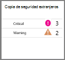


Para abrir el módulo de alertas de copia de seguridad desde el módulo de alertas y los eventos:

1. Desde el panel de la cámara, haga clic en **Todas las opciones**. 

2. En el módulo de **configuración** , haga clic en **alertas y eventos**. 

3. En el módulo de **eventos y alertas** , haga clic en **Alertas de copia de seguridad**. 

    El módulo de **Alertas de copia de seguridad** se abre y muestra las alertas filtradas.

    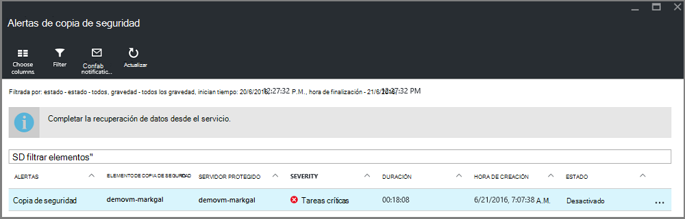

4. Para ver información detallada sobre una alerta en concreto, en la lista de eventos, haga clic en la alerta para abrir su hoja de **Detalles** .

    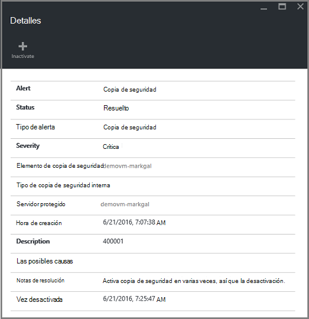

    Para personalizar los atributos que se muestran en la lista, consulte [Ver los atributos de evento adicionales](backup-azure-monitor-vms.md#view-additional-event-attributes)

## <a name="configure-notifications"></a>Configurar notificaciones

 Puede configurar el servicio para enviar notificaciones de correo electrónico para las alertas que se ha producido sobre la última hora, o cuando se producen determinados tipos de eventos.

Configurar notificaciones de correo electrónico para las alertas

1. En el menú de alertas de copia de seguridad, haga clic en **Configurar notificaciones**

    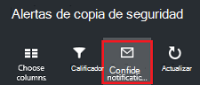

    Se abre el módulo de configurar las notificaciones.

    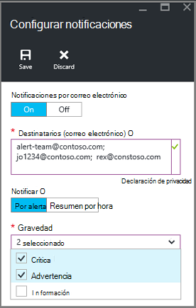

2. En el módulo de configurar las notificaciones, las notificaciones de correo electrónico, haga clic **en**.

    Los destinatarios y gravedad cuadros de diálogo tienen una estrella junto a ellos porque se requiere dicha información. Dirección de correo electrónico al menos una y seleccione al menos una gravedad.

3. En el cuadro de diálogo **destinatarios (correo electrónico)** , escriba las direcciones de correo electrónico para que recibe las notificaciones. Use el formato: username@domainname.com. Separe varias direcciones de correo electrónico con un punto y coma (;).

4. En el área de **notificación** , elija **Por alerta** para enviar una notificación cuando se produzca la alerta especificada o **Implícita por horas** para enviar un resumen de la última hora.

5. En el cuadro de diálogo de **gravedad** , elija uno o varios niveles que desee para desencadenar la notificación de correo electrónico.

6. Haga clic en **Guardar**.
### <a name="what-alert-types-are-available-for-azure-iaas-vm-backup"></a>¿Qué tipos de alertas están disponibles para la copia de seguridad de Azure IaaS VM?
| Nivel de alerta  | Alertas enviadas |
| ------------- | ------------- |
| Tareas críticas | Error de copia de seguridad, recuperación de error  |
| Advertencia  | Ninguno |
| Informativo  | Ninguno  |

### <a name="are-there-situations-where-email-isnt-sent-even-if-notifications-are-configured"></a>¿Hay situaciones donde no se envía correo electrónico incluso si se han configurado las notificaciones?

Hay situaciones donde no se envía una alerta, aunque se han configurado correctamente las notificaciones. En las siguientes situaciones de correo electrónico no se envían notificaciones para evitar el ruido de alerta:

- Si las notificaciones están configuradas para cada hora implícita y una alerta es elevada y resolver dentro de la hora.
- El trabajo se cancela.
- Un trabajo de copia de seguridad se activa y, a continuación, se produce un error y otra copia de seguridad está en curso.
- Se inicia un trabajo de copia de seguridad programado para una máquina virtual habilitada para el Administrador de recursos, pero ya no existe la máquina virtual.

## <a name="customize-your-view-of-events"></a>Personalizar la vista de eventos

La configuración de **registros de auditoría** incluye un conjunto de filtros y columnas que muestra la información de evento operativo predefinido. Puede personalizar la vista para que cuando se abre el módulo de **eventos** , muestra la información que desee.

1. En el [panel de la cámara](./backup-azure-manage-vms.md#open-a-recovery-services-vault-in-the-dashboard), busque y haga clic en **Registros de auditoría** para abrir el módulo de **eventos** .

    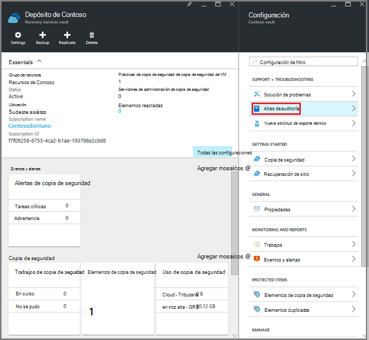

    Se abre el módulo de **eventos** a los eventos operativos filtrados solo para el depósito actual.

    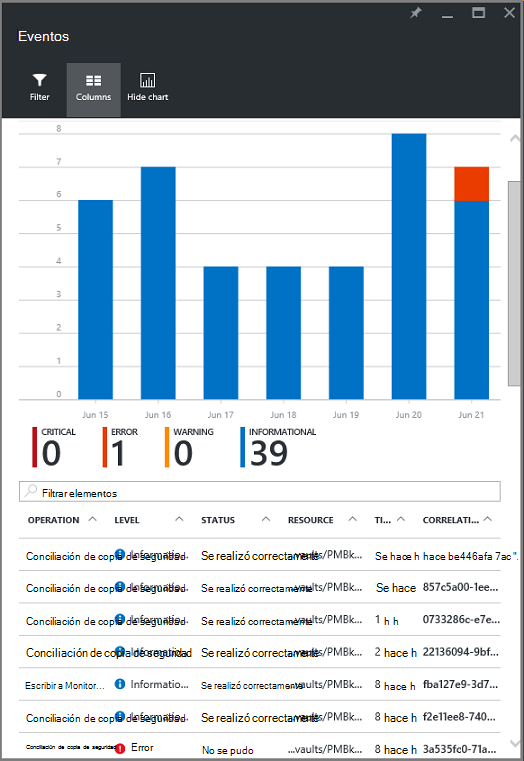

    El módulo muestra la lista de tareas críticas, Error, advertencia e informativos eventos que ocurrieron en la última semana. El intervalo de tiempo es un valor predeterminado establecido en el **filtro**. El módulo de **eventos** también muestra un gráfico de barras cuando se han producido los eventos de seguimiento. Si no desea ver el gráfico de barras, en el menú **eventos** , haga clic en **Ocultar gráfico** para alternar fuera del gráfico. La vista predeterminada de eventos muestra información de la operación, nivel, estado, recursos y tiempo. Para obtener información sobre cómo exponer los atributos de evento adicionales, vea la sección [información de eventos de expansión](backup-azure-monitor-vms.md#view-additional-event-attributes).

2. Para obtener información adicional sobre un evento operativo, en la columna de la **operación** , haga clic en un evento operativo para abrir su hoja. El módulo contiene información detallada sobre los eventos. Eventos se agrupan por su identificador de correlación y una lista de los eventos que ocurrieron en el intervalo de tiempo.

    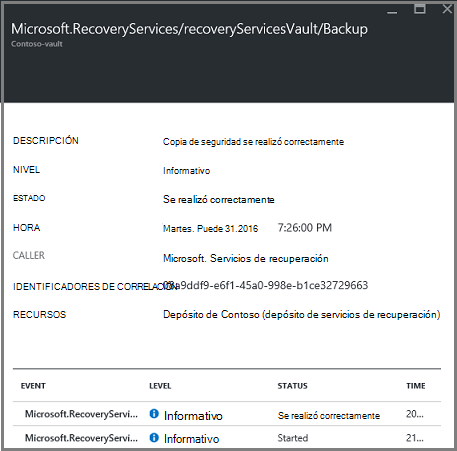

3. Para ver información detallada acerca de un evento concreto, en la lista de eventos, haga clic en el evento para abrir su hoja de **Detalles** .

    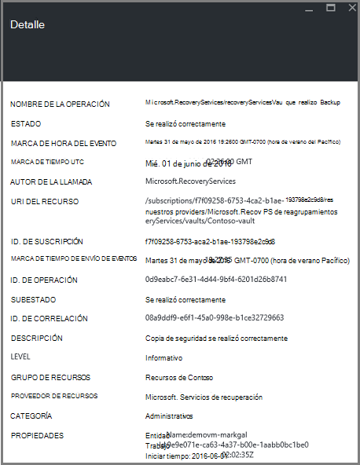

    La información de nivel de evento es tan detallada como Obtiene la información. Si prefiere ver este cuánta información sobre cada evento y le gustaría agregar este nivel de detalle para el módulo de **eventos** , consulte la sección [información de eventos de expansión](backup-azure-monitor-vms.md#view-additional-event-attributes).


## <a name="customize-the-event-filter"></a>Personalizar el filtro de eventos
Usar el **filtro** para ajustar o elija la información que aparece en un módulo determinado. Para filtrar la información del evento:

1. En el [panel de la cámara](./backup-azure-manage-vms.md#open-a-recovery-services-vault-in-the-dashboard), busque y haga clic en **Registros de auditoría** para abrir el módulo de **eventos** .

    

    Se abre el módulo de **eventos** a los eventos operativos filtrados solo para el depósito actual.

    

2. En el menú **eventos** , haga clic en **filtro** para abrir esa hoja.

    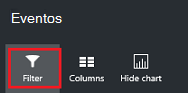

3. En el módulo de **filtro** , ajuste los filtros de **nivel** **de intervalo de tiempo**y **llamador** . Los filtros no están disponibles desde que se establecieron para proporcionar la información actual para el depósito de servicios de recuperación.

    

    Puede especificar el **nivel** de evento: crítica, Error, advertencia o informativos. Puede elegir cualquier combinación de niveles de evento, pero debe tener al menos un nivel seleccionado. Activar o desactivar el el nivel. El filtro **de intervalo de tiempo** le permite especificar el período de tiempo para capturar eventos. Si utiliza un intervalo de tiempo personalizado, puede establecer las horas de inicio y finalización.

4. Una vez que esté listo para los registros de las operaciones con el filtro de la consulta, haga clic en **Actualizar**. Mostrarán los resultados en el módulo de **eventos** .

    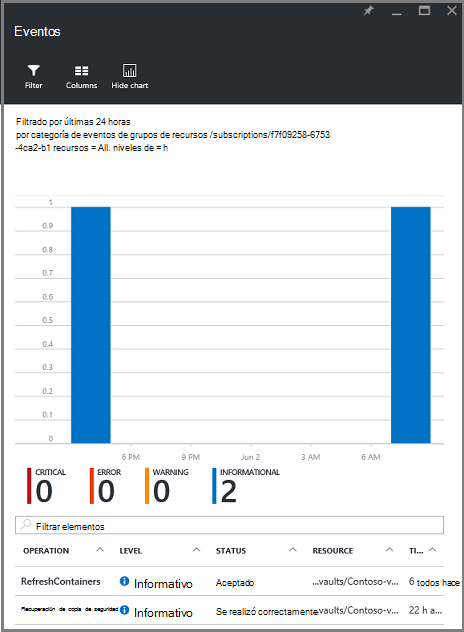


### <a name="view-additional-event-attributes"></a>Ver los atributos de evento adicionales
Mediante el botón **columnas** , puede habilitar los atributos de evento adicionales que aparezcan en la lista en el módulo de **eventos** . La lista predeterminada de eventos muestra información de la operación, nivel, estado, recursos y tiempo. Para habilitar los atributos adicionales:

1. En el módulo de **eventos** , haga clic en **columnas**.

    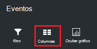

    Se abre el módulo de **Elegir columnas** .

    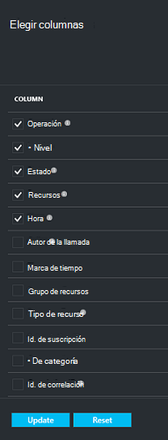

2. Para seleccionar el atributo, haga clic en la casilla de verificación. La casilla de verificación de atributo activa y desactiva.

3. Haga clic en **Restablecer** para restablecer la lista de atributos en el módulo de **eventos** . Después de agregar o quitar los atributos de la lista, use **Restablecer** para ver la nueva lista de atributos del evento.

4. Haga clic en **Actualizar** para actualizar los datos en los atributos del evento. En la tabla siguiente proporciona información acerca de cada atributo.

| Nombre de columna      |Descripción|
| -----------------|-----------|
| Operación|El nombre de la operación|
| Nivel|El nivel de la operación, valores pueden ser: informativo, advertencia, Error o tareas críticas|
|Estado|Estado descriptivo de la operación|
|Recursos|Dirección URL que identifica el recurso; también conocido como el identificador del recurso|
|Hora|Tiempo, medido desde la hora actual, cuando se produjo el evento|
|Autor de la llamada|¿Quién o qué denominado o activó el evento; puede ser el sistema o un usuario|
|Marca de tiempo|La hora cuando se activa el evento|
|Grupo de recursos|El grupo de recursos asociados|
|Tipo de recurso|El tipo de recurso interno utilizado por el Administrador de recursos|
|Id. de suscripción|El identificador de suscripción asociada|
|Categoría|Categoría del evento|
|Id. de correlación|ID comunes para los eventos relacionados|


## <a name="use-powershell-to-customize-alerts"></a>Usar PowerShell para personalizar alertas
Puede obtener notificaciones de alerta personalizadas para las tareas en el portal. Para obtener estas tareas, defina reglas de alerta de PowerShell en los eventos de registros operativos. Usar *PowerShell versión 1.3.0 o posterior*.

Para definir una notificación personalizada para errores de copia de seguridad, use un comando similar a la siguiente secuencia de comandos:

```
PS C:\> $actionEmail = New-AzureRmAlertRuleEmail -CustomEmail contoso@microsoft.com
PS C:\> Add-AzureRmLogAlertRule -Name backupFailedAlert -Location "East US" -ResourceGroup RecoveryServices-DP2RCXUGWS3MLJF4LKPI3A3OMJ2DI4SRJK6HIJH22HFIHZVVELRQ-East-US -OperationName Microsoft.Backup/RecoveryServicesVault/Backup -Status Failed -TargetResourceId /subscriptions/86eeac34-eth9a-4de3-84db-7a27d121967e/resourceGroups/RecoveryServices-DP2RCXUGWS3MLJF4LKPI3A3OMJ2DI4SRJK6HIJH22HFIHZVVELRQ-East-US/providers/microsoft.backupbvtd2/RecoveryServicesVault/trinadhVault -Actions $actionEmail
```

**ResourceId** : puede obtener ResourceId de los registros de auditoría. ResourceId es una dirección URL de la columna de recursos de los registros de operación.

**OperationName** : OperationName tiene el formato "Microsoft.RecoveryServices/recoveryServicesVault/*EventName*" donde puede ser *EventName* :<br/>
- Registrar <br/>
- Eliminar del registro <br/>
- ConfigureProtection <br/>
- Copia de seguridad <br/>
- Restaurar <br/>
- StopProtection <br/>
- DeleteBackupData <br/>
- CreateProtectionPolicy <br/>
- DeleteProtectionPolicy <br/>
- UpdateProtectionPolicy <br/>

**Estado** : valores compatibles son iniciado, éxito o error.

**ResourceGroup** : este es el grupo de recursos a la que pertenece el recurso. Puede agregar la columna de grupo de recursos para los registros generados. Grupo de recursos es uno de los tipos de información de eventos disponibles.

**Nombre** : nombre de la regla de alerta.

**CustomEmail** : especifique la dirección de correo electrónico personalizado a la que desea enviar una notificación de alerta

**SendToServiceOwners** : esta opción envía alertas para todos los administradores y coadministradores de la suscripción. Se puede usar en cmdlet **AzureRmAlertRuleEmail de nuevo**

### <a name="limitations-on-alerts"></a>Limitaciones de alertas
Alertas basadas en eventos están sujetos a las limitaciones siguientes:

1. Los avisos se activan en todos los equipos virtuales en depósito de servicios de recuperación. No se puede personalizar la alerta para un subconjunto de máquinas virtuales de un depósito de servicios de recuperación.
2. Esta característica está en vista previa. [Aprende más](../monitoring-and-diagnostics/insights-powershell-samples.md#create-alert-rules)
3. Se envían las alertas de "alerts-noreply@mail.windowsazure.com". Actualmente no se puede modificar el remitente de correo electrónico.


## <a name="next-steps"></a>Pasos siguientes

Registros de eventos de auditoría de las operaciones de copia de seguridad y habilitar excelente evaluación. Se registran las operaciones siguientes:

- Registrar
- Eliminar del registro
- Configurar la protección
- Copia de seguridad (ambos programadas así como copia de seguridad a petición)
- Restaurar
- Detener la protección
- Eliminar datos de copia de seguridad
- Agregar directiva
- Eliminar la directiva
- Directiva de actualización
- Cancelar trabajo

Para obtener una explicación amplia de eventos, operaciones y registros de auditoría en los servicios de Azure, vea el artículo, [Ver eventos y registros de auditoría](../monitoring-and-diagnostics/insights-debugging-with-events.md).

Para obtener información sobre cómo volver a crear una máquina virtual desde un punto de recuperación, consulte [Restaurar máquinas virtuales de Azure](backup-azure-restore-vms.md). Si necesita información sobre cómo proteger su máquinas virtuales de Windows, vea [busque primero: VM a un depósito de servicios de recuperación de copia de seguridad](backup-azure-vms-first-look-arm.md). Obtenga información sobre las tareas de administración para las copias de seguridad VM en el artículo de [copias de seguridad de Azure administrar máquina virtual](backup-azure-manage-vms.md).
