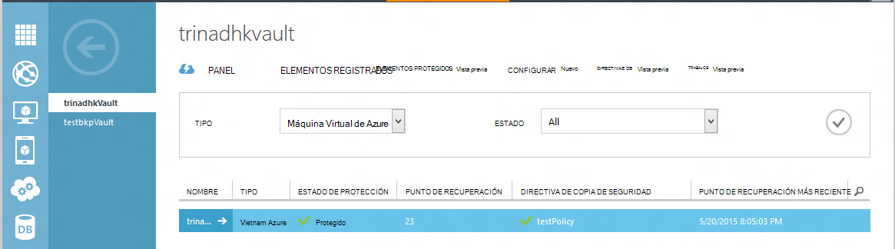
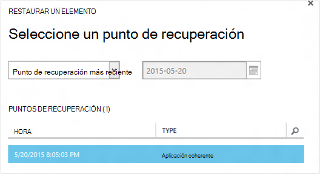
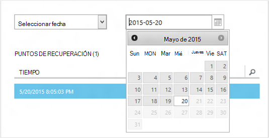
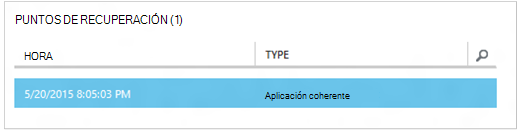
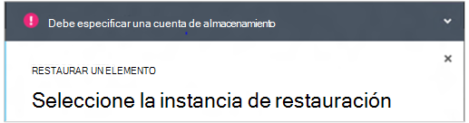
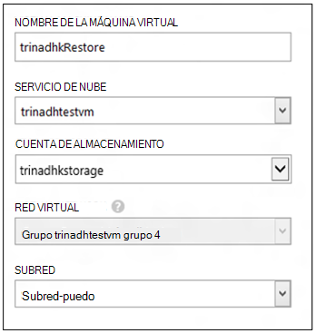
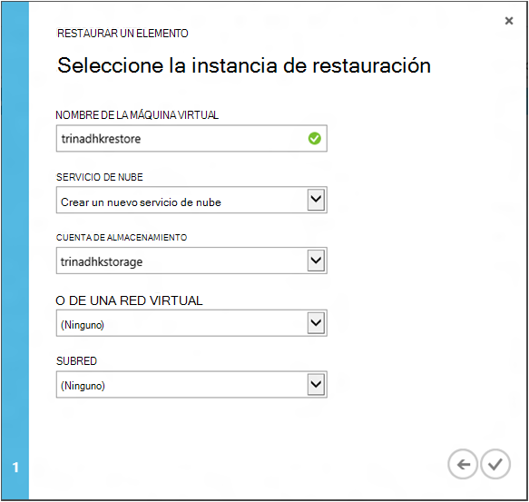
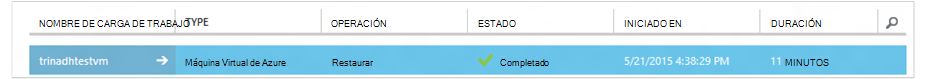

<properties
    pageTitle="Restaurar un máquinas virtuales de copia de seguridad | Microsoft Azure"
    description="Obtenga información sobre cómo restaurar una máquina virtual Azure desde un punto de recuperación"
    services="backup"
    documentationCenter=""
    authors="trinadhk"
    manager="shreeshd"
    editor=""
    keywords="restaurar copia de seguridad; Cómo restaurar; punto de recuperación;"/>

<tags
    ms.service="backup"
    ms.workload="storage-backup-recovery"
    ms.tgt_pltfrm="na"
    ms.devlang="na"
    ms.topic="article"
    ms.date="08/02/2016"
    ms.author="trinadhk; jimpark;"/>

# Restaurar máquinas virtuales de Azure

> [AZURE.SELECTOR]
- [Restaurar máquinas virtuales en el portal de Azure](backup-azure-arm-restore-vms.md)
- [Restaurar máquinas virtuales de portal clásico](backup-azure-restore-vms.md)

Restaurar una máquina virtual a una nueva máquina virtual de las copias de seguridad almacenados en un depósito de copia de seguridad de Azure con los siguientes pasos.

## Restaurar el flujo de trabajo

### 1. Elija un elemento para restaurar

1. Vaya a la pestaña **Elementos protegidos** y seleccione la máquina virtual que desea restaurar a una nueva máquina virtual.

    

    La columna de **Punto de recuperación** en la página de **Elementos protegidos** le indicará el número de puntos de recuperación para una máquina virtual. La columna de **Punto de recuperación más recientes** le indica la hora de la copia de seguridad más reciente desde el que se puede restaurar una máquina virtual.

2. Haga clic en **Restaurar** para abrir al Asistente para **restaurar un elemento** .

    

### 2. Seleccione un punto de recuperación

1. En la pantalla **Seleccionar un punto de recuperación** , puede restaurar desde el punto de recuperación más reciente, o desde un punto anterior en el tiempo. La opción predeterminada seleccionada cuando se abre el asistente es el *Punto de recuperación más recientes*.

    

2. Para seleccionar un punto anterior en el tiempo, elija la opción **Seleccionar fecha** en la lista desplegable y seleccione una fecha en el control de calendario haciendo clic en el **icono de calendario**. En el control, todas las fechas que tienen puntos de recuperación se rellenan con un tono de color gris claro y permite seleccionables por el usuario.

    

    Una vez que haga clic en una fecha en el control de calendario, la recuperación puntos disponibles en los que la fecha se mostrará en la siguiente tabla de puntos de recuperación. La columna **hora** indica la hora en que se realizó la instantánea. La columna **tipo** muestra la [coherencia](https://azure.microsoft.com/documentation/articles/backup-azure-vms/#consistency-of-recovery-points) de punto de recuperación. El encabezado de tabla muestra el número de puntos de recuperación disponibles en ese día entre paréntesis.

    

3. Seleccione el punto de recuperación de la tabla de **Puntos de recuperación** y haga clic en la flecha siguiente para ir a la siguiente pantalla.

### 3. Especifique una ubicación de destino

1. En la pantalla de **instancia Restaurar selección** especificar detalles de dónde desea restaurar la máquina virtual.

  - Especifique el nombre de la máquina virtual: en un servicio de nube determinada, el nombre de la máquina virtual debe ser único. No se admite sobrescribiendo VM existente. 
  - Seleccione un servicio de nube de VM: Esto es obligatorio para crear una máquina virtual. Puede usar un servicio de nube existente o crear un nuevo servicio de nube.

        Whatever cloud service name is picked should be globally unique. Typically, the cloud service name gets associated with a public-facing URL in the form of [cloudservice].cloudapp.net. Azure will not allow you to create a new cloud service if the name has already been used. If you choose to create select create a new cloud service, it will be given the same name as the virtual machine – in which case the VM name picked should be unique enough to be applied to the associated cloud service.

        We only display cloud services and virtual networks that are not associated with any affinity groups in the restore instance details. [Learn More](../virtual-network/virtual-networks-migrate-to-regional-vnet.md).

2. Seleccione una cuenta de almacenamiento para la máquina virtual: Esto es obligatorio para la creación de la máquina virtual. Puede seleccionar desde las cuentas existentes de almacenamiento de la misma región como depósito de copia de seguridad de Azure. No se admite cuentas de almacenamiento que son redundante o del tipo de almacenamiento Premium de zona.

    Si no hay ninguna cuenta de almacenamiento con configuración compatible, cree una cuenta de almacenamiento de configuración compatible antes de iniciar la operación de restauración.

    

3. Seleccione una red Virtual: la red virtual (VNET) para la máquina virtual debe estar seleccionada en el momento de la creación de la máquina virtual. La restauración IU muestra todos los VNETs dentro de esta suscripción que se pueden usar. No es obligatorio para seleccionar un VNET para VM restaurada: podrá conectarse a la máquina virtual restaurada a través de internet incluso si no se aplica el VNET.

    Si el servicio de nube seleccionado está asociado a una red virtual, no puede cambiar la red virtual.

    

4. Seleccione una subred: en caso de que el VNET tiene subredes, de forma predeterminada se selecciona la subred primera. Elija la subred de su elección de las opciones de la lista desplegable. Para obtener detalles de subred, vaya a la extensión de redes en la [página principal del portal](https://manage.windowsazure.com/), vaya a **Redes virtuales** y seleccione la red virtual y profundizar en configurar para ver detalles de subred.

    

5. Haga clic en el icono de **envío** en el Asistente para enviar los detalles y crear una tarea de restauración.

## Realizar un seguimiento de la operación de restauración
Una vez que tiene toda la información en el Asistente para restauración de entrada y lo envió copia de seguridad de Azure intentará crear un trabajo para realizar un seguimiento de la operación de restauración.

Si la creación de trabajo se realiza correctamente, verá una notificación de aviso que indica que se ha creado el trabajo. Puede obtener más detalles, haga clic en el botón de **Trabajo de la vista** que le llevará a la ficha **trabajos** .

Una vez finalizada la operación de restauración, se marcará como completada en la ficha **trabajos** .

Después de restaurar la máquina virtual debe volver a instalar las extensiones existentes en la máquina virtual original y [modificar los extremos](../virtual-machines/virtual-machines-windows-classic-setup-endpoints.md) de la máquina virtual en el portal de Azure.

## Posteriores a la restauración pasos
Si está utilizando una distribución de Linux en función de inicialización de nube como Ubuntu, por motivos de seguridad, se bloquearán contraseña publicar restaurar. Utilice VMAccess extensión en la VM restaurados para [Restablecer la contraseña](../virtual-machines/virtual-machines-linux-classic-reset-access.md). Se recomienda utilizar claves SSH en estas distribuciones para evitar el restablecimiento de contraseña post restaurar. 

## Copia de seguridad de VM restauradas
Si ha restaurado VM al mismo servicio de nube con el mismo nombre que se copia originalmente VM, copia de seguridad seguirá en la restauración de la publicación de máquina virtual. Si tiene restaurado Vm a un servicio de nube diferente, o bien especificar un nombre diferente para VM restaurados, esto se tratará como una nueva máquina virtual y necesita copia de seguridad de configuración para VM restaurados.

## Restaurar una máquina virtual durante desastre de centro de datos de Azure
Copia de seguridad de Azure permite restaurar una copia de máquinas virtuales al centro de datos pareja en caso de que los datos principales centrar donde máquinas virtuales están ejecutando experiencias desastres y configurado depósito de copia de seguridad para que sea geo redundantes. Durante estos casos, deberá seleccionar una cuenta de almacenamiento que está presente en el centro de datos pareja y resto del proceso de restauración permanece mismo. Copia de seguridad de Azure usa el servicio de cálculo de geo pareja para crear la máquina virtual restaurada. 

## Restaurar VM del controlador de dominio
Copia de seguridad de máquinas virtuales de controlador de dominio (DC) es un escenario admitido con copia de seguridad de Azure. Sin embargo algunos debe tener cuidado durante el proceso de restauración. La experiencia de restauración es muy diferente para máquinas virtuales de controlador de dominio en una configuración de único DC frente a máquinas virtuales en una configuración de múltiples DC.

### Único DC
Se puede restaurar la máquina virtual (como cualquier otra máquina virtual) de la Azure portal o con PowerShell.

### Varios controladores de dominio
Cuando tiene un entorno de múltiples DC, los controladores de dominio tiene su propia forma de mantener sincronizados los datos. Cuando un punto de copia de seguridad anterior es restaurado *sin las precauciones*, proceso para deshacer el USN puede causar caos en un entorno de múltiples DC. La forma de recuperar como una máquina virtual es iniciar en modo DSRM.

El desafío surge porque no hay modo DSRM en Azure. Por lo tanto para restaurar como una máquina virtual, no puede usar el portal de Azure. Solo admite restaurar mecanismo es restaurar basada en disco con PowerShell.

>[AZURE.WARNING] Máquinas virtuales de controlador de dominio en un entorno de múltiples DC, no use el portal de Azure para restaurar! Se permite la restauración de PowerShell según solo

Más información sobre el [problema de deshacer USN](https://technet.microsoft.com/library/dd363553) y las estrategias sugeridas para solucionarlo.

## Restaurar VM con las configuraciones de red especiales
Copia de seguridad de Azure es compatible con la copia de seguridad para los siguientes configuraciones de red especiales de máquinas virtuales de Windows.

- Máquinas virtuales en equilibrador de carga (interno y externo)
- Máquinas virtuales con varias direcciones IP reservada
- Máquinas virtuales con varias NIC

Exigen estas configuraciones siguientes consideraciones al restaurar.

>[AZURE.TIP] Use PowerShell según restaurar flujo para volver a crear la configuración de red especiales de restauración de máquinas virtuales de publicación.

### Restaurar a partir de la interfaz de usuario:
Al restaurar a partir de la interfaz de usuario, **Elija siempre un nuevo servicio de nube**. Tenga en cuenta que puesto que portal sólo tiene obligatorio parámetros durante la restauración flujo, máquinas virtuales restauradas mediante la interfaz de usuario perderá la configuración de red especiales poseen. En otras palabras, restaurar las VM será normales máquinas virtuales sin la configuración del equilibrador de carga o múltiples NIC o IP reservada varios.

### Restaurar a partir de PowerShell:
PowerShell tiene la capacidad para restaurar solo los discos VM de copia de seguridad y no crear la máquina virtual. Esto es útil para restaurar máquinas virtuales de Windows que requieren mentined de configuraciones de red especiales anterior.

Para volver a crear los discos de restauración de publicación de máquina virtual completamente, siga estos pasos:

1. Restaurar los discos de la cámara de copia de seguridad con [PowerShell de copia de seguridad de Azure](../backup-azure-vms-classic-automation.md#restore-an-azure-vm)

2. Crear la configuración necesaria para equilibrador de carga / IP reservada de NIC o varios múltiples con los cmdlets de PowerShell y el uso que se cree la máquina virtual de deseado configuración.
    - Crear VM en servicio de nube con [equilibrador de carga interno](https://azure.microsoft.com/documentation/articles/load-balancer-internal-getstarted/)
    - Crear VM para conectarse a [opuestas equilibrador de carga de Internet] (https://azure.microsoft.com/en-us/documentation/articles/load-balancer-internet-getstarted/)
    - Crear VM con [varias NIC](https://azure.microsoft.com/documentation/articles/virtual-networks-multiple-nics/)
    - Crear VM con [varias direcciones IP reservada](https://azure.microsoft.com/documentation/articles/virtual-networks-reserved-public-ip/)

## Pasos siguientes
- [Solución de errores](backup-azure-vms-troubleshoot.md#restore)
- [Administrar máquinas virtuales](backup-azure-manage-vms.md)
