<properties
   pageTitle="Restaurar los datos en un servidor de Windows o un cliente de Windows de Azure utiliza el modelo de implementación de administrador de recursos | Microsoft Azure"
   description="Obtenga información sobre cómo restaurar a partir de un cliente de Windows o Windows Server."
   services="backup"
   documentationCenter=""
   authors="saurabhsensharma"
   manager="shivamg"
   editor=""/>

<tags
   ms.service="backup"
   ms.workload="storage-backup-recovery"
     ms.tgt_pltfrm="na"
     ms.devlang="na"
     ms.topic="article"
     ms.date="08/02/2016"
     ms.author="trinadhk; jimpark; markgal;"/>

# Restaurar archivos en un servidor de Windows o un equipo de cliente de Windows mediante el modelo de implementación de administrador de recursos

> [AZURE.SELECTOR]
- [Portal de Azure](backup-azure-restore-windows-server.md)
- [Portal clásica](backup-azure-restore-windows-server-classic.md)

En este artículo se describen los pasos necesarios para realizar dos tipos de operaciones de restauración:

- Restaurar los datos en el mismo equipo desde la que se han realizado las copias de seguridad.
- Restaurar los datos en cualquier otro equipo.

En ambos casos, los datos se recuperan de la cámara de servicios de recuperación de Azure.

[AZURE.INCLUDE [learn-about-deployment-models](../../includes/learn-about-deployment-models-rm-include.md)]modelo de implementación clásico.

## Recuperar datos en el mismo equipo
Si accidentalmente elimina un archivo y desea restaurar en el mismo equipo (desde la que se toma la copia de seguridad), los pasos siguientes le ayudará a recuperar los datos.

1. Abra el complemento de **Copia de seguridad de Microsoft Azure** .
2. Haga clic en **Recuperar datos** para iniciar el flujo de trabajo.

    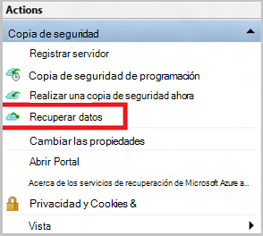

3. Seleccione el * *este servidor (*NombreDeSuEquipo*) ** opción para restaurar los archivos en el mismo equipo.

    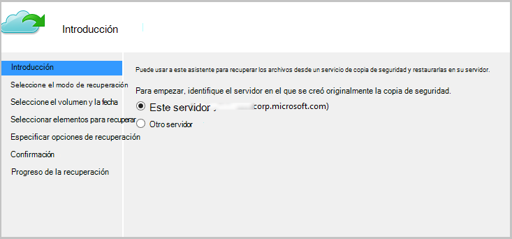

4. Elija **Examinar para archivos** o **Buscar archivos**.

    Deje la opción predeterminada si piensa restaurar uno o más archivos que se conoce cuya ruta de acceso. Si no está seguro sobre la estructura de carpetas pero desea buscar un archivo, seleccione la opción de **búsqueda de archivos** . En esta sección, se continuará con la opción predeterminada.

    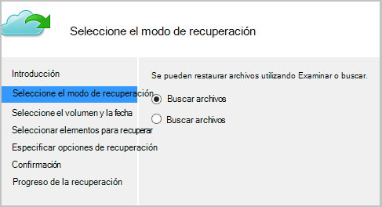

5. Seleccione el volumen desde la que desea restaurar el archivo.

    Puede restaurar desde cualquier punto en el tiempo. Las fechas que aparecen en **negrita** en el control de calendario indican la disponibilidad de un punto de restauración. Una vez que se selecciona una fecha, en función de la programación de copia de seguridad (y el éxito de una operación de copia de seguridad), puede seleccionar un punto en el tiempo de la lista de **tiempo** hacia abajo.

    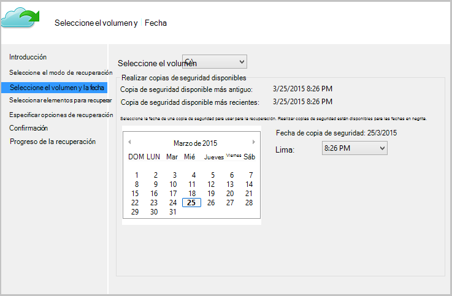

6. Seleccione los elementos que desea recuperar. Puede seleccionar varios carpetas y archivos que desea restaurar.

    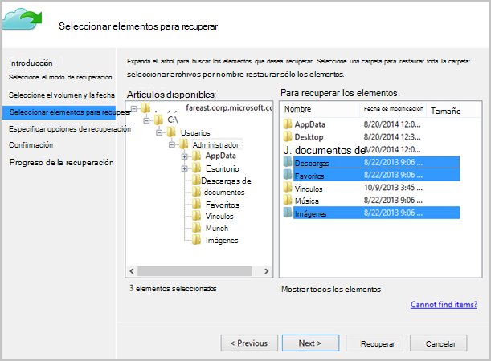

7. Especifique los parámetros de recuperación.

    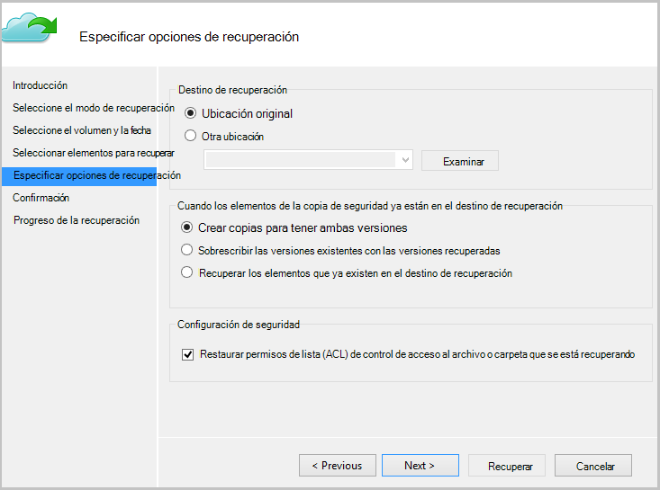

  - Tiene la opción de restaurar en la ubicación original (en la que el archivo o carpeta se sobrescribirán) o a otra ubicación en el mismo equipo.
  - Si existe el archivo o carpeta que desea restaurar en la ubicación de destino, puede crear copias (dos versiones del mismo archivo), sobrescribir los archivos en la ubicación de destino u omitir la recuperación de los archivos que existen en el destino.
  - Se recomienda que deje la opción predeterminada de restaurar las ACL en los archivos que se recuperarán.

8. Una vez que se proporcionan estas entradas, haga clic en **siguiente**. El flujo de trabajo de recuperación, que restaura los archivos en este equipo, comenzará.

## Recuperar a un equipo alternativo
Si se pierde todo el servidor, se pueden recuperar datos de copia de seguridad de Azure a otro equipo. Los pasos siguientes muestran el flujo de trabajo.  

Incluye la terminología usada en estos pasos:

- *Equipo de origen* : la máquina original desde el que se realizó la copia de seguridad y que está disponible actualmente.
- *Equipo de destino* : el equipo a la que se está recuperando los datos.
- *Depósito de ejemplo* : depósito de los servicios de recuperación que se registran el *equipo de origen* y el *equipo de destino* .  

> [AZURE.NOTE] No se puede restaurar copias de seguridad realizadas desde un equipo en un equipo que se está ejecutando una versión anterior del sistema operativo. Por ejemplo, si se realizan copias de seguridad de un equipo con Windows 7, puede restaurarse en un Windows 8 o por encima de la máquina. Sin embargo la viceversa no es cierta.

1. Abra el complemento de **Copia de seguridad de Microsoft Azure** de en el *equipo de destino*.
2. Asegúrese de que el *equipo de destino* y el *equipo de origen* están registrados para el mismo depósito de servicios de recuperación.
3. Haga clic en **Recuperar datos** para iniciar el flujo de trabajo.

    

4. Seleccione **otro servidor**

    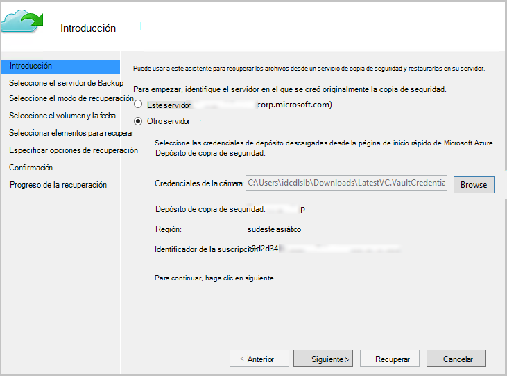

5. Proporcione el archivo de credenciales de cámara que corresponde a la *cámara de ejemplo*. Si el archivo de credenciales de la cámara no es válido (o caducado) descargar un nuevo archivo de credenciales de depósito desde la *cámara de ejemplo* en el portal de Azure. Una vez que se proporciona el archivo de credenciales de la cámara, se muestra el depósito de servicios de recuperación con el archivo de credenciales de la cámara.

6. Seleccione la *máquina de origen* de la lista de equipos mostrados.

    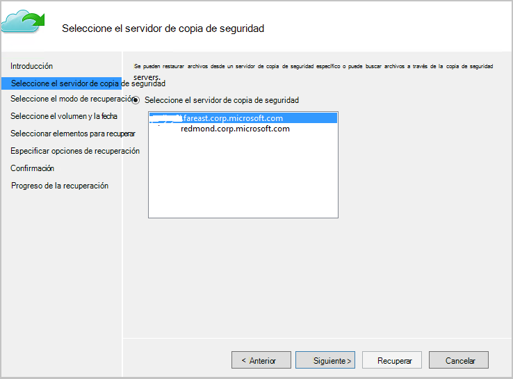

7. Seleccione la opción **Buscar archivos** o **Buscar archivos** . En esta sección, usamos la opción de **búsqueda de archivos** .

    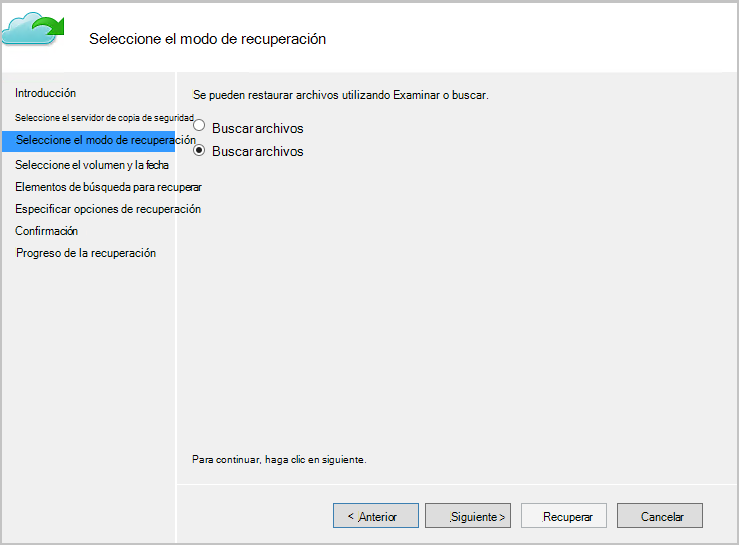

8. Seleccione el volumen y la fecha en la pantalla siguiente. Busque el nombre de carpeta o archivo que desea restaurar.

    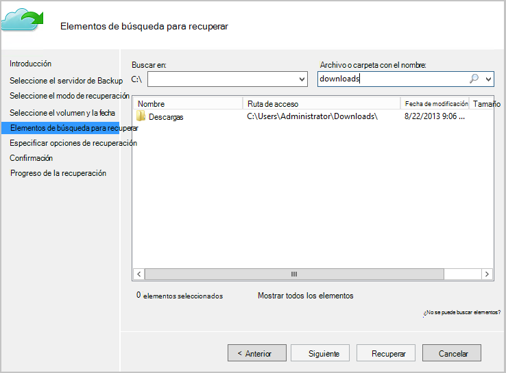

9. Seleccione la ubicación donde debe restaurarse los archivos.

    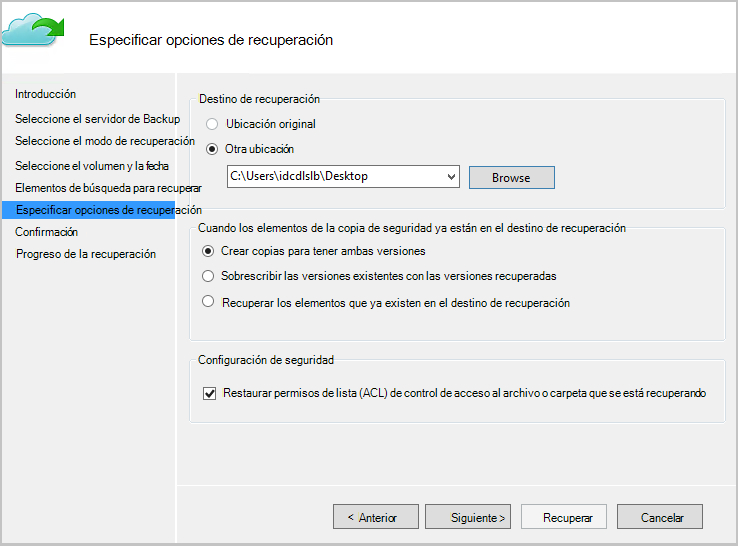

10. Proporcione la frase de contraseña de cifrado que se proporcionó durante el registro del *equipo de origen* en *depósito de ejemplo*.

    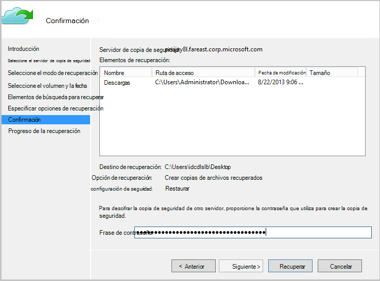

11. Una vez que se proporciona la entrada, haga clic en **recuperar**, que se activa la restauración de los archivos de copia de seguridad en el destino proporcionado.

## Pasos siguientes
- Ahora que ha recuperado los archivos y carpetas, puede [administrar las copias de seguridad](backup-azure-manage-windows-server.md).
