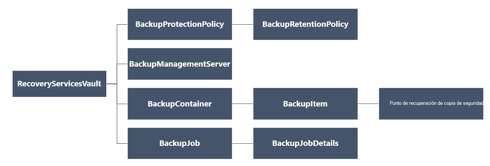

<properties
   pageTitle="Implementar y administrar las copias de seguridad para máquinas virtuales de implementada por el Administrador de recursos con PowerShell | Microsoft Azure"
   description="Usar PowerShell para implementar y administrar las copias de seguridad en Azure para máquinas virtuales implementado por el Administrador de recursos"
   services="backup"
   documentationCenter=""
   authors="markgalioto"
   manager="cfreeman"
   editor=""/>

<tags
   ms.service="backup"
   ms.devlang="na"
   ms.topic="article"
   ms.tgt_pltfrm="na"
   ms.workload="storage-backup-recovery"
   ms.date="08/03/2016"
   ms.author="markgal; trinadhk"/>

# <a name="deploy-and-manage-backups-for-resource-manager-deployed-vms-using-powershell"></a>Implementar y administrar las copias de seguridad para máquinas virtuales de implementada por el Administrador de recursos con PowerShell

> [AZURE.SELECTOR]
- [Administrador de recursos](backup-azure-vms-automation.md)
- [Clásico](backup-azure-vms-classic-automation.md)

Este artículo le muestra cómo usar los cmdlets de PowerShell de Azure para realizar copias de seguridad y recuperar una máquina virtual Azure (VM) de un depósito de servicios de recuperación. Un depósito de servicios de recuperación es un recurso de administrador de recursos de Azure y se usa para proteger los datos y activos en servicios de copia de seguridad de Azure y Azure sitio de recuperación. Puede usar un depósito de servicios de recuperación para proteger máquinas virtuales implementado por el Administrador de servicios de Azure, así como máquinas virtuales implementado por el Administrador de recursos de Azure.

>[AZURE.NOTE] Azure tiene dos modelos de implementación para crear y trabajar con recursos: [Administrador de recursos y clásica](../resource-manager-deployment-model.md). Este artículo es para su uso con máquinas virtuales creadas con el modelo de administrador de recursos.

En este artículo le guiará por usar PowerShell para proteger una máquina virtual y restaurar los datos de un punto de recuperación.

## <a name="concepts"></a>Conceptos

Si no está familiarizado con el servicio de copia de seguridad de Azure, para obtener información general del servicio, consulte [¿Qué es la copia de seguridad de Azure?](backup-introduction-to-azure-backup.md) Antes de empezar, asegúrese de que cubre los fundamentos sobre los requisitos previos necesarios para que funcione con la copia de seguridad de Azure y las limitaciones de la solución de copia de seguridad de máquina virtual actual.

Para usar PowerShell eficaz, es necesario comprender la jerarquía de objetos y de dónde comenzar.



Para ver la referencia de cmdlet de AzureRmRecoveryServicesBackup PowerShell, consulte la [Copia de seguridad de Azure - Cmdlets de servicios de recuperación](https://msdn.microsoft.com/library/mt723320.aspx) de la biblioteca de Azure.
Para ver la referencia de cmdlet de AzureRmRecoveryServicesVault PowerShell, consulte los [Cmdlets del servicio de recuperación de Azure](https://msdn.microsoft.com/library/mt643905.aspx).


## <a name="setup-and-registration"></a>Configuración y registro

Para empezar:

1. [Descargar la versión más reciente de PowerShell](https://github.com/Azure/azure-powershell/releases) (es la versión mínima requerida: 1.4.0)

2. Buscar los cmdlets de PowerShell de copia de seguridad de Azure disponibles escribiendo el siguiente comando:

```
PS C:\> Get-Command *azurermrecoveryservices*

CommandType     Name                                               Version    Source
-----------     ----                                               -------    ------
Cmdlet          Backup-AzureRmRecoveryServicesBackupItem           1.4.0      AzureRM.RecoveryServices.Backup
Cmdlet          Disable-AzureRmRecoveryServicesBackupProtection    1.4.0      AzureRM.RecoveryServices.Backup
Cmdlet          Enable-AzureRmRecoveryServicesBackupProtection     1.4.0      AzureRM.RecoveryServices.Backup
Cmdlet          Get-AzureRmRecoveryServicesBackupContainer         1.4.0      AzureRM.RecoveryServices.Backup
Cmdlet          Get-AzureRmRecoveryServicesBackupItem              1.4.0      AzureRM.RecoveryServices.Backup
Cmdlet          Get-AzureRmRecoveryServicesBackupJob               1.4.0      AzureRM.RecoveryServices.Backup
Cmdlet          Get-AzureRmRecoveryServicesBackupJobDetails        1.4.0      AzureRM.RecoveryServices.Backup
Cmdlet          Get-AzureRmRecoveryServicesBackupManagementServer  1.4.0      AzureRM.RecoveryServices.Backup
Cmdlet          Get-AzureRmRecoveryServicesBackupProperties        1.4.0      AzureRM.RecoveryServices
Cmdlet          Get-AzureRmRecoveryServicesBackupProtectionPolicy  1.4.0      AzureRM.RecoveryServices.Backup
Cmdlet          Get-AzureRMRecoveryServicesBackupRecoveryPoint     1.4.0      AzureRM.RecoveryServices.Backup
Cmdlet          Get-AzureRmRecoveryServicesBackupRetentionPolic... 1.4.0      AzureRM.RecoveryServices.Backup
Cmdlet          Get-AzureRmRecoveryServicesBackupSchedulePolicy... 1.4.0      AzureRM.RecoveryServices.Backup
Cmdlet          Get-AzureRmRecoveryServicesVault                   1.4.0      AzureRM.RecoveryServices
Cmdlet          Get-AzureRmRecoveryServicesVaultSettingsFile       1.4.0      AzureRM.RecoveryServices
Cmdlet          New-AzureRmRecoveryServicesBackupProtectionPolicy  1.4.0      AzureRM.RecoveryServices.Backup
Cmdlet          New-AzureRmRecoveryServicesVault                   1.4.0      AzureRM.RecoveryServices
Cmdlet          Remove-AzureRmRecoveryServicesProtectionPolicy     1.4.0      AzureRM.RecoveryServices.Backup
Cmdlet          Remove-AzureRmRecoveryServicesVault                1.4.0      AzureRM.RecoveryServices
Cmdlet          Restore-AzureRMRecoveryServicesBackupItem          1.4.0      AzureRM.RecoveryServices.Backup
Cmdlet          Set-AzureRmRecoveryServicesBackupProperties        1.4.0      AzureRM.RecoveryServices
Cmdlet          Set-AzureRmRecoveryServicesBackupProtectionPolicy  1.4.0      AzureRM.RecoveryServices.Backup
Cmdlet          Set-AzureRmRecoveryServicesVaultContext            1.4.0      AzureRM.RecoveryServices
Cmdlet          Stop-AzureRmRecoveryServicesBackupJob              1.4.0      AzureRM.RecoveryServices.Backup
Cmdlet          Unregister-AzureRmRecoveryServicesBackupContainer  1.4.0      AzureRM.RecoveryServices.Backup
Cmdlet          Unregister-AzureRmRecoveryServicesBackupManagem... 1.4.0      AzureRM.RecoveryServices.Backup
Cmdlet          Wait-AzureRmRecoveryServicesBackupJob              1.4.0      AzureRM.RecoveryServices.Backup
```


Las siguientes tareas se pueden automatizar con PowerShell:

- Crear un depósito de servicios de recuperación
- Hacer copia de seguridad o proteger máquinas virtuales de Azure
- Desencadenar un trabajo de copia de seguridad
- Monitor de un trabajo de copia de seguridad
- Restaurar una máquina virtual de Azure

## <a name="create-a-recovery-services-vault"></a>Crear un depósito de servicios de recuperación

Los siguientes pasos le guiarán en el proceso de creación de un depósito de servicios de recuperación. Un depósito de servicios de recuperación es diferente a un depósito de copia de seguridad.

1. Si está utilizando la copia de seguridad de Azure por primera vez, debe usar el cmdlet **[AzureRMResourceProvider registrar](https://msdn.microsoft.com/library/mt679020.aspx)** para registrar el proveedor de servicios de recuperación de Azure con su suscripción.

    ```
    PS C:\> Register-AzureRmResourceProvider -ProviderNamespace "Microsoft.RecoveryServices"
    ```

2. El depósito de servicios de recuperación es un recurso de administrador de recursos, por lo que es necesario colocar dentro de un grupo de recursos. Puede usar un grupo de recursos existente o crear un nuevo grupo de recursos con el cmdlet **[AzureRmResourceGroup de nuevo](https://msdn.microsoft.com/library/mt678985.aspx)** . Al crear un nuevo grupo de recursos, especifique el nombre y la ubicación del grupo de recursos.  

    ```
    PS C:\> New-AzureRmResourceGroup –Name "test-rg" –Location "West US"
    ```

3. Usar el cmdlet **[AzureRmRecoveryServicesVault de nuevo](https://msdn.microsoft.com/library/mt643910.aspx)** para crear el nuevo depósito. Asegúrese de especificar la misma ubicación para el depósito que se utilizó para el grupo de recursos.

    ```
    PS C:\> New-AzureRmRecoveryServicesVault -Name "testvault" -ResourceGroupName " test-rg" -Location "West US"
    ```

4. Especificar el tipo de redundancia de almacenamiento para usar; Puede usar [Almacenamiento redundantes localmente (LRS)](../storage/storage-redundancy.md#locally-redundant-storage) o [Geo redundantes almacenamiento (GRS)](../storage/storage-redundancy.md#geo-redundant-storage). En el ejemplo siguiente se muestra que la opción - BackupStorageRedundancy testVault está establecida en GeoRedundant.

    ```
    PS C:\> $vault1 = Get-AzureRmRecoveryServicesVault –Name "testVault"
    PS C:\> Set-AzureRmRecoveryServicesBackupProperties  -Vault $vault1 -BackupStorageRedundancy GeoRedundant
    ```

    > [AZURE.TIP] Cmdlets de copia de seguridad de Azure muchos requieren el objeto de la cámara de servicios de recuperación como una entrada. Por este motivo, es conveniente almacenar el objeto del depósito de servicios de recuperación de copia de seguridad en una variable.

## <a name="view-the-vaults-in-a-subscription"></a>Ver los depósitos en una suscripción
Use **[Get-AzureRmRecoveryServicesVault](https://msdn.microsoft.com/library/mt643907.aspx)** para ver la lista de todos los depósitos en la suscripción actual. Puede utilizar este comando para comprobar que se ha creado un depósito nuevo, o para ver qué depósitos están disponibles en la suscripción.

Ejecutar el comando Get-AzureRmRecoveryServicesVault, y se muestran todos los depósitos en la suscripción.

```
PS C:\> Get-AzureRmRecoveryServicesVault
Name              : Contoso-vault
ID                : /subscriptions/1234
Type              : Microsoft.RecoveryServices/vaults
Location          : WestUS
ResourceGroupName : Contoso-docs-rg
SubscriptionId    : 1234-567f-8910-abc
Properties        : Microsoft.Azure.Commands.RecoveryServices.ARSVaultProperties
```


## <a name="backup-azure-vms"></a>Copia de seguridad máquinas virtuales de Azure
Ahora que ha creado un depósito de servicios de recuperación, puede usarlo para proteger una máquina virtual. Sin embargo antes de aplicar la protección, debe establecer el contexto de la cámara y es posible que desee comprobar la directiva de protección. Contexto de la cámara define el tipo de datos que está protegidas de la cámara. La directiva de protección es el plan para cuando se ejecuta el trabajo de copia de seguridad y cuánto tiempo se conserva cada instantánea de copia de seguridad.

Antes de habilitar la protección en una máquina virtual, debe establecer el contexto de la cámara. El contexto se aplica a todos los cmdlets siguientes.

```
PS C:\> Get-AzureRmRecoveryServicesVault -Name testvault | Set-AzureRmRecoveryServicesVaultContext
```

### <a name="create-a-protection-policy"></a>Crear una directiva de protección

Cuando se crea un nuevo depósito, viene con una directiva predeterminada. Esta directiva activa a un trabajo de copia de seguridad cada día a una hora determinada. Por la directiva predeterminada, se conservará la copia de seguridad instantánea durante 30 días. Puede usar la directiva predeterminada para proteger rápidamente su VM y editar la directiva más adelante con datos diferentes.

Use **[Get-AzureRmRecoveryServicesBackupProtectionPolicy](https://msdn.microsoft.com/library/mt723300.aspx)** para ver la lista de directivas disponibles de la cámara:

```
PS C:\> Get-AzureRmRecoveryServicesBackupProtectionPolicy -WorkloadType AzureVM
Name                 WorkloadType       BackupManagementType BackupTime                DaysOfWeek
----                 ------------       -------------------- ----------                ----------
DefaultPolicy        AzureVM            AzureVM              4/14/2016 5:00:00 PM
```

> [AZURE.NOTE] La zona horaria del campo BackupTime en PowerShell es UTC. Sin embargo, cuando el tiempo de copia de seguridad se muestra en el portal de Azure, la hora se ajusta a su zona horaria local.

Una directiva de protección de copia de seguridad está asociada con al menos una directiva de retención.  Directiva de retención define el tiempo que se mantiene un punto de recuperación con copias de seguridad de Azure. Usar **Get-AzureRmRecoveryServicesBackupRetentionPolicyObject** para ver la directiva de retención de forma predeterminada.  Del mismo modo puede usar **Get-AzureRmRecoveryServicesBackupSchedulePolicyObject** para obtener la directiva predeterminada de la programación. Los objetos de directiva de retención y programación se usan como entrada al cmdlet **AzureRmRecoveryServicesBackupProtectionPolicy de nuevo** .

Una directiva de protección de copia de seguridad define cuándo y con qué frecuencia se realiza la copia de seguridad de un elemento. El cmdlet New-AzureRmRecoveryServicesBackupProtectionPolicy crea un objeto de PowerShell que contiene la información de directiva de copia de seguridad. La directiva de copia de seguridad se utiliza como entrada al cmdlet Enable-AzureRmRecoveryServicesBackupProtection.

```
PS C:\> $schPol = Get-AzureRmRecoveryServicesBackupSchedulePolicyObject -WorkloadType "AzureVM"
PS C:\>  $retPol = Get-AzureRmRecoveryServicesBackupRetentionPolicyObject -WorkloadType "AzureVM"
PS C:\>  New-AzureRmRecoveryServicesBackupProtectionPolicy -Name "NewPolicy" -WorkloadType AzureVM -RetentionPolicy $retPol -SchedulePolicy $schPol
Name                 WorkloadType       BackupManagementType BackupTime                DaysOfWeek
----                 ------------       -------------------- ----------                ----------
NewPolicy           AzureVM            AzureVM              4/24/2016 1:30:00 AM
```

### <a name="enable-protection"></a>Habilitar protección

Al habilitar la protección implica dos objetos - el elemento y la directiva. Ambos objetos son necesarios para habilitar la protección de la cámara. Una vez que la directiva se asociaron con la cámara, se activa el flujo de trabajo de copia de seguridad al tiempo que se definen en la programación de la directiva.

Para habilitar la protección en máquinas virtuales de ARM no cifrado

```
PS C:\> $pol=Get-AzureRmRecoveryServicesBackupProtectionPolicy -Name "NewPolicy"
PS C:\> Enable-AzureRmRecoveryServicesBackupProtection -Policy $pol -Name "V2VM" -ResourceGroupName "RGName1"
```

Para habilitar la protección en máquinas virtuales cifradas [cifrada con BEK y KEK], debe conceder permisos de servicio de copia de seguridad de Azure a leer las claves y la información confidencial de la cámara clave. 

```
PS C:\> Set-AzureRmKeyVaultAccessPolicy -VaultName 'KeyVaultName' -ResourceGroupName 'RGNameOfKeyVault' -PermissionsToKeys backup,get,list -PermissionsToSecrets get,list -ServicePrincipalName 262044b1-e2ce-469f-a196-69ab7ada62d3
PS C:\> $pol=Get-AzureRmRecoveryServicesBackupProtectionPolicy -Name "NewPolicy"
PS C:\> Enable-AzureRmRecoveryServicesBackupProtection -Policy $pol -Name "V2VM" -ResourceGroupName "RGName1"
```

Para ASM basados en máquinas virtuales

```
PS C:\>  $pol=Get-AzureRmRecoveryServicesBackupProtectionPolicy -Name "NewPolicy"
PS C:\>  Enable-AzureRmRecoveryServicesBackupProtection -Policy $pol -Name "V1VM" -ServiceName "ServiceName1"
```

### <a name="modify-a-protection-policy"></a>Modificar una directiva de protección

Para modificar la directiva, modifique el objeto de BackupSchedulePolicyObject o BackupRetentionPolicy y modificar la directiva de uso conjunto AzureRmRecoveryServicesBackupProtectionPolicy

En el ejemplo siguiente se cambia el recuento de retención a 365.

```
PS C:\> $retPol = Get-AzureRmRecoveryServicesBackupRetentionPolicyObject -WorkloadType "AzureVM"
PS C:\> $retPol.DailySchedule.DurationCountInDays = 365
PS C:\> $pol= Get-AzureRmRecoveryServicesBackupProtectionPolicy -Name NewPolicy
PS C:\> Set-AzureRmRecoveryServicesBackupProtectionPolicy -Policy $pol  -RetentionPolicy  $RetPol
```

## <a name="run-an-initial-backup"></a>Hacer una copia de seguridad inicial

La programación de copia de seguridad activa completa copia de seguridad en la inicial nuevo para el artículo. En las siguientes copias de seguridad, la copia de seguridad es una copia incremental. Si desea forzar la copia de seguridad inicial que suceda en un momento determinado o incluso inmediatamente, a continuación, usar el cmdlet de **[AzureRmRecoveryServicesBackupItem de copia de seguridad](https://msdn.microsoft.com/library/mt723312.aspx)** :

```
PS C:\> $namedContainer = Get-AzureRmRecoveryServicesBackupContainer -ContainerType "AzureVM" -Status "Registered" -Name "V2VM"
PS C:\> $item = Get-AzureRmRecoveryServicesBackupItem -Container $namedContainer -WorkloadType "AzureVM"
PS C:\> $job = Backup-AzureRmRecoveryServicesBackupItem -Item $item
WorkloadName     Operation            Status               StartTime                 EndTime                   JobID
------------     ---------            ------               ---------                 -------                   ----------
V2VM              Backup               InProgress            4/23/2016 5:00:30 PM                       cf4b3ef5-2fac-4c8e-a215-d2eba4124f27
```

> [AZURE. Nota: La zona horaria de los campos hora de inicio y hora de finalización de PowerShell es UTC. Sin embargo, cuando se muestra la hora en el portal de Azure, la hora se ajusta a su zona horaria local.

## <a name="monitoring-a-backup-job"></a>Supervisar un trabajo de copia de seguridad

La mayoría de operaciones de ejecución larga en copia de seguridad de Azure se reproduzcan como una tarea. Esto facilita realizar un seguimiento del progreso sin tener que mantener el portal de Azure abierto en todo momento.

Para obtener el último estado de un trabajo en curso, use el cmdlet Get-AzureRmRecoveryservicesBackupJob.

```
PS C:\ > $joblist = Get-AzureRmRecoveryservicesBackupJob –Status InProgress
PS C:\ > $joblist[0]
WorkloadName     Operation            Status               StartTime                 EndTime                   JobID
------------     ---------            ------               ---------                 -------                   ----------
V2VM             Backup               InProgress            4/23/2016 5:00:30 PM           cf4b3ef5-2fac-4c8e-a215-d2eba4124f27
```

En lugar de sondeo estas tareas para su finalización, que es necesario código adicional, use el cmdlet **[AzureRmRecoveryServicesBackupJob espera](https://msdn.microsoft.com/library/mt723321.aspx)** . Este cmdlet detiene la ejecución hasta que finalice el trabajo o se alcance el valor de tiempo de espera especificado.

```
PS C:\> Wait-AzureRmRecoveryServicesBackupJob -Job $joblist[0] -Timeout 43200
```

## <a name="restore-an-azure-vm"></a>Restaurar una máquina virtual de Azure

Existe una diferencia clave entre la restauración de una máquina virtual con el portal de Azure y restaurar una máquina virtual con PowerShell. Con PowerShell, la operación de restauración es completa una vez que se crean los discos y la información de configuración desde el punto de recuperación. La operación de restauración no crea una máquina virtual. Se proporcionan las instrucciones para crear la máquina virtual de discos. Sin embargo, para restaurar completamente una máquina virtual, debe realizar los procedimientos siguientes:

- Seleccione la máquina virtual
- Elija un punto de recuperación
- Restaurar los discos
- Crear la máquina virtual de discos almacenados

El siguiente gráfico muestra la jerarquía de objetos de la RecoveryServicesVault hacia abajo hasta la BackupRecoveryPoint.


Para restaurar los datos de copia de seguridad, identifique el elemento de la copia de seguridad y el punto de recuperación que contiene los datos en un momento. A continuación, use el cmdlet de **[AzureRmRecoveryServicesBackupItem restaurar](https://msdn.microsoft.com/library/mt723316.aspx)** para restaurar los datos de la cámara a la cuenta del cliente.

### <a name="select-the-vm"></a>Seleccione la máquina virtual

Para obtener el objeto de PowerShell que identifica el producto de copia de seguridad adecuada, inicie desde el contenedor de la cámara y vaya avanzando por la jerarquía de objetos. Para seleccionar el contenedor que representa la máquina virtual, use el cmdlet **[Get-AzureRmRecoveryServicesBackupContainer](https://msdn.microsoft.com/library/mt723319.aspx)** y de canalización al cmdlet **[Get-AzureRmRecoveryServicesBackupItem](https://msdn.microsoft.com/library/mt723305.aspx)** .

```
PS C:\> $namedContainer = Get-AzureRmRecoveryServicesBackupContainer  -ContainerType AzureVM –Status Registered -Name 'V2VM'
PS C:\> $backupitem = Get-AzureRmRecoveryServicesBackupItem –Container $namedContainer  –WorkloadType "AzureVM"
```

### <a name="choose-a-recovery-point"></a>Elija un punto de recuperación

Use el cmdlet **[Get-AzureRmRecoveryServicesBackupRecoveryPoint](https://msdn.microsoft.com/library/mt723308.aspx)** para todos los puntos de recuperación para el elemento de la copia de seguridad de la lista. A continuación, elija el punto de recuperación para restaurar. Si no está seguro de qué punto de recuperación para usar, es una buena práctica para elegir el más reciente RecoveryPointType = AppConsistent punto en la lista.

En la siguiente secuencia de comandos, la variable, **$rp**, es una matriz de puntos de recuperación para el elemento seleccionado de copia de seguridad. La matriz está ordenada en orden inverso de tiempo con el punto de recuperación más reciente en el índice 0. Use la indización de matriz de PowerShell estándar para elegir el punto de recuperación. Por ejemplo: $rp [0] se seleccione el punto de recuperación más reciente.

```
PS C:\> $startDate = (Get-Date).AddDays(-7)
PS C:\> $endDate = Get-Date
PS C:\> $rp = Get-AzureRmRecoveryServicesBackupRecoveryPoint -Item $backupitem -StartDate $startdate.ToUniversalTime() -EndDate $enddate.ToUniversalTime()
PS C:\> $rp[0]
RecoveryPointAdditionalInfo :
SourceVMStorageType         : NormalStorage
Name                        : 15260861925810
ItemName                    : VM;iaasvmcontainer;RGName1;V2VM
RecoveryPointId             : /subscriptions/XX/resourceGroups/ RGName1/providers/Microsoft.RecoveryServices/vaults/testvault/backupFabrics/Azure/protectionContainers/IaasVMContainer;iaasvmcontainer;RGName1;V2VM/protectedItems/VM;iaasvmcontainer; RGName1;V2VM
                              /recoveryPoints/15260861925810
RecoveryPointType           : AppConsistent
RecoveryPointTime           : 4/23/2016 5:02:04 PM
WorkloadType                : AzureVM
ContainerName               : IaasVMContainer;iaasvmcontainer; RGName1;V2VM
ContainerType               : AzureVM
BackupManagementType        : AzureVM
```


### <a name="restore-the-disks"></a>Restaurar los discos

Usar el cmdlet **[AzureRmRecoveryServicesBackupItem restaurar](https://msdn.microsoft.com/library/mt723316.aspx)** para restaurar los datos y la configuración de un elemento de la copia de seguridad, en un punto de recuperación. Una vez que ha identificado a un punto de recuperación usarlo el valor del parámetro **- RecoveryPoint** . En el código de ejemplo anterior, **$rp [0]** se ha elegido como punto de recuperación para usar. En el siguiente código de ejemplo, el punto de recuperación para usar para restaurar el disco especificado **$rp [0]** .

Para restaurar los discos y la información de configuración

```
PS C:\> $restorejob = Restore-AzureRmRecoveryServicesBackupItem -RecoveryPoint $rp[0] -StorageAccountName DestAccount -StorageAccountResourceGroupName DestRG
PS C:\> $restorejob
WorkloadName     Operation          Status               StartTime                 EndTime            JobID
------------     ---------          ------               ---------                 -------          ----------
V2VM              Restore           InProgress           4/23/2016 5:00:30 PM                        cf4b3ef5-2fac-4c8e-a215-d2eba4124f27
```

Una vez completada la tarea de restauración, use el cmdlet **[Get-AzureRmRecoveryServicesBackupJobDetails](https://msdn.microsoft.com/library/mt723310.aspx)** para obtener los detalles de la operación de restauración. La propiedad JobDetails tiene la información necesaria para volver a crear la máquina virtual.

```
PS C:\> $restorejob = Get-AzureRmRecoveryServicesBackupJob -Job $restorejob
PS C:\> $details = Get-AzureRmRecoveryServicesBackupJobDetails
```

Una vez que restaure los discos, vaya a la siguiente sección para obtener información sobre la creación de la máquina virtual.

### <a name="create-a-vm-from-restored-disks"></a>Crear una máquina virtual de discos restaurados

Después de haber restaurado los discos, siga estos pasos para crear y configurar la máquina virtual de disco.

1. Consultar las propiedades de disco restaurado para los detalles del trabajo.

    ```
    PS C:\> $properties = $details.properties
    PS C:\> $storageAccountName = $properties["Target Storage Account Name"]
    PS C:\> $containerName = $properties["Config Blob Container Name"]
    PS C:\> $blobName = $properties["Config Blob Name"]
    ```

2. Establecer el contexto de almacenamiento de Azure y restaurar el archivo de configuración de JSON.

    ```
    PS C:\> Set-AzureRmCurrentStorageAccount -Name $storageaccountname -ResourceGroupName testvault
    PS C:\> $destination_path = "C:\vmconfig.json"
    PS C:\> Get-AzureStorageBlobContent -Container $containerName -Blob $blobName -Destination $destination_path
    PS C:\> $obj = ((Get-Content -Path $destination_path -Encoding Unicode)).TrimEnd([char]0x00) | ConvertFrom-Json
    ```

3. Usar el archivo de configuración de JSON para crear la configuración de la máquina virtual.

    ```
  PS C:\> $vm = New-AzureRmVMConfig -VMSize $obj.HardwareProfile.VirtualMachineSize -VMName "testrestore"
    ```

4. Adjuntar el disco de sistema operativo y los discos de datos.

      Para las VM no cifrado,

       ```
       PS C:\> Set-AzureRmVMOSDisk -VM $vm -Name "osdisk" -VhdUri $obj.StorageProfile.OSDisk.VirtualHardDisk.Uri -CreateOption “Attach”
       PS C:\> $vm.StorageProfile.OsDisk.OsType = $obj.StorageProfile.OSDisk.OperatingSystemType foreach($dd in $obj.StorageProfile.DataDisks)
       {
       $vm = Add-AzureRmVMDataDisk -VM $vm -Name "datadisk1" -VhdUri $dd.VirtualHardDisk.Uri -DiskSizeInGB 127 -Lun $dd.Lun -CreateOption Attach
       }
       ```
      Máquinas virtuales de cifrado, debe especificar [información de la cámara de tecla](https://msdn.microsoft.com/library/dn868052.aspx) antes de que puede adjuntar discos.
      
      ```
      PS C:\> Set-AzureRmVMOSDisk -VM $vm -Name "osdisk" -VhdUri $obj.StorageProfile.OSDisk.VirtualHardDisk.Uri -DiskEncryptionKeyUrl "https://ContosoKeyVault.vault.azure.net:443/secrets/ContosoSecret007" -DiskEncryptionKeyVaultId "/subscriptions/abcdedf007-4xyz-1a2b-0000-12a2b345675c/resourceGroups/ContosoRG108/providers/Microsoft.KeyVault/vaults/ContosoKeyVault" -KeyEncryptionKeyUrl "https://ContosoKeyVault.vault.azure.net:443/keys/ContosoKey007" -KeyEncryptionKeyVaultId "subscriptions/abcdedf007-4xyz-1a2b-0000-12a2b345675c/resourceGroups/ContosoRG108/providers/Microsoft.KeyVault/vaults/ContosoKeyVault" -CreateOption "Attach" -Windows
      PS C:\> $vm.StorageProfile.OsDisk.OsType = $obj.StorageProfile.OSDisk.OperatingSystemType foreach($dd in $obj.StorageProfile.DataDisks)
       {
       $vm = Add-AzureRmVMDataDisk -VM $vm -Name "datadisk1" -VhdUri $dd.VirtualHardDisk.Uri -DiskSizeInGB 127 -Lun $dd.Lun -CreateOption Attach
       }
      ```
      
5. Establecer la configuración de red.

    ```
    PS C:\> $nicName="p1234"
    PS C:\> $pip = New-AzureRmPublicIpAddress -Name $nicName -ResourceGroupName "test" -Location "WestUS" -AllocationMethod Dynamic
    PS C:\> $vnet = Get-AzureRmVirtualNetwork -Name "testvNET" -ResourceGroupName "test"
    PS C:\> $nic = New-AzureRmNetworkInterface -Name $nicName -ResourceGroupName "test" -Location "WestUS" -SubnetId $vnet.Subnets[$subnetindex].Id -PublicIpAddressId $pip.Id
    PS C:\> $vm=Add-AzureRmVMNetworkInterface -VM $vm -Id $nic.Id
    ```

6. Crear la máquina virtual.

    ```
    PS C:\> $vm.StorageProfile.OsDisk.OsType = $obj.StorageProfile.OSDisk.OperatingSystemType
    PS C:\> New-AzureRmVM -ResourceGroupName "test" -Location "WestUS" -VM $vm
    ```

## <a name="next-steps"></a>Pasos siguientes

Si prefiere usar PowerShell para comunicarse con los recursos de Azure, consulte el artículo de PowerShell para la protección de Windows Server, [implementar y administrar copia de seguridad de Windows Server](./backup-client-automation.md). También es un artículo de PowerShell para administrar copias de seguridad DPM, [implementar y administrar copias de seguridad de DPM](./backup-dpm-automation.md). Estos dos artículos tienen una versión de implementaciones del Administrador de recursos, así como implementaciones clásico.  
