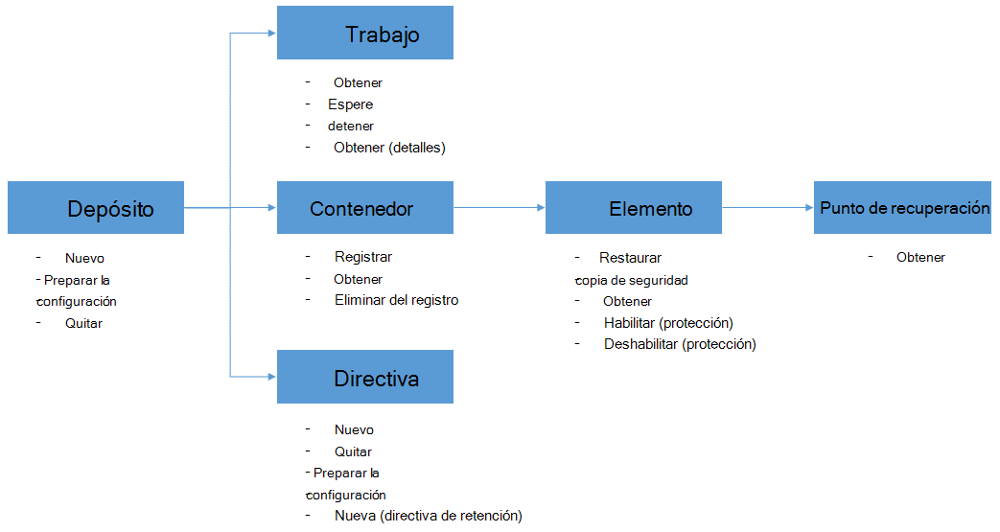

<properties
    pageTitle="Implementar y administrar la copia de seguridad para máquinas virtuales de Azure con PowerShell | Microsoft Azure"
    description="Aprenda a implementar y administrar la copia de seguridad de Azure con PowerShell"
    services="backup"
    documentationCenter=""
    authors="markgalioto"
    manager="cfreeman"
    editor=""/>

<tags
    ms.service="backup"
    ms.workload="storage-backup-recovery"
    ms.tgt_pltfrm="na"
    ms.devlang="na"
    ms.topic="article"
    ms.date="08/08/2016"
    ms.author="markgal;trinadhk;jimpark" />


# <a name="deploy-and-manage-backup-for-azure-vms-using-powershell"></a>Implementar y administrar la copia de seguridad para máquinas virtuales de Azure con PowerShell

> [AZURE.SELECTOR]
- [Administrador de recursos](backup-azure-vms-automation.md)
- [Clásico](backup-azure-vms-classic-automation.md)

En este artículo se muestra cómo usar PowerShell Azure para copia de seguridad y restauración de VM de Azure. Azure tiene dos diferentes modelos de implementación para crear y trabajar con recursos: el Administrador de recursos y clásica. En este artículo trata sobre utiliza el modelo de implementación estándar. Microsoft recomienda que más nuevas implementaciones de usar el modelo de administrador de recursos.

## <a name="concepts"></a>Conceptos


En este artículo se proporciona información específica sobre los cmdlets de PowerShell que se usa para realizar copias de seguridad máquinas virtuales de Windows. Para obtener información básica sobre cómo proteger máquinas virtuales de Azure, vea [Planear la infraestructura de copia de seguridad de VM en Azure](backup-azure-vms-introduction.md).

> [AZURE.NOTE] Antes de empezar, lea los [requisitos previos](backup-azure-vms-prepare.md) necesarios para trabajar con copia de seguridad de Azure y las [limitaciones](backup-azure-vms-prepare.md#limitations) de la solución de copia de seguridad de máquina virtual actual.

Para usar PowerShell eficaz, dedique un momento a comprender la jerarquía de objetos y de dónde comenzar.



Los dos flujos más importantes son al habilitar la protección de una máquina virtual y restaurar los datos desde un punto de recuperación. El enfoque de este artículo es para ayudarle a expertos en trabajar con los cmdlets de PowerShell para habilitar estos dos escenarios.


## <a name="setup-and-registration"></a>Configuración y registro
Para empezar:

1. [Descargar la última PowerShell](https://github.com/Azure/azure-powershell/releases) (es la versión mínima requerida: 1.0.0)

2. Buscar los cmdlets de PowerShell de copia de seguridad de Azure disponibles escribiendo el siguiente comando:

```
PS C:\> Get-Command *azurermbackup*

CommandType     Name                                               Version    Source
-----------     ----                                               -------    ------
Cmdlet          Backup-AzureRmBackupItem                           1.0.1      AzureRM.Backup
Cmdlet          Disable-AzureRmBackupProtection                    1.0.1      AzureRM.Backup
Cmdlet          Enable-AzureRmBackupContainerReregistration        1.0.1      AzureRM.Backup
Cmdlet          Enable-AzureRmBackupProtection                     1.0.1      AzureRM.Backup
Cmdlet          Get-AzureRmBackupContainer                         1.0.1      AzureRM.Backup
Cmdlet          Get-AzureRmBackupItem                              1.0.1      AzureRM.Backup
Cmdlet          Get-AzureRmBackupJob                               1.0.1      AzureRM.Backup
Cmdlet          Get-AzureRmBackupJobDetails                        1.0.1      AzureRM.Backup
Cmdlet          Get-AzureRmBackupProtectionPolicy                  1.0.1      AzureRM.Backup
Cmdlet          Get-AzureRmBackupRecoveryPoint                     1.0.1      AzureRM.Backup
Cmdlet          Get-AzureRmBackupVault                             1.0.1      AzureRM.Backup
Cmdlet          Get-AzureRmBackupVaultCredentials                  1.0.1      AzureRM.Backup
Cmdlet          New-AzureRmBackupProtectionPolicy                  1.0.1      AzureRM.Backup
Cmdlet          New-AzureRmBackupRetentionPolicyObject             1.0.1      AzureRM.Backup
Cmdlet          New-AzureRmBackupVault                             1.0.1      AzureRM.Backup
Cmdlet          Register-AzureRmBackupContainer                    1.0.1      AzureRM.Backup
Cmdlet          Remove-AzureRmBackupProtectionPolicy               1.0.1      AzureRM.Backup
Cmdlet          Remove-AzureRmBackupVault                          1.0.1      AzureRM.Backup
Cmdlet          Restore-AzureRmBackupItem                          1.0.1      AzureRM.Backup
Cmdlet          Set-AzureRmBackupProtectionPolicy                  1.0.1      AzureRM.Backup
Cmdlet          Set-AzureRmBackupVault                             1.0.1      AzureRM.Backup
Cmdlet          Stop-AzureRmBackupJob                              1.0.1      AzureRM.Backup
Cmdlet          Unregister-AzureRmBackupContainer                  1.0.1      AzureRM.Backup
Cmdlet          Wait-AzureRmBackupJob                              1.0.1      AzureRM.Backup
```

Las siguientes tareas de configuración y el registro se pueden automatizar con PowerShell:

- Crear un depósito de copia de seguridad
- Registrar las máquinas virtuales con el servicio de copia de seguridad de Azure

### <a name="create-a-backup-vault"></a>Crear un depósito de copia de seguridad

> [AZURE.WARNING] Los clientes con copia de seguridad de Azure por primera vez, debe registrar el proveedor de copia de seguridad de Azure para usarlo con su suscripción. Para ello, ejecute el siguiente comando: registrar AzureRmResourceProvider - ProviderNamespace "Microsoft.Backup"

Puede crear un nuevo depósito de copia de seguridad mediante el cmdlet **AzureRmBackupVault de nuevo** . La copia de seguridad depósito es un recurso ARM, por lo que es necesario colocar dentro de un grupo de recursos. En una consola elevada de Azure PowerShell, ejecute los comandos siguientes:

```
PS C:\> New-AzureRmResourceGroup –Name “test-rg” –Location “West US”
PS C:\> $backupvault = New-AzureRmBackupVault –ResourceGroupName “test-rg” –Name “test-vault” –Region “West US” –Storage GeoRedundant
```

Puede obtener una lista de todos los depósitos de copia de seguridad en una determinada suscripción mediante el cmdlet **Get-AzureRmBackupVault** .

> [AZURE.NOTE] Es conveniente almacenar el objeto de la cámara de copia de seguridad en una variable. El objeto de depósito es necesaria como entrada para muchas cmdlets de copia de seguridad de Azure.


### <a name="registering-the-vms"></a>Registrar las máquinas virtuales
El primer paso para configurar la copia de seguridad con copia de seguridad de Azure es registrar su equipo o máquina virtual con una copia de seguridad de Azure depósito. El cmdlet **Registrar AzureRmBackupContainer** toma la información de entrada de una máquina virtual de Azure IaaS y registra con el depósito especificado. La operación de registrar asocia el depósito de copia de seguridad en la máquina virtual de Azure y realiza el seguimiento de la máquina virtual a través de la copia de seguridad del ciclo de vida.

Registro de la máquina virtual con el servicio de copia de seguridad de Azure, crea un objeto contenedor de nivel superior. Normalmente, un contenedor contiene varios elementos que pueden hacer una copia, pero en el caso de máquinas virtuales será solo un elemento de una copia de seguridad para el contenedor.

```
PS C:\> $registerjob = Register-AzureRmBackupContainer -Vault $backupvault -Name "testvm" -ServiceName "testvm"
```

## <a name="backup-azure-vms"></a>Copia de seguridad máquinas virtuales de Azure

### <a name="create-a-protection-policy"></a>Crear una directiva de protección
No es obligatorio para crear una nueva directiva de protección para iniciar una copia de seguridad de sus máquinas virtuales. La cámara se suministra con una 'directiva predeterminada' que puede utilizar para activar la protección y luego editarse posteriormente los detalles de la derecha. Puede obtener una lista de las directivas disponibles en la caja fuerte mediante el cmdlet **Get-AzureRmBackupProtectionPolicy** :

```
PS C:\> Get-AzureRmBackupProtectionPolicy -Vault $backupvault

Name                      Type               ScheduleType       BackupTime
----                      ----               ------------       ----------
DefaultPolicy             AzureVM            Daily              26-Aug-15 12:30:00 AM
```

> [AZURE.NOTE] La zona horaria del campo BackupTime en PowerShell es UTC. Sin embargo, cuando el tiempo de copia de seguridad se muestra en el portal de Azure, la zona horaria se alinea a su sistema local junto con el desplazamiento de UTC.

Una directiva de copia de seguridad está asociada con al menos una directiva de retención. La directiva de retención define el tiempo que se mantiene un punto de recuperación con copias de seguridad de Azure. El cmdlet **New-AzureRmBackupRetentionPolicy** crea objetos de PowerShell que contiene la información de la directiva de retención. Estos objetos de directiva de retención se usan como entrada al cmdlet *New-AzureRmBackupProtectionPolicy* o directamente con el cmdlet *Enable-AzureRmBackupProtection* .

Una directiva de copia de seguridad define cuándo y con qué frecuencia se realiza la copia de seguridad de un elemento. El cmdlet **New-AzureRmBackupProtectionPolicy** crea un objeto de PowerShell que contiene la información de directiva de copia de seguridad. La directiva de copia de seguridad se utiliza como entrada al cmdlet *Enable-AzureRmBackupProtection* .

```
PS C:\> $Daily = New-AzureRmBackupRetentionPolicyObject -DailyRetention -Retention 30
PS C:\> $newpolicy = New-AzureRmBackupProtectionPolicy -Name DailyBackup01 -Type AzureVM -Daily -BackupTime ([datetime]"3:30 PM") -RetentionPolicy $Daily -Vault $backupvault

Name                      Type               ScheduleType       BackupTime
----                      ----               ------------       ----------
DailyBackup01             AzureVM            Daily              01-Sep-15 3:30:00 PM
```

### <a name="enable-protection"></a>Habilitar protección
Habilitar protección implica dos objetos - el elemento y la directiva y deben pertenecer al mismo depósito. Una vez asociada con el elemento de la directiva, el flujo de trabajo de copia de seguridad se producirán a la programación definida.

```
PS C:\> Get-AzureRmBackupContainer -Type AzureVM -Status Registered -Vault $backupvault | Get-AzureRmBackupItem | Enable-AzureRmBackupProtection -Policy $newpolicy
```

### <a name="initial-backup"></a>Copia de seguridad inicial
La programación de copia de seguridad se ocupará de realizar la copia inicial completa del elemento y la copia incremental para las copias de seguridad posteriores. Sin embargo, si desea forzar la copia de seguridad inicial que suceda en un momento determinado o incluso inmediatamente usar el cmdlet **AzureRmBackupItem de copia de seguridad** :

```
PS C:\> $container = Get-AzureRmBackupContainer -Vault $backupvault -Type AzureVM -Name "testvm"
PS C:\> $backupjob = Get-AzureRmBackupItem -Container $container | Backup-AzureRmBackupItem
PS C:\> $backupjob

WorkloadName    Operation       Status          StartTime              EndTime
------------    ---------       ------          ---------              -------
testvm          Backup          InProgress      01-Sep-15 12:24:01 PM  01-Jan-01 12:00:00 AM
```

> [AZURE.NOTE] La zona horaria de los campos de hora de inicio y hora de finalización que se muestra en PowerShell es UTC. Sin embargo, cuando se muestra la información similar en el portal de Azure, la zona horaria se alinea con el reloj del sistema local.

### <a name="monitoring-a-backup-job"></a>Supervisar un trabajo de copia de seguridad
La mayoría de operaciones de ejecución larga en copia de seguridad de Azure se reproduzcan como una tarea. Esto facilita realizar un seguimiento del progreso sin tener que mantener el portal de Azure abierto en todo momento.

Para obtener el último estado de un trabajo en curso, use el cmdlet **Get-AzureRmBackupJob** .

```
PS C:\> $joblist = Get-AzureRmBackupJob -Vault $backupvault -Status InProgress
PS C:\> $joblist[0]

WorkloadName    Operation       Status          StartTime              EndTime
------------    ---------       ------          ---------              -------
testvm          Backup          InProgress      01-Sep-15 12:24:01 PM  01-Jan-01 12:00:00 AM
```

En lugar de sondear estas tareas para su finalización, que es el código innecesario, adicional, es más fácil usar el cmdlet **AzureRmBackupJob espera** . Cuando se usa en una secuencia de comandos, el cmdlet detendrá la ejecución hasta que finalice el trabajo o se alcance el valor de tiempo de espera especificado.

```
PS C:\> Wait-AzureRmBackupJob -Job $joblist[0] -Timeout 43200
```


## <a name="restore-an-azure-vm"></a>Restaurar una máquina virtual de Azure

Para restaurar los datos de copia de seguridad, debe identificar el elemento de la copia de seguridad y el punto de recuperación que contiene los datos en un momento. Esta información se proporciona al cmdlet restaurar AzureRmBackupItem para iniciar una restauración de datos de la cámara a la cuenta del cliente.

### <a name="select-the-vm"></a>Seleccione la máquina virtual

Para obtener el objeto de PowerShell que identifica el producto de copia de seguridad adecuada, debe empezar desde el contenedor de la cámara y a continuación, vaya avanzando por la jerarquía de objetos. Para seleccionar el contenedor que representa la máquina virtual, use el cmdlet **Get-AzureRmBackupContainer** y de canalización al cmdlet **Get-AzureRmBackupItem** .

```
PS C:\> $backupitem = Get-AzureRmBackupContainer -Vault $backupvault -Type AzureVM -name "testvm" | Get-AzureRmBackupItem
```

### <a name="choose-a-recovery-point"></a>Elija un punto de recuperación

Ahora puede mostrar todos los puntos de recuperación para el elemento de copia de seguridad con el cmdlet **Get-AzureRmBackupRecoveryPoint** y elija el punto de recuperación para restaurar. Normalmente los usuarios elegir el punto de *AppConsistent* más reciente en la lista.

```
PS C:\> $rp =  Get-AzureRmBackupRecoveryPoint -Item $backupitem
PS C:\> $rp

RecoveryPointId    RecoveryPointType  RecoveryPointTime      ContainerName
---------------    -----------------  -----------------      -------------
15273496567119     AppConsistent      01-Sep-15 12:27:38 PM  iaasvmcontainer;testvm;testv...
```

La variable ```$rp``` es una matriz de puntos de recuperación para la copia de seguridad seleccionado elemento, ordenadas en orden inverso de tiempo: es el punto de recuperación más reciente en el índice 0. Use la indización de matriz de PowerShell estándar para elegir el punto de recuperación. Por ejemplo: ```$rp[0]``` seleccionará el punto de recuperación más reciente.

### <a name="restoring-disks"></a>Restaurar discos

Existe una diferencia clave entre las operaciones de restauración terminado a través del portal de Azure y Azure PowerShell. Con PowerShell, la operación de restauración se detiene en restaurar los discos y la información de configuración desde el punto de recuperación. No se crea una máquina virtual.

> [AZURE.WARNING] La AzureRmBackupItem restaurar no crea una máquina virtual. Sólo se restaura los discos a la cuenta de almacenamiento especificado. No es el mismo comportamiento que experimenta en el portal de Azure.

```
PS C:\> $restorejob = Restore-AzureRmBackupItem -StorageAccountName "DestAccount" -RecoveryPoint $rp[0]
PS C:\> $restorejob

WorkloadName    Operation       Status          StartTime              EndTime
------------    ---------       ------          ---------              -------
testvm          Restore         InProgress      01-Sep-15 1:14:01 PM   01-Jan-01 12:00:00 AM
```

Puede obtener los detalles de la operación de restauración mediante el cmdlet **Get-AzureRmBackupJobDetails** una vez que haya finalizado el trabajo de restauración. La propiedad *ErrorDetails* tendrá la información necesaria para volver a crear la máquina virtual.

```
PS C:\> $restorejob = Get-AzureRmBackupJob -Job $restorejob
PS C:\> $details = Get-AzureRmBackupJobDetails -Job $restorejob
```

### <a name="build-the-vm"></a>Crear la máquina virtual

Creación de la máquina virtual fuera de los discos restaurados puede hacerse mediante los cmdlets de PowerShell de administración del servicio de Azure anteriores, las nuevas plantillas de administrador de recursos de Azure, incluso con el portal de Azure. En un ejemplo rápido, mostraremos cómo acceder a ellos mediante los cmdlets de administración de servicios de Azure.

```
 $properties  = $details.Properties

 $storageAccountName = $properties["Target Storage Account Name"]
 $containerName = $properties["Config Blob Container Name"]
 $blobName = $properties["Config Blob Name"]

 $keys = Get-AzureStorageKey -StorageAccountName $storageAccountName
 $storageAccountKey = $keys.Primary
 $storageContext = New-AzureStorageContext -StorageAccountName $storageAccountName -StorageAccountKey $storageAccountKey


 $destination_path = "C:\Users\admin\Desktop\vmconfig.xml"
 Get-AzureStorageBlobContent -Container $containerName -Blob $blobName -Destination $destination_path -Context $storageContext


$obj = [xml](((Get-Content -Path $destination_path -Encoding UniCode)).TrimEnd([char]0x00))
 $pvr = $obj.PersistentVMRole
 $os = $pvr.OSVirtualHardDisk
 $dds = $pvr.DataVirtualHardDisks
 $osDisk = Add-AzureDisk -MediaLocation $os.MediaLink -OS $os.OS -DiskName "panbhaosdisk"
 $vm = New-AzureVMConfig -Name $pvr.RoleName -InstanceSize $pvr.RoleSize -DiskName $osDisk.DiskName

 if (!($dds -eq $null))
 {
     foreach($d in $dds.DataVirtualHardDisk)
     {
         $lun = 0
         if(!($d.Lun -eq $null))
         {
             $lun = $d.Lun
         }
         $name = "panbhadataDisk" + $lun
     Add-AzureDisk -DiskName $name -MediaLocation $d.MediaLink
     $vm | Add-AzureDataDisk -Import -DiskName $name -LUN $lun
    }
}

New-AzureVM -ServiceName "panbhasample" -Location "SouthEast Asia" -VM $vm
```

Para obtener más información sobre cómo crear una máquina virtual desde los discos restaurados, lea acerca de los cmdlets siguientes:

- [AzureDisk agregar](https://msdn.microsoft.com/library/azure/dn495252.aspx)
- [Nueva AzureVMConfig](https://msdn.microsoft.com/library/azure/dn495159.aspx)
- [Nueva AzureVM](https://msdn.microsoft.com/library/azure/dn495254.aspx)

## <a name="code-samples"></a>Ejemplos de código

### <a name="1-get-the-completion-status-of-job-sub-tasks"></a>1. obtener el estado de finalización de las subtareas de trabajo

Para realizar un seguimiento del estado de finalización de las subtareas individuales, puede usar el cmdlet **Get-AzureRmBackupJobDetails** :

```
PS C:\> $details = Get-AzureRmBackupJobDetails -JobId $backupjob.InstanceId -Vault $backupvault
PS C:\> $details.SubTasks

Name                                                        Status
----                                                        ------
Take Snapshot                                               Completed
Transfer data to Backup vault                               InProgress
```

### <a name="2-create-a-dailyweekly-report-of-backup-jobs"></a>2. crear un informe de diariamente, semanalmente de trabajos de copia de seguridad

Normalmente, los administradores desean saber lo que ha encontrado trabajos de copia de seguridad en las últimas 24 horas, el estado de los trabajos de copia de seguridad. Además, la cantidad de datos que se transfieren ofrece una manera de estimar su uso mensual de datos a los administradores. La siguiente secuencia de comandos extrae los datos sin formato del servicio de copia de seguridad de Azure y muestra la información en la consola de PowerShell.

```
param(  [Parameter(Mandatory=$True,Position=1)]
        [string]$backupvaultname,

        [Parameter(Mandatory=$False,Position=2)]
        [int]$numberofdays = 7)


#Initialize variables
$DAILYBACKUPSTATS = @()
$backupvault = Get-AzureRmBackupVault -Name $backupvaultname
$enddate = ([datetime]::Today).AddDays(1)
$startdate = ([datetime]::Today)

for( $i = 1; $i -le $numberofdays; $i++ )
{
    # We query one day at a time because pulling 7 days of data might be too much
    $dailyjoblist = Get-AzureRmBackupJob -Vault $backupvault -From $startdate -To $enddate -Type AzureVM -Operation Backup
    Write-Progress -Activity "Getting job information for the last $numberofdays days" -Status "Day -$i" -PercentComplete ([int]([decimal]$i*100/$numberofdays))

    foreach( $job in $dailyjoblist )
    {
        #Extract the information for the reports
        $newstatsobj = New-Object System.Object
        $newstatsobj | Add-Member -Type NoteProperty -Name Date -Value $startdate
        $newstatsobj | Add-Member -Type NoteProperty -Name VMName -Value $job.WorkloadName
        $newstatsobj | Add-Member -Type NoteProperty -Name Duration -Value $job.Duration
        $newstatsobj | Add-Member -Type NoteProperty -Name Status -Value $job.Status

        $details = Get-AzureRmBackupJobDetails -Job $job
        $newstatsobj | Add-Member -Type NoteProperty -Name BackupSize -Value $details.Properties["Backup Size"]
        $DAILYBACKUPSTATS += $newstatsobj
    }

    $enddate = $enddate.AddDays(-1)
    $startdate = $startdate.AddDays(-1)
}

$DAILYBACKUPSTATS | Out-GridView
```

Si desea agregar gráficos a este informe de salida, aprenda de la entrada de blog de TechNet [creación de gráficos con PowerShell](http://blogs.technet.com/b/richard_macdonald/archive/2009/04/28/3231887.aspx)

## <a name="next-steps"></a>Pasos siguientes

Si prefiere usar PowerShell para comunicarse con los recursos de Azure, consulte el artículo de PowerShell para la protección de Windows Server, [implementar y administrar copia de seguridad de Windows Server](./backup-client-automation-classic.md). También es un artículo de PowerShell para administrar copias de seguridad DPM, [implementar y administrar copias de seguridad de DPM](./backup-dpm-automation-classic.md). Estos dos artículos tienen una versión de implementaciones del Administrador de recursos, así como implementaciones clásico.
