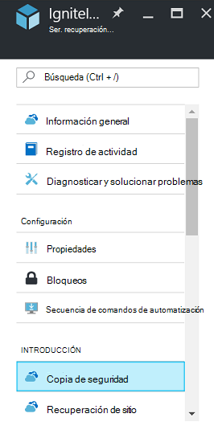
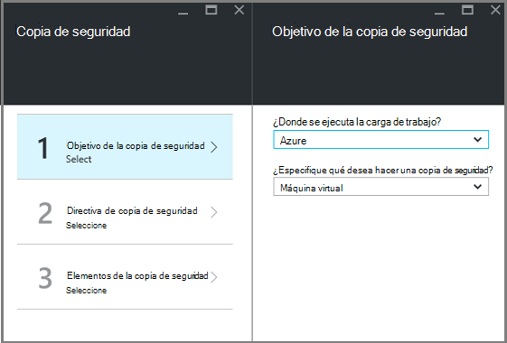
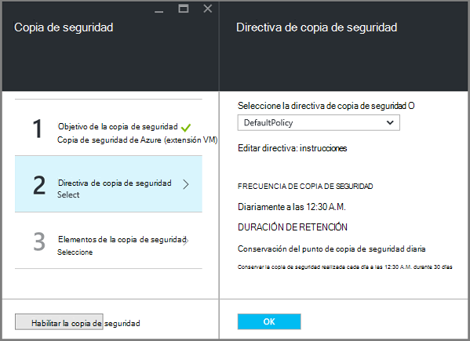
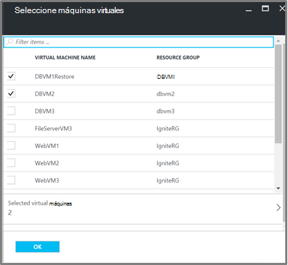
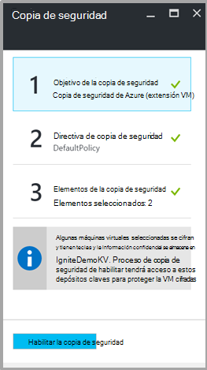

<properties
   pageTitle="Copia de seguridad y restauración cifran máquinas virtuales con copia de seguridad de Azure"
   description="En este artículo trata sobre la copia de seguridad y restauración experiencia para máquinas virtuales cifrada con cifrado de disco de Azure."
   services="backup"
   documentationCenter=""
   authors="JPallavi"
   manager="vijayts"
   editor=""/>
<tags
   ms.service="backup"
   ms.devlang="na"
   ms.topic="article"
   ms.tgt_pltfrm="na"
   ms.workload="storage-backup-recovery"
   ms.date="10/25/2016"
   ms.author="markgal; jimpark; trinadhk"/>

# Copia de seguridad y restauración cifran máquinas virtuales con copia de seguridad de Azure

En este artículo se habla pasos para hacer copia de seguridad y restauración de máquinas virtuales con copia de seguridad de Azure. También se proporciona información detallada sobre escenarios compatibles, requisitos previos y pasos para solucionar problemas en caso de error.

## Escenarios compatibles

> [AZURE.NOTE]
1.  Copia de seguridad y restauración de máquinas virtuales cifradas solo se puede máquinas virtuales de implementa el Administrador de recursos. No se admite para máquinas virtuales de clásico.  
2.  Es compatible únicamente para máquinas virtuales cifrados con la clave de cifrado BitLocker y clave de cifrado. No se admite para máquinas virtuales cifrados con la clave de cifrado BitLocker solo.  

## Requisitos previos

1.  Máquina virtual ha sido cifrada con [Cifrado de disco de Azure](../security/azure-security-disk-encryption.md). Se debe cifrar con la clave de cifrado BitLocker y clave de cifrado.
2.  Depósito de servicios de recuperación se ha creado y replicación de almacenamiento conjunto mediante pasos mencionados en el artículo [Preparar el entorno para la copia de seguridad](backup-azure-arm-vms-prepare.md).

## Copia de seguridad cifra VM
Use los siguientes pasos para establecer el objetivo de la copia de seguridad, definir la directiva, configurar elementos y copia de seguridad de desencadenador.

### Configurar copia de seguridad

1. Si ya tiene abierto un depósito de servicios de recuperación, vaya al paso siguiente. Si no tiene un servicio de recuperación depósito abierta, pero se encuentran en el portal de Azure, en el menú de concentrador, haga clic en **Examinar**.

  - En la lista de recursos, escriba **Servicios de recuperación**.
  - Cuando comience a escribir, los filtros de la lista en función de la entrada. Cuando vea **depósitos de servicios de recuperación**, haga clic en él.
  
        

    Aparece la lista de servicios de recuperación depósitos. En la lista de servicios de recuperación depósitos, seleccione un depósito.

    Se abre el panel de depósito seleccionado.

2. En la lista de elementos que aparece debajo de la cámara, haga clic en **copia de seguridad** para abrir el módulo de copia de seguridad.

       
    
3. En el módulo de copia de seguridad, haga clic en el **objetivo de copia de seguridad** para abrir el módulo de objetivo de copia de seguridad.

       
    
4.   En el módulo de objetivo de la copia de seguridad, establezca **donde se ejecuta la carga de trabajo** en Azure y **Especifique qué desea hacer una copia de seguridad** a máquina Virtual, a continuación, haga clic en **Aceptar**.

    El módulo de objetivo de copia de seguridad se cierra y se abre el módulo de directivas de copia de seguridad.

       

5. En el módulo de directivas de copia de seguridad, seleccione la directiva de copia de seguridad que desea aplicar a la cámara y haga clic en **Aceptar**.

       

    Los detalles de la directiva predeterminada se muestran en los detalles. Si desea crear una directiva, seleccione **Crear nuevo** en el menú desplegable. Una vez que haga clic en **Aceptar**, la directiva de copia de seguridad está asociada con la cámara.

    A continuación, seleccione las máquinas virtuales para asociarla con la cámara.
    
6. Elija el cifrado máquinas virtuales de Windows para asociar con la directiva especificada y haga clic en **Aceptar**.

      
   
7. Esta página muestra un mensaje sobre depósito clave asociado a las VM cifradas seleccionadas. Servicio de copia de seguridad requiere acceso de solo lectura a las claves y la información confidencial en depósito de clave. Usa estos permisos a una clave de copia de seguridad y secreto, junto con las VM asociadas. 

      

      Ahora que ha definido toda la configuración de la cámara, en el módulo de copia de seguridad, haga clic en habilitar la copia de seguridad en la parte inferior de la página. Habilitar copia de seguridad implementa la directiva a la cámara y las máquinas virtuales.

8. La siguiente fase de preparación está configurado para instalar al agente de VM o asegurarse de que el agente de VM está instalado. Para hacer lo mismo, realice los pasos mencionados en el artículo [Preparar el entorno para la copia de seguridad](backup-azure-arm-vms-prepare.md). 

### Trabajo de copia de seguridad de activación
Siga los pasos mencionados en el artículo de la [Copia de seguridad de máquinas virtuales de Azure en depósito de servicios de recuperación](backup-azure-arm-vms.md) para el trabajo de copia de seguridad de desencadenador.

## Restaurar cifrado VM
Restaure la experiencia para equipos virtuales cifrados y no cifrado es el mismo. Siga los pasos mencionados en [restaurar máquinas virtuales de Azure portal](backup-azure-arm-restore-vms.md) para restaurar la máquina virtual de cifrado. En caso de que necesite restaurar claves y la información confidencial, debe asegurarse de que exista dicho depósito clave restaurarlas.

## Solución de errores

| Operación | Detalles del error | Resolución |
| -------- | -------- | -------|
| Copia de seguridad | Error de validación como máquina virtual está cifrada con BEK únicamente. Pueden habilitar las copias de seguridad sólo para máquinas virtuales cifrados con BEK y KEK. | Máquina virtual se debe cifrar con BEK y KEK. Después de eso, debe habilitarse la copia de seguridad. |
| Restaurar | No puede restaurar este VM cifrada ya depósito clave asociada a este VM no existe. | Crear clave depósito con la [Introducción a Azure clave depósito](../key-vault/key-vault-get-started.md). Consulte el artículo [Restaurar clave depósito clave y secreto mediante copia de seguridad de Azure](backup-azure-restore-key-secret.md) restaurar clave y secreto si no están presentes. |
| Restaurar | No puede restaurar este VM cifrada ya clave y secreto asociada a este VM no existe. | Consulte el artículo [Restaurar clave depósito clave y secreto mediante copia de seguridad de Azure](backup-azure-restore-key-secret.md) restaurar clave y secreto si no están presentes. |
