<properties
    pageTitle="Introducción: Proteger máquinas virtuales de Azure con un depósito de copia de seguridad | Microsoft Azure"
    description="Proteger máquinas virtuales de Azure con depósito de copia de seguridad. Tutorial explica depósito de creación, registrar máquinas virtuales, crear directivas y proteger máquinas virtuales en Azure."
    services="backup"
    documentationCenter=""
    authors="markgalioto"
    manager="cfreeman"
    editor=""/>

<tags
    ms.service="backup"
    ms.workload="storage-backup-recovery"
    ms.tgt_pltfrm="na"
    ms.devlang="na"
    ms.topic="hero-article"
    ms.date="09/15/2016"
    ms.author="markgal; jimpark"/>

# Buscar primero: copia de seguridad máquinas virtuales de Windows Azure

> [AZURE.SELECTOR]
- [Proteger máquinas virtuales con un depósito de servicios de recuperación](backup-azure-vms-first-look-arm.md)
- [Proteger máquinas virtuales de Azure con un depósito de copia de seguridad](backup-azure-vms-first-look.md)

Este tutorial le guiará en los pasos para crear copias de una máquina virtual Azure (VM) a un depósito de copia de seguridad en Azure. En este artículo se describe el modelo clásico o el modelo de implementación de administrador de servicios, de una copia de seguridad de máquinas virtuales. Si está interesado en copia de seguridad de una máquina virtual a un depósito de servicios de recuperación que pertenece a un grupo de recursos, vea [busque primero: proteger máquinas virtuales con un depósito de servicios de recuperación](backup-azure-vms-first-look-arm.md). Para finalizar este tutorial correctamente, deben existir estos requisitos previos:

- Ha creado una máquina virtual en su suscripción de Azure.
- La máquina virtual tiene conectividad con Azure direcciones IP públicas. Para obtener más información, vea [la conectividad de red](./backup-azure-vms-prepare.md#network-connectivity).

Para la copia de seguridad una máquina virtual, hay cinco pasos principales:  

 crear un depósito de copia de seguridad o identificar un depósito de copia de seguridad existente.  
 usar el portal de Azure clásico para detectar y registrar los equipos virtuales.  
 instalar el agente de máquina virtual.  
 crear la directiva de protección de los equipos virtuales.  
 ejecutar la copia de seguridad.

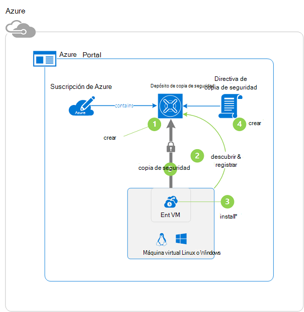

>[AZURE.NOTE] Azure tiene dos modelos de implementación para crear y trabajar con recursos: [Administrador de recursos y clásica](../resource-manager-deployment-model.md). Este tutorial es para su uso con las máquinas virtuales que se pueden crear en el portal de Azure clásico. El servicio de copia de seguridad de Azure admite máquinas virtuales basadas en el Administrador de recursos. Para obtener más información sobre copias de máquinas virtuales a un depósito de servicios de recuperación, consulte [First Look: proteger máquinas virtuales con un depósito de servicios de recuperación](backup-azure-vms-first-look-arm.md).

## Paso 1: crear un depósito de copia de seguridad de una máquina virtual

Un depósito de copia de seguridad es una entidad que almacena todas las copias de seguridad y los puntos de recuperación que se han creado a lo largo del tiempo. La copia de seguridad depósito también contiene las directivas de copia de seguridad que se aplican a los equipos virtuales copia de seguridad.

1. Inicie sesión en el [portal de Azure clásico](http://manage.windowsazure.com/).

2. En la esquina inferior izquierda del portal de Azure, haga clic en **nuevo**

    

3. En el asistente crear rápido, haga clic en **Servicios de datos** > **Servicios de recuperación** > **Copia de seguridad de cámara** > **Crear rápido**.

    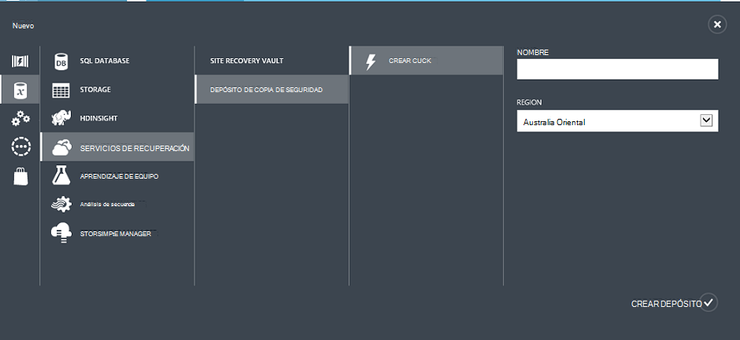

    El asistente le pide el **nombre** y la **región**. Si administra más de una suscripción, aparece un cuadro de diálogo para elegir la suscripción.

4. En **nombre**, escriba un nombre descriptivo para identificar la cámara. El nombre debe ser único para la suscripción de Azure.

5. En la **región**, seleccione la región geográfica de la cámara. La cámara **debe** estar en la misma región como las máquinas virtuales protege.

    Si no conoce la región donde se encuentra su máquina virtual, cerrar a este asistente y haga clic en **máquinas virtuales de Windows** en la lista de servicios de Azure. La columna ubicación proporciona el nombre de la región. Si tiene máquinas virtuales de Windows en varias regiones, cree un depósito de copia de seguridad en cada región.

6. Si no hay ningún cuadro de diálogo de **suscripción** en el asistente, vaya al paso siguiente. Si trabaja con varias suscripciones, seleccione una suscripción a asociar con el nuevo depósito de copia de seguridad.

    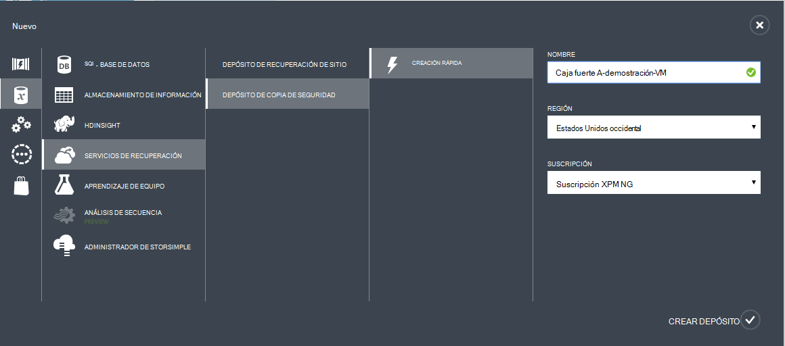

7. Haga clic en **Crear depósito**. Puede pasar un tiempo para la copia de seguridad depósito que debe crearse. Supervisar las notificaciones de estado en la parte inferior del portal.

    

    Un mensaje confirma que la cámara se ha creado correctamente. Se mostrará en la página **Servicios de recuperación** como **activa**.

    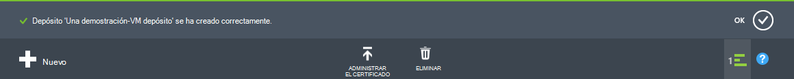

8. En la lista de depósitos en **Servicios de recuperación de** página, seleccione el depósito que creó para iniciar la página de **Inicio rápido** .

    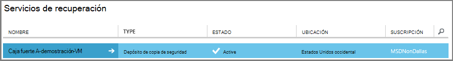

9. En la página de **Inicio rápido** , haga clic en **Configurar** para abrir la opción de replicación de almacenamiento.
    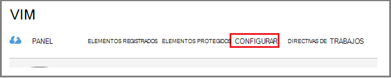

10. En la opción de **replicación de almacenamiento** , elija la opción de replicación de la cámara.

    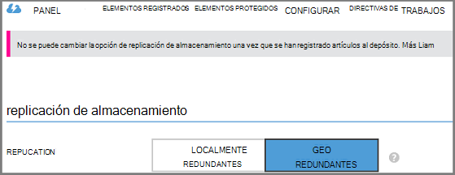

    De forma predeterminada, el depósito tiene almacenamiento geo redundantes. Elija el almacenamiento geo redundantes si se trata de la copia de seguridad principal. Si desea una opción económica que no es bastante como resistente, elija almacenamiento redundante local. Obtenga más información acerca de las opciones de almacenamiento geo redundantes y redundantes localmente en la [Visión general de la replicación de almacenamiento de Azure](../storage/storage-redundancy.md).

Después de elegir la opción de almacenamiento de la cámara, ya está listo para asociar la máquina virtual con la cámara. Para comenzar la asociación, descubrir y registrar los equipos virtuales Azure.

## Paso 2: Descubra y máquinas virtuales de Azure registrar
Antes de registrar la máquina virtual con un depósito, ejecute el proceso de descubrimiento para identificar las nuevas máquinas virtuales. Devuelve una lista de máquinas virtuales en la suscripción, junto con información adicional, como el nombre de servicio de nube y la región.

1. Inicie sesión en el [portal de Azure clásica](http://manage.windowsazure.com/)

2. En el portal de Azure clásico, haga clic en **Servicios de recuperación** para abrir la lista de servicios de recuperación depósitos.
    

3. En la lista de depósitos, seleccione el depósito para realizar copias de seguridad una máquina virtual.

    Cuando se selecciona el depósito, se abre en la página de **Inicio rápido**

4. En el menú de la cámara, haga clic en **Elementos registrados**.

    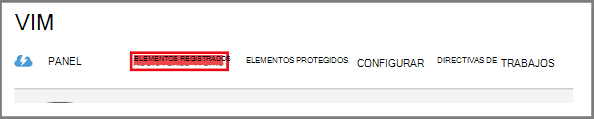

5. En el menú **tipo** , seleccione la **Máquina Virtual de Azure**.

    

6. Haga clic en **detectar** en la parte inferior de la página.
    

    El proceso de detección puede tardar unos minutos mientras las máquinas virtuales se que se hayan publicado. Hay una notificación en la parte inferior de la pantalla que le permite saber que se está ejecutando el proceso.

    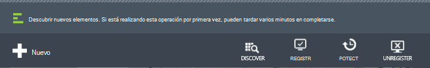

    Complete los cambios de notificación cuando el proceso.

    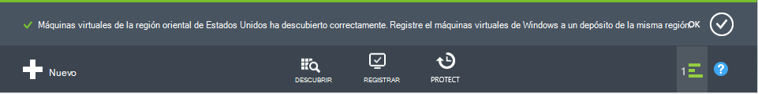

7. Haga clic en **REGISTRARSE** en la parte inferior de la página.
    

8. En el menú contextual de **Registrar elementos** , seleccione las máquinas virtuales que desea registrar.

    >[AZURE.TIP] Puede registrar varias máquinas virtuales a la vez.

    Se crea una tarea para cada máquina virtual que ha seleccionado.

9. En la notificación para ir a la página **tareas** , haga clic en **Vista de trabajo** .

    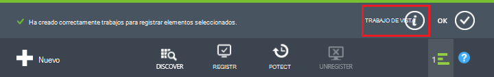

    La máquina virtual también aparece en la lista de elementos registrados, junto con el estado de la operación de registro.

    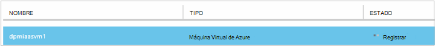

    Cuando se completa la operación, el estado cambia para reflejar el estado de *registrado* .

    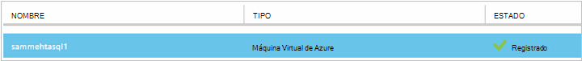

## Paso 3: instalar al agente de máquina virtual en la máquina virtual

El agente de Azure VM debe instalarse en la máquina virtual de Azure para que funcione la extensión de copia de seguridad. Si ha creado la máquina virtual de la Galería de Azure, el agente de VM ya está presente en la máquina virtual. Vaya a [proteger sus máquinas virtuales](backup-azure-vms-first-look.md#step-4-protect-azure-virtual-machines).

Si su máquina virtual migra de un centro de datos local, la máquina virtual probablemente no tiene instalado el agente de máquina virtual. Debe instalar al agente de máquina virtual de la máquina virtual antes de continuar para proteger la máquina virtual. Para conocer los pasos detallados sobre cómo instalar al agente de máquina virtual, consulte la [sección de agente de VM del artículo máquinas virtuales de copia de seguridad](backup-azure-vms-prepare.md#vm-agent).

## Paso 4: crear la directiva de copia de seguridad
Antes de activar el trabajo de copia de seguridad inicial, establezca la programación cuando se toman instantáneas de copia de seguridad. Cuando se toman instantáneas de copia de seguridad y la longitud de tiempo esas instantáneas se conservan, es la directiva de copia de seguridad de la programación. La información de retención se basa en el esquema de rotación de copia de seguridad de-pie-hijo.

1. Desplácese hasta el depósito de copia de seguridad en los **Servicios de recuperación** en el portal de Azure clásica y haga clic en **Elementos registrados**.
2. Seleccione la **Máquina Virtual de Azure** en el menú desplegable.

    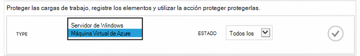

3. Haga clic en **proteger** en la parte inferior de la página.
    

    El **Asistente para proteger elementos** aparece y muestra *solo* máquinas virtuales de Windows que están registrados y no protegida.

    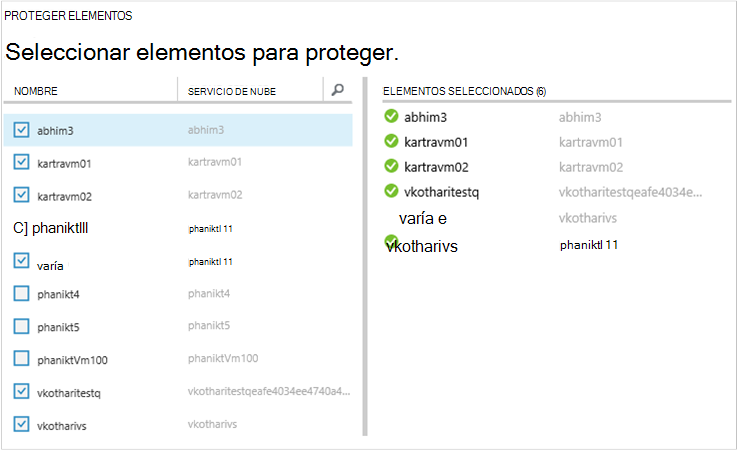

4. Seleccione las máquinas virtuales que desea proteger.

    Si hay dos o más máquinas virtuales con el mismo nombre, utilice el servicio de nube para distinguir entre las máquinas virtuales.

5. En el menú **Configurar protección** seleccione una directiva existente o crear una nueva directiva para proteger los equipos virtuales que ha identificado.

    Nuevos depósitos de copia de seguridad tienen una directiva predeterminada asociada con la cámara. Esta directiva tiene diaria instantánea cada tarde y se conserva la instantánea diaria de 30 días. Cada directiva de copia de seguridad puede tener varias máquinas virtuales de Windows asociada. Sin embargo, la máquina virtual solo puede asociar una directiva a la vez.

    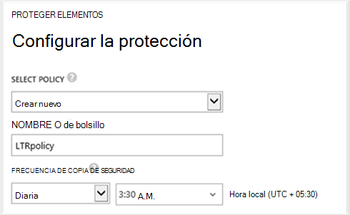

    >[AZURE.NOTE] Una directiva de copia de seguridad incluye una combinación de retención para las copias de seguridad programadas. Si selecciona una directiva de copia de seguridad existente, podrá modificar las opciones de retención en el siguiente paso.

6. En **Intervalo de retención** defina el ámbito diario, semanal, mensual y anual de los puntos de copia de seguridad específicos.

    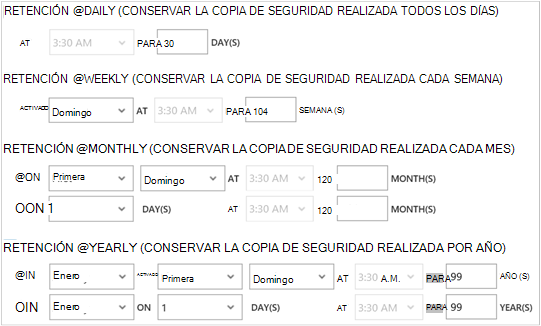

    Directiva de retención especifica la longitud de tiempo para almacenar una copia de seguridad. Puede especificar directivas de retención diferente en función de cuándo se realizó la copia de seguridad.

7. Haga clic en **tareas** para ver la lista de trabajos de **Protección de configurar** .

    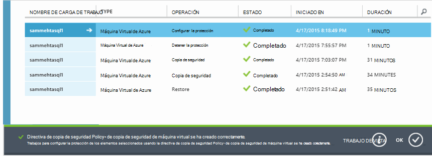

    Ahora que ha establecido la directiva, vaya al paso siguiente y ejecute la copia de seguridad inicial.

## Paso 5: copia de seguridad inicial

Una vez que una máquina virtual se ha protegido con una directiva, puede ver esta relación en la ficha **Elementos protegidos** . Hasta que se produzca la copia de seguridad inicial, se muestra el **Estado de protección** como **protegida - (pendiente de copia de seguridad inicial)**. De forma predeterminada, la primera copia de seguridad programada es la *copia de seguridad inicial*.

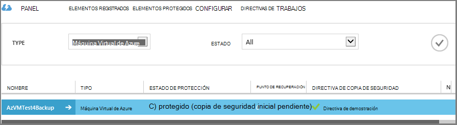

Para iniciar la copia de seguridad inicial ahora:

1. En la página de **Elementos protegidos** , haga clic en **Copia de seguridad ahora** en la parte inferior de la página.
    

    El servicio de copia de seguridad de Azure crea un trabajo de copia de seguridad para la operación de copia de seguridad inicial.

2. Haga clic en la ficha de **tareas** para ver la lista de trabajos.

    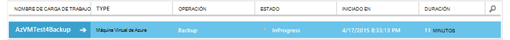

    Cuando finalice la copia de seguridad inicial, el estado de la máquina virtual en la ficha **Elementos protegidos** está *protegida*.

    

    >[AZURE.NOTE] La copia de seguridad de máquinas virtuales es un proceso local. No puede crear una copia de máquinas virtuales de una región un depósito de copia de seguridad en otra región. Por lo tanto, para cada región Azure que tiene máquinas virtuales que necesitan hacer copia de seguridad, debe crearse al menos un depósito de copia de seguridad de esa región.

## Pasos siguientes
Ahora que ha copiado correctamente una máquina virtual, hay varios pasos que podrían ser de interés. El paso más lógico es familiarizarse con la restauración de datos en una máquina virtual. Sin embargo, existen tareas de administración que le ayudará a comprender cómo proteger los datos y reducir los costos.

- [Administrar y supervisar los equipos virtuales](backup-azure-manage-vms.md)
- [Restaurar máquinas virtuales de Windows](backup-azure-restore-vms.md)
- [Guía de solución de problemas](backup-azure-vms-troubleshoot.md)

## ¿Preguntas?
Si tiene preguntas, o si no hay ninguna característica que le gustaría ver incluyen, [envíenos sus comentarios](http://aka.ms/azurebackup_feedback).
