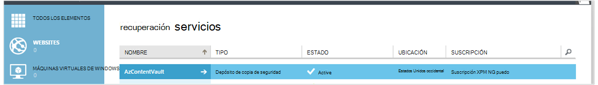

<properties
    pageTitle="Preparar el entorno para realizar copias de seguridad máquinas virtuales de Windows Azure | Microsoft Azure"
    description="Asegúrese de que su entorno está preparado para realizar copias de seguridad máquinas virtuales de Azure"
    services="backup"
    documentationCenter=""
    authors="markgalioto"
    manager="cfreeman"
    editor=""
    keywords="copias de seguridad. una copia de seguridad;"/>

<tags
    ms.service="backup"
    ms.workload="storage-backup-recovery"
    ms.tgt_pltfrm="na"
    ms.devlang="na"
    ms.topic="article"
    ms.date="08/26/2016"
    ms.author="trinadhk; jimpark; markgal;"/>


# <a name="prepare-your-environment-to-back-up-azure-virtual-machines"></a>Preparar el entorno para realizar copias de seguridad máquinas virtuales de Windows Azure

> [AZURE.SELECTOR]
- [Modelo de administrador de recursos](backup-azure-arm-vms-prepare.md)
- [Modelo clásico](backup-azure-vms-prepare.md)

Antes de que puede realizar una copia una máquina virtual (VM) en Azure, hay tres condiciones que deben existir.

- Debe crear un depósito de copia de seguridad o identificar un existente depósito de copia de seguridad *de la misma región como su máquina virtual*.
- Establecer la conectividad de red entre las direcciones de Internet públicas Azure y los extremos de almacenamiento de Azure.
- Instalar al agente de máquina virtual en la máquina virtual.

Si sabe que estas condiciones ya existen en su entorno de continuar para [realizar copias de seguridad de su artículo máquinas virtuales](backup-azure-vms.md). En caso contrario, siga leyendo, este artículo le guiará en los pasos para preparar el entorno para realizar copias de seguridad una máquina virtual de Azure.


## <a name="limitations-when-backing-up-and-restoring-a-vm"></a>Limitaciones al realizar copias de seguridad y restaurar una máquina virtual

>[AZURE.NOTE] Azure tiene dos modelos de implementación para crear y trabajar con recursos: [Administrador de recursos y clásica](../resource-manager-deployment-model.md). La siguiente lista proporciona las limitaciones cuando se implementa en el modelo clásico.

- No se admite la copia de seguridad de máquinas virtuales con más de 16 discos de datos.
- No se admite la copia de seguridad de máquinas virtuales con una dirección IP reservada y ningún extremo definido.
- Datos de copia de seguridad no incluyen unidades de red montada conectadas a máquina virtual. 
- Reemplazar una máquina virtual existente durante la restauración no es compatible. Eliminar la máquina virtual existente y los discos asociados y, a continuación, restaurar los datos de copia de seguridad.
- No se admite la restauración y copia de seguridad entre región.
- Cuando se realiza una copia de seguridad de máquinas virtuales de Windows mediante el servicio de copia de seguridad de Azure es compatible en todas las regiones públicas de Azure (consulte la [lista de comprobación](https://azure.microsoft.com/regions/#services) de regiones compatibles). Si la región que está buscando no es compatible actualmente, no aparecerá en la lista desplegable durante la creación de la cámara.
- Cuando se realiza una copia de seguridad de máquinas virtuales de Windows mediante el servicio de copia de seguridad de Azure es solo admite versiones seleccione sistema operativo:
  - **Linux**: copia de seguridad de Azure es compatible con [una lista de las distribuciones que están apoyo de Azure](../virtual-machines/virtual-machines-linux-endorsed-distros.md) excepto Core OS Linux. Otras distribuciones Traer-su-propietario-Linux también podrían funcionan como el agente VM está disponible en la máquina virtual y la compatibilidad con Python existe.
  - **Windows Server**: no se admiten las versiones anteriores a Windows Server 2008 R2.
- Restaurar un controlador de dominio VM (CC) que forma parte de una configuración de múltiples DC es compatible sólo a través de PowerShell. Obtenga más acerca de cómo [restaurar un controlador de dominio entre varios DC](backup-azure-restore-vms.md#restoring-domain-controller-vms).
- Se admite la restauración de máquinas virtuales que tiene las siguientes configuraciones de red especiales sólo a través de PowerShell. Máquinas virtuales que cree con el flujo de trabajo de restauración en la interfaz de usuario no tendrán estas configuraciones de red cuando se complete la operación de restauración. Para obtener más información, vea [Restaurar máquinas virtuales con las configuraciones de red especiales](backup-azure-restore-vms.md#restoring-vms-with-special-netwrok-configurations).
    - Máquinas virtuales de Windows en configuración del equilibrador de carga (interno y externo)
    - Máquinas virtuales con varias direcciones IP reservadas
    - Máquinas virtuales con varios adaptadores de red

## <a name="create-a-backup-vault-for-a-vm"></a>Crear un depósito de copia de seguridad para una máquina virtual

Un depósito de copia de seguridad es una entidad que almacena todas las copias de seguridad y los puntos de recuperación que se han creado a lo largo del tiempo. La copia de seguridad depósito también contiene las directivas de copia de seguridad que se aplicará a los equipos virtuales copia de seguridad.

Esta imagen muestra las relaciones entre las distintas entidades de copia de seguridad de Azure:     

Para crear un depósito de copia de seguridad:

1. Inicie sesión en el [portal de Azure](http://manage.windowsazure.com/).

2. En el portal de Azure, haga clic en **nuevo** > **Híbrido integración** > **copia de seguridad**. Al hacer clic en **copia de seguridad**, cambiará automáticamente el portal clásica (que se muestra después de la nota).

    

    >[AZURE.NOTE] Si la suscripción se usó por última vez en el portal de clásico, puede abrir la suscripción en el portal de clásico. En este caso, para crear un depósito de copia de seguridad, haga clic en **nuevo** > **Data Services** > **Servicios de recuperación** > **Copia de seguridad de cámara** > **Crear rápido** (consulte la imagen siguiente).

    

3. En **nombre**, escriba un nombre descriptivo para identificar la cámara. El nombre debe ser único para la suscripción de Azure. Escriba un nombre que contenga entre 2 y 50 caracteres. Debe comenzar con una letra y puede contener sólo letras, números y guiones.

4. En la **región**, seleccione la región geográfica de la cámara. La cámara debe estar en la misma región como las máquinas virtuales que desea proteger. Si tiene máquinas virtuales de Windows en varias regiones, debe crear un depósito de copia de seguridad en cada región. No es necesario para especificar las cuentas de almacenamiento para almacenar los datos de copia de seguridad: el depósito de copia de seguridad y el controlador de servicio de copia de seguridad de Azure esto automáticamente.

5. En la **suscripción** , seleccione la suscripción que desea asociar con la cámara de copia de seguridad. Habrá varias opciones solo si su cuenta profesional está asociado con varias suscripciones de Azure.

6. Haga clic en **Crear depósito**. Puede pasar un tiempo para la copia de seguridad depósito que debe crearse. Supervisar las notificaciones de estado en la parte inferior del portal.

    

7. Un mensaje se confirme que la cámara se ha creado correctamente. Se mostrará en la página **Servicios de recuperación** como **activa**. Asegúrese de elegir el derecho de opción de redundancia de almacenamiento apropiado después de la cámara se ha creado. Obtenga más información sobre la [configuración de la opción de redundancia de almacenamiento en depósito de copia de seguridad](backup-configure-vault.md#azure-backup---storage-redundancy-options).

    

8. Haga clic en el almacén de copia de seguridad para ir a la página de **Inicio rápido** , donde se muestran las instrucciones para realizar copias de seguridad máquinas virtuales de Windows Azure.

    


## <a name="network-connectivity"></a>Conectividad de red

Para administrar las instantáneas de máquina virtual, la extensión de copia de seguridad necesita conectividad con las direcciones IP públicas Azure. Sin la conectividad de Internet adecuada HTTP de la máquina virtual solicitudes de tiempo de espera y se produce un error en la operación de copia de seguridad. Si la implementación tiene las restricciones de acceso en su lugar (a través de un grupo de seguridad de la red (GSN), por ejemplo), a continuación, elija una de estas opciones para proporcionar un camino claro para el tráfico de copia de seguridad:

- [Rangos blanca la IP del centro de datos de Azure](http://www.microsoft.com/en-us/download/details.aspx?id=41653) : consulte el artículo para obtener instrucciones sobre cómo a la lista blanca las direcciones IP.
- Implementar un servidor de proxy HTTP para enrutar el tráfico.

Al decidir qué opción utilizar, son las ventajas y desventajas entre capacidad de administración, el control detallado y el costo.

|Opción|Ventajas|Desventajas|
|------|----------|-------------|
|Intervalos de IP Whitelist| No hay costes adicionales.<br><br>Para abrir el acceso de un GSN, use el cmdlet <i>Set-AzureNetworkSecurityRule</i> . | Compleja de administrar como la afectada intervalos IP cambian con el tiempo.<br><br>Proporciona acceso a la totalidad de Azure y no solo almacenamiento.|
|Proxy HTTP| Control detallado de en el servidor proxy de las direcciones URL de almacenamiento permitidos.<br>Un único punto de Internet de acceso a máquinas virtuales.<br>No están sujetos a cambios de direcciones IP de Azure.| Costes adicionales para ejecutar una máquina virtual con el software de proxy.|

### <a name="whitelist-the-azure-datacenter-ip-ranges"></a>Intervalos de IP blanca del centro de datos de Azure

A la lista blanca los intervalos de IP del centro de datos de Azure, por favor, consulte el [sitio Web de Azure](http://www.microsoft.com/en-us/download/details.aspx?id=41653) para obtener más información sobre los intervalos de IP e instrucciones.

### <a name="using-an-http-proxy-for-vm-backups"></a>Usar a un servidor proxy HTTP para las copias de seguridad VM
Cuando copia una máquina virtual, la extensión de copia de seguridad de la máquina virtual envía los comandos de administración de instantánea al almacenamiento de Azure con la API HTTPS. Enrutar el tráfico de copia de seguridad de extensión a través del proxy HTTP, ya que es el único componente configurado para el acceso a Internet.

>[AZURE.NOTE] No hay ninguna recomendación para el software de proxy que se debe usar. Asegúrese de que seleccione a un proxy que sea compatible con los siguientes pasos de configuración.

La imagen de ejemplo siguiente muestra los pasos de configuración de tres necesarios para usar a un servidor proxy HTTP:

- Aplicación VM enruta todo el tráfico HTTP enlazado para Internet pública a través de la máquina virtual de Proxy.
- Proxy VM permite el tráfico entrante de máquinas virtuales en la red virtual.
- El grupo de seguridad de red (GSN) denominada bloqueo sin fondos necesita un seguridad regla permitir Internet el tráfico saliente de máquina virtual de Proxy.


Para usar a un servidor proxy HTTP para comunicar a Internet, siga estos pasos:

#### <a name="step-1-configure-outgoing-network-connections"></a>Paso 1. Configurar conexiones de red salientes
###### <a name="for-windows-machines"></a>Para equipos con Windows
Esto realizará la instalación de configuración del servidor proxy para la cuenta del sistema Local.

1. Descargar [PsExec](https://technet.microsoft.com/sysinternals/bb897553)
2. Ejecutar el comando siguiente desde el símbolo del sistema con privilegios elevados,

     ```
     psexec -i -s "c:\Program Files\Internet Explorer\iexplore.exe"
     ```
     Se abrirá la ventana de internet explorer.
3. Vaya a Herramientas -> Opciones de Internet -> conexiones -> configuración de LAN.
4. Compruebe la configuración de proxy para la cuenta del sistema. Establecer IP de Proxy y puerto.
5. Cierre el Explorador de Internet.

Esto establecerá una configuración de proxy de todo el equipo y se utilizará para el tráfico saliente de HTTP/HTTPS.

Si tiene un servidor proxy de configuración en una cuenta de usuario actual (no una cuenta de sistema Local), utilice la siguiente secuencia de comandos para aplicarlos a SYSTEMACCOUNT:

```
   $obj = Get-ItemProperty -Path Registry::”HKEY_CURRENT_USER\Software\Microsoft\Windows\CurrentVersion\Internet Settings\Connections"
   Set-ItemProperty -Path Registry::”HKEY_USERS\S-1-5-18\Software\Microsoft\Windows\CurrentVersion\Internet Settings\Connections" -Name DefaultConnectionSettings -Value $obj.DefaultConnectionSettings
   Set-ItemProperty -Path Registry::”HKEY_USERS\S-1-5-18\Software\Microsoft\Windows\CurrentVersion\Internet Settings\Connections" -Name SavedLegacySettings -Value $obj.SavedLegacySettings
   $obj = Get-ItemProperty -Path Registry::”HKEY_CURRENT_USER\Software\Microsoft\Windows\CurrentVersion\Internet Settings"
   Set-ItemProperty -Path Registry::”HKEY_USERS\S-1-5-18\Software\Microsoft\Windows\CurrentVersion\Internet Settings" -Name ProxyEnable -Value $obj.ProxyEnable
   Set-ItemProperty -Path Registry::”HKEY_USERS\S-1-5-18\Software\Microsoft\Windows\CurrentVersion\Internet Settings" -Name Proxyserver -Value $obj.Proxyserver
```

>[AZURE.NOTE] Si observa "(407) requiere autenticación de Proxy" en el registro del servidor proxy, compruebe que su authrntication está configurado correctamente.

######<a name="for-linux-machines"></a>Para equipos Linux

Agregue la línea siguiente a la ```/etc/environment``` archivo:

```
http_proxy=http://<proxy IP>:<proxy port>
```

Agregue las siguientes líneas a la ```/etc/waagent.conf``` archivo:

```
HttpProxy.Host=<proxy IP>
HttpProxy.Port=<proxy port>
```

#### <a name="step-2-allow-incoming-connections-on-the-proxy-server"></a>Paso 2. Permitir las conexiones entrantes en el servidor proxy:

1. En el servidor proxy, abra Firewall de Windows. La manera más sencilla de acceso del firewall es buscar Firewall de Windows con seguridad avanzada.

    

2. En el cuadro de diálogo Firewall de Windows, haga clic en **Reglas de entrada** y haga clic en **Nueva regla...**.

    

3. En el **Asistente para reglas de entrada nuevo**, elija la opción **personalizada** para el **Tipo de regla** y haga clic en **siguiente**.

4. En la página para seleccionar el **programa**, elija **Todos los programas** y haga clic en **siguiente**.

5. En la página de **puertos y protocolos** , escriba la información siguiente y haga clic en **siguiente**:

    

    - elegir *tipo de protocolo* *TCP*
    - para el *puerto Local* elija *Puertos específicos*, en el campo siguiente, especifique la ```<Proxy Port>``` que se ha configurado.
    - para el *puerto remoto* , seleccione *Todos los puertos*

    Para el resto del asistente, haga clic en hasta el final y escriba un nombre para esta regla.

#### <a name="step-3-add-an-exception-rule-to-the-nsg"></a>Paso 3. Agregar una regla de excepción a la GSN:

En un símbolo del sistema de PowerShell de Azure, escriba el siguiente comando:

El siguiente comando agrega una excepción a la GSN. Esta excepción permite el tráfico TCP desde cualquier puerto 10.0.0.5 a cualquier dirección de Internet en los puertos 80 (HTTP) o 443 (HTTPS). Si necesita un puerto específico en Internet público, asegúrese de agregar el puerto para la ```-DestinationPortRange``` también.

```
Get-AzureNetworkSecurityGroup -Name "NSG-lockdown" |
Set-AzureNetworkSecurityRule -Name "allow-proxy " -Action Allow -Protocol TCP -Type Outbound -Priority 200 -SourceAddressPrefix "10.0.0.5/32" -SourcePortRange "*" -DestinationAddressPrefix Internet -DestinationPortRange "80-443"
```

*Asegúrese de que los nombres en el ejemplo se reemplaza con los detalles apropiados para su implementación.*


## <a name="vm-agent"></a>Agente VM

Antes de que puede realizar una copia la máquina virtual de Azure, debe asegurarse de que el agente de Azure VM está instalado correctamente en la máquina virtual. Dado que el agente VM es un componente opcional en el momento en que se crea la máquina virtual, asegúrese de que está seleccionada la casilla de verificación para el agente VM antes de que se aprovisiona la máquina virtual.

### <a name="manual-installation-and-update"></a>Instalación manual y actualización

El agente VM ya está presente en máquinas virtuales que se crean desde la Galería de Azure. Sin embargo, máquinas virtuales que se migran desde los centros de datos locales no tendrá instalado el agente de máquina virtual. Para dichas máquinas virtuales, el agente VM debe instalarse explícitamente. Obtenga más acerca de cómo [instalar al agente de máquina virtual en una máquina virtual existente](http://blogs.msdn.com/b/mast/archive/2014/04/08/install-the-vm-agent-on-an-existing-azure-vm.aspx).

| **Operación** | **Windows** | **Linux** |
| --- | --- | --- |
| Instalar al agente VM | <li>Descargue e instale el [agente de MSI](http://go.microsoft.com/fwlink/?LinkID=394789&clcid=0x409). Necesitará privilegios de administrador para completar la instalación. <li>[Actualizar la propiedad VM](http://blogs.msdn.com/b/mast/archive/2014/04/08/install-the-vm-agent-on-an-existing-azure-vm.aspx) para indicar que está instalado el agente. | <li> Instale la última [Linux agente](https://github.com/Azure/WALinuxAgent) de GitHub. Necesitará privilegios de administrador para completar la instalación. <li> [Actualizar la propiedad VM](http://blogs.msdn.com/b/mast/archive/2014/04/08/install-the-vm-agent-on-an-existing-azure-vm.aspx) para indicar que está instalado el agente. |
| Actualizar al agente VM | Actualizar al agente VM es tan sencillo como volver a instalar los [archivos binarios de agente de máquina virtual](http://go.microsoft.com/fwlink/?LinkID=394789&clcid=0x409). <br><br>Asegúrese de que ninguna operación de copia de seguridad se está ejecutando mientras se actualiza el agente de máquina virtual. | Siga las instrucciones sobre cómo [Actualizar al agente de máquina virtual Linux ](../virtual-machines-linux-update-agent.md). <br><br>Asegúrese de que ninguna operación de copia de seguridad se está ejecutando mientras se actualiza el agente de máquina virtual. |
| Validar la instalación de agente VM | <li>Vaya a la carpeta *C:\WindowsAzure\Packages* en la máquina virtual de Azure. <li>Encontrará el archivo de WaAppAgent.exe.<li> Haga clic en el archivo, vaya a las **Propiedades**y, a continuación, seleccione la ficha **Detalles** . El campo de versión del producto debe ser 2.6.1198.718 o superior. | N/A. |


Obtenga información sobre el [agente VM](https://go.microsoft.com/fwLink/?LinkID=390493&clcid=0x409) y [cómo instalarlo](https://azure.microsoft.com/blog/2014/04/15/vm-agent-and-extensions-part-2/).

### <a name="backup-extension"></a>Extensión de copia de seguridad

Para la copia de seguridad de la máquina virtual, el servicio de copia de seguridad de Azure instala una extensión con el agente de máquina virtual. El servicio de copia de seguridad de Azure sin problemas actualizaciones y revisiones de la extensión de copia de seguridad sin intervención del usuario adicionales.

La extensión de copia de seguridad está instalada si se está ejecutando la máquina virtual. Una VM en ejecución también proporciona las mayores posibilidades de obtener un punto de recuperación consistente para la aplicación. Sin embargo, la copia de seguridad de Azure servicio seguirá para hacer una copia de la máquina virtual, incluso si está desactivada y, a continuación, la extensión no se pudo instalar (también conocido como sin conexión VM). En este caso, el punto de recuperación será *coherente con los bloqueos* , como se indicó anteriormente.


## <a name="questions"></a>¿Preguntas?
Si tiene preguntas, o si no hay ninguna característica que le gustaría ver incluyen, [envíenos sus comentarios](http://aka.ms/azurebackup_feedback).

## <a name="next-steps"></a>Pasos siguientes
Ahora que ha preparado el entorno para la copia de seguridad de la máquina virtual, el siguiente paso es crear una copia de seguridad. El artículo planificación proporciona información más detallada sobre la copia de seguridad de máquinas virtuales.

- [Realizar copias de seguridad de máquinas virtuales](backup-azure-vms.md)
- [Planear la infraestructura de copia de seguridad de VM](backup-azure-vms-introduction.md)
- [Administrar las copias de seguridad de la máquina virtual](backup-azure-manage-vms.md)
