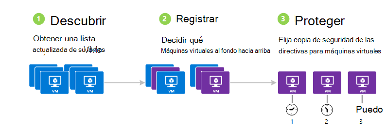
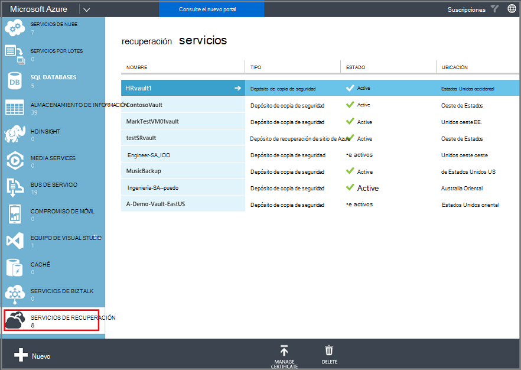
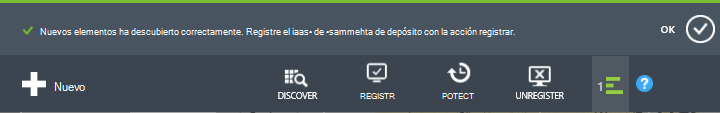
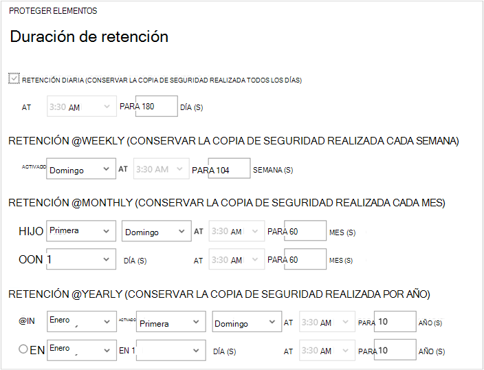
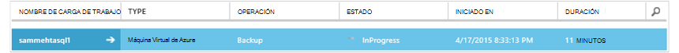
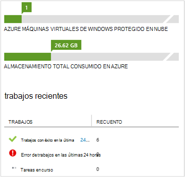

<properties
    pageTitle="Copia de seguridad de máquinas virtuales de Windows Azure | Microsoft Azure"
    description="Descubrir, registrar y realizar copias de seguridad de sus máquinas virtuales con estos procedimientos para la copia de seguridad de Azure máquina virtual."
    services="backup"
    documentationCenter=""
    authors="markgalioto"
    manager="jwhit"
    editor=""
    keywords="copia de seguridad de la máquina virtual; realizar copias de seguridad de la máquina virtual; copia de seguridad y recuperación de desastres; copia de seguridad de VM"/>

<tags
    ms.service="backup"
    ms.workload="storage-backup-recovery"
    ms.tgt_pltfrm="na"
    ms.devlang="na"
    ms.topic="article"
    ms.date="09/28/2016"
    ms.author="trinadhk; jimpark; markgal;"/>

# Realizar copias de seguridad máquinas virtuales de Windows Azure

> [AZURE.SELECTOR]
- [Realizar copias de seguridad VM en depósito de servicios de recuperación](backup-azure-arm-vms.md)
- [Realizar copias de seguridad VM en depósito de copia de seguridad](backup-azure-vms.md)

Este artículo proporciona los procedimientos para realizar copias de seguridad una implementado clásica Azure máquina virtual (VM) a un depósito de copia de seguridad. Hay algunas tareas que debe ocuparse de antes de que puede realizar una copia de una máquina virtual Azure. Si aún no lo ha hecho, completar los [requisitos previos](backup-azure-vms-prepare.md) para preparar el entorno para la copia de seguridad de sus máquinas virtuales.

Para obtener más información, vea los artículos en [máquinas virtuales de Windows Azure](https://azure.microsoft.com/documentation/services/virtual-machines/)y [Planear la infraestructura de copia de seguridad de VM en Azure](backup-azure-vms-introduction.md) .

>[AZURE.NOTE] Azure tiene dos modelos de implementación para crear y trabajar con recursos: [Administrador de recursos y clásica](../resource-manager-deployment-model.md). Un depósito de copia de seguridad sólo puede proteger máquinas virtuales implementado clásico. No puede proteger máquinas virtuales implementado por el Administrador de recursos con un depósito de copia de seguridad. Para obtener más información sobre cómo trabajar con los servicios de recuperación depósitos, consulte [realizar copias de seguridad máquinas virtuales de servicios de recuperación de cámara](backup-azure-arm-vms.md) .

La copia de seguridad de máquinas virtuales de Windows Azure consta de tres pasos principales:

>[AZURE.NOTE] La copia de seguridad de máquinas virtuales es un proceso local. No puede crear una copia de máquinas virtuales de una región un depósito de copia de seguridad en otra región. Por lo que debe crear un depósito de copia de seguridad en cada región Azure, donde hay máquinas virtuales que se copiarán.

## Paso 1: descubrir máquinas virtuales de Windows Azure
Para asegurarse de que cualquier máquinas virtuales (VM) nuevos agregados a la suscripción se identifican antes de registrar, ejecute el proceso de detección. Las consultas de proceso Azure para la lista de máquinas virtuales de la suscripción, junto con información adicional, como el nombre de servicio de nube y la región.

1. Inicie sesión en el [portal de clásico](http://manage.windowsazure.com/)

2. En la lista de servicios de Azure, haga clic en **Servicios de recuperación** para abrir la lista de depósitos de copia de seguridad y recuperación del sitio.
    

3. En la lista de depósitos de copia de seguridad, seleccione el depósito para realizar copias de seguridad una máquina virtual.

    Si se trata de un depósito nuevo que el portal se abrirá la página de **Inicio rápido** .

    

    Si la cámara se ha configurado previamente, el portal se abre en el menú utilizado recientemente.

4. En el menú de la cámara (en la parte superior de la página), haga clic en **Elementos registrados**.

    

5. En el menú **tipo** , seleccione la **Máquina Virtual de Azure**.

    

6. Haga clic en **detectar** en la parte inferior de la página.
    

    El proceso de detección puede tardar unos minutos mientras las máquinas virtuales se que se hayan publicado. Hay una notificación en la parte inferior de la pantalla que le permite saber que se está ejecutando el proceso.

    

    Complete los cambios de notificación cuando el proceso. Si el proceso de descubrimiento no encuentra las máquinas virtuales, asegúrese primero que las VM existen. Si existen las máquinas virtuales, asegúrese de que las máquinas virtuales están en la misma región como la cámara de copia de seguridad. Si las máquinas virtuales existen y están en la misma región, asegúrese de que las máquinas virtuales ya no están registradas en un depósito de copia de seguridad. Si una máquina virtual se asigna a un depósito de copia de seguridad no está disponible para asignarse a otros depósitos de copia de seguridad.

    

    Una vez que ha descubierto nuevos elementos, vaya al paso 2 y registrar sus máquinas virtuales.

##  Paso 2: registrar máquinas virtuales de Windows Azure
Registrar una máquina virtual Azure para asociar con el servicio de copia de seguridad de Azure. Suele ser una actividad de una sola vez.

1. Desplácese hasta el depósito de copia de seguridad en los **Servicios de recuperación** en el portal de Azure y, a continuación, haga clic en **Elementos registrados**.

2. Seleccione la **Máquina Virtual de Azure** en el menú desplegable.

    

3. Haga clic en **REGISTRARSE** en la parte inferior de la página.
    

4. En el menú contextual de **Registrar elementos** , seleccione las máquinas virtuales que desea registrar. Si hay dos o más máquinas virtuales con el mismo nombre, utilice el servicio de nube para distinguir entre ellas.

    >[AZURE.TIP] Puede registrar varias máquinas virtuales a la vez.

    Se crea una tarea para cada máquina virtual que ha seleccionado.

5. En la notificación para ir a la página **tareas** , haga clic en **Vista de trabajo** .

    

    La máquina virtual también aparece en la lista de elementos registrados, junto con el estado de la operación de registro.

    

    Cuando se completa la operación, el estado cambia para reflejar el estado de *registrado* .

    

## Paso 3: proteger máquinas virtuales de Windows Azure
Ahora puede configurar una directiva de retención y copia de seguridad de la máquina virtual. Varias máquinas virtuales pueden protegerse mediante el uso de una única proteger la acción.

Azure depósitos de copia de seguridad creadas después de mayo de 2015 vienen con una directiva predeterminada integrado en la cámara. Esta directiva predeterminada se suministra con una retención predeterminado de 30 días y una programación de copia de seguridad diaria de una vez.

1. Desplácese hasta el depósito de copia de seguridad en los **Servicios de recuperación** en el portal de Azure y, a continuación, haga clic en **Elementos registrados**.
2. Seleccione la **Máquina Virtual de Azure** en el menú desplegable.

    

3. Haga clic en **proteger** en la parte inferior de la página.

    Aparecerá el **Asistente para proteger elementos** . El Asistente solo muestra máquinas virtuales que están registrados y no protegidas. Seleccione las máquinas virtuales que desea proteger.

    Si hay dos o más máquinas virtuales con el mismo nombre, utilice el servicio de nube para distinguir entre las máquinas virtuales.

    >[AZURE.TIP] Puede proteger varios equipos virtuales a la vez.

    

4. Elija una **programación de copia de seguridad** para realizar copias de seguridad de los equipos virtuales que ha seleccionado. Puede elegir de un conjunto de directivas existente o definir una nueva.

    Cada directiva de copia de seguridad puede tener varias máquinas virtuales de Windows asociada. Sin embargo, la máquina virtual sólo puede asociada a una directiva en cualquier momento.

    

    >[AZURE.NOTE] Una directiva de copia de seguridad incluye una combinación de retención para las copias de seguridad programadas. Si selecciona una directiva de copia de seguridad existente, no puede modificar las opciones de retención en el siguiente paso.

5. Elija un **intervalo de retención** para asociar a las copias de seguridad.

    

    Directiva de retención especifica la longitud de tiempo para almacenar una copia de seguridad. Puede especificar directivas de retención diferente en función de cuándo se realizó la copia de seguridad. Por ejemplo, un punto de copia de seguridad diaria tomado (que sirve como un punto de recuperación de las operaciones) puede conservarse durante 90 días. En comparación, un punto de copia de seguridad al final de cada trimestre (con fines de auditoría) que necesite conservarse por varios meses o años.

    

    En este ejemplo de imagen:

    - **Directiva de retención diaria**: copias de seguridad realizadas diariamente se almacenan durante 30 días.
    - **Directiva de retención semanal**: copias de seguridad realizadas cada semana el domingo se conservan para 104 semanas.
    - **Directiva de retención mensual**: copias de seguridad realizadas en el último domingo de cada mes se conservan 120 meses.
    - **Directiva de retención anual**: se conservan copias de seguridad realizadas en el primer domingo de cada enero de 99 años.

    Se crea una tarea para configurar la directiva de protección y asociar las máquinas virtuales a esa directiva para cada máquina virtual que ha seleccionado.

6. Para ver la lista de trabajos de **Protección de configurar** , en el menú de depósitos, haga clic en **tareas** y seleccione **Configurar protección** del filtro de **operación** .

    

## Copia de seguridad inicial
Una vez que la máquina virtual está protegida con una directiva, se muestra en la pestaña **Elementos protegidos** con el estado *protegido - (pendiente de copia de seguridad inicial)*. De forma predeterminada, la primera copia de seguridad programada es la *copia de seguridad inicial*.

Para activar la copia de seguridad inicial inmediatamente después de la configuración de la protección:

1. En la parte inferior de la página de **Elementos protegidos** , haga clic en **Copia de seguridad**.

    El servicio de copia de seguridad de Azure crea un trabajo de copia de seguridad para la operación de copia de seguridad inicial.

2. Haga clic en la ficha de **tareas** para ver la lista de trabajos.

    

>[AZURE.NOTE] Durante la operación de copia de seguridad, el servicio de copia de seguridad de Azure emite un comando a la extensión de copia de seguridad en cada máquina virtual para vaciar todos los trabajos de escritura y tomar una instantánea coherente.

Cuando finalice la copia de seguridad inicial, el estado de la máquina virtual en la ficha **Elementos protegidos** está *protegida*.

## Detalles y ver el estado de copia de seguridad
Una vez protegido, el recuento de máquina virtual aumenta también en la página **panel** de resumen. La página de **panel** también muestra el número de trabajos de las últimas 24 horas que tuvieron *éxito*, *error*y en *curso*. En la página **tareas** , use el **estado**, **operación**o menús **desde** y **hasta** para filtrar las tareas.

Valores en el panel se actualizan cada 24 horas.

## Solución de errores
Si tiene problemas mientras se está realizando la máquina virtual, consulte el [artículo de solución de problemas de VM](backup-azure-vms-troubleshoot.md) para obtener ayuda.

## Pasos siguientes

- [Administrar y supervisar los equipos virtuales](backup-azure-manage-vms.md)
- [Restaurar máquinas virtuales de Windows](backup-azure-restore-vms.md)
